# System Configuration

System configuration is essential for optimizing Studio Platform performance, ensuring security, and customizing the platform to meet organizational requirements. This guide covers all aspects of system configuration from basic settings to advanced customization.

## ⚙️ System Configuration Overview

### **What is System Configuration?**

System configuration involves setting up and maintaining the Studio Platform to meet your organization's specific needs, including performance optimization, security settings, integration configuration, and customization options.

#### **Configuration Categories**

```mermaid
graph TD
    A[System Configuration] --> B[Platform Settings]
    A --> C[Performance Configuration]
    A --> D[Security Configuration]
    A --> E[Integration Configuration]
    A --> F[Customization]
    A --> G[Maintenance Configuration]
    
    B --> H[Organization Settings]
    B --> I[User Interface]
    B --> J[Notification Settings]
    
    C --> K[Resource Management]
    C --> L[Service Configuration]
    C --> M[Monitoring Settings]
    
    D --> N[Authentication]
    D --> O[Authorization]
    D --> P[Data Protection]
    
    E --> Q[Third-Party Services]
    E --> R[API Configuration]
    E --> S[Webhook Configuration]
    
    F --> T[Branding]
    F --> U[Custom Fields]
    F --> V[Workflows]
    
    G --> W[Backup Settings]
    G --> X[Update Management]
    G --> Y[Logging Configuration]
```



### **Configuration Hierarchy**

#### **Configuration Levels**

**Global Configuration:**
- **System-wide settings** - Apply to all organizations
- **Default values** - Default platform configurations
- **Security policies** - Global security requirements
- **Performance settings** - Global performance optimization

**Organization Configuration:**
- **Organization-specific settings** - Apply to specific organization
- **Custom policies** - Organization-specific policies
- **User preferences** - Organization-wide user preferences
- **Integration settings** - Organization-specific integrations

**User Configuration:**
- **User-specific settings** - Individual user preferences
- **Personalization** - Interface customization
- **Notification preferences** - User-specific notifications
- **Access settings** - User-specific access controls

## 🏢 Platform Settings

### **Organization Configuration**

#### **Organization Information**

**Basic Organization Settings:**
```
🏢 Organization Configuration
   Organization Name: Cybergaar Inc.
   Organization ID: ORG-12345
   Industry: Technology/Software
   Size: Medium (100-500 employees)
   Location: United States
   
   Contact Information:
   📧 Contact Email: admin@cybergaar.com
   📞 Contact Phone: +1-555-0123
   🏢 Address: 123 Tech Street, New York, NY 10001
   🌐 Website: https://cybergaar.com
   
   Regulatory Information:
   🔒 Compliance Frameworks: SOC 2, ISO 27001, GDPR
   📊 Audit Frequency: Annual
   📋 Certifications: SOC 2 Type II, ISO 27001
   🔍 Regulatory Bodies: None
   
   Business Information:
   💼 Business Type: SaaS/Technology
   🌍 Geographic Scope: Global
   👥 Employee Count: 250
   💰 Revenue Range: $10M - $50M
   🎯 Target Markets: Enterprise, Mid-Market
```

#### **Organization Policies**

**Policy Configuration:**
```
📋 Organization Policies
   
   Data Protection Policy:
   🔒 Data Classification: Required
   🔒 Data Retention: 7 years
   🔒 Data Encryption: Required
   🔒 Data Access Controls: Required
   
   Security Policy:
   🔒 Multi-Factor Authentication: Required
   🔒 Password Complexity: Required
   🔒 Session Timeout: 30 minutes
   🔒 Access Reviews: Quarterly
   
   Compliance Policy:
   🔒 Compliance Training: Required
   🔒 Compliance Monitoring: Continuous
   🔒 Compliance Reporting: Monthly
   🔒 Compliance Audits: Annual
   
   Acceptable Use Policy:
   🔒 Personal Use: Limited
   🔒 Social Media: Restricted
   🔒 Software Installation: Restricted
   🔒 Data Sharing: Restricted
```

### **User Interface Configuration**

#### **Interface Customization**

**UI Settings:**
```
🎨 User Interface Configuration
   
   Theme Configuration:
   🎨 Primary Color: #2563eb (Blue)
   🎨 Secondary Color: #64748b (Gray)
   🎨 Accent Color: #10b981 (Green)
   🎨 Background Color: #ffffff (White)
   🎨 Text Color: #1e293b (Dark Gray)
   
   Logo Configuration:
   🖼️ Company Logo: Uploaded (cybergaar-logo.png)
   📏 Logo Size: 200x50 pixels
   📍 Logo Position: Top Left
   🔗 Logo Link: https://cybergaar.com
   
   Navigation Configuration:
   📊 Dashboard Layout: Grid
   📱 Mobile View: Optimized
   🔍 Search Bar: Enabled
   📱 Sidebar: Collapsible
   
   Display Configuration:
   📊 Data Density: Normal
   📈 Chart Colors: Default
   📄 Font Size: Medium
   🌙 Dark Mode: Optional
```

#### **Notification Settings**

**Notification Configuration:**
```
📧 Notification Configuration
   
   Email Notifications:
   📧 Daily Summary: Enabled
   📧 Weekly Reports: Enabled
   📧 Security Alerts: Enabled
   📧 System Updates: Enabled
   
   In-App Notifications:
   🔔 Real-time Alerts: Enabled
   🔔 Task Reminders: Enabled
   🔔 System Messages: Enabled
   🔔 Security Warnings: Enabled
   
   Mobile Notifications:
   📱 Push Notifications: Enabled
   📱 SMS Alerts: Critical Only
   📱 Email Alerts: All
   📱 In-App Alerts: All
   
   Notification Rules:
   📊 Compliance Score Changes: Notify when >5%
   🔒 Security Incidents: Immediate notification
   📋 Task Deadlines: 24 hours before
   🎯 Milestone Achievements: Immediate notification
   
   Notification Schedule:
   📅 Daily Summary: 6:00 PM EST
   📊 Weekly Report: Monday 9:00 AM EST
   📋 Monthly Report: First of month
   🔒 Security Report: Weekly
```

## ⚡ Performance Configuration

### **Resource Management**

#### **System Resources**

**Resource Allocation:**
```
⚡ Resource Management Configuration
   
   CPU Configuration:
   🖥️ Total CPU Cores: 16
   📊 Backend Service: 8 cores
   📊 Frontend Service: 4 cores
   📊 Database Service: 2 cores
   📊 Other Services: 2 cores
   
   Memory Configuration:
   💾 Total Memory: 64 GB
   📊 Backend Service: 32 GB
   📊 Frontend Service: 16 GB
   📊 Database Service: 8 GB
   📊 Other Services: 8 GB
   
   Storage Configuration:
   💾 Total Storage: 1 TB
   📊 Database Storage: 500 GB
   📊 File Storage: 300 GB
   📊 Backup Storage: 200 GB
   
   Network Configuration:
   🌐 Bandwidth: 1 Gbps
   📊 Internal Network: 10 Gbps
   📊 External Network: 1 Gbps
   🔒 VPN Connection: Required
```

#### **Performance Optimization**

**Performance Settings:**
```
⚡ Performance Optimization
   
   Caching Configuration:
   📊 Cache Size: 8 GB
   📊 Cache TTL: 1 hour
   📊 Cache Strategy: LRU
   📊 Cache Hit Rate: 85%
   
   Database Optimization:
   📊 Connection Pool: 50 connections
   📊 Query Timeout: 30 seconds
   📊 Index Optimization: Enabled
   📊 Query Caching: Enabled
   
   Application Optimization:
   📊 Response Time Target: <2 seconds
   📊 Concurrent Users: 500
   📊 Throughput: 1000 requests/second
   📊 Error Rate: <0.1%
   
   Monitoring Configuration:
   📊 Performance Metrics: Enabled
   📊 Resource Monitoring: Enabled
   📊 User Experience Monitoring: Enabled
   📊 Error Tracking: Enabled
```

### **Service Configuration**

#### **Service Settings**

**Backend Service Configuration:**
```
⚙️ Backend Service Configuration
   
   Server Settings:
   🌐 Port: 4000
   📊 Workers: 8
   📊 Timeout: 30 seconds
   🔒 SSL: Enabled
   
   Database Settings:
   🗄️ Database: PostgreSQL
   📊 Connection Pool: 50
   📊 Max Connections: 100
   📊 Query Timeout: 30 seconds
   
   Security Settings:
   🔒 JWT Secret: Configured
   🔒 Encryption: AES-256
   🔒 Rate Limiting: Enabled
   🔒 CORS: Configured
   
   Logging Settings:
   📊 Log Level: Info
   📊 Log Format: JSON
   📊 Log Rotation: Daily
   📊 Log Retention: 30 days
```

**Frontend Service Configuration:**
```
⚙️ Frontend Service Configuration
   
   Server Settings:
   🌐 Port: 3000
   📊 Workers: 4
   📊 Timeout: 30 seconds
   🔒 SSL: Enabled
   
   Build Settings:
   📊 Build Mode: Production
   📊 Minification: Enabled
   📊 Compression: Enabled
   📊 Source Maps: Disabled
   
   Security Settings:
   🔒 CSP: Enabled
   🔒 Security Headers: Enabled
   🔒 Rate Limiting: Enabled
   🔒 XSS Protection: Enabled
   
   Performance Settings:
   📊 Caching: Enabled
   📊 Lazy Loading: Enabled
   📊 Code Splitting: Enabled
   📊 Image Optimization: Enabled
```

## 🔒 Security Configuration

### **Authentication Configuration**

#### **Authentication Settings**

**Authentication Configuration:**
```
🔐 Authentication Configuration
   
   Authentication Methods:
   🔒 Email/Password: Enabled
   🔒 Two-Factor Auth: Required
   🔒 SSO: Enabled
   🔒 LDAP: Enabled
   
   Two-Factor Authentication:
   🔒 Method: Authenticator App
   🔒 Backup: SMS
   🔒 Backup Codes: Required
   🔒 Recovery: Secure recovery process
   
   Password Policy:
   🔒 Minimum Length: 12 characters
   🔒 Complexity: Uppercase, lowercase, numbers, symbols
   🔒 Expiration: 90 days
   🔒 History: Last 12 passwords
   🔒 Lockout: 5 attempts, 30 minutes
   
   Session Management:
   🔒 Session Timeout: 30 minutes
   🔒 Concurrent Sessions: 2
   🔒 Device Registration: Required
   🔒 IP Restrictions: Enabled
```

#### **Authorization Configuration**

**Authorization Settings:**
```
🔐 Authorization Configuration
   
   Access Control:
   🔒 Model: RBAC + ABAC
   🔒 Least Privilege: Enabled
   🔒 Need-to-Know: Enabled
   🔒 Separation of Duties: Enabled
   
   Role Configuration:
   🔒 Role Hierarchy: Defined
   🔒 Permission Inheritance: Enabled
   🔒 Role Assignment: Controlled
   🔒 Role Reviews: Quarterly
   
   Policy Configuration:
   🔒 Access Policies: Defined
   🔒 Resource Policies: Defined
   🔒 Time-based Policies: Enabled
   🔒 Location-based Policies: Enabled
   
   Monitoring:
   🔒 Access Logging: Enabled
   🔒 Anomaly Detection: Enabled
   🔒 Real-time Monitoring: Enabled
   🔒 Alerting: Enabled
```

### **Data Protection Configuration**

#### **Data Security Settings**

**Data Protection Configuration:**
```
🔒 Data Protection Configuration
   
   Encryption:
   🔒 Data at Rest: AES-256
   🔒 Data in Transit: TLS 1.3
   🔒 Database Encryption: Enabled
   🔒 File Encryption: Enabled
   
   Data Classification:
   🔒 Classification Levels: 4 levels
   🔒 Automatic Classification: Enabled
   🔒 Classification Labels: Required
   🔒 Access Controls: Based on classification
   
   Data Retention:
   🔒 Retention Policy: 7 years
   🔒 Automatic Deletion: Enabled
   🔒 Legal Hold: Configured
   🔒 Audit Trail: Permanent
   
   Privacy Settings:
   🔒 GDPR Compliance: Enabled
   🔒 Data Minimization: Enabled
   🔒 Consent Management: Enabled
   🔒 Data Subject Rights: Enabled
```

## 🔌 Integration Configuration

### **Third-Party Integrations**

#### **Integration Settings**

**Integration Configuration:**
```
🔌 Integration Configuration
   
   Active Integrations:
   🔗 Google Workspace: Enabled
   🔗 Microsoft 365: Enabled
   🔗 Slack: Enabled
   🔗 Jira: Enabled
   🔗 Salesforce: Enabled
   
   Google Workspace Integration:
   📧 Gmail: Calendar sync
   📅 Google Drive: File storage
   📊 Google Sheets: Data export
   👥 Google Workspace: User sync
   
   Slack Integration:
   💬 Channel Notifications: Enabled
   💬 Direct Messages: Enabled
   💬 File Sharing: Enabled
   💬 Workflow Automation: Enabled
   
   Jira Integration:
   📋 Issue Creation: Enabled
   📋 Project Sync: Enabled
   📋 Status Updates: Enabled
   📋 Time Tracking: Enabled

   AI Compliance Configuration:
   🤖 AI Analysis & Tasks: Managed via Admin AI Dashboard
   🤖 Document Type Management: Enabled
   🤖 Verification Tasks: Custom checklist-based
   🤖 Project Memory: Core facts + Daily logs
   🤖 Dreaming Cycle: Periodic consolidation enabled
```

#### **API Configuration**

**API Settings:**
```
🔌 API Configuration
   
   API Access:
   🔑 API Keys: Required
   🔑 OAuth 2.0: Enabled
   🔑 Rate Limiting: 1000 requests/hour
   🔑 IP Whitelisting: Enabled
   
   API Endpoints:
   📊 REST API: Enabled
   📊 GraphQL API: Enabled
   📊 WebSocket API: Enabled
   📊 Webhook API: Enabled
   
   Security:
   🔒 Authentication: Required
   🔒 Authorization: Required
   🔒 Encryption: Required
   🔒 Monitoring: Enabled
   
   Documentation:
   📚 API Documentation: Available
   📚 Swagger UI: Enabled
   📚 Examples: Provided
   📚 Support: Available
```

## 🎨 Customization

### **Branding Configuration**

#### **Branding Settings**

**Branding Configuration:**
```
🎨 Branding Configuration
   
   Visual Branding:
   🖼️ Company Logo: Uploaded
   🎨 Primary Color: #2563eb
   🎨 Secondary Color: #64748b
   🎨 Accent Color: #10b981
   🎨 Background Color: #ffffff
   
   Text Branding:
   📝 Company Name: Cybergaar Inc.
   📝 Tagline: Compliance Made Simple
   📝 Footer Text: © 2024 Cybergaar Inc.
   📝 Legal Text: Privacy Policy | Terms of Service
   
   Custom CSS:
   🎨 Custom Styles: Enabled
   🎨 Custom Fonts: Enabled
   🎨 Custom Layout: Enabled
   🎨 Custom Components: Enabled
```

#### **Custom Fields**

**Custom Field Configuration:**
```
📝 Custom Field Configuration
   
   User Custom Fields:
   📋 Employee ID: Text field
   📋 Department: Dropdown field
   📋 Location: Text field
   📋 Manager: User lookup field
   
   Project Custom Fields:
   📋 Project Code: Text field
   📋 Budget: Number field
   📋 Priority: Dropdown field
   📋 Client: Text field
   
   Evidence Custom Fields:
   📋 Document Type: Dropdown field
   📋 Confidentiality: Dropdown field
   📋 Review Status: Dropdown field
   📋 Expiration Date: Date field
   
   Validation Rules:
   🔒 Required Fields: Configured
   🔒 Format Validation: Enabled
   🔒 Range Validation: Enabled
   🔒 Custom Validation: Enabled
```

## 🔧 Maintenance Configuration

### **Backup Configuration**

#### **Backup Settings**

**Backup Configuration:**
```
💾 Backup Configuration
   
   Backup Schedule:
   📅 Daily Backup: 2:00 AM EST
   📅 Weekly Full Backup: Sunday 2:00 AM EST
   📅 Monthly Archive: First of month
   📅 Retention: 30 days daily, 12 months weekly
   
   Backup Sources:
   📊 Database: Full backup
   📁 Files: Incremental backup
   📋 Configuration: Weekly backup
   🔒 Logs: Weekly backup
   
   Backup Storage:
   📁 Primary Storage: Local
   📁 Secondary Storage: Cloud
   📁 Archive Storage: Cold storage
   📁 Recovery Storage: Hot backup
   
   Backup Encryption:
   🔒 Encryption: AES-256
   🔒 Key Management: Managed
   🔒 Access Control: Restricted
   🔒 Audit Trail: Enabled
```

#### **Update Management**

**Update Configuration:**
```
🔄 Update Management Configuration
   
   Update Schedule:
   📅 Security Updates: As needed
   📅 Feature Updates: Monthly
   📅 Maintenance Window: Saturday 2:00 AM - 4:00 AM EST
   📅 Testing: 1 week before production
   
   Update Channels:
   📊 Stable Channel: Production
   📊 Beta Channel: Testing
   📊 Development Channel: Development
   📊 Custom Channel: Custom builds
   
   Update Process:
   🔄 Automated Updates: Security patches
   🔄 Manual Updates: Feature updates
   🔄 Testing: Required for all updates
   🔄 Rollback: Automatic rollback capability
   
   Notification:
   📧 Update Notifications: Enabled
   📱 Mobile Notifications: Critical updates
   📊 Dashboard Notifications: All updates
   🔒 Security Alerts: Security updates
```

## ✅ Configuration Best Practices

### **Configuration Management Best Practices**

#### **Operational Excellence**
- **Documentation** - Maintain comprehensive configuration documentation
- **Version Control** - Use version control for configuration changes
- **Testing** - Test all configuration changes in non-production
- **Monitoring** - Monitor configuration effectiveness
- **Review** - Regular configuration reviews and audits

#### **Security Best Practices**
- **Principle of Least Privilege** - Apply least privilege to all configurations
- **Regular Updates** - Keep systems updated and patched
- **Security Testing** - Regular security testing and assessments
- **Incident Response** - Have incident response procedures
- **Compliance** - Ensure compliance with requirements

### **Common Configuration Mistakes**

❌ **Avoid These Mistakes:**
- Not documenting configuration changes
- Testing in production without proper testing
- Ignoring security best practices
- Not monitoring configuration effectiveness
- Not regularly reviewing and updating configurations

✅ **Follow These Best Practices:**
- Document all configuration changes
- Test thoroughly before production deployment
- Follow security best practices
- Monitor configuration effectiveness
- Regularly review and update configurations

---

!!! tip **Automation**
    Automate routine configuration tasks to improve efficiency and reduce errors. Use configuration management tools and scripts.

!!! note **Security First**
    Always prioritize security in configuration decisions. Implement strong security controls and follow security best practices.

!!! question **Need Help?**
    Check our [Troubleshooting Guide](../troubleshooting/) for common configuration issues, or contact our support team for personalized assistance.
