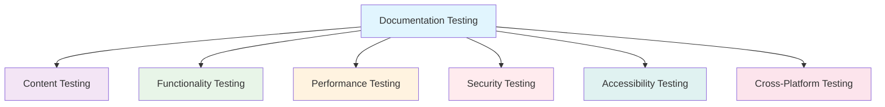

# Documentation Testing Guide
## Studio Platform Documentation

This guide provides comprehensive testing procedures for the Studio Platform documentation deployment to ensure quality, functionality, and user experience.

## 🧪 Testing Overview

### **Testing Objectives**
- **Functionality**: Verify all documentation features work correctly
- **Performance**: Ensure fast loading times and responsive behavior
- **Compatibility**: Test across browsers and devices
- **Accessibility**: Verify WCAG compliance
- **Security**: Test SSL/TLS and security headers
- **User Experience**: Ensure intuitive navigation and search

### **Testing Types**


## 📚 Content Testing

### **Content Quality Checks**

#### **Spelling and Grammar**
```bash
# Install spell checker
pip install pyspelling

# Run spell check
pyspelling -c .pyspelling.yml

# Grammar check (optional)
npm install -g grammar-cli
grammar check docs/
```

#### **Link Validation**
```bash
# Install markdown link checker
npm install -g markdown-link-check

# Check all markdown files
find docs/ -name "*.md" -exec markdown-link-check {} \;

# Create configuration file
cat > .markdownlinkcheck.json << 'EOF'
{
  "ignorePatterns": [
    {
      "pattern": "^http://localhost"
    },
    {
      "pattern": "^https://github.com/OmerRastgar/studio"
    }
  ],
  "replacementPatterns": [],
  "httpHeaders": [
    {
      "urls": ["https://docs.cybergaar.com"],
      "headers": {
        "Accept": "text/html",
        "User-Agent": "markdown-link-check/3.0.0"
      }
    }
  ],
  "timeout": "20s",
  "retryOn429": true,
  "retryCount": 3,
  "fallbackRetryDelay": "30s"
}
EOF
```

#### **Image Validation**
```bash
#!/bin/bash
# validate-images.sh

echo "=== Validating Documentation Images ==="

# Check for missing images
echo "Checking for missing images..."
find docs/ -name "*.md" -exec grep -o '!\[.*\](.*)' {} \; | sed 's/.*(\(.*\)).*/\1/' | while read img; do
    if [ ! -f "docs/$img" ]; then
        echo "❌ Missing image: $img"
    else
        echo "✅ Found: $img"
    fi
done

# Check image file sizes
echo "Checking image file sizes..."
find docs/ -name "*.png" -o -name "*.jpg" -o -name "*.jpeg" -o -name "*.gif" | while read img; do
    size=$(stat -f%z "$img" 2>/dev/null || stat -c%s "$img" 2>/dev/null)
    if [ "$size" -gt 1048576 ]; then  # > 1MB
        echo "⚠️  Large image: $img ($((size/1024))KB)"
    fi
done

# Check for broken image references
echo "Checking for broken image references..."
find docs/ -name "*.md" -exec grep -H '!\[.*\]([^)]*)' {} \; | while read line; do
    file=$(echo "$line" | cut -d: -f1)
    img=$(echo "$line" | grep -o '!\[.*\]([^)]*)' | sed 's/.*(\([^)]*\)).*/\1/')
    if [[ "$img" == http* ]]; then
        if ! curl -f -s "$img" > /dev/null; then
            echo "❌ Broken external image: $img in $file"
        fi
    fi
done
```

### **Content Structure Testing**

#### **Navigation Testing**
```python
#!/usr/bin/env python3
# test-navigation.py

import os
import yaml
import requests
from pathlib import Path

def test_navigation_links():
    """Test all navigation links in mkdocs.yml"""
    
    # Load mkdocs configuration
    with open('mkdocs.yml', 'r') as f:
        config = yaml.safe_load(f)
    
    base_url = "http://localhost:8000"
    errors = []
    
    def check_nav_item(item, path=""):
        if isinstance(item, str):
            # Direct page reference
            if item.endswith('.md'):
                page_path = item.replace('.md', '/')
                full_url = f"{base_url}/{page_path}"
                try:
                    response = requests.get(full_url, timeout=10)
                    if response.status_code != 200:
                        errors.append(f"Failed to load {item}: {response.status_code}")
                except Exception as e:
                    errors.append(f"Error loading {item}: {e}")
        
        elif isinstance(item, dict):
            for key, value in item.items():
                if isinstance(value, list):
                    check_nav_item(value, f"{path}/{key}")
                elif isinstance(value, str):
                    check_nav_item(value, f"{path}/{key}")
    
    # Check navigation structure
    if 'nav' in config:
        check_nav_item(config['nav'])
    
    # Report results
    if errors:
        print("❌ Navigation errors found:")
        for error in errors:
            print(f"  - {error}")
        return False
    else:
        print("✅ All navigation links work correctly")
        return True

if __name__ == "__main__":
    test_navigation_links()
```

## 🔧 Functionality Testing

### **Search Functionality Testing**

#### **Search Test Script**
```python
#!/usr/bin/env python3
# test-search.py

import requests
import json
import time

def test_search_functionality():
    """Test search functionality"""
    
    base_url = "http://localhost:8000"
    search_terms = [
        "compliance",
        "framework",
        "evidence",
        "SOC2",
        "ISO27001",
        "authentication",
        "API",
        "integration"
    ]
    
    results = {}
    
    for term in search_terms:
        try:
            # Test search via MkDocs search API
            search_url = f"{base_url}/search/?q={term}"
            response = requests.get(search_url, timeout=10)
            
            if response.status_code == 200:
                # Check if search results page loads
                if term.lower() in response.text.lower():
                    results[term] = "✅ Found"
                else:
                    results[term] = "⚠️  Limited results"
            else:
                results[term] = f"❌ Error: {response.status_code}"
                
        except Exception as e:
            results[term] = f"❌ Exception: {e}"
        
        time.sleep(1)  # Rate limiting
    
    # Print results
    print("=== Search Functionality Test Results ===")
    for term, result in results.items():
        print(f"{term}: {result}")
    
    return all("✅" in result for result in results.values())

if __name__ == "__main__":
    test_search_functionality()
```

### **Code Block Testing**

#### **Code Syntax Highlighting Test**
```python
#!/usr/bin/env python3
# test-code-blocks.py

import re
import requests
from bs4 import BeautifulSoup

def test_code_blocks():
    """Test code blocks and syntax highlighting"""
    
    base_url = "http://localhost:8000"
    
    # Get main page
    response = requests.get(base_url)
    soup = BeautifulSoup(response.text, 'html.parser')
    
    # Find all code blocks
    code_blocks = soup.find_all(['code', 'pre'])
    
    issues = []
    
    for i, block in enumerate(code_blocks):
        # Check if code block has appropriate classes
        if not block.get('class'):
            issues.append(f"Code block {i}: No syntax highlighting class")
        elif not any('language-' in cls or 'highlight' in cls for cls in block.get('class', [])):
            issues.append(f"Code block {i}: Missing language specification")
    
    # Test specific pages with code examples
    code_pages = [
        "/developer-guide/api-reference/",
        "/developer-guide/architecture/",
        "/installation/docker-setup/",
        "/integrations/fleetdm/"
    ]
    
    for page in code_pages:
        try:
            response = requests.get(f"{base_url}{page}")
            if response.status_code == 200:
                page_soup = BeautifulSoup(response.text, 'html.parser')
                page_code_blocks = page_soup.find_all(['code', 'pre'])
                if not page_code_blocks:
                    issues.append(f"Page {page}: No code blocks found")
            else:
                issues.append(f"Page {page}: Failed to load ({response.status_code})")
        except Exception as e:
            issues.append(f"Page {page}: Error - {e}")
    
    # Report results
    if issues:
        print("❌ Code block issues found:")
        for issue in issues:
            print(f"  - {issue}")
        return False
    else:
        print("✅ All code blocks are properly formatted")
        return True

if __name__ == "__main__":
    test_code_blocks()
```

## 🚀 Performance Testing

### **Load Time Testing**

#### **Performance Test Script**
```python
#!/usr/bin/env python3
# test-performance.py

import requests
import time
import statistics
from concurrent.futures import ThreadPoolExecutor

def measure_page_load_time(url, timeout=30):
    """Measure page load time"""
    start_time = time.time()
    try:
        response = requests.get(url, timeout=timeout)
        end_time = time.time()
        load_time = end_time - start_time
        
        return {
            'url': url,
            'load_time': load_time,
            'status_code': response.status_code,
            'content_length': len(response.content),
            'success': response.status_code == 200
        }
    except Exception as e:
        return {
            'url': url,
            'load_time': timeout,
            'status_code': 0,
            'content_length': 0,
            'success': False,
            'error': str(e)
        }

def test_documentation_performance():
    """Test documentation performance"""
    
    base_url = "http://localhost:8000"
    
    # Test pages
    test_pages = [
        "/",  # Home page
        "/overview/",
        "/installation/",
        "/user-guide/",
        "/admin-guide/",
        "/developer-guide/",
        "/architecture/",
        "/integrations/",
        "/troubleshooting/"
    ]
    
    urls = [f"{base_url}{page}" for page in test_pages]
    
    print("=== Performance Testing ===")
    print(f"Testing {len(urls)} pages...")
    
    # Single-threaded test
    single_thread_results = []
    for url in urls:
        result = measure_page_load_time(url)
        single_thread_results.append(result)
        print(f"{result['url']}: {result['load_time']:.2f}s ({'✅' if result['success'] else '❌'})")
    
    # Multi-threaded test (simulate concurrent users)
    print("\n=== Concurrent Load Test (5 users) ===")
    concurrent_results = []
    
    def load_url(url):
        return measure_page_load_time(url)
    
    with ThreadPoolExecutor(max_workers=5) as executor:
        concurrent_results = list(executor.map(load_url, urls * 3))  # 3 rounds
    
    # Analyze results
    successful_loads = [r for r in single_thread_results if r['success']]
    load_times = [r['load_time'] for r in successful_loads]
    
    if load_times:
        avg_load_time = statistics.mean(load_times)
        median_load_time = statistics.median(load_times)
        max_load_time = max(load_times)
        min_load_time = min(load_times)
        
        print(f"\n=== Performance Summary ===")
        print(f"Average load time: {avg_load_time:.2f}s")
        print(f"Median load time: {median_load_time:.2f}s")
        print(f"Max load time: {max_load_time:.2f}s")
        print(f"Min load time: {min_load_time:.2f}s")
        print(f"Success rate: {len(successful_loads)/len(single_thread_results)*100:.1f}%")
        
        # Performance criteria
        if avg_load_time < 3.0:
            print("✅ Performance meets target (< 3s average)")
            return True
        else:
            print("❌ Performance below target (> 3s average)")
            return False
    else:
        print("❌ No successful page loads")
        return False

if __name__ == "__main__":
    test_documentation_performance()
```

### **Mobile Responsiveness Testing**

#### **Mobile Test Script**
```python
#!/usr/bin/env python3
# test-mobile.py

import requests
from bs4 import BeautifulSoup

def test_mobile_responsiveness():
    """Test mobile responsiveness indicators"""
    
    base_url = "http://localhost:8000"
    
    # Test key pages
    test_pages = ["/", "/user-guide/", "/developer-guide/"]
    
    mobile_issues = []
    
    for page in test_pages:
        url = f"{base_url}{page}"
        try:
            response = requests.get(url)
            soup = BeautifulSoup(response.text, 'html.parser')
            
            # Check for viewport meta tag
            viewport = soup.find('meta', attrs={'name': 'viewport'})
            if not viewport:
                mobile_issues.append(f"{page}: Missing viewport meta tag")
            elif 'width=device-width' not in viewport.get('content', ''):
                mobile_issues.append(f"{page}: Viewport not mobile-optimized")
            
            # Check for responsive images
            images = soup.find_all('img')
            for img in images:
                if not img.get('alt'):
                    mobile_issues.append(f"{page}: Image missing alt attribute")
            
            # Check for responsive CSS classes
            if 'md-content' not in response.text:
                mobile_issues.append(f"{page}: Missing responsive CSS classes")
                
        except Exception as e:
            mobile_issues.append(f"{page}: Error - {e}")
    
    # Report results
    if mobile_issues:
        print("❌ Mobile responsiveness issues:")
        for issue in mobile_issues:
            print(f"  - {issue}")
        return False
    else:
        print("✅ Mobile responsiveness looks good")
        return True

if __name__ == "__main__":
    test_mobile_responsiveness()
```

## 🔒 Security Testing

### **SSL/TLS Testing**

#### **SSL Test Script**
```python
#!/usr/bin/env python3
# test-ssl.py

import ssl
import socket
import requests
from datetime import datetime

def test_ssl_configuration():
    """Test SSL/TLS configuration"""
    
    hostname = "doc.cybergaar.com"
    port = 443
    
    ssl_issues = []
    
    try:
        # Create SSL context
        context = ssl.create_default_context()
        
        # Connect and get certificate
        with socket.create_connection((hostname, port)) as sock:
            with context.wrap_socket(sock, server_hostname=hostname) as ssock:
                cert = ssock.getpeercert()
                cipher = ssock.cipher()
                version = ssock.version()
        
        # Check certificate expiry
        expiry_date = datetime.strptime(cert['notAfter'], '%b %d %H:%M:%S %Y %Z')
        days_until_expiry = (expiry_date - datetime.now()).days
        
        if days_until_expiry < 30:
            ssl_issues.append(f"Certificate expires in {days_until_expiry} days")
        
        # Check TLS version
        if version not in ['TLSv1.2', 'TLSv1.3']:
            ssl_issues.append(f"Using outdated TLS version: {version}")
        
        # Check cipher strength
        if cipher:
            cipher_name = cipher[0]
            if 'RC4' in cipher_name or 'DES' in cipher_name or 'MD5' in cipher_name:
                ssl_issues.append(f"Weak cipher detected: {cipher_name}")
        
        # Test HTTPS redirect
        try:
            http_response = requests.get(f"http://{hostname}", allow_redirects=False, timeout=10)
            if http_response.status_code not in [301, 302]:
                ssl_issues.append("HTTP to HTTPS redirect not configured")
        except:
            ssl_issues.append("HTTP endpoint not accessible")
        
        # Test HTTPS accessibility
        try:
            https_response = requests.get(f"https://{hostname}", timeout=10)
            if https_response.status_code != 200:
                ssl_issues.append(f"HTTPS not accessible: {https_response.status_code}")
        except Exception as e:
            ssl_issues.append(f"HTTPS connection failed: {e}")
        
        # Check security headers
        try:
            response = requests.get(f"https://{hostname}", timeout=10)
            headers = response.headers
            
            security_headers = {
                'Strict-Transport-Security': 'HSTS',
                'X-Frame-Options': 'Clickjacking protection',
                'X-Content-Type-Options': 'MIME-type sniffing',
                'X-XSS-Protection': 'XSS protection',
                'Content-Security-Policy': 'CSP'
            }
            
            for header, description in security_headers.items():
                if header not in headers:
                    ssl_issues.append(f"Missing security header: {header} ({description})")
        
        except Exception as e:
            ssl_issues.append(f"Failed to check security headers: {e}")
    
    except Exception as e:
        ssl_issues.append(f"SSL/TLS test failed: {e}")
    
    # Report results
    if ssl_issues:
        print("❌ SSL/TLS issues found:")
        for issue in ssl_issues:
            print(f"  - {issue}")
        return False
    else:
        print("✅ SSL/TLS configuration is secure")
        return True

if __name__ == "__main__":
    test_ssl_configuration()
```

## 🌍 Cross-Browser Testing

### **Browser Compatibility Matrix**

#### **Browser Test Plan**
```yaml
# browser-test-matrix.yml
browsers:
  desktop:
    - name: "Chrome"
      versions: ["latest", "latest-1"]
      platform: "Windows 10"
    - name: "Firefox"
      versions: ["latest", "latest-1"]
      platform: "Windows 10"
    - name: "Safari"
      versions: ["latest", "latest-1"]
      platform: "macOS"
    - name: "Edge"
      versions: ["latest", "latest-1"]
      platform: "Windows 10"
  
  mobile:
    - name: "Chrome Mobile"
      versions: ["latest"]
      platform: "Android"
    - name: "Safari Mobile"
      versions: ["latest"]
      platform: "iOS"

test_scenarios:
  - name: "Page Loading"
    pages: ["/", "/user-guide/", "/developer-guide/"]
    checks: ["layout", "navigation", "search"]
  
  - name: "Functionality"
    features: ["search", "navigation", "code-highlighting", "links"]
    checks: ["interaction", "response"]
  
  - name: "Responsive Design"
    viewports: ["mobile", "tablet", "desktop"]
    checks: ["layout", "readability", "navigation"]
```

### **Automated Browser Testing**

#### **Selenium Test Script**
```python
#!/usr/bin/env python3
# test-browsers.py

from selenium import webdriver
from selenium.webdriver.common.by import By
from selenium.webdriver.support.ui import WebDriverWait
from selenium.webdriver.support import expected_conditions as EC
import time

def test_browser_compatibility():
    """Test browser compatibility using Selenium"""
    
    base_url = "http://localhost:8000"
    
    # Test configurations
    browsers = [
        {"name": "Chrome", "driver": webdriver.Chrome},
        {"name": "Firefox", "driver": webdriver.Firefox}
    ]
    
    test_results = {}
    
    for browser_config in browsers:
        browser_name = browser_config["name"]
        driver_class = browser_config["driver"]
        
        try:
            # Initialize browser
            driver = driver_class()
            driver.set_window_size(1920, 1080)
            
            browser_issues = []
            
            # Test main page
            driver.get(base_url)
            time.sleep(2)
            
            # Check page title
            if "Studio Platform Documentation" not in driver.title:
                browser_issues.append("Incorrect page title")
            
            # Test navigation
            nav_elements = driver.find_elements(By.CSS_SELECTOR, ".md-nav__link")
            if len(nav_elements) < 5:
                browser_issues.append("Navigation elements missing")
            
            # Test search functionality
            search_box = driver.find_elements(By.CSS_SELECTOR, ".md-search__input")
            if search_box:
                search_box[0].send_keys("compliance")
                time.sleep(1)
                # Check if search results appear
                search_results = driver.find_elements(By.CSS_SELECTOR, ".md-search-result")
                if len(search_results) == 0:
                    browser_issues.append("Search not working")
            else:
                browser_issues.append("Search box not found")
            
            # Test mobile responsiveness
            driver.set_window_size(375, 667)  # iPhone size
            time.sleep(1)
            
            # Check if mobile menu appears
            mobile_menu = driver.find_elements(By.CSS_SELECTOR, ".md-nav--primary")
            if not mobile_menu:
                browser_issues.append("Mobile navigation not working")
            
            # Test code highlighting
            driver.get(f"{base_url}/developer-guide/api-reference/")
            time.sleep(2)
            
            code_blocks = driver.find_elements(By.CSS_SELECTOR, "code")
            if code_blocks:
                # Check if code blocks have highlighting classes
                highlighted = False
                for code in code_blocks:
                    if "highlight" in code.get_attribute("class") or "":
                        highlighted = True
                        break
                
                if not highlighted:
                    browser_issues.append("Code syntax highlighting not working")
            else:
                browser_issues.append("No code blocks found")
            
            # Store results
            test_results[browser_name] = {
                "success": len(browser_issues) == 0,
                "issues": browser_issues
            }
            
            driver.quit()
            
        except Exception as e:
            test_results[browser_name] = {
                "success": False,
                "issues": [f"Browser test failed: {e}"]
            }
    
    # Report results
    print("=== Browser Compatibility Test Results ===")
    
    all_passed = True
    for browser, result in test_results.items():
        status = "✅" if result["success"] else "❌"
        print(f"{browser}: {status}")
        
        if result["issues"]:
            all_passed = False
            for issue in result["issues"]:
                print(f"  - {issue}")
    
    return all_passed

if __name__ == "__main__":
    test_browser_compatibility()
```

## ♿ Accessibility Testing

### **Accessibility Test Script**

#### **Axe Accessibility Testing**
```python
#!/usr/bin/env python3
# test-accessibility.py

import requests
from selenium import webdriver
from axe_selenium import Axe

def test_accessibility():
    """Test WCAG accessibility compliance"""
    
    base_url = "http://localhost:8000"
    
    # Initialize browser
    driver = webdriver.Chrome()
    
    try:
        # Initialize axe
        axe = Axe(driver)
        
        # Test key pages
        test_pages = [
            "/",
            "/user-guide/",
            "/developer-guide/",
            "/installation/"
        ]
        
        accessibility_issues = {}
        
        for page in test_pages:
            url = f"{base_url}{page}"
            driver.get(url)
            
            # Run axe accessibility tests
            results = axe.run()
            
            # Filter issues by severity
            violations = results.violations
            critical = [v for v in violations if v.impact == "critical"]
            serious = [v for v in violations if v.impact == "serious"]
            moderate = [v for v in violations if v.impact == "moderate"]
            minor = [v for v in violations if v.impact == "minor"]
            
            accessibility_issues[page] = {
                "critical": len(critical),
                "serious": len(serious),
                "moderate": len(moderate),
                "minor": len(minor),
                "total": len(violations)
            }
            
            # Print detailed issues for critical and serious
            if critical or serious:
                print(f"\n🚨 Accessibility Issues for {page}:")
                for issue in critical + serious:
                    print(f"  - {issue.impact.upper()}: {issue.description}")
                    print(f"    Help: {issue.help_url}")
        
        driver.quit()
        
        # Summary report
        print("\n=== Accessibility Test Summary ===")
        total_issues = 0
        for page, issues in accessibility_issues.items():
            total_issues += issues["total"]
            status = "✅" if issues["critical"] == 0 and issues["serious"] == 0 else "❌"
            print(f"{page}: {status} ({issues['total']} issues)")
            print(f"  Critical: {issues['critical']}, Serious: {issues['serious']}")
        
        # Accessibility passes if no critical or serious issues
        passes = all(issues["critical"] == 0 and issues["serious"] == 0 
                    for issues in accessibility_issues.values())
        
        if passes:
            print("✅ Accessibility tests passed")
        else:
            print("❌ Critical or serious accessibility issues found")
        
        return passes
        
    except Exception as e:
        print(f"❌ Accessibility test failed: {e}")
        return False

if __name__ == "__main__":
    test_accessibility()
```

## 📊 Comprehensive Test Suite

### **Master Test Script**

#### **Run All Tests**
```bash
#!/bin/bash
# run-all-tests.sh

set -e

# Colors for output
RED='\033[0;31m'
GREEN='\033[0;32m'
YELLOW='\033[1;33m'
BLUE='\033[0;34m'
NC='\033[0m'

# Test results
TOTAL_TESTS=0
PASSED_TESTS=0
FAILED_TESTS=0

# Function to run a test
run_test() {
    local test_name="$1"
    local test_command="$2"
    
    echo -e "${BLUE}Running: $test_name${NC}"
    TOTAL_TESTS=$((TOTAL_TESTS + 1))
    
    if eval "$test_command"; then
        echo -e "${GREEN}✅ $test_name PASSED${NC}"
        PASSED_TESTS=$((PASSED_TESTS + 1))
    else
        echo -e "${RED}❌ $test_name FAILED${NC}"
        FAILED_TESTS=$((FAILED_TESTS + 1))
    fi
    echo ""
}

# Start testing
echo -e "${BLUE}=== Studio Documentation Test Suite ===${NC}"
echo ""

# Check if documentation is running
if ! curl -f -s http://localhost:8000 > /dev/null; then
    echo -e "${YELLOW}⚠️  Documentation not running. Starting it...${NC}"
    cd docs
    mkdocs serve --dev-addr=0.0.0.0:8000 &
    MKDOCS_PID=$!
    sleep 10  # Wait for MkDocs to start
    
    if ! curl -f -s http://localhost:8000 > /dev/null; then
        echo -e "${RED}❌ Failed to start documentation${NC}"
        exit 1
    fi
    cd ..
fi

# Run all tests
run_test "Content Quality" "python3 scripts/test-content-quality.py"
run_test "Navigation Functionality" "python3 scripts/test-navigation.py"
run_test "Search Functionality" "python3 scripts/test-search.py"
run_test "Code Blocks" "python3 scripts/test-code-blocks.py"
run_test "Performance" "python3 scripts/test-performance.py"
run_test "Mobile Responsiveness" "python3 scripts/test-mobile.py"
run_test "SSL Configuration" "python3 scripts/test-ssl.py"
run_test "Browser Compatibility" "python3 scripts/test-browsers.py"
run_test "Accessibility" "python3 scripts/test-accessibility.py"

# Generate test report
echo -e "${BLUE}=== Test Results Summary ===${NC}"
echo "Total Tests: $TOTAL_TESTS"
echo -e "Passed: ${GREEN}$PASSED_TESTS${NC}"
echo -e "Failed: ${RED}$FAILED_TESTS${NC}"

if [ $FAILED_TESTS -eq 0 ]; then
    echo -e "${GREEN}🎉 All tests passed!${NC}"
    exit_code=0
else
    echo -e "${RED}❌ Some tests failed. Please review the issues above.${NC}"
    exit_code=1
fi

# Clean up
if [ ! -z "$MKDOCS_PID" ]; then
    kill $MKDOCS_PID 2>/dev/null || true
fi

exit $exit_code
```

### **Test Configuration**

#### **Requirements File**
```txt
# test-requirements.txt
requests>=2.31.0
beautifulsoup4>=4.12.0
selenium>=4.15.0
axe-selenium>=2.1.0
pyyaml>=6.0.1
pyspelling>=2.7.0
markdown-link-check>=3.11.0
```

#### **Test Configuration File**
```yaml
# test-config.yml
test_suite:
  name: "Studio Documentation Tests"
  version: "1.0.0"
  
base_url: "http://localhost:8000"
production_url: "https://doc.cybergaar.com"

tests:
  content:
    enabled: true
    spell_check: true
    link_validation: true
    image_validation: true
  
  functionality:
    enabled: true
    navigation: true
    search: true
    code_blocks: true
  
  performance:
    enabled: true
    load_time_threshold: 3.0  # seconds
    concurrent_users: 5
  
  security:
    enabled: true
    ssl_check: true
    security_headers: true
  
  accessibility:
    enabled: true
    wcag_level: "AA"
  
  browser_compatibility:
    enabled: true
    browsers: ["chrome", "firefox"]
    viewports: ["desktop", "mobile"]

reporting:
  format: "html"
  output_dir: "test-results"
  include_screenshots: false
```

## 📋 Test Execution Guide

### **Running Tests**

#### **Quick Test**
```bash
# Run all tests
./scripts/run-all-tests.sh

# Run specific test category
./scripts/test-performance.py
./scripts/test-accessibility.py
```

#### **Production Testing**
```bash
# Test production deployment
PRODUCTION_URL="https://doc.cybergaar.com" ./scripts/run-all-tests.sh

# Test specific production features
./scripts/test-ssl.py --production
./scripts/test-performance.py --production
```

### **Continuous Integration**

#### **GitHub Actions Workflow**
```yaml
# .github/workflows/test-docs.yml
name: Test Documentation

on:
  push:
    branches: [ main, develop ]
    paths: [ 'docs/**' ]
  pull_request:
    branches: [ main ]
    paths: [ 'docs/**' ]

jobs:
  test:
    runs-on: ubuntu-latest
    
    steps:
    - uses: actions/checkout@v3
    
    - name: Set up Python
      uses: actions/setup-python@v4
      with:
        python-version: '3.11'
    
    - name: Install dependencies
      run: |
        pip install -r docs/test-requirements.txt
        pip install -r docs/requirements.txt
    
    - name: Start documentation
      run: |
        cd docs
        mkdocs serve --dev-addr=0.0.0.0:8000 &
        sleep 10
    
    - name: Run tests
      run: ./docs/scripts/run-all-tests.sh
    
    - name: Upload test results
      uses: actions/upload-artifact@v3
      if: always()
      with:
        name: test-results
        path: docs/test-results/
```

---

This comprehensive testing guide ensures the Studio Platform documentation meets high quality standards for functionality, performance, security, and user experience across all platforms and devices.
