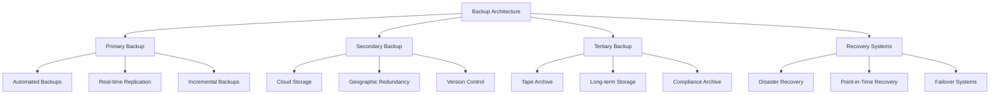

# Backup & Recovery

Backup and recovery are critical components of business continuity and disaster recovery planning. This comprehensive guide covers backup strategies, recovery procedures, and best practices for protecting your Studio Platform data and ensuring operational resilience.

## 💾 Backup Overview

### **Backup Architecture**

Studio Platform implements a comprehensive backup architecture designed to ensure data protection, rapid recovery, and compliance with regulatory requirements.



### **Backup Categories**

#### **Backup Types**

| Backup Type | Frequency | Retention | Storage Location | Purpose |
|------------|-----------|----------|----------------|---------|
| **Full Backup** | Weekly | 4 weeks | Primary + Secondary | Complete system backup |
| **Incremental Backup** | Daily | 2 weeks | Primary + Secondary | Changes since last backup |
| **Differential Backup** | Weekly | 2 weeks | Primary + Secondary | Changes since last full backup |
| **Real-time Replication** | Continuous | 24 hours | Secondary | Real-time data protection |
| **Snapshot Backup** | Hourly | 7 days | Primary + Secondary | Point-in-time recovery |

#### **Data Classification**

**Backup Data Categories:**
```
💾 Data Classification for Backup
   
   Critical Data:
   📊 Database: PostgreSQL, Neo4j, Redis
   📁 User Data: Evidence, documents, files
   🔒 Configuration: System configurations
   📋 Compliance: Audit logs, reports
   
   Important Data:
   📊 Analytics: Metrics, performance data
   📁 Media: Images, videos, documents
   📝 Logs: Application logs, system logs
   📄 Email: Communications, notifications
   
   Standard Data:
   📊 Cache: Application cache data
   📁 Temporary: Temporary files
   📝 Debug: Debug logs, trace files
   📄 Session: Session data, cookies
   
   Archive Data:
   📊 Historical: Historical data
   📁 Archived: Archived evidence
   📝 Compliance: Historical compliance data
   📄 Legal: Legal hold data
```

## 🔄 Backup Configuration

### **Backup Schedule Configuration**

#### **Backup Schedule Settings**

**Backup Schedule:**
```
💾 Backup Schedule Configuration
   
   Daily Backups:
   📅 Time: 2:00 AM EST
   📊 Type: Incremental
   📁 Scope: Database, Files, Configurations
   🔄 Retention: 14 days
   
   Weekly Backups:
   📅 Day: Sunday
   📅 Time: 1:00 AM EST
   📊 Type: Full
   📁 Scope: All data
   🔄 Retention: 4 weeks
   
   Monthly Backups:
   📅 Day: First of month
   📅 Time: 12:00 AM EST
   📊 Type: Full
   📁 Scope: All data
   🔄 Retention: 12 months
   
   Real-time Replication:
   📊 Frequency: Continuous
   📊 Type: Real-time
   📁 Scope: Database only
   🔄 Retention: 24 hours
   
   Snapshot Backups:
   📊 Frequency: Hourly
   📊 Type: Snapshot
   📁 Scope: Database
   🔄 Retention: 7 days
```

#### **Backup Sources Configuration**

**Backup Sources:**
```
💾 Backup Sources Configuration
   
   Database Backups:
   🗄️ PostgreSQL: Full + Incremental
   🗄️ Neo4j: Full + Incremental
   🗄️ Redis: Snapshot
   🗄️ MinIO: Object storage
   
   Application Backups:
   📁 User Files: Incremental
   📁 Evidence Files: Incremental
   📁 Configuration Files: Full
   📁 Log Files: Incremental
   
   System Backups:
   🔧 System Configurations: Full
   📊 Application Settings: Full
   🔒 Security Settings: Full
   📊 Monitoring Data: Incremental
   
   Custom Backups:
   📁 Custom Directories: Configurable
   📊 Custom Data: Configurable
   📋 Custom Schedules: Configurable
   📊 Custom Retention: Configurable
```

### **Backup Storage Configuration**

#### **Primary Storage**

**Primary Backup Storage:**
```
💾 Primary Storage Configuration
   
   Storage Type: Local Storage
   Location: Primary data center
   Capacity: 10 TB
   Performance: High performance
   Redundancy: RAID 6
   Encryption: AES-256
   
   Storage Configuration:
   📁 Database Storage: 4 TB
   📁 File Storage: 3 TB
   📁 Archive Storage: 2 TB
   📁 System Storage: 1 TB
   
   Access Control:
   🔒 Access: Restricted to backup administrators
   🔒 Encryption: Required
   🔒 Authentication: Multi-factor
   🔒 Audit Logging: Enabled
   
   Performance Metrics:
   📊 Throughput: 500 MB/s
   📊 Latency: < 10ms
   📊 Availability: 99.9%
   📊 Redundancy: N+1
```

#### **Secondary Storage**

**Secondary Backup Storage:**
```
💾 Secondary Storage Configuration
   
   Storage Type: Cloud Storage
   Provider: AWS S3
   Region: us-east-1
   Capacity: 20 TB
   Performance: Standard
   Redundancy: Cross-region
   Encryption: SSE-S3
   
   Storage Configuration:
   📁 Database Storage: 8 TB
   📁 File Storage: 6 TB
   📁 Archive Storage: 4 TB
   📁 System Storage: 2 TB
   
   Access Control:
   🔒 Access: Restricted to backup administrators
   🔒 Encryption: Server-side encryption
   🔒 Authentication: AWS IAM
   🔒 Audit Logging: Enabled
   
   Performance Metrics:
   📊 Throughput: 100 MB/s
   📊 Latency: < 100ms
   📊 Availability: 99.99%
   📊 Redundancy: Multi-AZ
```

### **Backup Encryption**

#### **Encryption Settings**

**Backup Encryption Configuration:**
```
🔐 Backup Encryption Configuration
   
   Encryption Methods:
   🔒 Algorithm: AES-256
   🔒 Key Management: Centralized
   🔒 Key Rotation: Quarterly
   🔒 Key Length: 256 bits
   
   Encryption Scope:
   🔒 Database Backups: Encrypted
   🔒 File Backups: Encrypted
   🔒 Configuration Backups: Encrypted
   🔒 Log Backups: Encrypted
   
   Key Management:
   🔒 Key Generation: Automated
   🔒 Key Storage: HSM
   🔒 Key Rotation: Quarterly
   🔒 Key Backup: Encrypted
   
   Encryption Policies:
   🔒 Encryption Required: All backups
   🔒 Key Access: Restricted
   🔒 Key Escrow: Configured
   🔒 Key Recovery: Secure process
```

## 🔄 Recovery Procedures

### **Recovery Planning

#### **Recovery Objectives**

**RTO/RPO Configuration:**
```
🔄 Recovery Objectives Configuration
   
   Recovery Time Objectives (RTO):
   📊 Database: 4 hours
   📁 Files: 2 hours
   🔧 System: 8 hours
   🔒 Security: 1 hour
   
   Recovery Point Objectives (RPO):
   📊 Database: 1 hour
   📁 Files: 4 hours
   🔧 System: 24 hours
   🔒 Security: 15 minutes
   
   Recovery Priorities:
   🔒 Critical: Security systems
   📊 High: Database
   📁 Medium: User files
   🔧 Low: Non-critical systems
   
   Recovery Testing:
   🧪 Test Frequency: Quarterly
   🧪 Test Scope: All systems
   🧪 Test Type: Full recovery
   🧪 Test Documentation: Required
```

### **Recovery Procedures**

#### **Database Recovery**

**Database Recovery Process:**
```
🔄 Database Recovery Procedure
   
   Recovery Steps:
   1. 📋 Assess Recovery Need
      📊 Identify affected database
      📊 Determine recovery point
      📊 Estimate recovery time
      📋 Notify stakeholders
   
   2. 🔄 Prepare Recovery Environment
      📊 Stop database service
      📊 Backup current state
      📊 Prepare recovery environment
      📋 Verify recovery tools
   
   3. 💾 Restore from Backup
      📊 Select appropriate backup
      📊 Restore database files
      📊 Verify backup integrity
      📋 Document recovery
   
   4. 🔧 Verify Recovery
      📊 Start database service
      📊 Verify data integrity
      📊 Test application functionality
      📋 Document results
   
   5. 📊 Post-Recovery
      📊 Monitor system performance
      📊 Verify backup functionality
      📊 Update documentation
      📋 Conduct post-mortem
   
   Recovery Tools:
   🛠️ pg_dump: PostgreSQL backup/restore
   🛠️ pg_restore: PostgreSQL restore
   🛠️ Neo4j Tools: Neo4j backup/restore
   🛠️ Redis Tools: Redis backup/restore
   
   Success Criteria:
   ✅ Database restored successfully
   ✅ Data integrity verified
   ✅ Application functionality restored
   ✅ Backup functionality restored
   ✅ Recovery time within RTO
```

#### **File Recovery**

**File Recovery Process:**
```
📁 File Recovery Procedure
   
   Recovery Steps:
   1. 📋 Identify Lost Files
      📊 Determine affected files
      📊 Locate appropriate backup
      📓 Estimate recovery time
      📋 Notify users
   
   2. 💾 Select Backup
      📊 Choose recovery point
      📊 Verify backup integrity
      📊 Check file permissions
      📋 Document selection
   
   3. 📁 Restore Files
      📊 Restore files to location
      📊 Verify file integrity
      📊 Set appropriate permissions
      📋 Notify users
   
   4. 🔍 Verify Recovery
      📊 Verify file accessibility
      📊 Test file functionality
      📊 Check file permissions
      📋 Document results
   
   5. 📊 Post-Recovery
      📊 Monitor file access
      📊 Verify backup functionality
      📊 Update documentation
      📋 Conduct review
   
   Recovery Tools:
   🛠️ rsync: File synchronization
   🛠️ tar: Archive extraction
   🛠️ MinIO Tools: Object storage
   🛠️ Custom Scripts: Custom recovery tools
   
   Success Criteria:
   ✅ Files restored successfully
   ✅ File integrity verified
   ✅ File accessibility restored
   ✅ File permissions correct
   ✅ Recovery time within RTO
```

### **Disaster Recovery**

#### **Disaster Recovery Plan**

**DRP Configuration:**
```
🔄 Disaster Recovery Plan
   
   Disaster Scenarios:
   🔥 Data Center Outage
   🔥 System Failure
   🔥 Data Corruption
   🔥 Security Breach
   🔥 Natural Disaster
   
   Recovery Strategies:
   🔥 Failover to Secondary Site
   🔥 Restore from Backups
   🔥 Activate Recovery Systems
   🔥 Implement Workarounds
   🔥 Manual Procedures
   
   Recovery Teams:
   👥 Recovery Team: Core recovery team
   👥 Technical Team: Technical recovery
   👥 Communications Team: Stakeholder communications
   👥 Management Team: Decision making
   👥 Support Team: User support
   
   Recovery Procedures:
   1. 🚨 Incident Detection
   2. 📋 Impact Assessment
   3. 🔄 Recovery Activation
   4. 📊 Progress Monitoring
   5. ✅ Recovery Verification
   6. 📊 Post-Recovery Review
   
   Recovery Testing:
   🧪 Test Frequency: Semi-annual
   🧪 Test Scope: Full disaster recovery
   🧪 Test Type: Simulated disaster
   🧪 Test Documentation: Required
```

## 📊 Backup Monitoring

### **Backup Monitoring**

#### **Backup Monitoring Configuration**

**Monitoring Settings:**
```
📊 Backup Monitoring Configuration
   
   Monitoring Metrics:
   📊 Backup Success Rate: 99.9%
   📊 Backup Completion Time: < 4 hours
   📊 Backup Size: 100 GB average
   📊 Storage Utilization: 70%
   
   Alerting:
   🔴 Critical Alerts: Backup failure
   🟡 Warning Alerts: Backup delay
   🟢 Info Alerts: Backup completion
   🔔 Maintenance Alerts: Maintenance required
   
   Dashboard:
   📊 Real-time Status: Enabled
   📊 Historical Trends: Enabled
   📊 Performance Metrics: Enabled
   📊 Storage Metrics: Enabled
   
   Reporting:
   📊 Daily Reports: Backup status
   📊 Weekly Reports: Backup trends
   📊 Monthly Reports: Backup analysis
   📊 Quarterly Reports: Backup review
```

#### **Backup Analytics**

**Backup Analytics Dashboard:**
```
📊 Backup Analytics Dashboard
   
   Backup Performance:
   📊 Success Rate: 99.9% (Target: 99.5%)
   📊 Average Time: 2.5 hours (Target: 4 hours)
   📊 Average Size: 95 GB (Target: 100 GB)
   📊 Storage Usage: 68% (Target: 70%)
   
   Backup Trends:
   📈 Success Rate: Stable
   📈 Completion Time: Improving
   📈 Storage Usage: Increasing
   📈 Error Rate: Decreasing
   
   Storage Analytics:
   📊 Primary Storage: 6.8 TB used
   📊 Secondary Storage: 12.5 TB used
   📊 Archive Storage: 1.2 TB used
   📊 Total Storage: 20.5 TB used
   
   Recovery Testing:
   🧪 Last Test: October 15, 2024
   🧪 Test Results: Successful
   🧪 Recovery Time: 3.5 hours
   🧪 Data Integrity: Verified
   🧪 Next Test: January 15, 2025
```

## 🔧 Backup Tools and Scripts

### **Backup Automation**

#### **Backup Scripts**

**Automated Backup Scripts:**
```
#!/bin/bash
# Automated Backup Script

# Configuration
BACKUP_DIR="/opt/backups"
DATE=$(date +%Y%m%d)
LOG_FILE="/var/log/backup.log"

# Database Backup
echo "Starting database backup - $DATE" >> $LOG_FILE
pg_dump -h localhost -U postgres -d auditdb > "$BACKUP_DIR/database_$DATE.sql"

# Files Backup
echo "Starting files backup - $DATE" >> $LOG_FILE
tar -czf "$BACKUP_DIR/files_$DATE.tar.gz" /opt/studio/data

# Configuration Backup
echo "Starting configuration backup - $DATE" >> $LOG_FILE
tar -czf "$BACKUP_DIR/config_$DATE.tar.gz" /opt/studio/config

# Upload to Cloud
echo "Uploading to cloud storage - $DATE" >> $LOG_FILE
aws s3 cp "$BACKUP_DIR/database_$DATE.sql" s3://studio-backups/database/
aws s3 cp "$BACKUP_DIR/files_$DATE.tar.gz" s3://studio-backups/files/
aws s3 cp "$BACKUP_DIR/config_$DATE.tar.gz" s3://studio-backups/config/

# Cleanup
echo "Cleaning up old backups - $DATE" >> $LOG_FILE
find $BACKUP_DIR -name "*.sql" -mtime +30 -delete
find $BACKUP_DIR -name "*.tar.gz" -mtime +30 -delete

echo "Backup completed - $DATE" >> $LOG_FILE
```

#### **Recovery Scripts**

**Automated Recovery Scripts:**
```
#!/bin/bash
# Automated Recovery Script

# Configuration
BACKUP_DIR="/opt/backups"
TARGET_DB="auditdb"
TARGET_DIR="/opt/studio/data"

# Database Recovery
echo "Starting database recovery" >> /var/log/recovery.log
pg_restore -h localhost -U postgres -d $TARGET_DB -c "$BACKUP_DIR/database_latest.sql"

# Files Recovery
echo "Starting files recovery" >> /var/log/recovery.log
tar -xzf "$BACKUP_DIR/files_latest.tar.gz" -C $TARGET_DIR

# Configuration Recovery
echo "Starting configuration recovery" >> /var/log/recovery.log
tar -xzf "$BACKUP_DIR/config_latest.tar.gz" -C /opt/studio

# Verification
echo "Verifying recovery" >> /var/log/recovery.log
psql -h localhost -U postgres -c "SELECT COUNT(*) FROM information_schema.tables WHERE table_schema = 'public'" $TARGET_DB

echo "Recovery completed" >> /var/log/recovery.log
```

## ✅ Backup Best Practices

### **Backup Management Best Practices**

#### **Operational Excellence**
- **Regular Testing** - Test backup and recovery procedures regularly
- **Documentation** - Maintain comprehensive backup documentation
- **Monitoring** - Monitor backup systems continuously
- **Automation** - Automate routine backup tasks
- **Review** - Regularly review backup policies and procedures

#### **Security Best Practices**
- **Encryption** - Encrypt all backup data
- **Access Control** - Restrict access to backup systems
- **Authentication** - Use strong authentication for backup systems
- **Audit Logging** - Log all backup activities
- **Compliance** - Ensure compliance with backup requirements

### **Common Backup Mistakes**

❌ **Avoid These Mistakes:**
- Not testing backup and recovery procedures
- Not encrypting backup data
- Not monitoring backup systems
- Not documenting backup procedures
- Not reviewing backup policies regularly

✅ **Follow These Best Practices:**
- Test backup and recovery procedures regularly
- Encrypt all backup data
- Monitor backup systems continuously
- Maintain comprehensive backup documentation
- Review backup policies regularly

---

!!! tip **Automation**
    Automate routine backup tasks to improve efficiency and reduce human error. Use scheduling tools and scripts for backup automation.

!!! note **3-2-1 Rule**
    Follow the 3-2-1 backup rule: 3 copies of data, 2 different media types, 1 copy offsite for optimal data protection.

!!! question **Need Help?**
    Check our [Troubleshooting Guide](../troubleshooting/) for common backup issues, or contact our support team for assistance.
