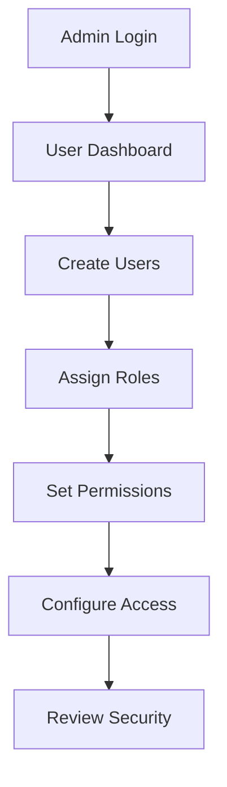
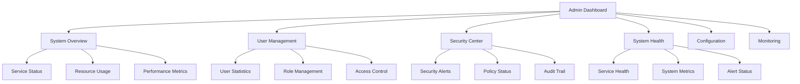

# Admin Guide

Welcome to the Studio Platform Admin Guide! This comprehensive guide covers all aspects of system administration, from user management to system configuration, security settings, and operational monitoring.

## 🎯 Who This Guide Is For

This guide is designed for:

- **System Administrators** - Managing platform infrastructure and services
- **IT Managers** - Overseeing platform operations and security
- **Security Officers** - Managing security policies and controls
- **Compliance Officers** - Administering compliance configurations
- **DevOps Engineers** - Managing deployment and operations

## 📚 Admin Guide Structure

### **System Administration**
- **[User Management](user-management.md)** - Managing users, roles, and permissions
- **[System Configuration](system-configuration.md)** - Platform configuration and customization
- **[Security Settings](security-settings.md)** - Security policies and controls
- **[Backup & Recovery](backup-recovery.md)** - Data backup and disaster recovery
- **[Monitoring](monitoring.md)** - System monitoring and alerting

### **Operational Management**
- **Performance Optimization** - System performance tuning
- **Resource Management** - Resource allocation and monitoring
- **Maintenance Procedures** - Regular maintenance tasks
- **Incident Response** - System incident management
- **Capacity Planning** - Resource capacity planning

### **Advanced Administration**
- **Multi-Tenant Management** - Managing multiple organizations
- **Integration Management** - Third-party integrations
- **Compliance Management** - Framework-specific configurations
- **Audit Trail Management** - Audit log management and analysis
- **API Management** - API access and rate limiting

## 🚀 Quick Start for Admins

### **Initial Admin Setup**

#### **Step 1: Access Admin Dashboard**

1. **Login as Admin**
   - Navigate to admin login page
   - Use admin credentials
   - Complete two-factor authentication

2. **Review System Status**
   - Check service health status
   - Review system metrics
   - Verify user activity

3. **Configure Basic Settings**
   - Set organization details
   - Configure security policies
   - Set up user roles

#### **Step 2: User Management**

**User Management Tasks:**

- **Create User Accounts** - Add new users to the platform
- **Assign Roles** - Assign appropriate roles to users  
- **Set Permissions** - Configure user access permissions
- **Manage Groups** - Create and manage user groups
- **Review Access** - Regularly review user access

#### **Step 3: System Configuration**

**Configuration Areas:**

- **Platform Settings** - Basic platform configuration
- **Security Policies** - Security and access policies
- **Integration Settings** - Third-party integrations
- **Notification Settings** - Email and notification preferences
- **Backup Configuration** - Backup and recovery settings

### **Admin Dashboard Overview**

#### **Main Dashboard Components**

**Dashboard Features:**
- **System Overview** - At-a-glance system status
- **User Management** - User and role management tools
- **Security Center** - Security policies and monitoring
- **System Health** - Service health and performance
- **Configuration** - System configuration tools
- **Monitoring** - Real-time monitoring and alerts

## 🔧 Admin Responsibilities

### **Primary Responsibilities**

#### **System Administration**
- **User Management** - Manage user accounts and access
- **System Configuration** - Configure system settings
- **Security Management** - Implement security policies
- **Performance Monitoring** - Monitor system performance
- **Backup Management** - Manage backup and recovery

#### **Security Administration**
- **Access Control** - Manage user access and permissions
- **Security Policies** - Implement security policies
- **Threat Monitoring** - Monitor for security threats
- **Incident Response** - Respond to security incidents
- **Compliance Monitoring** - Ensure compliance requirements

#### **Operational Administration**
- **Service Management** - Manage platform services
- **Resource Management** - Optimize resource usage
- **Capacity Planning** - Plan for future resource needs
- **Maintenance Management** - Schedule system maintenance
- **Vendor Management** - Manage third-party services

### **Daily Admin Tasks**

#### **Routine Tasks**
- **System Health Check** - Verify all services are running
- **User Access Review** - Review new user requests
- **Security Log Review** - Review security logs for issues
- **Performance Monitoring** - Check system performance metrics
- **Backup Verification** - Verify backup completion

#### **Weekly Tasks**
- **User Access Audit** - Review user access permissions
- **Security Policy Review** - Review security policy compliance
- **System Updates** - Apply system updates and patches
- **Performance Analysis** - Analyze performance trends
- **Capacity Review** - Review resource capacity

#### **Monthly Tasks**
- **Security Assessment** - Conduct security assessment
- **User Training** - Provide user training and support
- **System Maintenance** - Schedule system maintenance
- **Compliance Review** - Review compliance status
- **Reporting** - Generate admin reports

## 🛡️ Security Considerations

### **Admin Security Best Practices**

#### **Access Security**
- **Strong Authentication** - Use strong passwords and 2FA
- **Role-Based Access** - Implement role-based access control
- **Regular Access Review** - Regularly review admin access
- **Session Management** - Manage admin sessions properly
- **Secure Communication** - Use secure communication channels

#### **System Security**
- **Regular Updates** - Keep systems updated and patched
- **Security Monitoring** - Monitor for security threats
- **Incident Response** - Have incident response procedures
- **Backup Security** - Secure backup data properly
- **Network Security** - Implement network security controls

### **Compliance Requirements**

#### **Administrative Controls**
- **Access Logging** - Log all admin activities
- **Change Management** - Document all system changes
- **Audit Trail** - Maintain comprehensive audit trail
- **Policy Compliance** - Ensure compliance with policies
- **Regular Audits** - Conduct regular security audits

## 📊 Admin Metrics and KPIs

### **Key Performance Indicators**

#### **System Metrics**
- **System Uptime** - Percentage of time system is available
- **Response Time** - Average system response time
- **Error Rate** - Percentage of system errors
- **Resource Utilization** - System resource usage
- **User Satisfaction** - User satisfaction scores

#### **Security Metrics**
- **Security Incidents** - Number of security incidents
- **Response Time** - Average incident response time
- **Access Violations** - Number of access violations
- **Policy Compliance** - Security policy compliance rate
- **Vulnerability Status** - Vulnerability remediation status

#### **Operational Metrics**
- **User Management** - User account management metrics
- **System Performance** - System performance metrics
- **Maintenance Efficiency** - Maintenance task completion
- **Backup Success** - Backup completion rate
- **Support Tickets** - Support ticket resolution time

### **Monitoring Dashboard**

#### **Admin Dashboard Features**
- **Real-Time Metrics** - Real-time system metrics
- **Alert Management** - Alert configuration and management
- **Trend Analysis** - Historical trend analysis
- **Performance Reports** - Performance reporting tools
- **Custom Views** - Custom dashboard views

## 🎯 Admin Success Tips

### **Best Practices**

#### **Proactive Administration**
- **Regular Monitoring** - Monitor system health continuously
- **Preventive Maintenance** - Perform preventive maintenance
- **Capacity Planning** - Plan for future resource needs
- **Security Awareness** - Stay aware of security threats
- **User Support** - Provide excellent user support

#### **Documentation**
- **Procedures Documentation** - Document all procedures
- **Change Documentation** - Document all system changes
- **Troubleshooting Guides** - Create troubleshooting guides
- **User Guides** - Maintain user documentation
- **Admin Logs** - Maintain comprehensive admin logs

### **Common Admin Mistakes**

❌ **Avoid These Mistakes:**
- Neglecting regular system monitoring
- Not keeping systems updated and patched
- Ignoring security alerts and warnings
- Not documenting system changes
- Providing inadequate user support

✅ **Follow These Best Practices:**
- Monitor system health continuously
- Keep systems updated and secure
- Respond promptly to security alerts
- Document all system changes
- Provide excellent user support

## 📞 Support and Resources

### **Admin Support**

#### **Available Resources**
- **Documentation** - Comprehensive admin documentation
- **Training Materials** - Admin training and tutorials
- **Community Forum** - Admin community discussions
- **Support Team** - Technical support team
- **Knowledge Base** - Admin knowledge base

#### **Getting Help**
- **Documentation** - Search admin documentation
- **Community Forum** - Ask questions in community forum
- **Support Tickets** - Submit support tickets
- **Training** - Attend admin training sessions
- **Webinars** - Participate in admin webinars

---

!!! tip **Regular Monitoring**
    Set up automated monitoring and alerts to stay informed about system status and potential issues.

!!! note **Security First**
    Always prioritize security in admin tasks. Implement strong security controls and follow security best practices.

!!! question **Need Help?**
    Check our [Troubleshooting Guide](../troubleshooting/) for common admin issues, or contact our support team for personalized assistance.
