# Monitoring

Comprehensive monitoring is essential for maintaining system health, performance optimization, and security awareness. This guide covers all aspects of monitoring Studio Platform, from system metrics to security monitoring and compliance reporting.

## 📊 Monitoring Overview

### **Monitoring Architecture**

Studio Platform implements a comprehensive monitoring architecture designed to provide real-time visibility into system performance, security events, and compliance status.

```mermaid
graph TD
    A[Monitoring Architecture] --> B[System Monitoring]
    A --> C[Security Monitoring]
    A --> D[Performance Monitoring]
    A --> E[Compliance Monitoring]
    A --> F[User Activity Monitoring]
    
    B --> G[Infrastructure Metrics]
    B --> H[Application Metrics]
    B --> I[Database Metrics]
    B --> J[Network Metrics]
    
    C --> K[Security Events]
    C --> L[Threat Detection]
    C --> M[Vulnerability Scanning]
    C --> N[Access Monitoring]
    
    D --> O[Response Times]
    D --> P[Resource Utilization]
    D --> Q[Error Rates]
    D --> R[User Experience]
    
    E --> S[Compliance Scores]
    E --> T[Control Coverage]
    E --> U[Evidence Quality]
    E --> V[Risk Assessment]
    
    F --> W[User Login]
    F --> X[User Activity]
    F --> Y[Resource Access]
    F --> Z[Data Changes]
```



### **Monitoring Categories**

#### **System Monitoring**
- **Infrastructure** - Server health, network status, storage metrics
- **Application** - Application health, error rates, performance metrics
- **Database** - Database performance, query efficiency, resource usage
- **Network** - Network latency, bandwidth usage, connectivity
- **Storage** - Storage utilization, I/O performance, capacity planning

#### **Security Monitoring**
- **Authentication** - Login attempts, authentication failures, MFA usage
- **Authorization** - Access control, permission changes, role assignments
- **Threat Detection** - Anomaly detection, intrusion detection, malware detection
- **Vulnerability Scanning** - Vulnerability assessment, patch management
- **Access Monitoring** - Resource access, data access, privileged access

#### **Performance Monitoring**
- **Response Times** - Application response times, database query times
- **Resource Utilization** - CPU, memory, disk, network utilization
- **Error Rates** - Application errors, database errors, system errors
- **User Experience** - Page load times, user satisfaction metrics
- **Scalability** - System capacity, load balancing, performance under load

## 🖥️ System Monitoring

### **Infrastructure Monitoring**

#### **Server Health Monitoring**

**Server Metrics Dashboard:**
```
🖥️ Server Health Dashboard
   Total Servers: 12 | Healthy: 11 | Warning: 1 | Critical: 0
   
   Server Status:
   🖥️ Database Server: Healthy
      📊 CPU Usage: 45%
      💾 Memory Usage: 62%
      💽 Disk Usage: 38%
      🌐 Network: Normal
      🔒 Uptime: 99.9%
   
   🖥️ Application Server: Healthy
      📊 CPU Usage: 35%
      💾 Memory Usage: 58%
      💽 Disk Usage: 42%
      🌐 Network: Normal
      🔒 Uptime: 99.8%
   
   🖥️ Web Server: Warning
      📊 CPU Usage: 78%
      💾 Memory Usage: 82%
      💽 Disk Usage: 65%
      🌐 Network: Slow
      🔒 Uptime: 99.5%
   
   🖥️ Database Server: Healthy
      📊 CPU Usage: 52%
      💾 Memory Usage: 71%
      💽 Disk Usage: 45%
      🌐 Network: Normal
      🔒 Uptime: 99.9%
   
   📊 Overall Health:
   📊 Average CPU Usage: 52.5%
   📊 Average Memory Usage: 68.25%
   📊 Average Disk Usage: 47.5%
   📊 Average Uptime: 99.775%
   
   🚨 Alerts:
   🔴 High CPU Usage: Web Server
   🔴 High Memory Usage: Web Server
   🔴 High Disk Usage: Web Server
   🔴 Slow Network: Web Server
```

#### **Resource Utilization**

**Resource Utilization Metrics:**
```
📊 Resource Utilization Dashboard
   
   CPU Utilization:
   📊 Average: 52.5%
   📊 Peak: 85%
   📊 Low: 15%
   📊 Trend: Stable
   
   Memory Utilization:
   📊 Average: 68.25%
   📊 Peak: 92%
   📊 Low: 35%
   📊 Trend: Increasing
   
   Disk Utilization:
   📊 Average: 47.5%
   📊 Peak: 75%
   📊 Low: 20%
   📊 Trend: Stable
   
   Network Utilization:
   📊 Average: 35%
   📊 Peak: 80%
   📊 Low: 10%
   📊 Trend: Stable
   
   Capacity Planning:
   📊 CPU Capacity: 75%
   📊 Memory Capacity: 80%
   📊 Disk Capacity: 60%
   📊 Network Capacity: 50%
   
   Recommendations:
   🔴 Monitor Web Server CPU usage
   🔴 Monitor Web Server memory usage
   🔴 Plan disk capacity expansion
   🔒 Optimize network usage
```

### **Application Monitoring**

#### **Application Health**

**Application Metrics Dashboard:**
```
📱 Application Health Dashboard
   Application Status: Healthy
   Response Time: 1.2 seconds
   Error Rate: 0.5%
   Uptime: 99.8%
   
   Service Health:
   📊 Backend API: Healthy
      📊 Response Time: 800ms
      📊 Error Rate: 0.2%
      📊 Uptime: 99.9%
      📊 Requests/Second: 150
   
   📊 Frontend: Healthy
      📊 Response Time: 1.5 seconds
      📊 Error Rate: 0.8%
      📊 Uptime: 99.7%
      📊 Page Views: 2,500/day
   
   📊 Database: Healthy
      📊 Query Time: 200ms
      📊 Error Rate: 0.1%
      📊 Connections: 50/100
      📊 Transactions: 1,000/second
   
   📊 AI Service: Healthy
      📊 Response Time: 2.5 seconds
      📊 Error Rate: 1.2%
      📊 Uptime: 99.5%
      📊 Requests/Second: 50
   
   📊 Performance Metrics:
   📊 Average Response Time: 1.2s
   📊 95th Percentile: 2.5s
   📊 Error Rate: 0.5%
   📊 Throughput: 200 requests/second
   📊 Availability: 99.8%
```

#### **Application Performance**

**Performance Metrics:**
```
📈 Application Performance Dashboard
   
   Response Time Analysis:
   📊 Average: 1.2s
   📊 Median: 1.0s
   📊 95th Percentile: 2.5s
   📊 99th Percentile: 4.0s
   📊 Maximum: 8.0s
   
   Performance Trends:
   📈 Response Time: Improving (-0.2s this month)
   📈 Error Rate: Stable
   📈 Throughput: Increasing (+10 req/s this month)
   📈 Availability: Stable
   
   Performance by Service:
   📊 Backend API: 800ms (Excellent)
   📊 Frontend: 1.5s (Good)
   📊 Database: 200ms (Excellent)
   📊 AI Service: 2.5s (Good)
   📊 File Service: 1.8s (Good)
   
   Performance Issues:
   🔴 Slow Response: AI Service
   🔴 High Error Rate: Frontend
   🔴 High Memory Usage: Database
   🔴 Slow Database Queries: Database
   
   Recommendations:
   🔴 Optimize AI Service performance
   🔴 Investigate frontend errors
   🔒 Optimize database queries
   🔒 Implement query caching
```

## 🔒 Security Monitoring

### **Security Dashboard**

#### **Security Overview**

**Security Metrics Dashboard:**
```
🔒 Security Dashboard
   Security Status: Healthy
   Threat Level: Low
   Security Score: 92/100
   Active Alerts: 2
   
   Security Metrics:
   🔒 Authentication Success Rate: 98.5%
   🔒 MFA Usage Rate: 95%
   🔒 Failed Login Attempts: 15/day
   🔒 Suspicious Activities: 2/week
   🔒 Vulnerabilities: 3 (Low risk)
   
   Security Events:
   🔴 Failed Login Attempts: 15
   🔒 MFA Bypass Attempts: 0
   🔒 Suspicious Logins: 2
   🔒 Privileged Access: 25
   🔒 Data Access: 500
   
   Threat Intelligence:
   🔍 Malware Detection: 0
   🔍 Phishing Attempts: 5
   🔍 Bot Activity: 12
   🔍 Unknown Sources: 8
   🔍 Suspicious IPs: 3
   
   Security Alerts:
   🔴 Critical: 0
   🔴 High: 1
   🟡 Medium: 1
   🟢 Low: 0
   
   Recent Alerts:
   🔴 High: Suspicious login from unknown IP
   🟡 Medium: Multiple failed login attempts
   🟢 Low: New device registration
```

#### **Authentication Monitoring**

**Authentication Metrics:**
```
🔐 Authentication Dashboard
   
   Authentication Metrics:
   🔒 Total Logins: 1,500/day
   🔒 Successful Logins: 1,485
   🔒 Failed Logins: 15
   🔒 MFA Usage: 1,420
   🔒 New Users: 25
   
   Authentication Methods:
   🔒 Password Only: 75
   🔒 MFA Enabled: 1,420
   🔒 SSO: 5
   🔒 API Keys: 10
   
   Authentication Trends:
   📈 Success Rate: 98.5% (Target: 98%)
   📈 MFA Usage: 94.7% (Target: 95%)
   📈 Failed Login Rate: 1.0% (Target: <2%)
   📈 New User Rate: Stable
   
   Security Events:
   🔴 Failed Logins: 15
   🔒 MFA Bypass: 0
   🔒 Account Lockouts: 2
   🔒 Password Resets: 10
   🔒 New Devices: 25
   
   Geographic Distribution:
   🌐 United States: 85%
   🌐 Canada: 5%
   🌐 Europe: 5%
   🌐 Other: 5%
   
   Device Distribution:
   📱 Desktop: 60%
   📱 Mobile: 25%
   💻 Laptop: 15%
```

#### **Threat Detection**

**Threat Intelligence:**
```
🔍 Threat Detection Dashboard
   
   Threat Landscape:
   🔍 Current Threat Level: Low
   🔍 Active Threats: 2
   🔍 New Threats: 5/day
   🔍 Blocked Threats: 150/day
   
   Threat Categories:
   🔍 Phishing: 5 attempts
   🔍 Malware: 0 detections
   🔍 Bot Activity: 12 attempts
   🔍 Unknown Sources: 8 attempts
   🔍 Suspicious IPs: 3 attempts
   
   Detection Methods:
   🔍 Signature-Based: 50%
   🔍 Anomaly-Based: 30%
   🔍 Behavioral: 20%
   🔍 Machine Learning: 0%
   
   Response Actions:
   🔒 IP Blocking: 150 IPs
   🔒 Account Lockouts: 2 accounts
   🔒 Device Blocking: 5 devices
   🔒 Alert Notifications: 10 alerts
   
   Threat Intelligence:
   🔍 Threat Feeds: 10 active
   🔍 Reputation Data: Integrated
   🔍 Industry Sharing: Enabled
   🔍 Global Threats: Monitored
```

## 📈 Performance Monitoring

### **Performance Analytics**

#### **Performance Metrics**

**Performance Dashboard:**
```
📈 Performance Dashboard
   
   Response Time Metrics:
   📊 Average: 1.2s
   📊 Median: 1.0s
   📊 95th Percentile: 2.5s
   📊 99th Percentile: 4.0s
   📊 Maximum: 8.0s
   
   Throughput Metrics:
   📊 Requests/Second: 200
   📊 Concurrent Users: 500
   📊 Transactions/Second: 1,000
   📊 Page Views/Day: 2,500
   📊 API Calls/Day: 10,000
   
   Error Metrics:
   📊 Error Rate: 0.5%
   📊 4xx Errors: 0.3%
   📊 5xx Errors: 0.2%
   📊 Database Errors: 0.1%
   📊 Application Errors: 0.1%
   
   Resource Utilization:
   📊 CPU Usage: 52.5%
   📊 Memory Usage: 68.25%
   📊 Disk Usage: 47.5%
   📊 Network Usage: 35%
   📊 Database Connections: 50%
   
   Performance Trends:
   📈 Response Time: Improving (-0.2s)
   📈 Error Rate: Stable (0.5%)
   📈 Throughput: Increasing (+10 req/s)
   📈 Utilization: Increasing (+2%)
```

#### **Performance Optimization**

**Performance Recommendations:**
```
📈 Performance Optimization Recommendations
   
   High Priority:
   🔴 Optimize AI Service Performance
      - Response time: 2.5s (target: <2s)
      - Error rate: 1.2% (target: <1%)
      - Actions: Code optimization, caching
   
   🔴 Investigate Frontend Errors
      - Error rate: 0.8% (target: <0.5%)
      - Common errors: 404, 500
      - Actions: Error logging, debugging
   
   🔴 Optimize Database Queries
      - Query time: 200ms (target: <100ms)
      - Slow queries: 5 identified
      - Actions: Query optimization, indexing
   
   Medium Priority:
   🟡 Implement Response Caching
   🟡 Optimize Asset Loading
   🟡 Implement Database Connection Pooling
   🟡 Optimize Network Usage
   
   Low Priority:
   🟢 Implement CDN
   🟢 Optimize Image Compression
   🟢 Implement HTTP/2
   🟢 Optimize Database Configuration
```

## 📊 Compliance Monitoring

### **Compliance Dashboard**

#### **Compliance Metrics**

**Compliance Dashboard:**
```
📊 Compliance Dashboard
   Overall Compliance Score: 78%
   Framework Coverage: 3 frameworks
   Controls Assessed: 180
   Controls Compliant: 140
   
   Framework Breakdown:
   🔒 SOC 2: 78% (Good)
   🔒 ISO 27001: 76% (Good)
   🔒 GDPR: 85% (Good)
   🔒 HIPAA: 72% (Fair)
   🔒 PCI DSS: 82% (Good)
   
   Compliance Trends:
   📈 Overall Score: +5% this quarter
   📈 SOC 2: +4% this quarter
   📈 ISO 27001: +6% this quarter
   📈 GDPR: +2% this quarter
   📈 HIPAA: +8% this quarter
   📈 PCI DSS: +3% this quarter
   
   Control Coverage:
   📊 Total Controls: 180
   📊 Compliant Controls: 140
   📊 In Progress: 30
   📊 Not Started: 10
   📊 Coverage: 78%
   
   Evidence Quality:
   📊 Total Evidence: 1,247
   📊 Quality Score: 85%
   📊 High Quality: 523
   📊 Good Quality: 523
   📊 Needs Improvement: 156
   📊 Poor Quality: 45
   
   Risk Assessment:
   📊 Total Risks: 47
   📊 Critical Risks: 2
   📊 High Risks: 8
   📊 Medium Risks: 22
   📊 Low Risks: 12
   📊 Average Risk Score: 12.3
```

#### **Compliance Analytics**

**Compliance Analytics:**
```
📈 Compliance Analytics Dashboard
   
   Compliance Progress:
   📊 Current Score: 78%
   📈 Target Score: 85%
   📈 Gap: 7%
   📈 Progress Rate: +5%/quarter
   📈 Time to Target: 3 months
   
   Framework Performance:
   🔒 SOC 2: On track
   🔒 ISO 27001: On track
   🔒 GDPR: On track
   🔒 HIPAA: Ahead of schedule
   🔒 PCI DSS: On track
   
   Evidence Quality:
   📊 Quality Score: 85%
   📈 Improvement: +3% this quarter
   📈 Target: 90%
   📈 Time to Target: 2 months
   
   Risk Management:
   📊 Risk Score: 12.3
   📈 Trend: Decreasing
   📈 Mitigation: 25% completed
   📈 New Risks: 3 this month
   📈 Resolved Risks: 12 this month
   
   Team Performance:
   📊 Team Productivity: 92%
   📈 Evidence Quality: 85%
   📈 Review Speed: 2.1 days
   📈 Training Completion: 85%
```

## 📱 User Activity Monitoring

### **User Activity Analytics**

#### **User Metrics**

**User Activity Dashboard:**
```
👥 User Activity Dashboard
   Total Users: 247
   Active Users: 235
   New Users: 12
   Inactive Users: 12
   
   User Engagement:
   📊 Daily Active Users: 189
   📊 Weekly Active Users: 223
   📊 Monthly Active Users: 235
   📊 Average Session Duration: 2h 15m
   
   User Distribution:
   🎭 Super Admin: 2 (0.8%)
   🔧 Admin: 5 (2.0%)
   👨‍💼 Manager: 23 (9.3%)
   🔍 Auditor: 18 (7.3%)
   👤 Customer: 156 (63.2%)
   👁️ Viewer: 43 (17.4%)
   
   Activity Patterns:
   📊 Peak Hours: 9 AM - 5 PM
   📊 Peak Day: Wednesday
   📊 Peak Month: November
   📊 Geographic: US-based
   
   User Behavior:
   📊 Dashboard Views: 5,000/day
   📊 Evidence Uploads: 50/day
   📊 Report Generation: 25/day
   📊 AI Assistant Usage: 100/day
```

#### **User Access Monitoring**

**Access Analytics:**
```
🔐 User Access Dashboard
   
   Access Patterns:
   🔒 Total Access Events: 12,456
   🔒 Successful Access: 12,300
   🔒 Failed Access: 156
   🔒 Suspicious Access: 2
   🔒 Privileged Access: 500
   
   Access Types:
   🔒 Dashboard Access: 5,000
   🔒 Evidence Access: 3,000
   🔒 Report Access: 2,000
   🔒 Admin Access: 500
   🔒 API Access: 1,956
   
   Geographic Distribution:
   🌐 United States: 89%
   🌐 Canada: 5%
   🌐 Europe: 4%
   🌐 Asia: 2%
   
   Device Distribution:
   📱 Desktop: 60%
   📱 Mobile: 25%
   💻 Laptop: 15%
   
   Time-Based Patterns:
   ⏰ Business Hours: 85%
   📅 Weekdays: 80%
   🌙 After Hours: 15%
   🎉 Holidays: 5%
   
   Security Events:
   🔒 Failed Login Attempts: 15
   🔒 Suspicious Activity: 2
   🔒 Privileged Access: 500
   🔒 Data Access: 1,000
```

## 🔧 Monitoring Tools

### **Monitoring Tools**

#### **Monitoring Stack**

**Monitoring Tools:**
```
🔧 Monitoring Tool Stack
   
   Infrastructure Monitoring:
   📊 Prometheus: Metrics collection
   📊 Grafana: Visualization
   📊 Alertmanager: Alerting
   📊 Node Exporter: Node.js metrics
   
   Application Monitoring:
   📊 Application Metrics: Custom
   📊 Error Tracking: Sentry
   📊 Performance: Custom
   📊 User Analytics: Custom
   
   Security Monitoring:
   🔒 SIEM: Security Information Management
   🔒 IDS/IPS: Intrusion Detection
   🔒 Threat Intelligence: Threat feeds
   🔒 Log Management: Centralized
   
   Compliance Monitoring:
   📊 Compliance Metrics: Custom
   📊 Compliance Reporting: Custom
   📊 Risk Assessment: Custom
   📊 Evidence Tracking: Custom
```

#### **Alerting System**

**Alert Configuration:**
```
🚨 Alerting Configuration
   
   Alert Types:
   🔴 Critical: System down, security breach
   🟡 High: Performance degradation, security risk
   🟡 Medium: Resource warning, compliance issue
   🟢 Low: Informational, maintenance
   
   Alert Channels:
   📧 Email: All alerts
   📱 SMS: Critical alerts only
   📱 Mobile App: All alerts
   📊 Dashboard: All alerts
   
   Alert Rules:
   🔴 System Uptime < 99%
   🔴 Error Rate > 5%
   🔴 Response Time > 5s
   🔴 Security Breach Detected
   🔴 Compliance Score < 70%
   
   Alert Frequency:
   🔴 Critical: Immediate
   🔴 High: 5 minutes
   🔡 Medium: 30 minutes
   🔢 Low: 2 hours
   
   Alert Escalation:
   🔴 Level 1: Immediate notification
   🔴 Level 2: Escalation after 5 minutes
   🔴 Level 3: Escalation after 30 minutes
   🔴 Level 4: Escalation after 2 hours
```

## ✅ Monitoring Best Practices

### **Monitoring Best Practices**

#### **Operational Excellence**
- **Comprehensive Coverage** - Monitor all critical systems and components
- **Real-Time Monitoring** - Implement real-time monitoring for critical systems
- **Alert Management** - Configure appropriate alerting rules and escalation
- **Performance Optimization** - Use monitoring data to optimize performance
- **Continuous Improvement** - Continuously improve monitoring capabilities

#### **Security Best Practices**
- **Security Monitoring** - Implement comprehensive security monitoring
- **Threat Detection** - Use multiple threat detection methods
- **Incident Response** - Have comprehensive incident response procedures
- **Compliance Monitoring** - Monitor compliance with regulatory requirements
- **Audit Logging** - Maintain comprehensive audit logs

### **Common Monitoring Mistakes**

❌ **Avoid These Mistakes:**
- Not monitoring all critical systems
- Not setting appropriate alert thresholds
- Not responding to alerts promptly
- Not monitoring security events
- Not analyzing monitoring data

✅ **Follow These Best Practices:**
- Monitor all critical systems and components
- Set appropriate alert thresholds and escalation
- Respond to alerts promptly and appropriately
- Monitor security events continuously
- Analyze monitoring data for insights

---

!!! tip **Automation**
    Automate routine monitoring tasks to improve efficiency and reduce human error. Use automation tools and scripts for monitoring automation.

!!! note **Compliance Focus**
    Ensure monitoring systems capture all compliance-related data and metrics to support regulatory requirements and audit needs.

!!! question **Need Help?**
    Check our [Troubleshooting Guide](../troubleshooting/) for common monitoring issues, or contact our support team for assistance.
