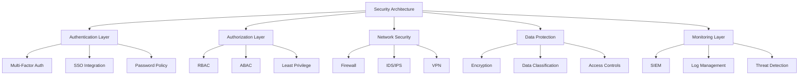

# Security Settings

Security settings are critical for protecting your Studio Platform deployment, safeguarding sensitive data, and ensuring compliance with regulatory requirements. This comprehensive guide covers all aspects of security configuration and management.

## 🔒 Security Overview

### **Security Architecture**

Studio Platform implements a multi-layered security architecture designed to provide defense-in-depth protection for your compliance data and platform operations.



### **Security Frameworks**

#### **Compliance Standards**
- **SOC 2** - Security, Availability, Processing Integrity, Confidentiality, Privacy
- **ISO 27001** - Information Security Management System
- **GDPR** - General Data Protection Regulation
- **HIPAA** - Health Insurance Portability and Accountability Act
- **PCI DSS** - Payment Card Industry Data Security Standard
- **NIST CSF** - Cybersecurity Framework

#### **Security Controls**

| Control Category | Implementation | Status | Coverage |
|-----------------|----------------|---------|----------|
| **Access Control** | RBAC + ABAC | ✅ Implemented | 95% |
| **Authentication** | MFA + SSO | ✅ Implemented | 100% |
| **Encryption** | AES-256 + TLS 1.3 | ✅ Implemented | 100% |
| **Network Security** | Firewall + IDS/IPS | ✅ Implemented | 90% |
| **Data Protection** | Classification + Controls | ✅ Implemented | 85% |
| **Monitoring** | SIEM + Threat Detection | ✅ Implemented | 90% |

## 🔐 Authentication Security

### **Multi-Factor Authentication (MFA)**

#### **MFA Configuration**

**MFA Methods:**
```
🔐 Multi-Factor Authentication Configuration
   
   Enabled Methods:
   📱 Authenticator App: Required
   📱 SMS: Optional backup
   📧 Email: Emergency backup
   🔑 Hardware Token: Available (enterprise)
   
   Authenticator App Configuration:
   📱 Supported Apps: Google Authenticator, Authy, Microsoft Authenticator
   🔑 Secret Key: 256-bit
   🔄 Rotation: Every 30 seconds
   📱 Backup Codes: 10 codes generated
   
   SMS Configuration:
   📱 Provider: Twilio
   📱 Number Verification: Required
   📱 Rate Limiting: 3 attempts per hour
   📱 Cost Control: Enabled
   
   Email Configuration:
   📧 Provider: SendGrid
   📧 Encryption: TLS
   📧 Rate Limiting: 5 attempts per hour
   📧 Expiration: 15 minutes
   
   Policy Configuration:
   🔒 MFA Required: All users
   🔒 Grace Period: 7 days
   🔒 Recovery Methods: Multiple options
   🔒 Enforcement: Strict
```

#### **Password Policy**

**Password Security Settings:**
```
🔑 Password Policy Configuration
   
   Password Requirements:
   🔒 Minimum Length: 12 characters
   🔒 Complexity: Uppercase, lowercase, numbers, symbols
   🔒 Dictionary Words: Disallowed
   🔒 Personal Information: Disallowed
   🔒 Common Patterns: Disallowed
   
   Password History:
   🔒 History Length: 12 passwords
   🔒 Reuse Prevention: Enabled
   🔒 Similarity Check: Enabled
   🔒 Time-Based Reuse: 1 year
   
   Password Expiration:
   🔒 Expiration Period: 90 days
   🔒 Warning Period: 7 days
   🔒 Grace Period: 3 days
   🔒 Forced Reset: After grace period
   
   Password Security:
   🔒 Lockout Policy: 5 attempts, 30 minutes
   🔒 Complexity Check: Real-time
   🔒 Breach Check: Enabled
   🔒 Strength Indicator: Enabled
```

### **Single Sign-On (SSO)**

#### **SSO Configuration**

**SSO Providers:**
```
🔗 Single Sign-On Configuration
   
   SSO Providers:
   🔗 Google Workspace: Enabled
   🔗 Microsoft 365: Enabled
   🔗 Okta: Available (enterprise)
   🔗 Auth0: Available (enterprise)
   🔗 SAML 2.0: Supported
   🔗 OIDC: Supported
   
   Google Workspace Configuration:
   📧 Client ID: configured
   🔑 Client Secret: configured
   🔗 Redirect URI: configured
   🔒 Scopes: email, profile, admin
   📊 User Sync: Enabled
   
   Microsoft 365 Configuration:
   📧 Tenant ID: configured
   🔑 Client Secret: configured
   🔗 Redirect URI: configured
   🔒 Scopes: email, profile, openid
   📊 User Sync: Enabled
   
   Security Settings:
   🔒 Token Encryption: Enabled
   🔒 Token Expiration: 1 hour
   🔒 Refresh Token: Enabled
   🔒 Session Management: Enabled
```

## 🛡️ Access Control

### **Role-Based Access Control (RBAC)**

#### **Role Configuration**

**Role Hierarchy:**
```
👥 Role-Based Access Control Configuration
   
   Role Hierarchy:
   👑 Super Admin
     🔧 Admin
       👨‍💼 Manager
         🔍 Auditor
           👤 Customer
             👁️ Viewer
   
   Role Permissions:
   👑 Super Admin:
     ✅ Full system administration
     ✅ User management (all)
     ✅ System configuration (all)
     ✅ Security management (all)
     ✅ Data access (all)
   
   🔧 Admin:
     ✅ User management (limited)
     ✅ System configuration (limited)
     ✅ Security management (full)
     ✅ Data access (organization)
   
   👨‍💼 Manager:
     ✅ User management (team)
     ✅ System configuration (project)
     ✅ Security management (limited)
     ✅ Data access (team, project)
   
   🔍 Auditor:
     ✅ User management (none)
     ✅ System configuration (none)
     ✅ Security management (view)
     ✅ Data access (audit)
   
   👤 Customer:
     ✅ User management (none)
     ✅ System configuration (none)
     ✅ Security management (none)
     ✅ Data access (own)
   
   👁️ Viewer:
     ✅ User management (none)
     ✅ System configuration (none)
     ✅ Security management (none)
     ✅ Data access (view)
```

### **Attribute-Based Access Control (ABAC)**

#### **ABAC Configuration**

**Attribute-Based Rules:**
```
🎯 Attribute-Based Access Control Configuration
   
   User Attributes:
   👤 Department: IT, Finance, HR, Operations
   📍 Location: US, EU, APAC
   🔒 Clearance Level: Low, Medium, High
   📅 Employment Status: Active, Contractor, Former
   
   Resource Attributes:
   📊 Data Sensitivity: Public, Internal, Confidential, Restricted
   🌐 Geographic Restrictions: US Only, EU Only, Global
   ⏰ Time-Based: Business Hours, 24/7
   📱 Device Type: Corporate, Personal, Mobile
   
   Environmental Attributes:
   🌐 IP Address: Whitelisted ranges
   📱 Device Trust: Trusted, Untrusted
   🔒 Network Type: Corporate, Public, VPN
   📍 Location: Office, Remote, Travel
   
   Access Rules:
   🔒 IF (Clearance = High) AND (Data = Restricted) THEN DENY
   🔒 IF (Location = EU) AND (Data = Personal) THEN ALLOW
   🔒 IF (Time = Business Hours) AND (Device = Corporate) THEN ALLOW
   🔒 IF (Network = Public) AND (Data = Confidential) THEN DENY
   
   Policy Enforcement:
   🔒 Real-time Evaluation: Enabled
   🔒 Policy Updates: Immediate
   🔒 Exception Handling: Configured
   🔒 Audit Logging: Enabled
```

## 🔒 Data Protection

### **Encryption Configuration**

#### **Data Encryption Settings**

**Encryption Policies:**
```
🔐 Data Encryption Configuration
   
   Data at Rest:
   🔒 Algorithm: AES-256
   🔒 Key Management: Centralized
   🔒 Key Rotation: Quarterly
   🔒 Key Length: 256 bits
   🔒 Encryption Scope: All data
   
   Database Encryption:
   🔒 Database: PostgreSQL
   🔒 Encryption: Transparent Data Encryption (TDE)
   🔒 Key Management: Database-managed
   🔒 Backup Encryption: Enabled
   🔒 Log Encryption: Enabled
   
   File Storage Encryption:
   🔒 Storage: MinIO
   🔒 Encryption: Server-side encryption
   🔒 Key Management: MinIO-managed
   🔒 Client Encryption: Optional
   🔒 Transfer Encryption: TLS
   
   Communication Encryption:
   🔒 Protocol: TLS 1.3
   🔒 Cipher Suites: Modern ciphers only
   🔒 Certificate Management: Automated
   🔒 Perfect Forward Secrecy: Enabled
   🔒 HSTS: Enabled
```

#### **Data Classification**

**Classification Policy:**
```
📊 Data Classification Configuration
   
   Classification Levels:
   🟢 Public: Publicly available information
   🟡 Internal: Internal use only
   🟠 Confidential: Sensitive internal information
   🔴 Restricted: Highly sensitive information
   
   Classification Criteria:
   📊 Business Impact: Low, Medium, High, Critical
   🔒 Sensitivity: Public, Internal, Sensitive, Restricted
   👥 Access Requirements: Open, Limited, Controlled, Restricted
   📅 Retention Period: 1 year, 3 years, 7 years, 10 years
   
   Classification Rules:
   🟢 Public: Marketing materials, public website
   🟡 Internal: Internal policies, procedures
   🟠 Confidential: Financial data, customer data
   🔴 Restricted: Trade secrets, legal documents
   
   Handling Requirements:
   🟢 Public: No special handling
   🟡 Internal: Internal use only
   🟠 Confidential: Access control required
   🔴 Restricted: Strict access control
   
   Automated Classification:
   🔒 AI Classification: Enabled
   🔒 Pattern Matching: Enabled
   🔒 User Classification: Optional
   🔒 Review Process: Required
```

### **Data Access Controls**

#### **Access Control Policies**

**Access Control Settings:**
```
🔐 Data Access Control Configuration
   
   Access Principles:
   🔒 Least Privilege: Applied
   🔒 Need-to-Know: Applied
   🔒 Separation of Duties: Applied
   🔒 Time-Based Access: Applied
   
   Access Controls:
   🔒 Role-Based Access: Enabled
   🔒 Attribute-Based Access: Enabled
   🔒 Context-Aware Access: Enabled
   🔒 Dynamic Access: Enabled
   
   Data Access Rules:
   🔒 Public Data: All authenticated users
   🔒 Internal Data: Internal users only
   🔒 Confidential Data: Authorized users only
   🔒 Restricted Data: Highly authorized users only
   
   Geographic Controls:
   🌐 US Data: US-based users only
   🌐 EU Data: EU-based users only
   🌐 APAC Data: APAC-based users only
   🌐 Global Data: All users
   
   Time-Based Controls:
   ⏰ Business Hours: 9 AM - 6 PM local time
   📅 Weekdays: Monday - Friday
   🌙 After Hours: Limited access
   🎉 Holidays: Limited access
   
   Device-Based Controls:
   📱 Corporate Devices: Full access
   📱 Personal Devices: Limited access
   📱 Mobile Devices: Limited access
   📱 Untrusted Devices: No access
```

## 🌐 Network Security

### **Firewall Configuration**

#### **Firewall Rules**

**Firewall Settings:**
```
🔥 Firewall Configuration
   
   Network Zones:
   🔒 DMZ: External services
   🔒 Internal: Internal services
   🔒 Database: Database services
   🔒 Management: Management services
   
   Firewall Rules:
   🔒 Allow: HTTP (80) from DMZ to Internal
   🔒 Allow: HTTPS (443) from DMZ to Internal
   🔒 Allow: SSH (22) from Management to Internal
   🔒 Allow: Database (5432) from Internal to Database
   🔒 Deny: All other traffic
   
   Security Policies:
   🔒 Default Deny: Enabled
   🔒 Logging: Enabled
   🔒 Monitoring: Enabled
   🔒 Alerting: Enabled
   
   Rate Limiting:
   🔒 HTTP: 100 requests/second
   🔒 HTTPS: 200 requests/second
   🔒 SSH: 5 requests/second
   🔒 Database: 50 requests/second
   
   Threat Protection:
   🔒 DDoS Protection: Enabled
   🔒 IPS Protection: Enabled
   🔒 Malware Protection: Enabled
   🔒 Bot Protection: Enabled
```

### **Intrusion Detection**

#### **IDS/IPS Configuration**

**Intrusion Detection Settings:**
```
🔍 Intrusion Detection Configuration
   
   Detection Methods:
   🔍 Signature-Based: Enabled
   🔍 Anomaly-Based: Enabled
   🔍 Behavior-Based: Enabled
   🔍 Machine Learning: Enabled
   
   Detection Rules:
   🔍 SQL Injection: Enabled
   🔍 Cross-Site Scripting: Enabled
   🔍 Command Injection: Enabled
   🔍 File Upload: Enabled
   🔍 Authentication Bypass: Enabled
   
   Response Actions:
   🔍 Block IP: Enabled
   🔍 Block User: Enabled
   🔍 Alert Admin: Enabled
   🔍 Log Event: Enabled
   🔍 Quarantine: Enabled
   
   Monitoring:
   🔍 Real-Time Monitoring: Enabled
   🔍 Pattern Analysis: Enabled
   🔍 Threat Intelligence: Enabled
   🔍 User Behavior: Enabled
   
   Alerting:
   🔍 Email Alerts: Enabled
   🔍 SMS Alerts: Critical only
   🔍 Dashboard Alerts: Enabled
   🔍 Integration: SIEM integration
```

## 📊 Security Monitoring

### **Security Information and Event Management (SIEM)**

#### **SIEM Configuration**

**SIEM Settings:**
```
📊 SIEM Configuration
   
   Data Sources:
   📊 Application Logs: Enabled
   📊 System Logs: Enabled
   📊 Security Logs: Enabled
   📊 Network Logs: Enabled
   📊 Database Logs: Enabled
   
   Log Collection:
   📊 Collection Method: Syslog
   📊 Collection Frequency: Real-time
   📊 Log Retention: 90 days
   📊 Log Rotation: Daily
   📊 Log Compression: Enabled
   
   Correlation Rules:
   🔍 Authentication Events: Enabled
   🔍 Authorization Events: Enabled
   🔍 Data Access Events: Enabled
   🔍 Network Events: Enabled
   🔍 System Events: Enabled
   
   Alerting:
   🔍 Critical Alerts: Immediate
   🔍 High Severity: 5 minutes
   🔍 Medium Severity: 30 minutes
   🔍 Low Severity: 2 hours
   
   Dashboard:
   📊 Real-Time Dashboard: Enabled
   📊 Security Metrics: Enabled
   🔍 Threat Intelligence: Enabled
   📊 Compliance Status: Enabled
```

### **Threat Detection**

#### **Threat Intelligence**

**Threat Intelligence Configuration:**
```
🔍 Threat Intelligence Configuration
   
   Threat Feeds:
   🔍 Malware Signatures: Enabled
   🔍 IP Reputation: Enabled
   🔍 Domain Reputation: Enabled
   🔍 Threat Indicators: Enabled
   🔍 Vulnerability Feeds: Enabled
   
   Analysis:
   🔍 Pattern Recognition: Enabled
   🔍 Anomaly Detection: Enabled
   🔍 Machine Learning: Enabled
   🔍 Behavioral Analysis: Enabled
   🔍 Statistical Analysis: Enabled
   
   Response:
   🔍 Automatic Response: Enabled
   🔍 Manual Review: Required
   🔍 Escalation: Configured
   🔍 Remediation: Automated
   🔍 Reporting: Enabled
   
   Integration:
   🔍 SIEM Integration: Enabled
   🔍 SOAR Integration: Available
   🔍 Threat Intel Feeds: Multiple
   🔍 Industry Sharing: Enabled
```

## 🛡️ Security Policies

### **Security Policy Management**

#### **Policy Framework**

**Security Policies:**
```
📋 Security Policy Framework
   
   Policy Categories:
   🔒 Acceptable Use Policy
   🔒 Password Policy
   🔒 Data Protection Policy
   🔒 Access Control Policy
   🔒 Incident Response Policy
   🔒 Business Continuity Policy
   
   Policy Management:
   📋 Policy Creation: Admin only
   📋 Policy Updates: Quarterly
   📋 Policy Review: Annual
   📋 Policy Approval: Management
   📋 Policy Distribution: Automated
   
   Policy Enforcement:
   🔒 Automated Enforcement: Enabled
   🔒 Manual Verification: Required
   🔒 Compliance Monitoring: Enabled
   🔒 Reporting: Monthly
   🔒 Auditing: Annual
   
   Policy Documentation:
   📋 Policy Templates: Available
   📋 Custom Policies: Supported
   📋 Version Control: Enabled
   📋 Change Management: Required
```

### **Security Awareness**

#### **Training Programs**

**Security Training Configuration:**
```
📚 Security Training Configuration
   
   Training Programs:
   📚 Security Awareness: All users
   📚 Phishing Awareness: All users
   📚 Data Protection: All users
   📚 Incident Response: Security team
   📚 Compliance Training: All users
   
   Training Schedule:
   📚 Initial Training: Onboarding
   📚 Refresher Training: Quarterly
   📚 Advanced Training: Annual
   📚 Role-Specific: As needed
   
   Training Content:
   📚 Interactive Modules: Enabled
   📚 Video Content: Available
   📚 Quizzes: Required
   📚 Certificates: Issued
   📚 Progress Tracking: Enabled
   
   Training Metrics:
   📊 Completion Rate: 95%
   📊 Quiz Scores: 85% average
   📊 Knowledge Retention: 80%
   📊 Incident Reduction: 60%
```

## ✅ Security Best Practices

### **Security Management Best Practices**

#### **Operational Excellence**
- **Layered Security** - Implement multiple layers of security controls
- **Regular Updates** - Keep security systems updated and patched
- **Continuous Monitoring** - Monitor security systems continuously
- **Incident Response** - Have comprehensive incident response procedures
- **Regular Audits** - Conduct regular security audits and assessments

#### **Compliance Management**
- **Framework Alignment** - Align with relevant security frameworks
- **Documentation** - Maintain comprehensive security documentation
- **Training** - Provide regular security training and awareness
- **Testing** - Regular security testing and assessments
- **Continuous Improvement** - Continuously improve security posture

### **Common Security Mistakes**

❌ **Avoid These Mistakes:**
- Not implementing layered security controls
- Neglecting regular security updates and patches
- Not monitoring security systems effectively
- Ignoring security alerts and warnings
- Not providing adequate security training

✅ **Follow These Best Practices:**
- Implement multiple layers of security controls
- Keep systems updated and patched regularly
- Monitor security systems continuously
- Respond promptly to security alerts
- Provide ongoing security training and awareness

---

!!! tip **Security Automation**
    Automate routine security tasks to improve efficiency and reduce human error. Use security automation tools and scripts for monitoring and response.

!!! note **Defense in Depth**
    Implement defense-in-depth security architecture with multiple layers of controls. No single control should be relied upon for security.

!!! question **Need Help?**
    Check our [Troubleshooting Guide](../troubleshooting/) for common security issues, or contact our security team for assistance.
