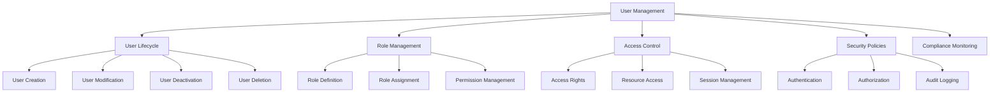
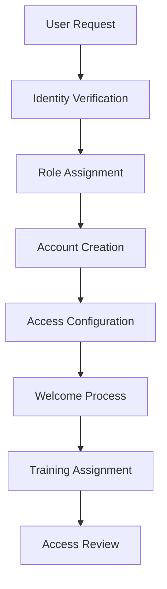
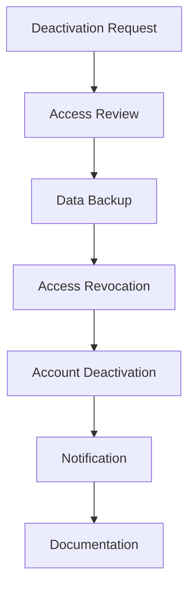
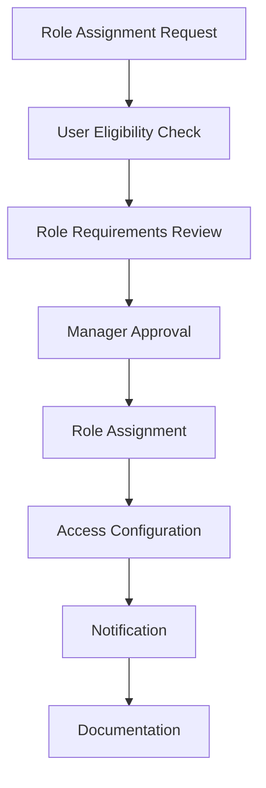

# User Management

User management is a critical administrative function that ensures proper access control, security, and compliance within Studio Platform. This guide covers user lifecycle management, role-based access control, and security best practices.

## 👥 User Management Overview

### **What is User Management?**

User management encompasses the processes and tools used to create, manage, and remove user accounts, assign roles and permissions, and ensure appropriate access to platform resources while maintaining security and compliance.

#### **User Management Components**



### **User Categories**

#### **User Types**

| User Type | Description | Access Level | Typical Role |
|-----------|-------------|-------------|--------------|
| **Super Admin** | Full system administration | Full access | System Administrator |
| **Admin** | Organization administration | High access | IT Manager |
| **Manager** | Team and project management | Medium-high access | Compliance Manager |
| **Auditor** | Audit and review functions | Medium access | Internal Auditor |
| **Customer** | End-user access | Medium access | Business User |
| **Viewer** | Read-only access | Low access | Stakeholder |

#### **User Roles Matrix**

| Role | User Management | System Config | Security | Compliance | Reporting |
|------|----------------|--------------|---------|-----------|----------|
| **Super Admin** | ✅ Full | ✅ Full | ✅ Full | ✅ Full | ✅ Full |
| **Admin** | ✅ Limited | ✅ Limited | ✅ Full | ✅ Full | ✅ Full |
| **Manager** | ❌ Limited | ❌ None | ✅ Limited | ✅ Full | ✅ Full |
| **Auditor** | ❌ None | ❌ None | ✅ Limited | ✅ Full | ✅ Full |
| **Customer** | ❌ None | ❌ None | ❌ Limited | ✅ Limited | ✅ Limited |
| **Viewer** | ❌ None | ❌ None | ❌ None | ✅ Limited | ✅ Limited |

## 🔄 User Lifecycle Management

### **User Creation Process

#### **New User Onboarding**



**Step-by-Step Process:**

1. **User Request Verification**
   - Verify user identity and authorization
   - Confirm role and access requirements
   - Check organizational approval
   - Validate compliance requirements

2. **Role Assignment**
   - Determine appropriate user role
   - Assign role-based permissions
   - Configure access rights
   - Set up security policies

3. **Account Creation**
   - Create user account in system
   - Generate initial credentials
   - Configure user profile
   - Set up communication preferences

4. **Access Configuration**
   - Assign specific resource access
   - Configure project permissions
   - Set up notification preferences
   - Enable required features

5. **Welcome Process**
   - Send welcome email with credentials
   - Provide initial training materials
   - Schedule orientation session
   - Assign mentor or buddy

**User Creation Interface:**
```
👤 Create New User
   User Information:
   📧 Email: john.doe@company.com
   👤 Full Name: John Doe
   📱 Phone: +1-555-0123
   🏢 Department: IT Security
   📍 Location: New York Office
   
   Role Assignment:
   🎭 Primary Role: Manager
   📋 Additional Roles: Auditor
   👥 Team: Compliance Team
   🎯 Projects: Q4 SOC 2 Assessment
   
   Access Configuration:
   🔐 Access Level: Standard
   📅 Access Duration: Permanent
   🌐 Geographic Access: US Only
   ⏰ Working Hours: 9 AM - 6 PM EST
   
   Security Settings:
   🔒 Two-Factor Auth: Required
   📱 Mobile Device: Allowed
   🌐 Remote Access: Allowed
   📧 Email Notifications: Enabled
   
   📋 Additional Information:
   📝 Notes: Senior compliance manager with 5+ years experience
   🎓 Training Required: Security Awareness, Compliance Training
   📅 Start Date: November 20, 2024
   👥 Manager: Jane Smith (jane.smith@company.com)
   
   Actions:
   ✅ Create User Account
   ✅ Send Welcome Email
   ✅ Assign Training
   ✅ Schedule Orientation
```

### **User Modification Process**

#### **User Profile Updates**

**Update Types:**
- **Personal Information** - Name, email, phone, department
- **Role Changes** - Role assignments and permissions
- **Access Rights** - Resource access and permissions
- **Security Settings** - Authentication and security policies
- **Project Assignments** - Project participation and roles

**User Modification Interface:**
```
👤 Edit User: John Doe
   User ID: user-12345
   Last Modified: November 15, 2024
   Modified By: admin@company.com
   
   Current Information:
   📧 Email: john.doe@company.com
   👤 Full Name: John Doe
   📱 Phone: +1-555-0123
   🏢 Department: IT Security
   📍 Location: New York Office
   
   Role Assignment:
   🎭 Primary Role: Manager
   📋 Additional Roles: Auditor
   👥 Team: Compliance Team
   🎯 Projects: Q4 SOC 2 Assessment, GDPR Implementation
   
   Access Configuration:
   🔐 Access Level: Standard
   📅 Access Duration: Permanent
   🌐 Geographic Access: US Only
   ⏰ Working Hours: 9 AM - 6 PM EST
   
   Security Settings:
   🔒 Two-Factor Auth: Required
   📱 Mobile Device: Allowed
   🌐 Remote Access: Allowed
   📧 Email Notifications: Enabled
   
   📋 Modification History:
   📅 November 15, 2024: Role changed from Customer to Manager
   📅 November 10, 2024: Added Auditor role
   📅 November 1, 2024: Added to Q4 SOC 2 project
   📅 October 15, 2024: Account created
   
   Actions:
   ✅ Save Changes
   ✅ Notify User
   ✅ Update Access Rights
   ✅ Log Modification
```

### **User Deactivation Process**

#### **User Offboarding**

**Deactivation Reasons:**
- **Employee Departure** - User leaving organization
- **Role Change** - User changing roles with different access needs
- **Security Concerns** - Security violations or concerns
- **Compliance Requirements** - Compliance-related access changes
- **Project Completion** - Project-specific access no longer needed

**Deactivation Process:**


**Deactivation Interface:**
```
👤 Deactivate User: John Doe
   User ID: user-12345
   Deactivation Date: November 20, 2024
   Deactivated By: admin@company.com
   
   Deactivation Reason:
   📋 Reason: Employee Departure
   📅 Last Day: November 20, 2024
   📝 Notes: Employee leaving company, effective immediately
   
   Access Review:
   🔒 Active Sessions: 2 sessions
   📁 Data Access: 1.2 GB of data
   🎯 Projects: 2 active projects
   👥 Team Memberships: 3 teams
   
   Data Backup:
   ✅ User data backed up
   ✅ Project data preserved
   ✅ Audit logs maintained
   ✅ Communication history saved
   
   Access Revocation:
   🔐 System Access: Revoked
   📧 Email Access: Revoked
   🌐 Remote Access: Revoked
   📱 Mobile Access: Revoked
   
   Notification:
   📧 User Notification: Sent
   👥 Manager Notification: Sent
   🏢 Department Notification: Sent
   🔒 Security Team Notification: Sent
   
   Documentation:
   📋 Offboarding Checklist: Completed
   📊 Access Review Report: Generated
   📜 Compliance Documentation: Updated
   🔍 Audit Trail: Recorded
   
   Actions:
   ✅ Deactivate User Account
   ✅ Revoke All Access
   ✅ Send Notifications
   ✅ Complete Documentation
```

## 🎭 Role Management

### **Role Definition and Configuration

#### **Role Types and Permissions**

**Super Admin Role:**
```
👑 Super Admin
   Description: Full system administration
   Users: 1-2 (system administrators)
   
   Permissions:
   ✅ User Management (Full)
   ✅ System Configuration (Full)
   ✅ Security Management (Full)
   ✅ Compliance Management (Full)
   ✅ Reporting (Full)
   ✅ Billing Management (Full)
   ✅ API Management (Full)
   ✅ Integration Management (Full)
   
   Access Rights:
   🔐 All system functions
   📊 All data and reports
   🛠️ All configuration options
   🔒 All security settings
   📧 All user communications
   
   Security Requirements:
   🔒 Multi-factor authentication required
   📱 Device registration required
   🌐 IP whitelisting recommended
   📊 Activity monitoring enabled
```

**Admin Role:**
```
🔧 Admin
   Description: Organization administration
   Users: 3-5 (IT managers)
   
   Permissions:
   ✅ User Management (Limited)
   ✅ System Configuration (Limited)
   ✅ Security Management (Full)
   ✅ Compliance Management (Full)
   ✅ Reporting (Full)
   ❌ Billing Management (None)
   ❌ API Management (None)
   ❌ Integration Management (Limited)
   
   Access Rights:
   🔐 User management functions
   📊 All compliance data
   🛠️ Limited system configuration
   🔒 Full security settings
   📧 User communications
   
   Security Requirements:
   🔒 Multi-factor authentication required
   📱 Device registration required
   🌐 Geographic restrictions
   📊 Activity monitoring enabled
```

**Manager Role:**
```
👨‍💼 Manager
   Description: Team and project management
   Users: 10-20 (team leads)
   
   Permissions:
   ❌ User Management (None)
   ❌ System Configuration (None)
   ✅ Security Management (Limited)
   ✅ Compliance Management (Full)
   ✅ Reporting (Full)
   ❌ Billing Management (None)
   ❌ API Management (None)
   ❌ Integration Management (None)
   
   Access Rights:
   🔐 Team member management
   📊 Team compliance data
   🛠️ Project configuration
   🔒 Limited security settings
   📧 Team communications
   
   Security Requirements:
   🔒 Multi-factor authentication recommended
   📱 Device registration optional
   🌐 Geographic restrictions
   📊 Activity monitoring enabled
```

### **Role Assignment Process**

#### **Role Assignment Workflow**



**Role Assignment Criteria:**
- **Eligibility** - User meets role requirements
- **Authorization** - Appropriate authorization obtained
- **Training** - Required training completed
- **Background Check** - Background check completed (if required)
- **Compliance** - Compliance requirements met

**Role Assignment Interface:**
```
🎭 Assign Role: Manager
   User: John Doe (john.doe@company.com)
   Current Role: Customer
   Requested Role: Manager
   Requested By: Jane Smith (jane.smith@company.com)
   
   Eligibility Check:
   ✅ Employment Status: Active
   ✅ Background Check: Completed
   ✅ Training Required: Security Awareness (Completed)
   ✅ Compliance Requirements: Met
   ✅ Manager Approval: Approved
   
   Role Requirements:
   📚 Training: Security Awareness, Compliance Training
   📋 Experience: 2+ years in role or similar
   🔒 Security Clearance: Medium clearance required
   📝 Documentation: Role acknowledgment required
   
   Access Configuration:
   🔐 New Permissions: Team management, project oversight
   📊 New Access: Team data, project data
   🛠️ New Functions: Team member management
   🔒 New Security: Limited security settings
   
   Timeline:
   📅 Role Assignment: November 20, 2024
   📚 Training Deadline: November 30, 2024
   📋 Documentation Deadline: December 1, 2024
   🔒 Access Activation: November 20, 2024
   
   Actions:
   ✅ Assign Manager Role
   ✅ Configure Access Rights
   ✅ Send Notification
   ✅ Schedule Training
   ✅ Update Documentation
```

## 🔐 Access Control

### **Access Rights Management**

#### **Access Control Models**

**Role-Based Access Control (RBAC):**
- **Role Definition** - Define roles with specific permissions
- **User Assignment** - Assign users to appropriate roles
- **Permission Inheritance** - Inherit permissions from roles
- **Access Enforcement** - Enforce access based on roles

**Attribute-Based Access Control (ABAC):**
- **User Attributes** - User characteristics and properties
- **Resource Attributes** - Resource characteristics and properties
- **Environmental Attributes** - Contextual factors
- **Access Rules** - Dynamic access rules based on attributes

**Hybrid Access Control:**
- **RBAC Foundation** - Base access control using roles
- **ABAC Enhancement** - Enhanced control with attributes
- **Context Awareness** - Consider contextual factors
- **Dynamic Adjustment** - Adjust access based on context

#### **Access Rights Configuration**

**Access Categories:**
```
🔐 Access Rights Configuration
   
   System Access:
   📊 Dashboard: Full Access
   👤 User Management: Admin Access
   🔧 System Configuration: No Access
   🔒 Security Settings: Limited Access
   📊 Reporting: Full Access
   
   Data Access:
   📁 Personal Data: Full Access
   📁 Team Data: Full Access
   📁 All User Data: No Access
   📁 System Data: No Access
   📁 Audit Data: Limited Access
   
   Functional Access:
   📝 Evidence Upload: Full Access
   🔍 Evidence Review: Full Access
   📊 Report Generation: Full Access
   🤖 AI Assistant: Full Access
   🔧 System Settings: No Access
   
   Geographic Access:
   🌐 Location: US Only
   🏢 Office: New York Office
   🏠 Remote: Allowed
   🌍 International: Not Allowed
   
   Time-Based Access:
   ⏰ Working Hours: 9 AM - 6 PM EST
   📅 Weekdays: Monday - Friday
   🌙 Weekends: No Access
   🎉 Holidays: Limited Access
```

### **Session Management

#### **Session Security**

**Session Configuration:**
```
🔐 Session Management
   
   Session Settings:
   ⏰ Session Timeout: 30 minutes
   🔒 Secure Session: Required
   📱 Multi-Device: Allowed (max 3 devices)
   🌐 Concurrent Sessions: 2 maximum
   
   Security Policies:
   🔒 Two-Factor Auth: Required for all sessions
   📱 Device Registration: Required for mobile devices
   🌐 IP Restrictions: Allowlisted IPs only
   📊 Session Monitoring: Enabled
   
   Session Controls:
   🔄 Auto-Logout: After inactivity timeout
   🚫 Suspicious Activity: Automatic logout
   📊 Session Logging: All sessions logged
   🔍 Anomaly Detection: Enabled
   
   Geographic Controls:
   🌐 Allowed Countries: US, Canada, UK
   🏢 Office Networks: Required for admin access
   📱 Mobile Networks: Allowed for standard users
   🌍 International Travel: VPN required
```

#### **Session Monitoring**

**Monitoring Features:**
- **Active Sessions** - View all active user sessions
- **Session History** - Track session history and patterns
- **Anomaly Detection** - Detect unusual session activity
- **Security Alerts** - Alert on suspicious session activity

**Session Monitoring Interface:**
```
🔐 Session Monitoring
   Active Sessions: 12 | Suspicious Sessions: 1
   
   Session Details:
   👤 User: john.doe@company.com
   🌐 IP Address: 192.168.1.100
   📱 Device: MacBook Pro
   🌍 Location: New York, NY
   ⏰ Session Duration: 2h 15m
   📅 Login Time: 9:45 AM EST
   
   Security Status:
   🔒 Authentication: Two-factor authenticated
   📱 Device: Registered device
   🌐 Network: Office network
   🌍 Location: Known location
   📊 Activity: Normal pattern
   
   Recent Activity:
   📊 Dashboard访问: 10:15 AM
   👤 User Management: 10:30 AM
   📊 Report Generation: 10:45 AM
   🔍 Evidence Review: 11:00 AM
   
   Actions:
   ✅ View Session Details
   ✅ Monitor Activity
   ⚠️ Alert on Anomalies
   🔒 Force Logout
```

## 📊 Compliance and Security

### **Compliance Requirements**

#### **Access Control Compliance**

**Regulatory Requirements:**
- **SO 2** - Access control and monitoring
- **ISO 27001** - Access control policy and procedures
- **GDPR** - Data access and processing controls
- **HIPAA** - Access to protected health information
- **PCI DSS** - Access control and authentication

**Compliance Monitoring:**
```
📊 Access Control Compliance
   Compliance Score: 92% (Excellent)
   
   Framework Compliance:
   🔒 SOC 2: 95% (Excellent)
   🔒 ISO 27001: 90% (Good)
   🔒 GDPR: 93% (Excellent)
   🔒 HIPAA: 88% (Good)
   🔒 PCI DSS: 95% (Excellent)
   
   Compliance Metrics:
   ✅ Access Reviews: 100% completed
   ✅ User Training: 95% completed
   ✅ Security Policies: 100% implemented
   ✅ Audit Logging: 100% enabled
   ⚠️ Background Checks: 85% completed
   
   Compliance Issues:
   ⚠️ 3 users with expired training
   ⚠️ 2 users with outdated background checks
   ⚠️ 1 role assignment pending approval
   
   Remediation Actions:
   📅 Training Completion: November 30, 2024
   📅 Background Check Update: December 15, 2024
   📅 Role Approval: November 20, 2024
```

### **Security Best Practices**

#### **Security Policies**

**Authentication Security:**
```
🔐 Authentication Security Policy
   
   Password Requirements:
   🔒 Minimum Length: 12 characters
   🔒 Complexity: Uppercase, lowercase, numbers, symbols
   🔒 Expiration: 90 days
   🔒 History: Last 12 passwords not reusable
   
   Multi-Factor Authentication:
   🔒 Required for all users
   🔒 Methods: Authenticator app, SMS, email
   🔒 Backup Codes: Required
   🔒 Recovery Process: Secure recovery process
   
   Session Security:
   🔒 Timeout: 30 minutes inactivity
   🔒 Concurrent Sessions: Maximum 2
   🔒 Device Registration: Required
   🔒 Geographic Restrictions: Enabled
```

**Access Control Security:**
```
🔐 Access Control Security Policy
   
   Access Principles:
   🔒 Least Privilege: Minimum necessary access
   🔒 Need-to-Know: Information based on need
   🔒 Separation of Duties: Conflict prevention
   🔒 Regular Reviews: Quarterly access reviews
   
   Access Monitoring:
   🔒 Logging: All access attempts logged
   🔒 Monitoring: Real-time monitoring enabled
   🔒 Alerts: Suspicious activity alerts
   🔒 Reporting: Monthly access reports
   
   Data Protection:
   🔒 Encryption: All data encrypted
   🔒 Backup: Regular backups maintained
   🔒 Retention: Data retention policies enforced
   🔒 Deletion: Secure data deletion process
```

## 📈 User Management Analytics

### **User Metrics and Analytics

#### **User Statistics**

**User Metrics Dashboard:**
```
👥 User Management Dashboard
   Total Users: 247 | Active Users: 235 | Inactive Users: 12
   
   User Distribution:
   🎭 Super Admin: 2 users (0.8%)
   🔧 Admin: 5 users (2.0%)
   👨‍💼 Manager: 23 users (9.3%)
   🔍 Auditor: 18 users (7.3%)
   👤 Customer: 156 users (63.2%)
   👁️ Viewer: 43 users (17.4%)
   
   User Activity:
   📊 Daily Active Users: 189
   📊 Weekly Active Users: 223
   📊 Monthly Active Users: 235
   📊 Average Session Duration: 2h 15m
   
   User Growth:
   📈 New Users This Month: 12
   📈 User Growth Rate: 5.2%
   📈 Retention Rate: 94.2%
   📈 Churn Rate: 5.8%
   
   Security Metrics:
   🔒 Two-Factor Auth: 98% enabled
   🔒 Failed Login Attempts: 15 this month
   🔒 Suspicious Activity: 2 alerts
   🔒 Security Incidents: 0 this month
```

#### **Access Analytics**

**Access Patterns Analysis:**
```
🔐 Access Analytics Dashboard
   Total Access Events: 12,456 | Failed Access: 156
   
   Access Distribution:
   📊 Dashboard Access: 4,234 (34%)
   👤 User Management: 1,234 (10%)
   🔍 Evidence Management: 3,456 (28%)
   📊 Reporting: 2,345 (19%)
   🔧 System Config: 567 (5%)
   🔒 Security Settings: 620 (5%)
   
   Geographic Distribution:
   🇺🇸 United States: 89%
   🇨🇦 Canada: 6%
   🇬🇧 United Kingdom: 3%
   🌍 Other: 2%
   
   Device Distribution:
   💻 Desktop: 65%
   📱 Mobile: 25%
   💻 Laptop: 10%
   
   Time-Based Patterns:
   ⏰ Peak Hours: 9 AM - 5 PM EST
   📅 Peak Days: Tuesday, Wednesday, Thursday
   🌙 Off-Hours: 15% of total access
   🎉 Holiday Access: 5% of normal access
```

## ✅ User Management Best Practices

### **Operational Best Practices**

#### **User Lifecycle Management**
- **Standardized Processes** - Use standardized user management processes
- **Regular Reviews** - Conduct regular user access reviews
- **Documentation** - Maintain comprehensive documentation
- **Automation** - Automate routine user management tasks
- **Monitoring** - Monitor user activity and access patterns

#### **Security Best Practices**
- **Strong Authentication** - Implement strong authentication methods
- **Least Privilege** - Apply least privilege access principle
- **Regular Audits** - Conduct regular security audits
- **Incident Response** - Have incident response procedures
- **User Training** - Provide regular security training

### **Common User Management Mistakes**

❌ **Avoid These Mistakes:**
- Not following least privilege principle
- Neglecting regular access reviews
- Not documenting user management processes
- Ignoring security alerts and warnings
- Not providing adequate user training

✅ **Follow These Best Practices:**
- Apply least privilege access principle
- Conduct regular access reviews
- Maintain comprehensive documentation
- Respond promptly to security alerts
- Provide ongoing user training and support

---

!!! tip **Automation**
    Automate routine user management tasks to improve efficiency and reduce errors. Use templates and workflows for common processes.

!!! note **Security First**
    Always prioritize security in user management. Implement strong access controls and follow security best practices.

!!! question **Need Help?**
    Check our [Troubleshooting Guide](../troubleshooting/) for common user management issues, or contact our support team for personalized assistance.
