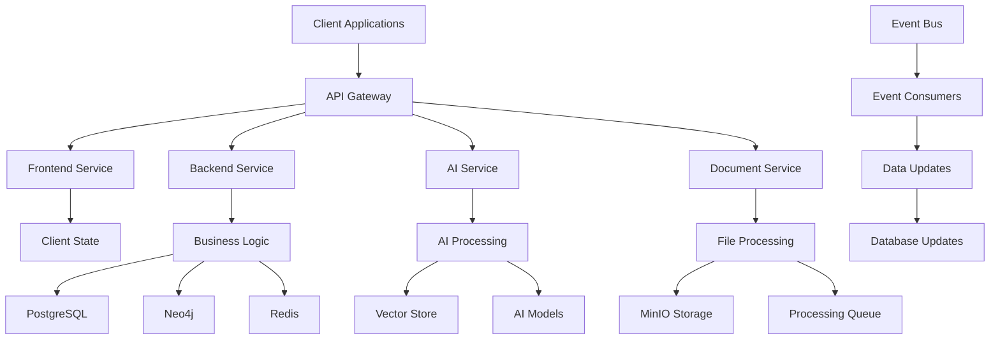
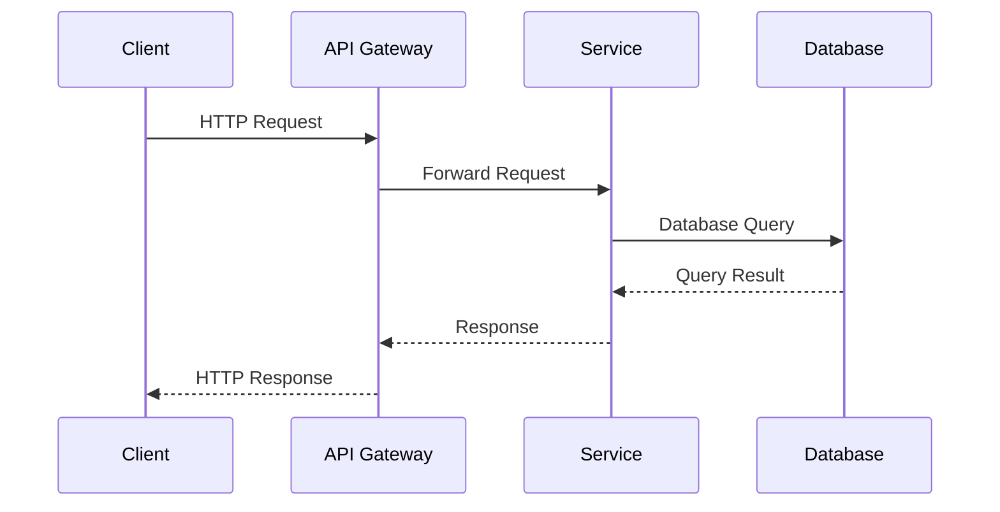
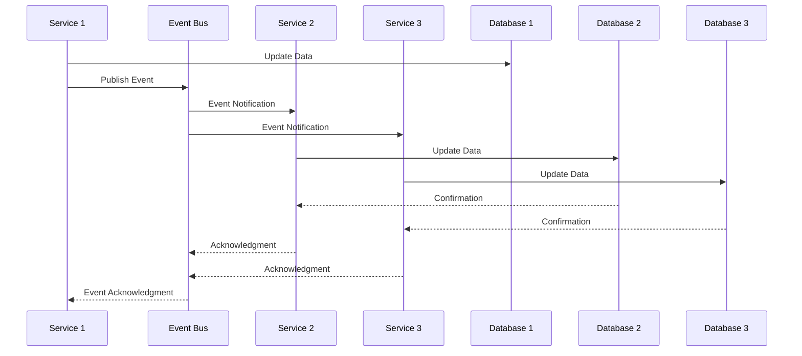
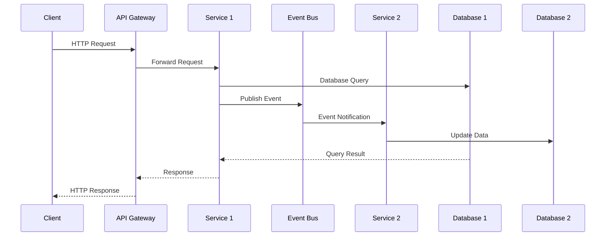
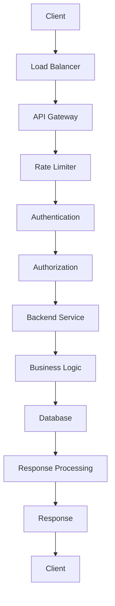
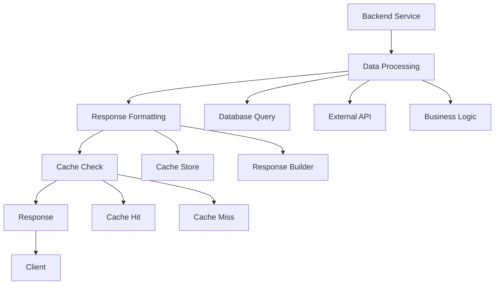
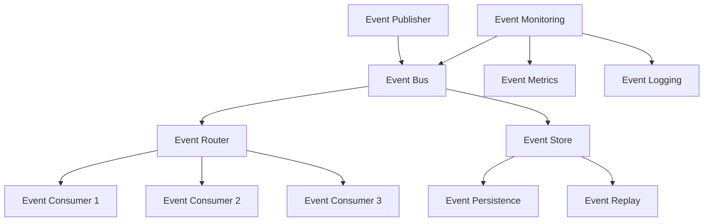

# Data Flow

Comprehensive guide to data flow patterns in Studio Platform, including data movement, transformation, and processing across the microservices architecture.

## 📊 Data Flow Overview

### **Data Flow Architecture**

Studio Platform implements a sophisticated data flow architecture that ensures efficient data movement, transformation, and processing across all services while maintaining data integrity and consistency.



### **Data Flow Patterns**

#### **Request-Response Flow**


#### **Event-Driven Flow**


#### **Hybrid Flow**


## 🔄 Request-Response Data Flow

### **HTTP Request Flow**

#### **Request Processing Pipeline**

**Request Pipeline:**


**Pipeline Components:**
- **Load Balancer** - Distribute incoming requests
- **API Gateway** - Single entry point
- **Rate Limiter** - Rate limiting and throttling
- **Authentication** - User authentication
- **Authorization** - Access control
- **Backend Service** - Business logic processing
- **Database** - Data persistence
- **Response Processing** - Response formatting
- **Client** - Response delivery

#### **Request Data Flow**

**Data Flow Steps:**
1. **Client Request** - HTTP request from client
2. **Load Balancing** - Request routing to API gateway
3. **Rate Limiting** - Rate limit checking
4. **Authentication** - User authentication
5. **Authorization** - Access control validation
6. **Service Routing** - Route to appropriate service
7. **Business Logic** - Business logic processing
8. **Database Query** - Database operation
9. **Response Processing** - Response formatting
10. **Client Response** - Response delivery

**Data Transformation:**
```ts
// Request data transformation
interface RequestData {
  headers: Record<string, string>;
  body: any;
  query: Record<string, string>;
  params: Record<string, string>;
  user?: User;
}

interface ProcessedData {
  headers: Record<string, string>;
  body: any;
  query: Record<string, string>;
  params: Record<string, string>;
  user: User;
  validated: boolean;
  sanitized: boolean;
}

class RequestProcessor {
  async processRequest(request: Request): Promise<ProcessedData> {
    const processedData: ProcessedData = {
      headers: request.headers,
      body: request.body,
      query: request.query,
      params: request.params,
      user: null,
      validated: false,
      sanitized: false,
    };

    // Authentication
    processedData.user = await this.authenticate(processedData);

    // Validation
    processedData.validated = await this.validate(processedData);

    // Sanitization
    processedData.sanitized = await this.sanitize(processedData);

    return processedData;
  }

  private async authenticate(data: ProcessedData): Promise<User> {
    // Authentication logic
    const token = data.headers.authorization;
    if (!token) {
      throw new Error('Authentication required');
    }

    const user = await UserService.verifyToken(token);
    return user;
  }

  private async validate(data: ProcessedData): Promise<boolean> {
    // Validation logic
    const schema = this.getValidationSchema(data);
    const validation = schema.safeParse(data);
    return validation.success;
  }

  private async sanitize(data: ProcessedData): Promise<boolean> {
    // Sanitization logic
    const sanitizedData = this.sanitizeData(data);
    Object.assign(data, sanitizedData);
    return true;
  }
}
```

### **Response Data Flow**

#### **Response Processing Pipeline**

**Response Pipeline:**


**Response Processing:**
```typescript
// Response processing
interface ResponseData {
  success: boolean;
  data?: any;
  error?: {
    code: string;
    message: string;
    details?: any;
  };
  timestamp: string;
  requestId: string;
}

class ResponseProcessor {
  async processResponse(
    data: any,
    request: Request,
    options?: ResponseOptions
  ): Promise<ResponseData> {
    const responseData: ResponseData = {
      success: true,
      data: data,
      timestamp: new Date().toISOString(),
      requestId: request.headers['x-request-id'] || this.generateRequestId(),
    };

    // Cache check
    if (options?.cache) {
      const cached = await this.checkCache(request, options.cache);
      if (cached) {
        return cached;
      }
    }

    // Response formatting
    const formatted = this.formatResponse(responseData);

    // Cache storage
    if (options?.cache) {
      await this.storeCache(request, formatted, options.cache);
    }

    return formatted;
  }

  private formatResponse(data: ResponseData): ResponseData {
    // Response formatting logic
    return {
      ...data,
      data: this.serializeData(data.data),
      error: data.error ? {
        ...data.error,
        details: this.serializeError(data.error.details)
      } : undefined,
    };
  }

  private serializeData(data: any): any {
    // Data serialization
    if (data === null || data === undefined) {
      return data;
    }

    if (typeof data === 'object') {
      return JSON.parse(JSON.stringify(data));
    }

    return data;
  }

  private serializeError(error: any): any {
    // Error serialization
    if (error instanceof Error) {
      return {
        name: error.name,
        message: error.message,
        stack: error.stack,
      };
    }

    return error;
  }

  private async checkCache(request: Request, options: CacheOptions): Promise<ResponseData | null> {
    // Cache check logic
    const cacheKey = this.generateCacheKey(request, options);
    const cached = await CacheService.get(cacheKey);
    
    if (cached && !this.isExpired(cached, options)) {
      return cached.data;
    }

    return null;
  }

  private async storeCache(request: Request, response: ResponseData, options: CacheOptions): Promise<void> {
    // Cache storage logic
    const cacheKey = this.generateCacheKey(request, options);
    const cacheData = {
      data: response,
      timestamp: new Date().toISOString(),
      ttl: options.ttl,
    };

    await CacheService.set(cacheKey, cacheData, options.ttl);
  }

  private generateCacheKey(request: Request, options: CacheOptions): string {
    // Cache key generation
    const url = request.url;
    const method = request.method;
    const userId = request.user?.id;
    
    return `${method}:${url}:${userId}:${options.key}`;
  }

  private isExpired(cached: any, options: CacheOptions): boolean {
    // Expiration check
    const now = new Date();
    const cachedTime = new Date(cached.timestamp);
    return (now.getTime() - cachedTime.getTime()) > (options.ttl * 1000);
  }
}
```

## 🎯 Event-Driven Data Flow

### **Event System Architecture**

#### **Event Bus Implementation**

**Event Bus:**


**Event Components:**
- **Event Publisher** - Publishes events to event bus
- **Event Router** - Routes events to consumers
- **Event Consumer** - Consumes events from bus
- **Event Store** - Persistent event storage
- **Event Monitoring** - Event monitoring and metrics

#### **Event Publishing**

**Event Publisher:**
```typescript
// Event publisher
interface Event {
  id: string;
  type: string;
  data: any;
  timestamp: string;
  source: string;
  version: string;
  metadata?: Record<string, any>;
}

class EventPublisher {
  private eventBus: EventBus;

  constructor(eventBus: EventBus) {
    this.eventBus = eventBus;
  }

  async publishEvent(event: Event): Promise<void> {
    try {
      // Event validation
      this.validateEvent(event);

      // Event enrichment
      const enrichedEvent = await this.enrichEvent(event);

      // Event publishing
      await this.eventBus.publish(enrichedEvent);

      // Event logging
      this.logEvent(enrichedEvent);

      console.log(`Event published: ${event.type} (${event.id})`);
    } catch (error) {
      console.error('Failed to publish event:', error);
      throw error;
    }
  }

  private validateEvent(event: Event): void {
    if (!event.id) {
      throw new Error('Event ID is required');
    }

    if (!event.type) {
      throw new Error('Event type is required');
    }

    if (!event.timestamp) {
      event.timestamp = new Date().toISOString();
    }

    if (!event.source) {
      event.source = this.getServiceName();
    }

    if (!event.version) {
      event.version = '1.0';
    }
  }

  private async enrichEvent(event: Event): Promise<Event> {
    // Event enrichment
    const enrichedEvent: Event = {
      ...event,
      metadata: {
        ...event.metadata,
        service: this.getServiceName(),
        environment: process.env.NODE_ENV,
        version: process.env.APP_VERSION,
      },
    };

    return enrichedEvent;
  }

  private logEvent(event: Event): void {
    // Event logging
    console.log(`Event: ${event.type}`, {
      id: event.id,
      source: event.source,
      timestamp: event.timestamp,
      data: event.data,
    });
  }

  private getServiceName(): string {
    return process.env.SERVICE_NAME || 'unknown';
  }
}
```

#### **Event Consumption**

**Event Consumer:**
```typescript
// Event consumer
type EventHandler = (event: Event) => Promise<void>;

class EventConsumer {
  private eventBus: EventBus;
  private handlers: Map<string, EventHandler[]> = new Map();
  private queue: Event[] = [];
  private processing = false;

  constructor(eventBus: EventBus) {
    this.eventBus = eventBus;
  }

  async start(): Promise<void> {
    // Subscribe to events
    await this.eventBus.subscribe('*', this.handleEvent.bind(this));
    
    // Start processing loop
    this.processing = true;
    this.processEvents();
  }

  async stop(): Promise<void> {
    this.processing = false;
    await this.eventBus.unsubscribe('*', this.handleEvent.bind(this));
  }

  private async handleEvent(event: Event): Promise<void> {
    // Add event to queue
    this.queue.push(event);
    
    // Trigger processing
    if (!this.processing) {
      this.processEvents();
    }
  }

  private async processEvents(): Promise<void> {
    while (this.processing && this.queue.length > 0) {
      const event = this.queue.shift();
      
      try {
        await this.processEvent(event);
      } catch (error) {
        console.error(`Failed to process event ${event.type}:`, error);
      }
    }
  }

  private async processEvent(event: Event): Promise<void> {
    const handlers = this.handlers.get(event.type) || [];
    
    for (const handler of handlers) {
      await handler(event);
    }
  }

  on(eventType: string, handler: EventHandler): void {
    if (!this.handlers.has(eventType)) {
      this.handlers.set(eventType, []);
    }
    
    this.handlers.get(eventType)!.push(handler);
  }

  off(eventType: string, handler: EventHandler): void {
    const handlers = this.handlers.get(eventType) || [];
    const index = handlers.indexOf(handler);
    
    if (index > -1) {
      handlers.splice(index, 1);
    }
    
    if (handlers.length === 0) {
      this.handlers.delete(eventType);
    }
  }
}
```

### **Event Types**

#### **Domain Events**

**User Events:**
```typescript
// User events
interface UserCreatedEvent extends Event {
  data: {
    user: User;
  };
}

interface UserUpdatedEvent extends Event {
  data: {
    user: User;
    changes: Record<string, any>;
  };
}

interface UserDeletedEvent extends Event {
  data: {
    user: User;
  };
}
```

**Project Events:**
```typescript
// Project events
interface ProjectCreatedEvent extends Event {
  data: {
    project: Project;
  };
}

interface ProjectUpdatedEvent extends Event {
  data: {
    project: Project;
    changes: Record<string, any>;
  };
}

interface ProjectDeletedEvent extends Event {
  data: {
    project: Project;
  };
}
```

**Evidence Events:**
```typescript
// Evidence events
interface EvidenceUploadedEvent extends Event {
  data: {
    evidence: Evidence;
  };
}

interface EvidenceReviewedEvent extends Event {
  data: {
    evidence: Evidence;
    review: EvidenceReview;
  };
}

interface EvidenceApprovedEvent extends Event {
  data: {
    evidence: Evidence;
    approver: User;
  };
}
```

## 🔄 Data Transformation

### **Data Transformation Patterns**

#### **Data Mapping**

**Data Mapper:**
```typescript
// Data mapper
interface UserData {
  id: string;
  email: string;
  name: string;
  role: string;
  createdAt: Date;
  updatedAt: Date;
}

interface UserDTO {
  id: string;
  email: string;
  name: string;
  role: string;
  createdAt: string;
  updatedAt: string;
}

class UserMapper {
  static toDTO(user: UserData): UserDTO {
    return {
      id: user.id,
      email: user.email,
      name: user.name,
      role: user.role,
      createdAt: user.createdAt.toISOString(),
      updatedAt: user.updatedAt.toISOString(),
    };
  }

  static fromDTO(dto: UserDTO): UserData {
    return {
      id: dto.id,
      email: dto.email,
      name: dto.name,
      role: dto.role,
      createdAt: new Date(dto.createdAt),
      updatedAt: new Date(dto.updatedAt),
    };
  }
}
```

#### **Data Validation**

**Data Validator:**
```typescript
// Data validator
import { z } from 'zod';

const UserSchema = z.object({
  id: z.string().uuid(),
  email: z.string().email(),
  name: z.string().min(1).max(255),
  role: z.enum(['super_admin', 'admin', 'manager', 'auditor', 'customer', 'viewer']),
  createdAt: z.date(),
  updatedAt: z.date(),
});

class DataValidator {
  static validateUser(data: any): UserData {
    return UserSchema.parse(data);
  }

  static validateProject(data: any): ProjectData {
    const ProjectSchema = z.object({
      id: z.string().uuid(),
      name: z.string().min(1).max(255),
      description: z.string().optional(),
      framework: z.string(),
      status: z.enum(['active', 'inactive', 'archived']),
      complianceScore: z.number().min(0).max(100),
      createdBy: z.string().uuid().optional(),
      createdAt: z.date(),
      updatedAt: z.date(),
    });

    return ProjectSchema.parse(data);
  }

  static validateEvidence(data: any): EvidenceData {
    const EvidenceSchema = z.object({
      id: z.string().uuid(),
      title: z.string().min(1).max(255),
      description: z.string().optional(),
      fileName: z.string().min(1),
      fileSize: z.number().positive(),
      contentType: z.string(),
      projectId: z.string().uuid(),
      controlId: z.string(),
      uploadedBy: z.string().uuid(),
      qualityScore: z.number().min(0).max(100),
      status: z.enum(['pending', 'in_review', 'approved', 'rejected']),
      uploadedAt: z.date(),
      updatedAt: z.date(),
    });

    return EvidenceSchema.parse(data);
  }
}
```

#### **Data Serialization**

**Data Serializer:**
```typescript
// Data serializer
class DataSerializer {
  static serialize(data: any): string {
    if (data === null || data === undefined) {
      return 'null';
    }

    if (typeof data === 'object') {
      return JSON.stringify(data, null, 2);
    }

    if (data instanceof Date) {
      return data.toISOString();
    }

    if (typeof data === 'string') {
      return data;
    }

    return String(data);
  }

  static deserialize<T>(data: string): T {
    if (data === 'null') {
      return null as T;
    }

    if (data.startsWith('{') || data.startsWith('[')) {
      return JSON.parse(data) as T;
    }

    if (data.includes('T') && data.includes('Z')) {
      return new Date(data) as T;
    }

    return data as T;
  }

  static serializeArray(data: any[]): string {
    return JSON.stringify(data, null, 2);
  }

  static deserializeArray<T>(data: string): T[] {
    return JSON.parse(data) as T[];
  }
}
```

## 📊 Data Storage

### **Data Persistence**

#### **Database Operations**

**Repository Pattern:**
```typescript
// Repository interface
interface Repository<T> {
  create(data: Partial<T>): Promise<T>;
  findById(id: string): Promise<T | null>;
  findAll(options?: FindOptions): Promise<T[]>;
  update(id: string, data: Partial<T>): Promise<T>;
  delete(id: string): Promise<void>;
  count(options?: CountOptions): Promise<number>;
}

// Repository implementation
class UserRepository implements Repository<User> {
  constructor(private database: Database) {}

  async create(userData: Partial<User>): Promise<User> {
    const user = await this.database.user.create({
      ...userData,
      id: crypto.randomUUID(),
      createdAt: new Date(),
      updatedAt: new Date(),
    });

    return user;
  }

  async findById(id: string): Promise<User | null> {
    const user = await this.database.user.findUnique({
      where: { id },
    });

    return user;
  }

  async findAll(options?: FindOptions): Promise<User[]> {
    const users = await this.database.user.findMany({
      where: options?.where,
      orderBy: options?.orderBy,
      limit: options?.limit,
      offset: options?.offset,
    });

    return users;
  }

  async update(id: string, userData: Partial<User>): Promise<User> {
    const user = await this.database.user.update({
      where: { id },
      data: {
        ...userData,
        updatedAt: new Date(),
      },
    });

    return user;
  }

  async delete(id: string): Promise<void> {
    await this.database.user.delete({
      where: { id },
    });
  }

  async count(options?: CountOptions): Promise<number> {
    const count = await this.database.user.count({
      where: options?.where,
    });

    return count;
  }
}
```

#### **Cache Operations**

**Cache Service:**
```typescript
// Cache service
interface CacheOptions {
  ttl: number;
  key?: string;
}

class CacheService {
  private cache: Map<string, CacheItem> = new Map();

  async get(key: string): Promise<any> {
    const item = this.cache.get(key);
    
    if (!item) {
      return null;
    }

    if (this.isExpired(item)) {
      this.cache.delete(key);
      return null;
    }

    return item.data;
  }

  async set(key: string, data: any, options?: CacheOptions): Promise<void> {
    const item: CacheItem = {
      data,
      timestamp: new Date().toISOString(),
      ttl: options?.ttl || 3600,
    };

    this.cache.set(key, item);
  }

  async delete(key: string): Promise<void> {
    this.cache.delete(key);
  }

  async clear(): Promise<void> {
    this.cache.clear();
  }

  private isExpired(item: CacheItem): boolean {
    const now = new Date();
    const cachedTime = new Date(item.timestamp);
    return (now.getTime() - cachedTime.getTime()) > (item.ttl * 1000);
  }

  async cleanup(): Promise<void> {
    const now = new Date();
    
    for (const [key, item] of this.cache.entries()) {
      if (this.isExpired(item)) {
        this.cache.delete(key);
      }
    }
  }
}

interface CacheItem {
  data: any;
  timestamp: string;
  ttl: number;
}
```

## ✅ Data Flow Best Practices

### **Data Flow Best Practices**

#### **Request-Response Flow**
- **Validation** - Validate all input data
- **Sanitization** - Sanitize user input
- **Authentication** - Authenticate all requests
- **Authorization** - Authorize all operations
- **Error Handling** - Handle errors gracefully
- **Logging** - Log all data flow operations

#### **Event-Driven Flow**
- **Event Design** - Design events carefully
- **Event Validation** - Validate all events
- **Event Idempotency** - Make events idempotent
- **Event Ordering** - Ensure event ordering
- **Event Persistence** - Store events for replay
- **Event Monitoring** - Monitor event flow

### **Common Data Flow Mistakes**

❌ **Avoid These Mistakes:**
- Not validating input data
- Not sanitizing user input
- Not handling errors gracefully
- Not logging data flow operations
- Not implementing proper error handling

✅ **Follow These Best Practices:**
- Validate all input data rigorously
- Sanitize all user input
- Handle errors gracefully and appropriately
- Log all data flow operations
- Implement comprehensive error handling

---

!!! tip **Data Validation**
    Always validate and sanitize data at system boundaries. Use schema validation libraries and input sanitization.

!!! note **Event Design**
    Design events carefully to ensure they are meaningful, atomic, and contain all necessary context.

!!! question **Need Help?**
    Check our [Data Flow Support](https://support.studio.com) for data flow assistance, or join our developer community.
