# Architecture

Welcome to the Studio Platform Architecture documentation! This comprehensive guide covers the technical architecture, system design, and infrastructure patterns that power the Studio Platform.

## 🏗️ Architecture Overview

### **Platform Architecture**

Studio Platform is built on a modern microservices architecture designed for scalability, resilience, and maintainability. The system leverages cloud-native technologies and follows industry best practices for enterprise applications.

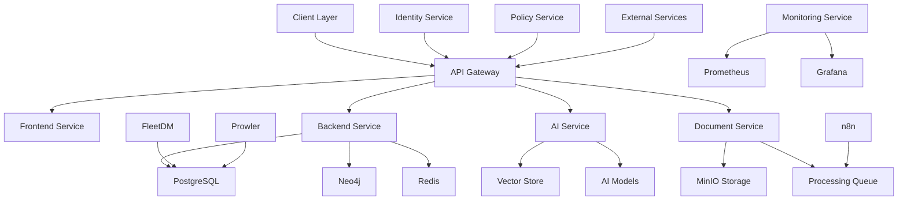

### **Architecture Principles**

**Core Principles:**

- **Microservices** - Service-oriented architecture
- **Cloud-Native** - Designed for cloud deployment
- **API-First** - API-driven design
- **Event-Driven** - Event-based communication
- **Security-First** - Security by design
- **Scalability** - Horizontal scalability
- **Resilience** - Fault tolerance and recovery

**Design Patterns:**

- **CQRS** - Command Query Responsibility Segregation
- **Event Sourcing** - Event-driven state management
- **Saga Pattern** - Distributed transaction management
- **Circuit Breaker** - Fault tolerance pattern
- **API Gateway** - Single entry point
- **Service Mesh** - Service communication

### **Technology Stack**

**Frontend:**

- **Framework** - Next.js 13+ with App Router
- **Language** - TypeScript
- **Styling** - Tailwind CSS
- **UI Components** - Radix UI
- **State Management** - React Query, Zustand
- **Forms** - React Hook Form
- **Charts** - Recharts, D3.js

**Backend:**

- **Runtime** - Node.js 18+
- **Framework** - Express.js
- **Language** - TypeScript
- **Database** - PostgreSQL, Neo4j, Redis
- **ORM** - Prisma
- **Authentication** - Ory Kratos
- **Authorization** - Open Policy Agent

**Infrastructure:**

- **Containerization** - Docker
- **Orchestration** - Docker Compose, Kubernetes
- **API Gateway** - Kong
- **Monitoring** - Prometheus, Grafana
- **Logging** - Loki, Fluent Bit
- **CI/CD** - GitHub Actions

## 📚 Architecture Documentation Structure

### **System Architecture**
- **[System Overview](system-overview.md)** - High-level system architecture
- **[Microservices](microservices.md)** - Microservices design and patterns
- **[Data Flow](data-flow.md)** - Data flow and processing patterns
- **[Security Model](security-model.md)** - Security architecture and controls
- **[Deployment](deployment.md)** - Deployment strategies and patterns

### **Component Architecture**
- **Frontend Architecture** - Frontend application architecture
- **Backend Architecture** - Backend service architecture
- **Database Architecture** - Database design and relationships
- **Integration Architecture** - Third-party integration patterns
- **Monitoring Architecture** - Monitoring and observability

### **Infrastructure Architecture**
- **Container Architecture** - Docker and Kubernetes architecture
- **Network Architecture** - Network design and security
- **Storage Architecture** - Storage systems and data management
- **Security Architecture** - Security infrastructure and controls
- **Scalability Architecture** - Scaling patterns and strategies

## 🎯 Architecture Goals

### **Functional Requirements**

**Core Functionality:**

- **Compliance Management** - Comprehensive compliance tracking
- **Evidence Management** - Document and evidence handling
- **Risk Assessment** - Risk analysis and management
- **AI Assistant** - Intelligent compliance assistance
- **Reporting** - Comprehensive reporting and analytics

**User Experience:**

- **Intuitive Interface** - User-friendly design
- **Responsive Design** - Mobile-friendly interface
- **Performance** - Fast and responsive application
- **Accessibility** - WCAG compliant interface
- **Internationalization** - Multi-language support

### **Non-Functional Requirements**

**Performance:**

- **Response Time** - <2 seconds for most operations
- **Throughput** - 1000+ concurrent users
- **Availability** - 99.9% uptime
- **Scalability** - Horizontal scaling support
- **Latency** - <100ms for API calls

**Security:**

- **Authentication** - Multi-factor authentication
- **Authorization** - Role-based access control
- **Data Protection** - Encryption at rest and in transit
- **Audit Trail** - Comprehensive audit logging
- **Compliance** - SOC 2, ISO 27001, GDPR compliance

**Reliability:**

- **Fault Tolerance** - Graceful degradation
- **Recovery** - Fast recovery from failures
- **Backup** - Regular backup and recovery
- **Disaster Recovery** - Comprehensive disaster recovery
- **Monitoring** - Real-time monitoring and alerting

## 🔧 Technical Architecture

### **Service Architecture**

#### **Frontend Service**

**Frontend Architecture:**
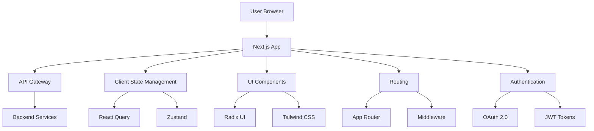

**Frontend Components:**
- **Pages** - Route-based page components
- **Components** - Reusable UI components
- **Hooks** - Custom React hooks
- **Services** - API integration services
- **Utils** - Utility functions and helpers
- **Types** - TypeScript type definitions

#### **Backend Service**

**Backend Architecture:**
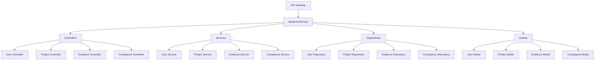

**Backend Components:**
- **Controllers** - HTTP request handlers
- **Services** - Business logic implementation
- **Repositories** - Data access layer
- **Models** - Data models and schemas
- **Middleware** - Request/response processing
- **Utils** - Utility functions and helpers

#### **AI Service**

**AI Architecture:**
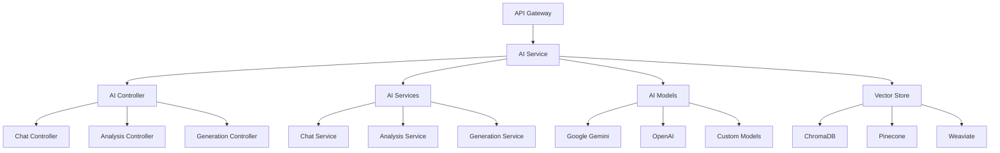

**AI Components:**
- **Controllers** - AI request handlers
- **Services** - AI logic implementation
- **Models** - AI model interfaces
- **Vector Store** - Vector database integration
- **Embeddings** - Text embedding generation
- **Prompts** - Prompt management

### **Data Architecture**

#### **Database Architecture**

**Database Design:**
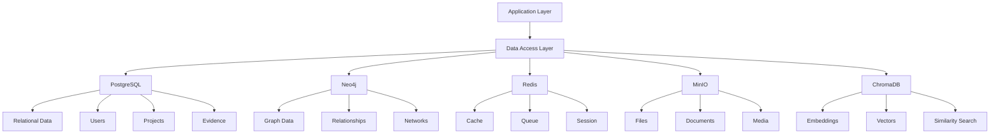

**Database Responsibilities:**
- **PostgreSQL** - Primary relational database
- **Neo4j** - Graph database for relationships
- **Redis** - Cache and message queue
- **MinIO** - Object storage for files
- **ChromaDB** - Vector database for AI

#### **Data Flow Architecture**

**Data Flow Patterns:**
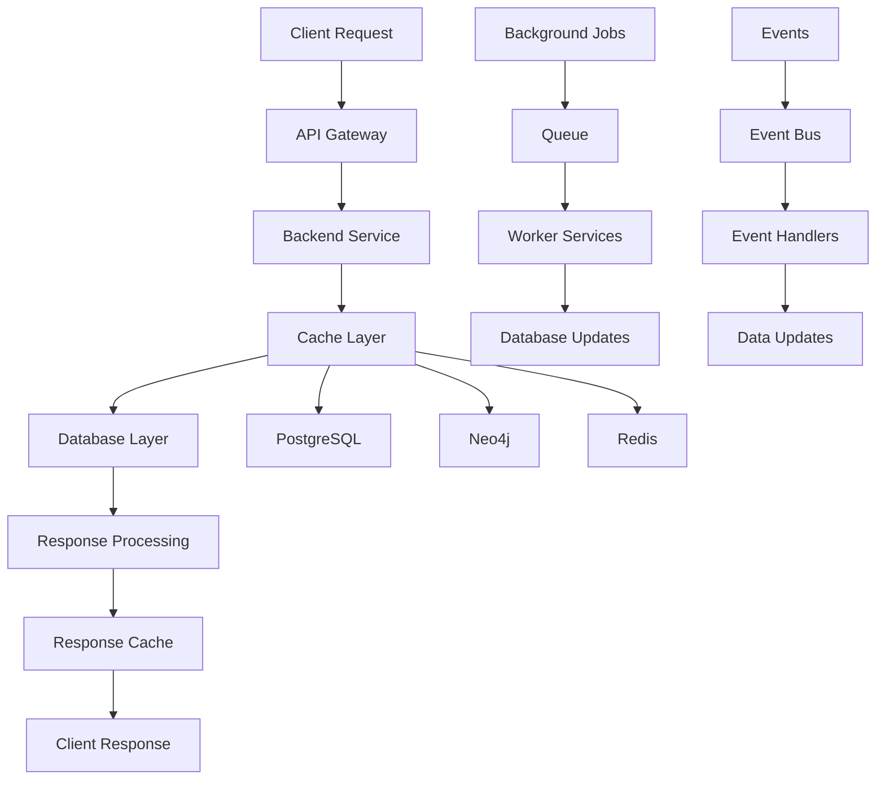

## 🔒 Security Architecture

### **Security Model**

#### **Security Layers**

**Security Architecture:**
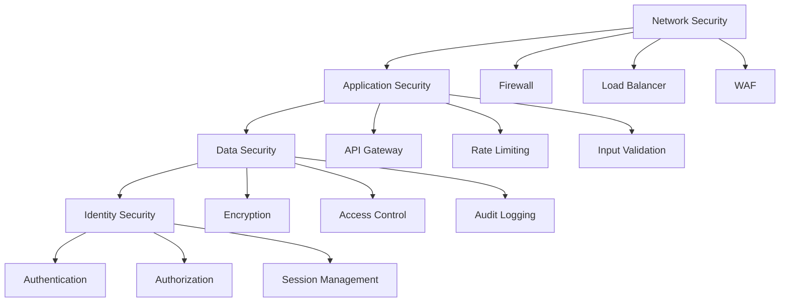

**Security Components:**
- **Network Security** - Firewall, WAF, DDoS protection
- **Application Security** - API gateway, rate limiting, input validation
- **Data Security** - Encryption, access control, audit logging
- **Identity Security** - Authentication, authorization, session management

### **Authentication & Authorization**

#### **Authentication Flow**

**OAuth 2.0 Flow:**
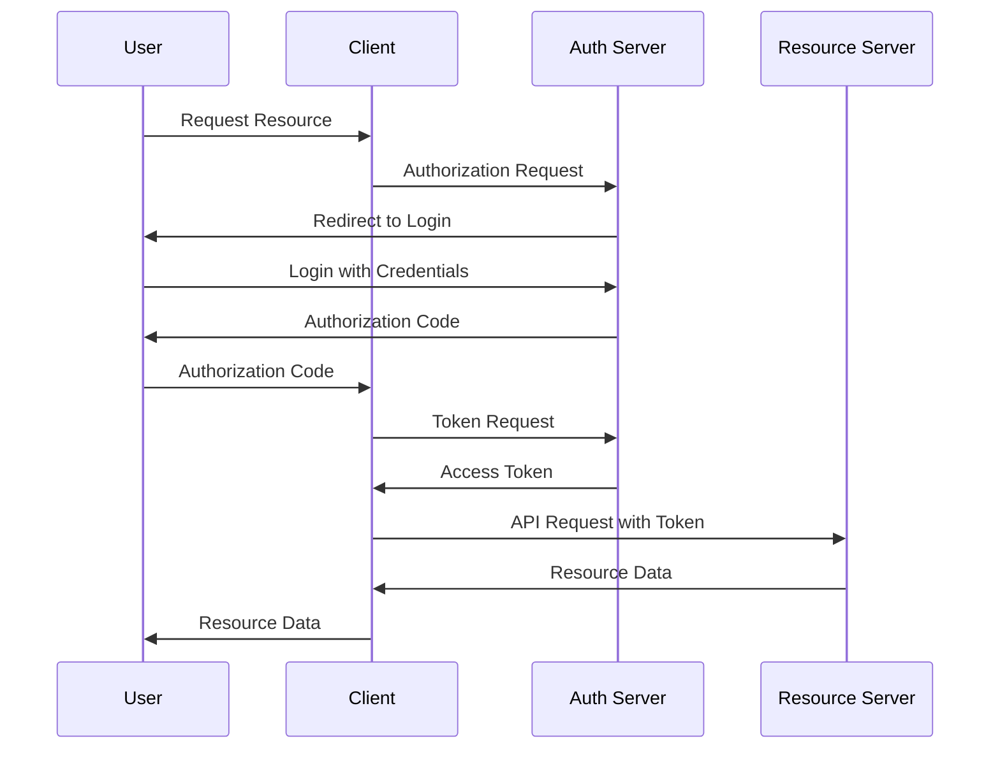

**Authorization Model:**
- **RBAC** - Role-based access control
- **ABAC** - Attribute-based access control
- **Policy Engine** - Open Policy Agent
- **Fine-grained Permissions** - Resource-level permissions
- **Dynamic Authorization** - Context-aware authorization

## 🚀 Deployment Architecture

### **Deployment Patterns**

#### **Container Architecture**

**Docker Architecture:**
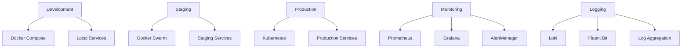

**Deployment Environments:**
- **Development** - Local development with Docker Compose
- **Staging** - Pre-production with Docker Swarm
- **Production** - Production with Kubernetes
- **Monitoring** - Centralized monitoring and logging

#### **Infrastructure Architecture**

**Cloud Infrastructure:**
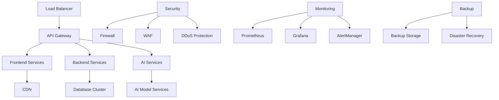

## 📊 Monitoring Architecture

### **Observability Stack**

#### **Monitoring Components**

**Monitoring Architecture:**
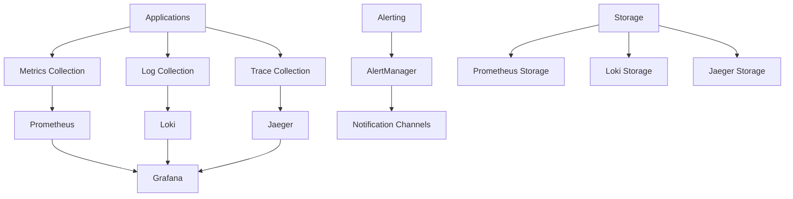

**Monitoring Components:**
- **Metrics** - Prometheus, Grafana
- **Logging** - Loki, Fluent Bit
- **Tracing** - Jaeger, OpenTelemetry
- **Alerting** - AlertManager, notification channels
- **Storage** - Long-term metrics and logs storage

### **Performance Monitoring**

#### **Performance Metrics**

**Key Metrics:**
- **Response Time** - API response time monitoring
- **Throughput** - Requests per second
- **Error Rate** - Error percentage and types
- **Resource Usage** - CPU, memory, disk, network
- **User Experience** - Page load time, user satisfaction

**Performance Dashboards:**
- **System Overview** - Overall system health
- **Service Metrics** - Individual service performance
- **Database Performance** - Database query performance
- **User Metrics** - User experience metrics
- **Business Metrics** - Business-relevant metrics

## ✅ Architecture Best Practices

### **Design Principles**

#### **Microservices Best Practices**
- **Single Responsibility** - Each service has a single responsibility
- **Loose Coupling** - Services are loosely coupled
- **High Cohesion** - Services are highly cohesive
- **API-First** - Design APIs first
- **Fault Tolerance** - Design for failure
- **Observability** - Make services observable

#### **Data Architecture Best Practices**
- **Data Consistency** - Ensure data consistency
- **Data Security** - Protect data at rest and in transit
- **Data Privacy** - Respect data privacy
- **Data Governance** - Implement data governance
- **Data Quality** - Ensure data quality
- **Data Retention** - Implement data retention policies

### **Common Architecture Mistakes**

❌ **Avoid These Mistakes:**
- Not designing for scalability
- Not implementing proper security
- Not considering fault tolerance
- Not implementing proper monitoring
- Not designing for maintainability

✅ **Follow These Best Practices:**
- Design for scalability and performance
- Implement security by design
- Design for fault tolerance and resilience
- Implement comprehensive monitoring
- Design for maintainability and extensibility

---

!!! tip **Start Small**
    Begin with a simple architecture and evolve it as your needs grow. Don't over-engineer from the start.

!!! note **Security First**
    Always prioritize security in architecture decisions. Implement security controls at every layer.

!!! question **Need Help?**
    Check our [Architecture Support](https://support.studio.com) for architecture assistance, or join our developer community.
