# Microservices

Comprehensive guide to Studio Platform's microservices architecture, including service design, communication patterns, and deployment strategies.

## 🔌 Microservices Overview

### **Microservices Architecture**

Studio Platform is built on a microservices architecture that breaks down the monolithic application into smaller, independent services. Each service is responsible for a specific business capability and can be developed, deployed, and scaled independently.

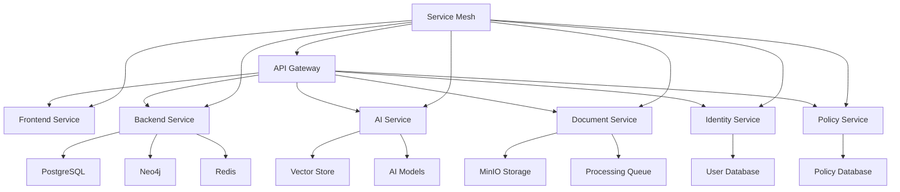

### **Service Characteristics**

#### **Core Principles**

**Service Autonomy:**
- **Independent Deployment** - Services can be deployed independently
- **Independent Scaling** - Services can be scaled independently
- **Independent Development** - Teams can develop services independently
- **Independent Technology** - Services can use different technologies

**Service Boundaries:**
- **Business Capability** - Each service maps to a business capability
- **Data Ownership** - Each service owns its data
- **API Contract** - Services communicate through well-defined APIs
- **Event-Driven** - Services communicate through events

#### **Service Benefits**

**Development Benefits:**
- **Team Autonomy** - Teams can work independently
- **Technology Diversity** - Teams can choose appropriate technologies
- **Faster Development** - Smaller codebase, faster development
- **Easier Testing** - Smaller services easier to test

**Operational Benefits:**
- **Scalability** - Scale individual services as needed
- **Reliability** - Failure isolation between services
- **Deployment** - Deploy services independently
- **Maintenance** - Update services independently

## 🏗️ Service Design

### **Service Categories**

#### **Frontend Services**

**Frontend Service:**
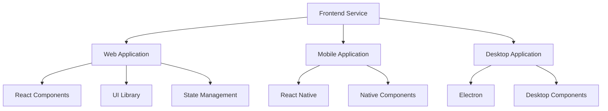

**Responsibilities:**
- **User Interface** - Web, mobile, and desktop interfaces
- **Client-Side Logic** - Frontend business logic
- **User Experience** - UX optimization
- **Authentication** - Client-side authentication
- **API Communication** - Backend API integration

**Technology Stack:**
- **Framework** - Next.js 13+ with App Router
- **Language** - TypeScript
- **Styling** - Tailwind CSS
- **UI Components** - Radix UI
- **State Management** - React Query, Zustand

#### **Backend Services**

**Backend Service:**
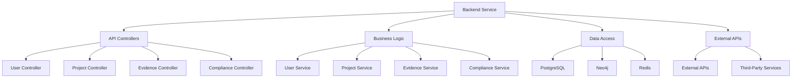

**Responsibilities:**
- **API Management** - RESTful API endpoints
- **Business Logic** - Core business logic implementation
- **Data Management** - Database operations
- **Authentication** - User authentication
- **Authorization** - Access control

**Technology Stack:**
- **Runtime** - Node.js 18+
- **Framework** - Express.js
- **Language** - TypeScript
- **Database** - PostgreSQL, Neo4j, Redis
- **ORM** - Prisma

#### **AI Services**

**AI Service:**
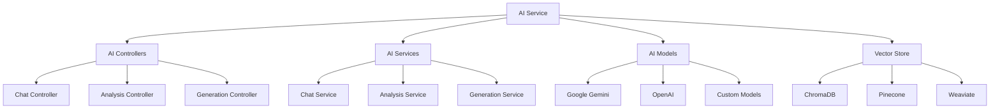

**Responsibilities:**
- **AI Assistant** - Conversational AI interface
- **Policy Generation** - Automated policy creation
- **Evidence Analysis** - Document analysis
- **Compliance Insights** - AI-powered insights
- **Natural Language Processing** - Text processing

**Technology Stack:**
- **Runtime** - Python 3.11+
- **Framework** - FastAPI
- **AI Models** - Google Gemini, OpenAI
- **Vector Database** - ChromaDB
- **Task Queue** - Celery

#### **Supporting Services**

**Identity Service:**
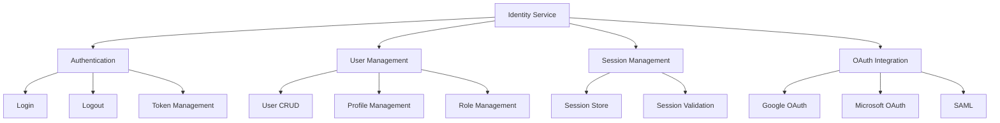

**Policy Service:**
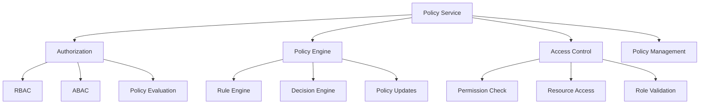

## 🔗 Service Communication

### **Communication Patterns**

#### **Synchronous Communication**

**REST API Communication:**
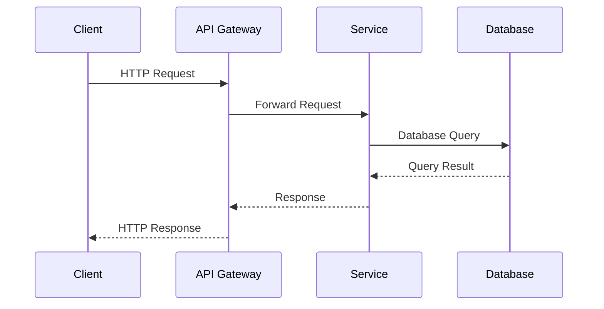

**API Gateway Pattern:**
- **Single Entry Point** - Single entry point for all services
- **Routing** - Request routing to appropriate services
- **Load Balancing** - Load balancing across service instances
- **Authentication** - Centralized authentication
- **Rate Limiting** - API rate limiting and throttling

#### **Asynchronous Communication**

**Event-Driven Communication:**
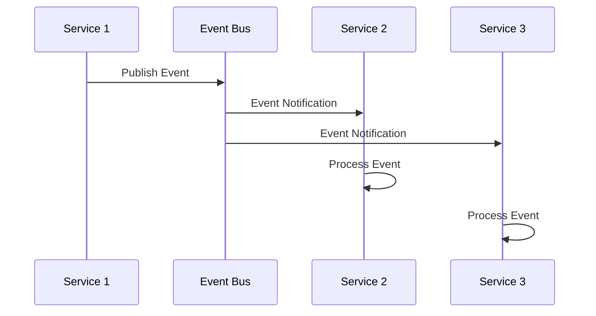

**Message Queue Pattern:**
- **Event Publishing** - Services publish events to message queue
- **Event Subscription** - Services subscribe to relevant events
- **Event Processing** - Services process events asynchronously
- **Error Handling** - Error handling and retry logic
- **Event Persistence** - Event persistence and replay

#### **Hybrid Communication**

**Mixed Communication:**
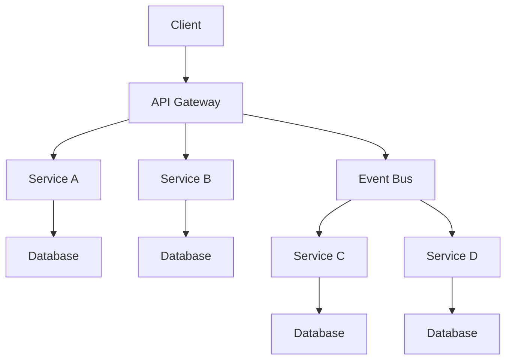

**Communication Rules:**
- **Synchronous** - For immediate response requirements
- **Asynchronous** - For background processing and notifications
- **Event-Driven** - For loose coupling and scalability
- **API-First** - For external integrations

### **Service Mesh**

#### **Service Mesh Architecture**

**Istio Service Mesh:**
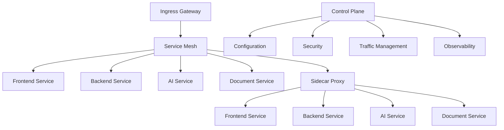

**Service Mesh Benefits:**
- **Traffic Management** - Traffic routing and load balancing
- **Security** - mTLS, authentication, authorization
- **Observability** - Metrics, logging, tracing
- **Reliability** - Circuit breakers, retries, timeouts
- **Policy Enforcement** - Policy enforcement at mesh level

## 🗄️ Data Management

### **Data Ownership**

#### **Service Data Ownership**

**Data Ownership Principles:**
- **Service Ownership** - Each service owns its data
- **Data Isolation** - Services have isolated data stores
- **Data Sharing** - Services share data through APIs
- **Data Consistency** - Eventual consistency across services
- **Data Privacy** - Services respect data privacy

**Data Ownership Examples:**
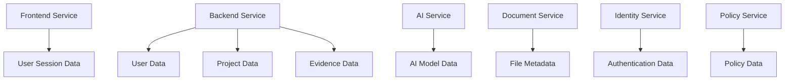

#### **Data Consistency**

**Eventual Consistency:**
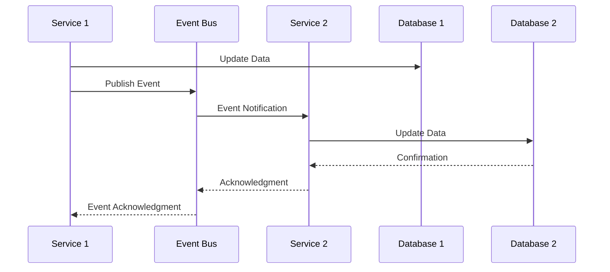

**Consistency Patterns:**
- **Eventual Consistency** - Accept temporary inconsistency
- **Event Sourcing** - Store events as source of truth
- **CQRS** - Separate read and write models
- **Saga Pattern** - Distributed transaction management
- **Eventual Consistency** - Eventually consistent state

### **Data Synchronization**

#### **Data Sync Patterns**

**Event-Driven Sync:**
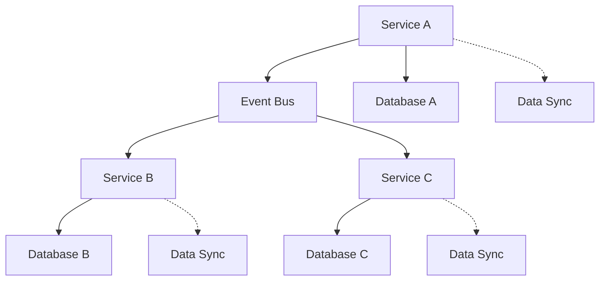

**Sync Strategies:**
- **Event-Driven** - Events drive data synchronization
- **Polling** - Periodic data polling
- **Streaming** - Real-time data streaming
- **Batch Processing** - Batch data processing
- **Change Data Capture** - Database change capture

## 🔧 Service Deployment

### **Container Deployment**

#### **Docker Configuration**

**Dockerfile Example:**
```dockerfile
# Backend Service Dockerfile
FROM node:18-alpine AS builder

WORKDIR /app
COPY package*.json ./
RUN npm ci --only=production

COPY . .
RUN npm run build

FROM node:18-alpine AS runtime

RUN addgroup -g 1001 -S nodejs && \
    adduser -S nodejs -u 1001

WORKDIR /app
COPY --from=builder /app/node_modules ./node_modules
COPY --from=builder /app/dist ./dist

USER nodejs

EXPOSE 4000

HEALTHCHECK --interval=30s --timeout=3s --start-period=5s --retries=3 \
  CMD curl -f http://localhost:4000/api/health || exit 1

CMD ["npm", "start"]
```

**Multi-Stage Build:**
- **Builder Stage** - Build application
- **Runtime Stage** - Production runtime
- **Security** - Non-root user
- **Health Check** - Health check endpoint
- **Optimization** - Image optimization

#### **Docker Compose**

**Development Compose:**
```yaml
# docker-compose.dev.yml
version: '3.8'

services:
  backend:
    build:
      context: ./backend
      dockerfile: Dockerfile
      target: development
    ports:
      - "4000:4000"
    volumes:
      - ./backend:/app
      - /app/node_modules
    environment:
      - NODE_ENV=development
      - WATCHPACK_POLLING=true
    depends_on:
      - postgres
      - redis
      - neo4j

  ai-service:
    build:
      context: ./ai-service
      dockerfile: Dockerfile
      target: development
    ports:
      - "5000:5000"
    volumes:
      - ./ai-service:/app
      - /app/venv
    environment:
      - PYTHONPATH=/app
      - GOOGLE_API_KEY=${GOOGLE_API_KEY}
    depends_on:
      - chroma

  postgres:
    image: pgvector/pgvector:pg15
    environment:
      POSTGRES_USER: studio
      POSTGRES_PASSWORD: dev
      POSTGRES_DB: studio_dev
    volumes:
      - postgres_data:/var/lib/postgresql/data
    ports:
      - "5432:5432"
```

### **Kubernetes Deployment**

#### **Kubernetes Configuration**

**Deployment Configuration:**
```yaml
# backend-deployment.yaml
apiVersion: apps/v1
kind: Deployment
metadata:
  name: backend-service
  labels:
    app: backend-service
spec:
  replicas: 3
  selector:
    matchLabels:
      app: backend-service
  template:
    metadata:
      labels:
        app: backend-service
    spec:
      containers:
      - name: backend
        image: studio/backend:latest
        ports:
        - containerPort: 4000
        env:
        - name: NODE_ENV
          value: "production"
        - name: DATABASE_URL
          valueFrom:
            secretKeyRef:
              name: database-secret
              key: url
        resources:
          requests:
            cpu: 500m
            memory: 1Gi
          limits:
            cpu: 1000m
            memory: 2Gi
        livenessProbe:
          httpGet:
            path: /api/health
            port: 4000
          initialDelaySeconds: 30
          periodSeconds: 10
        readinessProbe:
          httpGet:
            path: /api/ready
            port: 4000
          initialDelaySeconds: 5
          periodSeconds: 5
```

**Service Configuration:**
```yaml
# backend-service.yaml
apiVersion: v1
kind: Service
metadata:
  name: backend-service
spec:
  selector:
    app: backend-service
  ports:
  - protocol: TCP
    port: 4000
    targetPort: 4000
  type: ClusterIP
```

## 🔍 Service Discovery

### **Service Registration**

#### **Service Registry**

**Consul Service Registry:**
```yaml
# consul.yml
consul:
  datacenter: dc1
  data_dir: /opt/consul
  server: true
  bootstrap_expect: 3
  ui:
    enabled: true
  connect:
    enabled: true
  services:
    - name: backend-service
      id: backend-service-1
      address: 192.168.1.10
      port: 4000
      tags: [backend, api]
      checks:
        - http: http://192.168.1.10:4000/api/health
          interval: 10s
          timeout: 5s
```

**Service Registration:**
```typescript
// Service registration
import Consul from 'consul';

class ServiceRegistry {
  private consul: Consul;

  constructor() {
    this.consul = new Consul({
      host: process.env.CONSUL_HOST,
      port: process.env.CONSUL_PORT,
    });
  }

  async registerService(serviceName: string, serviceId: string, address: string, port: number) {
    try {
      await this.consul.agent.service.register({
        name: serviceName,
        id: serviceId,
        address: address,
        port: port,
        tags: [serviceName],
        check: {
          http: `http://${address}:${port}/api/health`,
          interval: '10s',
          timeout: '5s',
        },
      });
      
      console.log(`Service ${serviceName} registered successfully`);
    } catch (error) {
      console.error('Failed to register service:', error);
    }
  }

  async deregisterService(serviceId: string) {
    try {
      await this.consul.agent.service.deregister(serviceId);
      console.log(`Service ${serviceId} deregistered successfully`);
    } catch (error) {
      console.error('Failed to deregister service:', error);
    }
  }

  async discoverService(serviceName: string) {
    try {
      const services = await this.consul.agent.health.service({
        service: serviceName,
        passing: true,
      });

      return services.map(service => ({
        id: service.Service.ID,
        address: service.Service.Address,
        port: service.Service.Port,
        tags: service.Service.Tags,
      }));
    } catch (error) {
      console.error('Failed to discover service:', error);
      return [];
    }
  }
}
```

### **Load Balancing**

#### **Load Balancing Strategies**

**Round Robin Load Balancing:**
```yaml
# nginx.conf
upstream backend {
  least_conn;
  server backend-1:4000 max_fails=3 fail_timeout=30s;
  server backend-2:4000 max_fails=3 fail_timeout=30s;
  server backend-3:4000 max_fails=3 fail_timeout=30s;
}

server {
  listen 80;
  server_name api.studio.com;

  location /api/ {
    proxy_pass http://backend;
    proxy_set_header Host $host;
    proxy_set_header X-Real-IP $remote_addr;
    proxy_set_header X-Forwarded-For $proxy_add_x_forwarded_for;
    proxy_set_header X-Forwarded-Proto $scheme;
    
    health_check_interval 5s;
    health_check_timeout 3s;
    health_check_fail_timeout 30s;
  }
}
```

**Load Balancing Algorithms:**
- **Round Robin** - Requests distributed evenly
- **Least Connections** - Requests sent to least busy server
- **IP Hash** - Requests sent based on client IP
- **Weighted Round Robin** - Weighted distribution
- **Random** - Random server selection

## 🔧 Service Monitoring

### **Health Checks**

#### **Health Check Implementation**

**Health Check Endpoint:**
```typescript
// Health check service
export class HealthCheckService {
  private dependencies: Map<string, () => Promise<boolean>> = new Map();

  constructor() {
    this.dependencies.set('database', this.checkDatabase);
    this.dependencies.set('redis', this.checkRedis);
    this.dependencies.set('neo4j', this.checkNeo4j);
    this.dependencies.set('external_apis', this.checkExternalApis);
  }

  async checkHealth(): Promise<HealthStatus> {
    const checks = new Map<string, Promise<boolean>>();
    
    for (const [name, check] of this.dependencies) {
      checks.set(name, check());
    }

    const results = await Promise.allSettled(checks);
    const status = results.every(result => result.status === 'fulfilled');

    return {
      status: status ? 'healthy' : 'unhealthy',
      timestamp: new Date().toISOString(),
      checks: Array.from(checks.entries()).map(([name, promise]) => ({
        name,
        status: promise.status === 'fulfilled' ? 'healthy' : 'unhealthy',
        duration: 0, // TODO: measure duration
      })),
    };
  }

  private async checkDatabase(): Promise<boolean> {
    try {
      await DatabaseService.query('SELECT 1');
      return true;
    } catch (error) {
      console.error('Database health check failed:', error);
      return false;
    }
  }

  private async checkRedis(): Promise<boolean> {
    try {
      await RedisService.ping();
      return true;
    } catch (error) {
      console.error('Redis health check failed:', error);
      return false;
    }
  }

  private async checkNeo4j(): Promise<boolean> {
    try {
      await Neo4jService.query('RETURN 1');
      return true;
    } catch (error) {
      console.error('Neo4j health check failed:', error);
      return false;
    }
  }

  private async checkExternalApis(): Promise<boolean> {
    try {
      // Check external API connectivity
      const response = await fetch('https://api.google.com');
      return response.ok;
    } catch (error) {
      console.error('External API health check failed:', error);
      return false;
    }
  }
}
```

### **Metrics Collection**

#### **Prometheus Metrics**

**Metrics Exporter:**
```typescript
// Metrics service
import { register, collectDefaultMetrics, Counter, Histogram, Gauge } from 'prom-client';

// Create metrics
const httpRequestDuration = new Histogram({
  name: 'http_request_duration_seconds',
  help: 'Duration of HTTP requests in seconds',
  labelNames: ['method', 'route', 'status_code'],
  buckets: [0.1, 0.5, 1, 2, 5, 10],
});

const httpRequestTotal = new Counter({
  name: 'http_requests_total',
  help: 'Total number of HTTP requests',
  labelNames: ['method', 'route', 'status_code'],
});

const activeConnections = new Gauge({
  name: 'active_connections',
  help: 'Number of active connections',
  labelNames: ['service'],
});

export class MetricsService {
  static recordHttpRequest(method: string, route: string, statusCode: number, duration: number) {
    httpRequestDuration
      .labels(method, route, statusCode.toString())
      .observe(duration);
    
    httpRequestTotal
      .labels(method, route, statusCode.toString())
      .inc();
  }

  static incrementActiveConnections(service: string) {
    activeConnections.labels(service).inc();
  }

  static decrementActiveConnections(service: string) {
    activeConnections.labels(service).dec();
  }

  static getMetrics() {
    return collectDefaultMetrics();
  }
}
```

## ✅ Microservices Best Practices

### **Design Best Practices**

#### **Service Design**
- **Single Responsibility** - Each service has a single responsibility
- **Bounded Context** - Well-defined service boundaries
- **API-First** - Design APIs first
- **Event-Driven** - Use events for communication
- **Observability** - Make services observable

#### **Communication Best Practices**
- **Synchronous** - For immediate response requirements
- **Asynchronous** - For background processing
- **Event-Driven** - For loose coupling
- **API Gateway** - Single entry point
- **Service Mesh** - For service-to-service communication

### **Common Microservices Mistakes**

❌ **Avoid These Mistakes:**
- Not defining clear service boundaries
- Not implementing proper error handling
- Not considering service dependencies
- Not implementing proper monitoring
- Not designing for failure

✅ **Follow These Best Practices:**
- Define clear service boundaries
- Implement comprehensive error handling
- Consider service dependencies carefully
- Implement comprehensive monitoring
- Design for failure and recovery

---

!!! tip **Start Small**
    Start with a few core services and gradually add more as needed. Don't create too many services initially.

!!! note **Service Boundaries**
    Define clear service boundaries and data ownership. Avoid tight coupling between services.

!!! question **Need Help?**
    Check our [Microservices Support](https://support.studio.com) for microservices assistance, or join our developer community.
