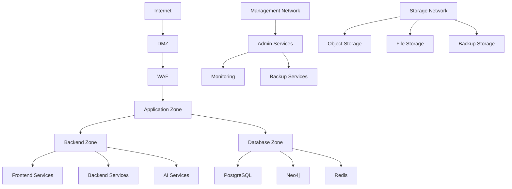
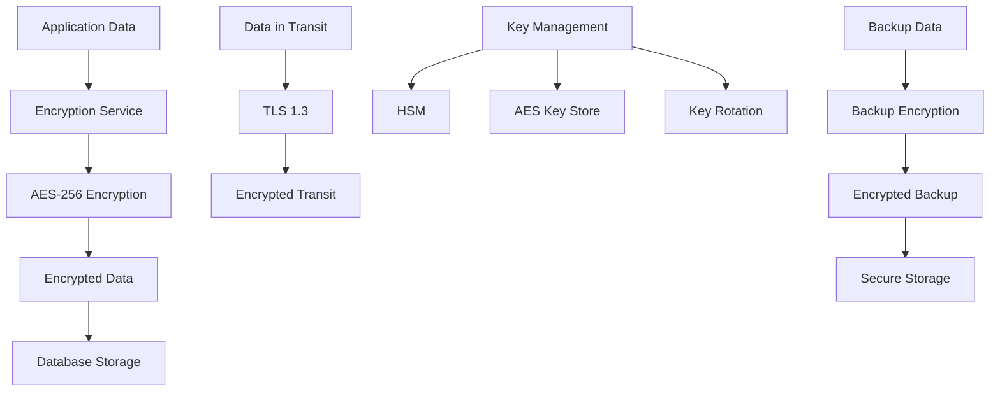

# Security Model

Comprehensive guide to Studio Platform's security architecture, including security principles, threat modeling, and security controls.

## 🔒 Security Overview

### **Security Architecture**

Studio Platform implements a comprehensive security model designed to protect sensitive compliance data, ensure regulatory compliance, and provide secure access to all platform features.

```mermaid
    A[Security Architecture] --> B[Network Security]
    A --> C[Application Security]
    A --> D[Data Security]
    A --> E[Identity Security]
    
    B --> F[Firewall]
    B --> G[WAF]
    B --> H[DDoS Protection]
    B --> I[Network Segmentation]
    
    C --> J[API Gateway]
    C --> K[Rate Limiting]
    C --> L[Input Validation]
    C --> M[Output Encoding]
    
    D --> N[Encryption]
    D --> O[Access Control]
    D --> P[Audit Logging]
    D --> Q[Data Classification]
    
    E --> R[Authentication]
    E --> S[Authorization]
    E --> T[Session Management]
    E --> U[Multi-Factor Auth]
```

### **Security Principles**

#### **Core Security Principles**

**Defense in Depth:**
- **Multiple Layers** - Multiple security layers
- **Redundancy** - Redundant security controls
- **Diversity** - Different security mechanisms
- **Monitoring** - Continuous security monitoring
- **Testing** - Regular security testing

**Security by Design:**
- **Secure by Default** - Secure by default configuration
- **Least Privilege** - Minimum necessary access
- **Zero Trust** - Zero trust architecture
- **Encryption Everywhere** - Encrypt data everywhere
- **Compliance First** - Compliance by design

#### **Privacy by Design**

**Privacy Principles:**
- **Data Minimization** - Collect only necessary data
- **Data Classification** - Classify data by sensitivity
- **Data Retention** - Retain data only as long as necessary
- **Data Protection** - Protect personal data
- **User Rights** - Respect user rights

## 🔐 Network Security

### **Network Architecture**

#### **Network Segmentation**

**Network Zones:**


**Network Zones:**
- **DMZ** - Demilitarized zone with basic services
- **Application Zone** - Application services with API gateway
- **Backend Zone** - Backend services and databases
- **Database Zone** - Database servers and storage
- **Management Network** - Management and monitoring services
- **Storage Network** - Object storage and file storage

#### **Firewall Configuration**

**Firewall Rules:**
```yaml
# firewall-rules.yml
rules:
  - name: allow_http
    port: 80
    protocol: tcp
    action: allow
    source: 0.0.0.0/0
    destination: 0.0.0.0/0
    description: "Allow HTTP traffic"
  
  - name: allow_https
    port: 443
    protocol: tcp
    action: allow
    source: 0.0.0.0/0
    destination: 0.0.0.0/0
    description: "Allow HTTPS traffic"
  
  - name: deny_ssh
    port: 22
    protocol: tcp
    action: deny
    source: 0.0.0.0/0
    destination: 0.0.0.0/0
    description: "Deny SSH traffic"
  
  - name: allow_internal
    port: 4000-5000
    protocol: tcp
    action: allow
    source: 10.0.0.0/8
    destination: 10.0.0.0/8
    description: "Allow internal traffic"
```

### **Web Application Firewall**

#### **WAF Configuration**

**WAF Rules:**
```yaml
# waf-rules.yml
rules:
  - name: sql_injection
    description: "Block SQL injection attempts"
    pattern: "(?i)(union|select|insert|update|delete|drop|create|alter|execute)"
    action: block
    severity: high
    
  - name: xss_protection
    description: "Block XSS attempts"
    pattern: "(?i)(<script|admin</span>', 'auditor', 'customer', 'viewer']),
});

class InputValidator {
  static validateUserInput(data: any): UserInput {
    return UserInputSchema.parse(data);
  }

  static sanitizeInput(data: string): string {
    // Basic XSS protection
    return data
      .replace(/<script\b[^<]*>/gi, '')
      .replace(/<iframe\b[^<]*>/gi, '')
      .replace(/<object\b[^<]*>/gi, '')
      .replace(/<embed\b[^<]*>/gi, '')
      .trim();
  }

  static validateEmail(email: string): boolean {
    const emailRegex = /^[^\s@]+@[^\s@]+\.[^\s@]+\.[^\s@]+$/;
    return emailRegex.test(email);
  }

  static validatePassword(password: string): boolean {
    const passwordRegex = /^(?=.*[a-z])(?=.*[A-Z])(?=.*\d)(?=.*[@$!#$%^&*])(?=.*[A-Z])(?=.*[a-z])(?=.*[0-9]).{8,}$/;
    return passwordRegex.test(password);
  }
}
```

### **Session Management**

#### **Session Configuration**

**Session Settings:**
```typescript
// Session configuration
interface SessionConfig {
  secret: string;
  maxAge: number;
  secure: boolean;
  httpOnly: boolean;
  sameSite: 'strict' | 'lax' | 'none';
  domain?: string;
  path?: string;
}

class SessionManager {
  private config: SessionConfig;

  constructor(config: SessionConfig) {
    this.config = config;
  }

  createSession(user: User): SessionData {
    return {
      id: crypto.randomUUID(),
      userId: user.id,
      email: user.email,
      name: user.name,
      role: user.role,
      permissions: this.getUserPermissions(user),
      createdAt: new Date(),
      expiresAt: new Date(Date.now() + this.config.maxAge * 1000),
      lastAccessedAt: new Date(),
    };
  }

  async validateSession(sessionData: SessionData): Promise<boolean> {
    // Check if session exists
    const session = await this.getSession(sessionData.id);
    
    if (!session) {
      return false;
    }

    // Check if session is expired
    if (this.isExpired(session)) {
      return false;
    }

    // Check if user is still valid
    const user = await UserService.findById(sessionData.userId);
    if (!user || user.status !== 'active') {
      return false;
    }

    // Update last accessed time
    await this.updateLastAccessed(sessionData.id);

    return true;
  }

  private async getSession(sessionId: string): Promise<SessionData | null> {
    // Get session from cache or database
    return await CacheService.get(`session:${sessionId}`);
  }

  private isExpired(session: SessionData): boolean {
    return Date.now() > session.expiresAt;
  }

  private async updateLastAccessed(sessionId: string): Promise<void> {
    const session = await this.getSession(sessionId);
    if (session) {
      session.lastAccessedAt = new Date();
      await CacheService.set(`session:${sessionId}`, session);
    }
  }

  private getUserPermissions(user: User): string[] {
    // Get user permissions based on role
    switch (user.role) {
      case 'super_admin':
        return ['*'];
      case 'admin':
        return ['read', 'write', 'delete', 'user_management'];
      case 'manager':
        return ['read', 'write', 'project_management', 'team_management'];
      case 'auditor':
        return ['read', 'audit', 'reporting'];
      case 'customer':
        return ['read', 'write', 'own_data'];
      case 'viewer':
        return ['read'];
      default:
        return [];
    }
  }
}
```

## 🔐 Data Security

### **Encryption**

#### **Encryption Architecture**

**Encryption Strategy:**


**Encryption Implementation:**
```typescript
// Encryption service
import crypto from 'crypto';

class EncryptionService {
  private algorithm = 'aes-256-gcm';
  private keyLength = 32;
  private ivLength = 16;
  private tagLength = 16;

  private key: Buffer;

  constructor(key: string) {
    this.key = Buffer.from(key, 'hex');
  }

  encrypt(data: string): EncryptedData {
    const iv = crypto.randomBytes(this.ivLength);
    const cipher = crypto.createCipher(this.algorithm, this.key, iv, null);
    
    let encrypted = cipher.update(data, 'utf8');
    encrypted = cipher.final();
    
    const tag = crypto.randomBytes(this.tagLength);
    
    return {
      encrypted: Buffer.concat([encrypted, iv, tag]).toString('base64'),
      iv: iv.toString('hex'),
      tag: tag.toString('hex'),
    };
  }

  decrypt(encryptedData: string): string {
    const parts = encryptedData.split(':');
    const iv = Buffer.from(parts[1], 'hex');
    const tag = Buffer.from(parts[2], 'hex');
    const encrypted = Buffer.from(parts[0], 'base64');
    
    const cipher = crypto.createDecipher(this.algorithm, this.key, iv, tag);
    
    const decrypted = cipher.setAuthTag(tag);
    const decryptedData = cipher.update(encrypted, null);
    
    return decryptedData.toString('utf8');
  }

  generateKey(): string {
    return crypto.randomBytes(this.keyLength).toString('hex');
  }

  rotateKey(): void {
    this.key = this.generateKey();
  }
}

interface EncryptedData {
  encrypted: string;
  iv: string;
  tag: string;
}
```

#### **Data Classification**

**Data Classification Model:**
```typescript
// Data classification
enum DataClassification {
  PUBLIC = 'public',
  INTERNAL = 'internal',
  CONFIDENTIAL = 'confidential',
  RESTRICTED = 'restricted'
}

interface DataClassificationRule {
  classification: DataClassification;
  retentionPeriod: number; // days
  encryptionRequired: boolean;
  accessControl: string[];
  loggingRequired: boolean;
  auditRequired: boolean;
}

class DataClassificationService {
  private rules: Map<string, DataClassificationRule> = new Map();

  constructor() {
    this.initializeRules();
  }

  private initializeRules(): void {
    // Initialize classification rules
    this.rules.set('public', {
      classification: DataClassification.PUBLIC,
      retentionPeriod: 365,
      encryptionRequired: false,
      accessControl: ['everyone'],
      loggingRequired: false,
      auditRequired: false,
    });

    this.rules.set('internal', {
      classification: DataClassification.INTERNAL,
      retentionPeriod: 730,
      encryptionRequired: false,
      accessControl: ['employees'],
      loggingRequired: true,
      auditRequired: false,
    });

    this.rules.set('confidential', {
      classification: DataClassification.CONFIDENTIAL,
      retentionPeriod: 1825, // 5 years
      encryptionRequired: true,
      accessControl: ['authorized'],
      loggingRequired: true,
      auditRequired: true,
    });

    this.rules.set('restricted', {
      classification: DataClassification.RESTRICTED,
      retentionPeriod: 3650, // 10 years
      encryptionRequired: true,
      accessControl: ['admin', 'security'],
      loggingRequired: true,
      auditRequired: true,
    });
  }

  classifyData(data: any): DataClassification {
    // Classify data based on content and context
    if (this.isPublicData(data)) {
      return DataClassification.PUBLIC;
    }

    if (this.isInternalData(data)) {
      return DataClassification.INTERNAL;
    }

    if (this.isConfidentialData(data)) {
      return DataClassification.CONFIDENTIAL;
    }

    if (this.isRestrictedData(data)) {
      return DataClassification.RESTRICTED;
    }

    return DataClassification.INTERNAL;
  }

  getRetentionPeriod(classification: DataClassification): number {
    const rule = this.rules.get(classification);
    return rule?.retentionPeriod || 365;
  }

  isEncryptionRequired(classification: DataClassification): boolean {
    const rule = this.rules.get(classification);
    return rule?.encryptionRequired || false;
  }

  getAccessControl(classification: DataClassification): string[] {
    const rule = this.rules.get(classification);
    return rule?.accessControl || [];
  }

  isLoggingRequired(classification: DataClassification): boolean {
    const rule = this.rules.get(classification);
    return rule?.loggingRequired || false;
  }

  isAuditRequired(classification: DataClassification): boolean {
    const rule = this.rules.get(classification);
    return rule?.auditRequired || false;
  }

  private isPublicData(data: any): boolean {
    // Check if data is public
    return (
      !this.containsSensitiveData(data) &&
      !this.containsPersonalData(data) &&
      !this.containsFinancialData(data)
    );
  }

  private isInternalData(data: any): boolean {
    // Check if data is internal
    return (
      this.containsInternalData(data) &&
      !this.containsSensitiveData(data) &&
      !this.containsPersonalData(data) &&
      !this.containsFinancialData(data)
    );
  }

  private isConfidentialData(data: any): boolean {
    // Check if data is confidential
    return (
      this.containsSensitiveData(data) ||
      this.containsPersonalData(data) ||
      this.containsFinancialData(data)
    );
  }

  private isRestrictedData(data: any): boolean {
    // Check if data is restricted
    return (
      this.containsHighlySensitiveData(data) ||
      this.containsLegalData(data) ||
      this.containsHealthData(data)
    );
  }

  private containsSensitiveData(data: any): boolean {
    // Check for sensitive data patterns
    const sensitivePatterns = [
      /password/i,
      /secret/i,
      /token/i,
      /key/i,
      /credential/i,
      /auth/i,
      /login/i,
    ];

    return sensitivePatterns.some(pattern => pattern.test(JSON.stringify(data)));
  }

  private containsPersonalData(data: any): boolean {
    // Check for personal data patterns
    const personalPatterns = [
      /email/i,
      /phone/i,
      /address/i,
      /ssn/i,
      /passport/i,
      /driver_license/i,
      /medical/i,
      /health/i,
    ];

    return personalPatterns.some(pattern => pattern.test(JSON.stringify(data)));
  }

  private containsFinancialData(data: any): boolean {
    // Check for financial data patterns
    const financialPatterns = [
      /credit_card/i,
      /bank_account/i,
      /routing_number/i,
      /account_number/i,
      /transaction/i,
      /payment/i,
    ];

    return financialPatterns.some(pattern => pattern.test(JSON.stringify(data)));
  }

  private containsInternalData(data: any): boolean {
    // Check for internal data patterns
    const internalPatterns = [
      /internal/i,
      /employee/i,
      /staff/i,
      /team/i,
      /project/i,
      /internal_data/i,
    ];

    return internalPatterns.some(pattern => pattern.test(JSON.stringify(data)));
  }

  containsHighlySensitiveData(data: any): boolean {
    // Check for highly sensitive data patterns
    const highlySensitivePatterns = [
      /social_security_number/i,
      /medical_record/i,
      /legal_document/i,
      /trade_secret/i,
      /proprietary/i,
    ];

    return highlySensitivePatterns.some(pattern => pattern.test(JSON.stringify(data)));
  }

  containsLegalData(data: any): boolean {
    // Check for legal data patterns
    const legalPatterns = [
      /legal/i,
      /attorney/i,
      /contract/i,
      /lawsuit/i,
      /court/i,
      /regulation/i,
    ];

    return legalPatterns.some(pattern => pattern.test(JSON.stringify(data)));
  }

  containsHealthData(data: any): boolean {
    // Check for health data patterns
    const healthPatterns = [
      /medical_history/i,
      /diagnosis/i,
      /treatment/i,
      /medication/i,
      /health_record/i,
    ];

    return healthPatterns.some(pattern => pattern.test(JSON.stringify(data)));
  }
}
```

## 🔐 Identity and Access Management

### **Authentication**

#### **Multi-Factor Authentication**

**MFA Configuration:**
```typescript
// MFA configuration
interface MFAConfig {
  enabled: boolean;
  methods: MFA_Method[];
  backupMethods: MFA_Method[];
  gracePeriod: number;
  enforcement: MFA_Enforcement;
}

enum MFA_Method {
  TOTP = 'totp';
  SMS = 'sms';
  EMAIL = 'email';
  BACKUP = 'backup';
}

enum MFA_Enforcement {
  OPTIONAL = 'optional';
  REQUIRED = 'required';
  STRICT = 'strict';
}

class MFAService {
  private config: MFAConfig;

  constructor(config: MFAConfig) {
    this.config = config;
  }

  async enableMFA(user: User, method: MFA_Method): Promise<MFA_Secret> {
    const secret = this.generateSecret(method);
    
    // Store MFA secret
    await MFASecretService.create(user.id, method, secret);
    
    // Update user MFA status
    await UserService.updateMFA(user.id, {
      enabled: true,
      methods: [method],
      backupMethods: this.config.backupMethods,
      enabledAt: new Date(),
    });

    return secret;
  }

  async verifyMFA(user: User, method: MFA_Method, code: string): Promise<boolean> {
    const secret = await MFASecretService.getLatest(user.id, method);
    
    if (!secret) {
      return false;
    }

    const isValid = this.verifyCode(secret, code);
    
    if (isValid) {
      // Update last used timestamp
      await MFASecretService.updateLastUsed(secret.id);
    }

    return isValid;
  }

  private generateSecret(method: MFA_Method): MFA_Secret {
    switch (method) {
      case MFA_Method.TOTP:
        return this.generateTOTPSecret();
      case MFA_Method.SMS:
        return this.generateSMSSecret();
      case MFA_Method.EMAIL:
        return this.generateEmailSecret();
      case MFA_Method.BACKUP:
        return this.generateBackupSecret();
      default:
        throw new Error(`Unsupported MFA method: ${method}`);
    }
  }

  private generateTOTPSecret(): MFA_Secret {
    const secret = speakeasy.generateSecret({
      name: 'Studio Platform',
      issuer: 'studio-platform',
      label: 'MFA Secret',
      algorithm: 'sha256',
      digits: 6,
      period: 30,
    });

    return {
      secret: secret.base32,
      backup: secret.base32,
      method: MFA_Method.TOTP,
      createdAt: new Date(),
      expiresAt: new Date(Date.now() + 30 * 24 * 60 * 1000),
      lastUsedAt: null,
    };
  }

  private generateSMSSecret(): MFA_Secret {
    const secret = Math.random().toString().slice(2, 8);
    
    return {
      secret: secret,
      backup: secret,
      method: MFA_Method.SMS,
      createdAt: new Date(),
      expiresAt: new Date(Date.now() + 5 * 60 * 1000),
      lastUsedAt: null,
    };
  }

  private generateEmailSecret(): MFA_Secret {
    const secret = crypto.randomBytes(32).toString('hex');
    
    return {
      secret: secret,
      backup: secret,
      method: MFA_Method.EMAIL,
      createdAt: new Date(),
      expiresAt: new Date(Date.now() + 10 * 60 * 1000),
      lastUsedAt: null,
    };
  }

  private generateBackupSecret(): MFA_Secret {
    const secret = crypto.randomBytes(32).toString('hex');
    
    return {
      secret: secret,
      backup: secret,
      method: MFA_Method.BACKUP,
      createdAt: new Date(),
      expiresAt: new Date(Date.now() + 30 * 24 * 60 * 1000),
      lastUsedAt: null,
    };
  }

  verifyCode(secret: MFA_Secret, code: string): boolean {
    const expectedCode = this.generateCode(secret);
    return code === expectedCode;
  }

  private generateCode(secret: MFA_Secret): string {
    // Generate verification code based on secret
    return speakeasy.totp({
      secret: secret.secret,
      encoding: 'base32',
      label: 'Studio Platform',
      time: Math.floor(Date.now() / 1000 / 30),
    });
  }
}

interface MFA_Secret {
  secret: string;
  backup: string;
  method: MFA_Method;
  createdAt: Date;
  expiresAt: Date;
  lastUsedAt: Date | null;
}
```

#### **OAuth 2.0 Integration**

**OAuth 2.0 Configuration:**
```yaml
# oauth2.yml
oauth2:
  providers:
    google:
      client_id: ${GOOGLE_CLIENT_ID}
      client_secret: ${GOOGLE_CLIENT_SECRET}
      redirect_uri: ${GOOGLE_REDIRECT_URI}
      scopes:
        - https://www.googleapis.com/auth/drive
        - https://www.googleapis.com/auth/calendar
        - https://www.googleapis.com/auth/userinfo
        - openid
        - email
        profile
    
    microsoft:
      client_id: ${MICROSOFT_CLIENT_ID}
      client_secret: ${MICROSOFT_CLIENT_SECRET}
      tenant_id: ${MICROSOFT_TENANT_ID}
      redirect_uri: ${MICROSOFT_REDIRECT_URI}
      scopes:
        - https://graph.microsoft.com/Files.ReadWrite
        - https://graph.microsoft.com/Calendars.ReadWrite
        - https://graph.microsoft.com/Sites.ReadWrite.All
        - https://graph.microsoft.com/Mail.Read
        - openid
        profile
        email
```

**OAuth 2.0 Flow:**
```typescript
// OAuth 2.0 flow
class OAuth2Service {
  async getAuthorizationUrl(provider: string, state: string): Promise<string> {
    const config = this.getProviderConfig(provider);
    
    const params = new URLSearchParams({
      response_type: 'code',
      client_id: config.client_id,
      redirect_uri: config.redirect_uri,
      scope: config.scopes.join(' '),
      state: state,
    });

    return `${config.authorization_url}?${params}`;
  }

  async exchangeCodeForToken(provider: string, code: string, state: string): Promise<TokenResponse> {
    const config = this.getProviderConfig(provider);
    
    const tokenResponse = await fetch(config.token_url, {
      method: 'POST',
      headers: {
        'Content-Type': 'application/x-www-form-urlencoded',
      },
      body: new URLSearchParams({
        grant_type: 'authorization_code',
        code: code,
        client_id: config.client_id,
        client_secret: config.client_secret,
        redirect_uri: config.redirect_uri,
        state: state,
      }),
    });

    return tokenResponse.json();
  }

  async refreshAccessToken(provider: string, refreshToken: string): Promise<TokenResponse> {
    const config = this.getProviderConfig(provider);
    
    const tokenResponse = await fetch(config.token_url, {
      method: 'POST',
      headers: {
        'Content-Type': 'interface"application/x-www-form-urlencoded',
      },
      body: new URLSearchParams({
        grant_type: 'refresh_token',
        refresh_token: refreshToken,
        client_id: config.client_id,
        client_secret: config.client_secret,
      }),
    });

    return tokenResponse.json();
  }

  private getProviderConfig(provider: string): OAuth2Config {
    const configs = {
      google: {
        authorization_url: 'https://accounts.google.com/o/oauth2/v2/auth',
        token_url: 'https://oauth2.googleapis.com/token',
        client_id: process.env.GOOGLE_CLIENT_ID,
        client_secret: process.env.GOOGLE_CLIENT_SECRET,
        redirect_uri: process.env.GOOGLE_REDIRECT_URI,
        scopes: ['https://www.googleapis.com/auth/drive', 'https://www.googleapis.com/auth/calendar'],
      },
      microsoft: {
        authorization_url: `https://login.microsoftonline.com/${process.env.MICROSOFT_TENANT_ID}/oauth2/v2.0/authorize`,
        token_url: `https://login.microsoftonline.com/${process.env.MICROSOFT_TENANT_ID}/oauth2/v2.0/token`,
        client_id: process.env.MICROSOFT_CLIENT_ID,
        client_secret: process.env.MICROSOFT_CLIENT_SECRET,
        redirect_uri: process.env.MICROSOFT_REDIRECT_URI,
        scopes: ['https://graph.microsoft.com/Files.ReadWrite', 'https://graph.microsoft.com/Calendars.ReadWrite'],
      },
    };

    const config = configs[provider];
    if (!config) {
      throw new Error(`OAuth2 provider not found: ${provider}`);
    }

    return config;
  }
}

interface TokenResponse {
  access_token: string;
  token_type: string;
  expires_in: number;
  refresh_token: string;
  scope: string;
  id_token?: string;
}
```

## 🔍 Access Control

### **RBAC Implementation**

#### **Role-Based Access Control**

**RBAC Configuration:**
```typescript
// RBAC implementation
interface Role {
  id: string;
  name: string;
  description: string;
  permissions: Permission[];
  created_at: Date;
  updated_at: Date;
}

interface Permission {
  id: string;
  name: string;
  description: string;
  resource: string;
  action: string;
  created_at: Date;
  updated_at: Date;
}

class RBACService {
  private roles: Map<string, Role> = new Map();
  private permissions: Map<string, Permission> = new Map();

  async createRole(roleData: Partial<Role>): Promise<Role> {
    const role: Role = {
      id: crypto.randomUUID(),
      name: roleData.name,
      description: roleData.description,
      permissions: roleData.permissions || [],
      created_at: new Date(),
      updated_at: new Date(),
    };

    this.roles.set(role.id, role);
    return role;
  }

  async createPermission(permissionData: Partial<Permission>): Promise<Permission> {
    const permission: Permission = {
      id: crypto.randomUUID(),
      name: permissionData.name,
      description: permissionData.description,
      resource: permissionData.resource,
      action: permissionData.action,
      created_at: new Date(),
      updated_at: new Date(),
    };

    this.permissions.set(permission.id, permission);
    return permission;
  }

  async assignRoleToUser(userId: string, roleId: string): Promise<void> {
    await UserRole.create({
      userId,
      roleId,
      assignedAt: new Date(),
    });
  }

  async getUserRoles(userId: Promise<Role[]> {
    const userRoles = await UserRole.findAll({
      where: { userId },
      include: [Role],
    });

    return userRoles.map(ur => ur.role);
  }

  async hasPermission(userId: string, resource: string, action: string): Promise<boolean> {
    const userRoles = await this.getUserRoles(userId);
    
    for (const role of userRoles) {
      const roleDetails = this.roles.get(role.id);
      
      if (roleDetails) {
        const hasPermission = roleDetails.permissions.some(
          permission =>
            permission.resource === resource && permission.action === action
        );
        
        if (hasPermission) {
          return true;
        }
      }
    }

    return false;
  }

  async hasAnyPermission(userId: string, resource: string, actions: string[]): Promise<boolean> {
    const userRoles = await this.getUserRoles(userId);
    
    for (const role of userRoles) {
      const roleDetails = this.roles.get(role.id);
      
      if (roleDetails) {
        const hasAnyPermission = roleDetails.permissions.some(
          permission =>
            permission.resource === resource &&
            actions.includes(permission.action)
        );
        
        if (hasAnyPermission) {
          return true;
        }
      }
    }

    return false;
  }
```

#### **ABAC Implementation**

**ABAC Configuration:**
```typescript
// ABAC implementation
interface Policy {
  id: string;
  name: string;
  description: string;
  rules: PolicyRule[];
  created_at: Date;
  updated_at: Date;
}

interface PolicyRule {
  id: string;
  name: string;
  description: string;
  condition: PolicyCondition;
  action: PolicyAction;
  priority: PolicyPriority;
  created_at: Date;
  updated_at: Date;
}

interface PolicyCondition {
  attribute: string;
  operator: PolicyOperator;
  value: any;
  logical_operator?: PolicyLogicalOperator;
}

enum PolicyOperator {
  EQUALS = 'eq';
  NOT_EQUALS = 'ne';
  GREATER_THAN = 'gt';
  LESS_THAN = 'lt';
  GREATER_THAN_OR_EQUAL = 'ge';
  LESS_THAN_OR_EQUAL = 'le';
  CONTAINS = 'contains';
  STARTS_WITH = 'starts_with';
  END_WITH = 'ends_with';
  REGEX = 'regex';
  IN = 'in';
  NOT_IN = 'not_in';
}

enum PolicyAction {
  ALLOW = 'allow';
  DENY = 'deny';
  LOG = 'log';
  ALERT = 'alert';
}

enum PolicyPriority {
  LOW = 'low';
  MEDIUM = 'medium';
  HIGH = 'high';
  CRITICAL = 'critical';
}

class ABACService {
  private policies: Map<string, Policy> = new Map();

  async createPolicy(policyData: Partial<Policy>): Promise<Policy> {
    const policy: Policy = {
      id: crypto.randomUUID(),
      name: policyData.name,
      description: policyData.description,
      rules: policyData.rules || [],
      created_at: new Date(),
      updated_at: new Date(),
    };

    this.policies.set(policy.id, policy);
    return policy;
  }

  async evaluatePolicy(policyId: string, context: PolicyContext): Promise<PolicyEvaluation> {
    const policy = this.policies.get(policyId);
    
    if (!policy) {
      return {
        allowed: false,
        reason: 'Policy not found',
        priority: 'low',
      };
    }

    let allowed = true;
    let priority = PolicyPriority.LOW;
    let reason = '';

    for (const rule of policy.rules) {
      const evaluation = await this.evaluateRule(rule, context);
      
      if (evaluation.action === PolicyAction.DENY) {
        allowed = false;
        priority = Math.max(priority, rule.priority);
        reason = `Rule "${rule.name}" denied`;
        break;
      }
      
      if (evaluation.action === PolicyAction.ALLOW) {
        priority = Math.max(priority, rule.priority);
      }
    }

    return {
      allowed,
      reason,
      priority,
    };
  }

  private async evaluateRule(rule: PolicyRule, context: PolicyContext): Promise<PolicyEvaluation> {
    const condition = rule.condition;
    
    for (const condition of condition) {
      const evaluation = this.evaluateCondition(condition, context);
      
      if (!evaluation.result) {
        return {
          action: rule.action,
          reason: `Condition "${condition.attribute} ${condition.operator} ${condition.value}" failed`,
        };
      }
      
      if (condition.logical_operator) {
        // Handle logical operators
        const nextCondition = condition.logical_operator;
        const nextEvaluation = await this.evaluateCondition(nextCondition, context);
        
        if (evaluation.result !== evaluation.result) {
          return {
            action: rule.action,
            reason: `Logical condition failed`,
          };
        }
      }
    }

    return {
      action: rule.action,
      reason: 'Condition satisfied',
    };
  }

  private async evaluateCondition(condition: PolicyCondition, context: context): Promise<ConditionEvaluation> {
    const attributeValue = this.getAttributeValue(context, condition.attribute);
    const conditionValue = condition.value;

    switch (condition.operator) {
      case PolicyOperator.EQUALS:
        return { result: attributeValue === conditionValue };
      case PolicyOperator.NOT_EQUALS:
        return { result: attributeValue !== conditionValue };
      case PolicyOperator.GREATER_THAN:
        return { result: attributeValue > conditionValue };
      case PolicyOperator.LESS_THAN:
        return { result: attributeValue < conditionValue };
      case PolicyOperator.GREATER_THAN_OR_EQUAL:
        return { result: attributeValue >= conditionValue };
      case PolicyOperator.LESS_THAN_OR_EQUAL:
        return { result: attributeValue <= conditionValue };
      case PolicyOperator.CONTAINS:
        return { result: String(attributeValue).includes(String(conditionValue) };
      case Policy.STARTS_WITH:
        return { result: String(attributeValue).startsWith(conditionValue) };
      case Policy.ENDS_WITH:
        return { result: String(attributeValue).endsWith(conditionValue) };
      case Policy.REGEX:
        const regex = new RegExp(condition.value);
        return { result: regex.test(String(attributeValue) };
      case Policy.IN:
        return { result: Array.isArray(conditionValue) ? conditionValue.includes(attributeValue) : false };
      case Policy.NOT_IN:
        return { result: !Array.isArray(conditionValue) ? !conditionValue.includes(attributeValue) : false };
      default:
        return { result: false };
    }
  }

  private getAttributeValue(context: PolicyContext, attribute: string): any {
    const attributes = attribute.split('.');
    let value = context;
    
    for (const attr of attributes) {
      if (value[attr]) {
        value = value[attr];
      } else {
        return null;
      }
    }
    
    return value;
  }
}

interface PolicyContext {
  user: User;
  resource: string;
  action: string;
  ip_address: string;
  time: Date;
  environment: string;
  user_agent: string;
  request_id: string;
  metadata: Record<string, any>;
}

interface ConditionEvaluation {
  result: boolean;
  reason: string;
}

interface PolicyEvaluation {
  action: PolicyAction;
  reason: string;
  priority: PolicyPriority;
}
```

## 🔍 Security Monitoring

### **Security Monitoring**

#### **Security Metrics**

**Security Metrics Dashboard:**
```typescript
// Security metrics
interface SecurityMetrics {
  authentication: {
    login_attempts: number;
    login_successes: number;
    login_failures: number;
    mfa_usage_rate: number;
    session_count: number;
    active_sessions: number;
  };
  authorization: {
    access_requests: number;
    access_granted: number;
    access_denied: number;
    policy_evaluations: number;
    policy_violations: number;
  };
  data_protection: {
    encryption_events: number;
    data_access_events: number;
    data_classification_events: number;
    data_retention_events: number;
    data_deletion_events: number;
  };
  threat_detection: {
    threats_detected: number;
    threats_blocked: number;
    false_positives: number;
    false_negatives: number;
    high_risk_events: number;
  };
  compliance: {
    compliance_score: number;
    compliance_gaps: number;
    audit_events: number;
    policy_violations: number;
  };
}

class SecurityMonitor {
  async getSecurityMetrics(): Promise<SecurityMetrics> {
    const metrics: SecurityMetrics = {
      authentication: {
        login_attempts: await this.getLoginAttempts(),
        login_successes: await this.getLoginSuccesses(),
        login_failures: await this.getLoginFailures(),
        mfa_usage_rate: await getMFAUsageRate(),
        session_count: await getSessionCount(),
        active_sessions: await getActiveSessions(),
      },
      authorization: {
        access_requests: await getAccessRequests(),
        access_granted: await getAccessGranted(),
        access_denied: await getAccessDenied(),
        policy_evaluations: await getPolicyEvaluations(),
        policy_violations: await getPolicyViolations(),
      },
      data_protection: {
        encryption_events: await getEncryptionEvents(),
        data_access_events: await getDataAccessEvents(),
        data_classification_events: await getDataClassificationEvents(),
        data_retention_events: await getDataRetentionEvents(),
        data_deletion_events: await getDataDeletionEvents(),
      },
      threat_detection: {
        threats_detected: await getThreatsDetected(),
        threats_blocked: await getThreatsBlocked(),
        false_positives: await getFalsePositives(),
        false_negatives: await getFalseNegatives(),
        high_risk_events: await getHighRiskEvents(),
      },
      compliance: {
        compliance_score: await getComplianceScore(),
        compliance_gaps: await getComplianceGaps(),
        audit_events: await getAuditEvents(),
        policy_violations: await getPolicyViolations(),
      },
    };

    return metrics;
  }

  private async getLoginAttempts(): Promise<number> {
    return await this.getMetric('authentication.login_attempts');
  }

  private async getLoginSuccesses(): Promise<number> {
    return await this.getMetric('authentication.login_successes');
  }

  private async getLoginFailures(): Promise<number> {
    return await this.getMetric('authentication.login_failures');
  }

  private async getMFAUsageRate(): Promise<number> {
    const totalUsers = await this.getMetric('authentication.total_users');
    const mfaUsers = await this.getMetric('authentication.mfa_users');
    return totalUsers > 0 ? (mfaUsers / totalUsers) * 100 : 0;
  }

  private async getSessionCount(): Promise<number> {
    return await this.getMetric('authentication.session_count');
  }

  private async getActiveSessions(): Promise<number> {
    return await this.getMetric('authentication.active_sessions');
  }
}
```

#### **Security Alerts**

**Alert Configuration:**
```typescript
// Security alerts
interface SecurityAlert {
  type: SecurityAlertType;
  severity: SecurityAlertSeverity;
  title: string;
  description: string;
  timestamp: Date;
  source: string;
  data: any;
  metadata: Record<string, any>;
}

enum SecurityAlertType {
  AUTHENTICATION_FAILURE = 'authentication_failure';
  AUTHORIZATION_FAILURE = 'authorization_failure';
  DATA_BREACH = 'data_breach';
  MALICIOUS_ACTIVITY = 'malicious_activity';
  SUSPICIOUS_LOGIN = 'suspicious_login';
  RATE_LIMIT_EXCEEDED = 'rate_limit_exceeded';
  VULNERABILITY_FOUND = 'vulnerability_found';
  COMPLIANCE_VIOLATION = 'compliance_violation';
}

enum SecurityAlertSeverity {
  LOW = 'low';
  MEDIUM = 'medium';
  HIGH = 'high';
  CRITICAL = 'critical';
}

class SecurityAlertService {
  async createAlert(alert: SecurityAlert): Promise<void> {
    // Store alert
    await SecurityAlertModel.create(alert);
    
    // Send notification
    await this.sendNotification(alert);
    
    // Log alert
    console.error(`Security Alert [${alert.type}]: ${alert.title}`);
  }

  async sendNotification(alert: SecurityAlert): Promise<void> {
    // Send notification to appropriate channels
    switch (alert.severity) {
      case SecurityAlertSeverity.CRITICAL:
        await this.sendCriticalAlert(alert);
        break;
      case SecurityAlert.HIGH:
        await this.sendHighAlert(alert);
        break;
      case SecurityAlert.MEDIUM:
        await this.sendMediumAlert(alert);
        break;
      case SecurityAlert.LOW:
        await this.sendLowAlert(alert);
        break;
    }
  }

  private async sendCriticalAlert(alert: SecurityAlert): Promise<void> {
    // Send critical alert via multiple channels
    await this.sendEmailAlert(alert);
    await this.sendSMSAlert(alert);
    await this.sendSlackAlert(alert);
    await this.sendPagerDutyAlert(alert);
  }

  private async sendEmailAlert(alert: SecurityAlert): Promise<void> {
    // Send email alert
    await EmailService.send({
      to: 'security@studio.com',
      subject: `🚨️ Critical Security Alert: ${alert.title}`,
      text: alert.description,
      html: this.generateEmailAlertHTML(alert),
    });
  }

  private generateEmailAlertHTML(alert: SecurityAlert): string {
    return `
      <div style="font-family: Arial, sans-serif; color: #333;">
        <h2>🚨️ Critical Security Alert</h2>
        <p><strong>Type:</strong> ${alert.type}</p>
        <p><strong>Title:</strong> ${alert.title}</p>
        <p><strong>Description:</strong> ${alert.description}</p>
        <p><strong>Timestamp:</strong> ${alert.timestamp.toISOString()}</p>
        <p><strong>Source:</strong> ${alert.source}</p>
        ${alert.data ? `<p><strong>Details:</strong> <pre>${JSON.stringify(alert.data, null, 2)}</pre></p> : ''}
        <p><strong>Actions:</strong> <a href="${this.getActionLink(alert)}">View Details</a></p>
      </div>
    `;
  }

  private getActionLink(alert: SecurityAlert): string {
    return `${process.env.STUDIO_URL}/security/alerts/${alert.id}`;
  }
}
```

## ✅ Security Best Practices

### **Security Best Practices**

#### **Authentication Best Practices**
- **Multi-Factor Authentication** - Implement MFA for all users
- **Strong Passwords** - Enforce strong password policies
- **Session Management** - Implement secure session management
- **Regular Auditing** - Regular security audits
- **Access Reviews** - Regular access reviews

#### **Data Protection Best Practices**
- **Data Classification** - Classify all data appropriately
- **Encryption** - Encrypt sensitive data at rest and in transit
- **Access Control** - Implement fine-grained access control
- **Audit Logging** - Log all security events
- **Data Retention** - Follow data retention policies

#### **Network Security Best Practices**
- **Network Segmentation** - Segment networks appropriately
- **Firewall Rules** - Configure firewall rules
- **WAF Configuration** - Configure WAF rules
- **DDoS Protection** - Implement DDoS protection
- **VPN Access** - Use VPN for remote access
- **Secure Protocols** - Use secure protocols only

### **Common Security Mistakes**

❌ **Avoid These Mistakes:**
- Not implementing multi-factor authentication
- Not encrypting sensitive data
- Not implementing proper access control
- Not logging security events
- Not implementing proper monitoring

✅ **Follow These Best Practices:**
- Implement multi-factor authentication for all users
- Encrypt all sensitive data at rest and in transit
- Implement fine-grained access control
- Log all security events comprehensively
- Implement comprehensive security monitoring

---

!!! tip **Security First**
    Always prioritize security in all architectural decisions. Implement security controls at every layer.

!!! note **Regular Audits**
    Conduct regular security audits and penetration testing to identify vulnerabilities.

!!! question **Need Help?**
    Check our [Security Support](https://support.studio.com) for security assistance, or join our security team.
