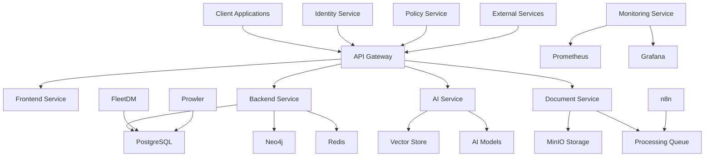

# System Overview

Comprehensive overview of the Studio Platform system architecture, including high-level design, key components, and architectural decisions.

## 🏗️ System Architecture Overview

### **High-Level Architecture**

Studio Platform is a comprehensive compliance management system built on a modern microservices architecture. The system is designed to handle enterprise-scale compliance operations while maintaining security, performance, and scalability.

### **Core Components**

#### **Client Layer**
- **Web Application** - React-based web interface
- **Mobile Application** - React Native mobile app
- **API Clients** - Third-party API integrations
- **Desktop Application** - Electron desktop app

#### **Service Layer**
- **Frontend Service** - Next.js application server
- **Backend Service** - Node.js API server
- **AI Service** - Python AI service
- **Document Service** - File processing service
- **Identity Service** - Authentication service
- **Policy Service** - Authorization service

#### **Data Layer**
- **PostgreSQL** - Primary relational database
- **Neo4j** - Graph database for relationships
- **Redis** - Cache and message queue
- **MinIO** - Object storage
- **ChromaDB** - Vector database for AI

#### **Infrastructure Layer**
- **API Gateway** - Kong API gateway
- **Load Balancer** - Nginx load balancer
- **Container Platform** - Docker/Kubernetes
- **Monitoring Stack** - Prometheus/Grafana
- **Logging Stack** - Loki/Fluent Bit

## 🎯 Design Principles

### **Architectural Principles**

#### **Microservices Architecture**

**Service Separation:**
- **Frontend Service** - User interface and client-side logic
- **Backend Service** - Core business logic and APIs
- **AI Service** - AI-powered features and analysis
- **Document Service** - File processing and storage
- **Identity Service** - Authentication and user management
- **Policy Service** - Authorization and access control

**Service Communication:**
- **Synchronous** - REST APIs for request/response
- **Asynchronous** - Message queues for background tasks
- **Event-Driven** - Event-based communication
- **API Gateway** - Single entry point for all services

#### **Cloud-Native Design**

**Containerization:**
- **Docker** - Container runtime
- **Docker Compose** - Local development
- **Kubernetes** - Production orchestration
- **Helm** - Kubernetes package manager

**Cloud Services:**
- **Compute** - Scalable compute instances
- **Storage** - Object storage and block storage
- **Network** - Virtual private cloud
- **Database** - Managed database services

#### **API-First Design**

**API Design:**
- **RESTful** - REST API design principles
- **OpenAPI** - OpenAPI specification
- **Versioning** - API versioning strategy
- **Documentation** - Comprehensive API documentation

**API Gateway:**
- **Single Entry Point** - Single entry point for all APIs
- **Rate Limiting** - API rate limiting and throttling
- **Authentication** - Centralized authentication
- **Monitoring** - API monitoring and analytics

### **Design Patterns**

#### **CQRS (Command Query Responsibility Segregation)**

**Command Side:**
- **Write Operations** - Create, update, delete operations
- **Validation** - Input validation and business rules
- **Event Publishing** - Event publishing for changes
- **Transaction Management** - Distributed transactions

**Query Side:**
- **Read Operations** - Read-only operations
- **Optimized Queries** - Query optimization
- **Caching** - Query result caching
- **Denormalization** - Read model denormalization

#### **Event Sourcing**

**Event Store:**
- **Event Storage** - Immutable event log
- **Event Replay** - Event replay functionality
- **Event Versioning** - Event versioning strategy
- **Event Snapshots** - Periodic state snapshots

**Event Processing:**
- **Event Publishing** - Event publishing mechanism
- **Event Subscriptions** - Event subscription management
- **Event Handlers** - Event handler registration
- **Event Routing** - Event routing and filtering

#### **Circuit Breaker Pattern**

**Circuit Breaker:**
- **Failure Detection** - Automatic failure detection
- **Circuit States** - Open, closed, half-open states
- **Fallback Mechanism** - Fallback functionality
- **Recovery** - Automatic recovery mechanism

## 🔧 Technology Stack

### **Frontend Technology Stack**

#### **Web Application**

**Core Technologies:**

- **Framework** - Next.js 13+ with App Router
- **Language** - TypeScript
- **Styling** - Tailwind CSS
- **UI Components** - Radix UI
- **State Management** - React Query, Zustand
- **Forms** - React Hook Form
- **Routing** - Next.js App Router

**Development Tools:**

- **Build Tool** - Next.js built-in build
- **Linting** - ESLint, Prettier
- **Testing** - Jest, React Testing Library
- **Bundling** - Next.js built-in bundler
- **Hot Reload** - Fast Refresh

#### **Mobile Application**

**Core Technologies:**
- **Framework** - React Native
- **Language** - TypeScript
- **Navigation** - React Navigation
- **State Management** - Redux Toolkit
- **UI Components** - NativeBase
- **Testing** - Jest, Detox

### **Backend Technology Stack**

#### **Node.js Services**

**Core Technologies:**
- **Runtime** - Node.js 18+
- **Framework** - Express.js
- **Language** - TypeScript
- **Database** - PostgreSQL, Neo4j, Redis
- **ORM** - Prisma
- **Authentication** - Ory Kratos
- **Authorization** - Open Policy Agent

**Development Tools:**
- **Build Tool** - TypeScript compiler
- **Linting** - ESLint, Prettier
- **Testing** - Jest, Supertest
- **Package Manager** - npm
- **Hot Reload** - Nodemon

#### **Python Services**

**Core Technologies:**
- **Runtime** - Python 3.11+
- **Framework** - FastAPI
- **AI Models** - Google Gemini, OpenAI
- **Vector Database** - ChromaDB
- **Task Queue** - Celery
- **Web Server** - Uvicorn

**Development Tools:**
- **Package Manager** - pip
- **Linting** - Black, Flake8
- **Testing** - pytest
- **Documentation** - Sphinx
- **Virtual Environment** - venv

### **Database Technology Stack**

#### **Relational Database**

**PostgreSQL:**
- **Version** - PostgreSQL 15+
- **Extensions** - pgvector, uuid-ossp
- **Features** - JSONB, Full-text search
- **Replication** - Streaming replication
- **Backup** - pgBackRest

**Schema Design:**
- **Users** - User management
- **Projects** - Project management
- **Evidence** - Evidence storage
- **Controls** - Compliance controls
- **Compliance** - Compliance scores

#### **Graph Database**

**Neo4j:**
- **Version** - Neo4j 5.x
- **Features** - Cypher query language
- **Clustering** - Causal clustering
- **Backup** - Neo4j backup
- **Security** - Authentication and authorization

**Graph Model:**
- **Users** - User relationships
- **Projects** - Project hierarchies
- **Controls** - Control dependencies
- **Evidence** - Evidence relationships
- **Compliance** - Compliance networks

#### **Cache Database**

**Redis:**
- **Version** - Redis 7.x
- **Features** - Data structures, persistence
- **Clustering** - Redis Cluster
- **Backup** - Redis persistence
- **Security** - Authentication and encryption

**Use Cases:**
- **Session Cache** - User session storage
- **API Cache** - API response caching
- **Message Queue** - Background job queue
- **Rate Limiting** - API rate limiting

### **Infrastructure Technology Stack**

#### **Container Platform**

**Docker:**
- **Runtime** - Docker Engine
- **Orchestration** - Docker Compose, Kubernetes
- **Registry** - Docker Hub, ECR
- **Security** - Docker Content Trust
- **Monitoring** - Docker stats, logs

**Kubernetes:**
- **Runtime** - Kubernetes 1.25+
- **Networking** - CNI plugins
- **Storage** - CSI drivers
- **Security** - RBAC, Network Policies
* **Monitoring** - Prometheus, Grafana

#### **API Gateway**

**Kong:**
- **Version** - Kong 3.x
- **Features** - Load balancing, rate limiting
- **Plugins** - Custom plugins
- **Security** - Authentication, encryption
- **Monitoring** - Prometheus metrics

**Gateway Features:**
- **Load Balancing** - Round-robin, least connections
- **Rate Limiting** - Request rate limiting
- **Authentication** - JWT, OAuth 2.0
- **Monitoring** - Metrics, logging
- **Security** - WAF, CORS

## 📊 System Metrics

### **Performance Metrics**

#### **Key Performance Indicators**

**Application Performance:**
- **Response Time** - <2 seconds for most operations
- **Throughput** - 1000+ concurrent users
- **Availability** - 99.9% uptime
- **Error Rate** - <0.1% error rate
- **Latency** - <100ms for API calls

**Database Performance:**
- **Query Time** - <100ms for most queries
- **Connection Pool** - 20 connections per service
- **Throughput** - 1000+ queries per second
- **Availability** - 99.9% uptime
- **Latency** - <10ms for local queries

#### **Scalability Metrics**

**Horizontal Scaling:**
- **Frontend** - 2-10 instances
- **Backend** - 3-20 instances
- **AI Service** - 2-10 instances
- **Database** - Read replicas, sharding
- **Storage** - Distributed storage

**Vertical Scaling:**
- **CPU** - 1-8 cores per instance
- **Memory** - 2-16GB per instance
- **Storage** - 100GB-1TB per instance
- **Network** - 1-10Gbps per instance

## 🔒 Security Architecture

### **Security Layers**

#### **Network Security**

**Network Security:**
- **Firewall** - Network firewall rules
- **WAF** - Web application firewall
- **DDoS Protection** - DDoS mitigation
- **VPN** - Secure remote access
- **Network Segmentation** - Network isolation

**API Security:**
- **Authentication** - Multi-factor authentication
- **Authorization** - Role-based access control
- **Rate Limiting** - API rate limiting
- **Input Validation** - Input validation and sanitization
- **Encryption** - TLS 1.3 encryption

#### **Data Security**

**Data Protection:**
- **Encryption at Rest** - AES-256 encryption
- **Encryption in Transit** - TLS 1.3 encryption
- **Access Control** - Fine-grained access control
- **Audit Logging** - Comprehensive audit logging
- **Data Classification** - Data classification and labeling

**Compliance:**
- **SOC 2** - SOC 2 Type II compliance
- **ISO 27001** - ISO 27001 certification
- **GDPR** - GDPR compliance
- **HIPAA** - HIPAA compliance
- **PCI DSS** - PCI DSS compliance

## 🚀 Deployment Architecture

### **Deployment Environments**

#### **Development Environment**

**Local Development:**
- **Docker Compose** - Local development setup
- **Hot Reload** - Fast development cycle
- **Debugging** - Integrated debugging tools
- **Testing** - Local testing environment
- **Monitoring** - Local monitoring setup

**Development Services:**
- **Frontend** - Next.js development server
- **Backend** - Node.js development server
- **AI Service** - Python development server
- **Database** - Local database instances
- **Storage** - Local MinIO instance

#### **Staging Environment**

**Pre-Production:**
- **Docker Swarm** - Container orchestration
- **Load Balancing** - Load balancer setup
- **Monitoring** - Production-like monitoring
- **Testing** - Integration testing
- **Performance** - Performance testing

**Staging Services:**
- **Frontend** - Production-like frontend
- **Backend** - Production-like backend
- **AI Service** - Production-like AI service
- **Database** - Staging database
- **Storage** - Staging storage

#### **Production Environment**

**Production Deployment:**
- **Kubernetes** - Container orchestration
- **Load Balancing** - Load balancer setup
- **Monitoring** - Production monitoring
- **Logging** - Centralized logging
- **Backup** - Automated backup

**Production Services:**
- **Frontend** - Production frontend
- **Backend** - Production backend
- **AI Service** - Production AI service
- **Database** - Production database
- **Storage** - Production storage

## ✅ Architecture Best Practices

### **Design Best Practices**

#### **Microservices Best Practices**
- **Single Responsibility** - Each service has a single responsibility
- **Loose Coupling** - Services are loosely coupled
- **High Cohesion** - Services are highly cohesive
- **API-First** - Design APIs first
- **Fault Tolerance** - Design for failure
- **Observability** - Make services observable

#### **Data Architecture Best Practices**
- **Data Consistency** - Ensure data consistency
- **Data Security** - Protect data at rest and in transit
- **Data Privacy** - Respect data privacy
- **Data Governance** - Implement data governance
- **Data Quality** - Ensure data quality
- **Data Retention** - Implement data retention policies

### **Common Architecture Mistakes**

❌ **Avoid These Mistakes:**
- Not designing for scalability
- Not implementing proper security
- Not considering fault tolerance
- Not implementing proper monitoring
- Not designing for maintainability

✅ **Follow These Best Practices:**
- Design for scalability and performance
- Implement security by design
- Design for fault tolerance and resilience
- Implement comprehensive monitoring
- Design for maintainability and extensibility

---

!!! tip **Start Small**
    Begin with a simple architecture and evolve it as your needs grow. Don't over-engineer from the start.

!!! note **Security First**
    Always prioritize security in architecture decisions. Implement security controls at every layer.

!!! question **Need Help?**
    Check our [Architecture Support](https://support.studio.com) for architecture assistance, or join our developer community.
