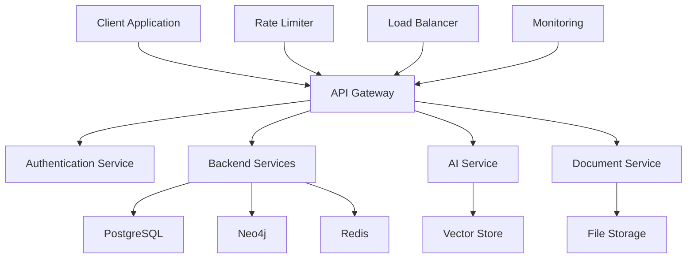

# API Reference

Complete API reference for Studio Platform, including all endpoints, authentication methods, request/response formats, and code examples.

## 🔌 API Overview

### **API Architecture**

Studio Platform provides a comprehensive RESTful API that enables programmatic access to all platform features. The API is designed with scalability, security, and ease of use in mind.



### **API Features**

- **RESTful Design** - Follows REST principles
- **OAuth 2.0** - Secure authentication
- **Rate Limiting** - Protects against abuse
- **Versioning** - API versioning support
- **Webhooks** - Real-time event notifications
- **Pagination** - Efficient data retrieval
- **Filtering** - Advanced filtering options
- **Sorting** - Flexible sorting capabilities

## 🔐 Authentication

### **OAuth 2.0 Flow**

#### **Authorization Code Flow**

**Step 1: Authorization Request**
```http
GET /oauth/authorize?
  response_type=code&
  client_id=your_client_id&
  redirect_uri=https://your-app.com/callback&
  scope=read write&
  state=random_string
```

**Step 2: Authorization Response**
```http
HTTP/1.1 302 Found
Location: https://your-app.com/callback?
  code=authorization_code&
  state=random_string
```

**Step 3: Token Request**
```http
POST /oauth/token
Content-Type: application/x-www-form-urlencoded

grant_type=authorization_code&
code=authorization_code&
redirect_uri=https://your-app.com/callback&
client_id=your_client_id&
client_secret=your_client_secret
```

**Step 4: Token Response**
```json
{
  "access_token": "eyJhbGciOiJIUzI1NiIs...",
  "token_type": "Bearer",
  "expires_in": 3600,
  "refresh_token": "eyJhbGciOiJIUzI1NiIs...",
  "scope": "read write"
}
```

#### **Client Credentials Flow**

**Token Request:**
```http
POST /oauth/token
Content-Type: application/x-www-form-urlencoded

grant_type=client_credentials&
client_id=your_client_id&
client_secret=your_client_secret&
scope=read write
```

**Token Response:**
```json
{
  "access_token": "eyJhbGciOiJIUzI1NiIs...",
  "token_type": "Bearer",
  "expires_in": 3600,
  "scope": "read write"
}
```

### **API Key Authentication**

#### **API Key Setup**

**Generate API Key:**
```http
POST /api/v1/api-keys
Authorization: Bearer your_access_token
Content-Type: application/json

{
  "name": "My Application",
  "description": "API key for my application",
  "scopes": ["read", "write"],
  "expires_at": "2025-01-01T00:00:00Z"
}
```

**API Key Response:**
```json
{
  "id": "ak_1234567890",
  "name": "My Application",
  "api_key": "sk_live_1234567890abcdef",
  "scopes": ["read", "write"],
  "created_at": "2024-01-01T00:00:00Z",
  "expires_at": "2025-01-01T00:00:00Z"
}
```

**Use API Key:**
```http
GET /api/v1/users
X-API-Key: sk_live_1234567890abcdef
Content-Type: application/json
```

## 📊 API Endpoints

### **Authentication Endpoints**

#### **Login**
```http
POST /api/v1/auth/login
Content-Type: application/json

{
  "email": "user@example.com",
  "password": "password123"
}
```

**Response:**
```json
{
  "success": true,
  "data": {
    "user": {
      "id": "user_1234567890",
      "email": "user@example.com",
      "name": "John Doe",
      "role": "customer"
    },
    "tokens": {
      "access_token": "eyJhbGciOiJIUzI1NiIs...",
      "refresh_token": "eyJhbGciOiJIUzI1NiIs...",
      "expires_in": 3600
    }
  }
}
```

#### **Refresh Token**
```http
POST /api/v1/auth/refresh
Content-Type: application/json

{
  "refresh_token": "eyJhbGciOiJIUzI1NiIs..."
}
```

**Response:**
```json
{
  "success": true,
  "data": {
    "access_token": "eyJhbGciOiJIUzI1NiIs...",
    "refresh_token": "eyJhbGciOiJIUzI1NiIs...",
    "expires_in": 3600
  }
}
```

#### **Logout**
```http
POST /api/v1/auth/logout
Authorization: Bearer your_access_token
```

**Response:**
```json
{
  "success": true,
  "message": "Logged out successfully"
}
```

### **User Endpoints**

#### **Get Current User**
```http
GET /api/v1/users/me
Authorization: Bearer your_access_token
```

**Response:**
```json
{
  "success": true,
  "data": {
    "id": "user_1234567890",
    "email": "user@example.com",
    "name": "John Doe",
    "role": "customer",
    "created_at": "2024-01-01T00:00:00Z",
    "updated_at": "2024-01-01T00:00:00Z",
    "last_login": "2024-01-15T10:30:00Z",
    "preferences": {
      "theme": "light",
      "language": "en",
      "timezone": "UTC"
    }
  }
}
```

#### **Get Users**
```http
GET /api/v1/users?page=1&limit=20&role=customer
Authorization: Bearer your_access_token
```

**Response:**
```json
{
  "success": true,
  "data": {
    "users": [
      {
        "id": "user_1234567890",
        "email": "user@example.com",
        "name": "John Doe",
        "role": "customer",
        "created_at": "2024-01-01T00:00:00Z",
        "last_login": "2024-01-15T10:30:00Z"
      }
    ],
    "pagination": {
      "page": 1,
      "limit": 20,
      "total": 100,
      "pages": 5
    }
  }
}
```

#### **Create User**
```http
POST /api/v1/users
Authorization: Bearer your_access_token
Content-Type: application/json

{
  "email": "newuser@example.com",
  "name": "New User",
  "role": "customer",
  "password": "password123"
}
```

**Response:**
```json
{
  "success": true,
  "data": {
    "id": "user_0987654321",
    "email": "newuser@example.com",
    "name": "New User",
    "role": "customer",
    "created_at": "2024-01-15T11:00:00Z",
    "updated_at": "2024-01-15T11:00:00Z"
  }
}
```

#### **Update User**
```http
PUT /api/v1/users/user_1234567890
Authorization: Bearer your_access_token
Content-Type: application/json

{
  "name": "Updated Name",
  "preferences": {
    "theme": "dark",
    "language": "en",
    "timezone": "UTC"
  }
}
```

**Response:**
```json
{
  "success": true,
  "data": {
    "id": "user_1234567890",
    "email": "user@example.com",
    "name": "Updated Name",
    "role": "customer",
    "preferences": {
      "theme": "dark",
      "language": "en",
      "timezone": "UTC"
    },
    "updated_at": "2024-01-15T11:30:00Z"
  }
}
```

#### **Delete User**
```http
DELETE /api/v1/users/user_1234567890
Authorization: Bearer your_access_token
```

**Response:**
```json
{
  "success": true,
  "message": "User deleted successfully"
}
```

### **Project Endpoints**

#### **Get Projects**
```http
GET /api/v1/projects?page=1&limit=20&status=active
Authorization: Bearer your_access_token
```

**Response:**
```json
{
  "success": true,
  "data": {
    "projects": [
      {
        "id": "proj_1234567890",
        "name": "SOC 2 Type II Assessment",
        "description": "SOC 2 Type II compliance assessment",
        "status": "active",
        "framework": "soc2",
        "compliance_score": 78,
        "created_at": "2024-01-01T00:00:00Z",
        "updated_at": "2024-01-15T10:30:00Z",
        "team_members": [
          {
            "user_id": "user_1234567890",
            "role": "manager",
            "joined_at": "2024-01-01T00:00:00Z"
          }
        ]
      }
    ],
    "pagination": {
      "page": 1,
      "limit": 20,
      "total": 50,
      "pages": 3
    }
  }
}
```

#### **Get Project**
```http
GET /api/v1/projects/proj_1234567890
Authorization: Bearer your_access_token
```

**Response:**
```json
{
  "success": true,
  "data": {
    "id": "proj_1234567890",
    "name": "SOC 2 Type II Assessment",
    "description": "SOC 2 Type II compliance assessment",
    "status": "active",
    "framework": "soc2",
    "compliance_score": 78,
    "created_at": "2024-01-01T00:00:00Z",
    "updated_at": "2024-01-15T10:30:00Z",
    "team_members": [
      {
        "user_id": "user_1234567890",
        "role": "manager",
        "joined_at": "2024-01-01T00:00:00Z"
      }
    ],
    "controls": [
      {
        "id": "ctrl_1234567890",
        "number": "A1.1",
        "title": "Information Security Policies",
        "status": "complete",
        "evidence_count": 5
      }
    ],
    "milestones": [
      {
        "id": "mile_1234567890",
        "name": "Evidence Collection",
        "due_date": "2024-02-01T00:00:00Z",
        "status": "in_progress"
      }
    ]
  }
}
```

#### **Create Project**
```http
POST /api/v1/projects
Authorization: Bearer your_access_token
Content-Type: application/json

{
  "name": "ISO 27001 Certification",
  "description": "ISO 27001 certification project",
  "framework": "iso27001",
  "team_members": [
    {
      "user_id": "user_1234567890",
      "role": "manager"
    }
  ],
  "milestones": [
    {
      "name": "Initial Assessment",
      "due_date": "2024-02-01T00:00:00Z"
    }
  ]
}
```

**Response:**
```json
{
  "success": true,
  "data": {
    "id": "proj_0987654321",
    "name": "ISO 27001 Certification",
    "description": "ISO 27001 certification project",
    "status": "active",
    "framework": "iso27001",
    "compliance_score": 0,
    "created_at": "2024-01-15T12:00:00Z",
    "updated_at": "2024-01-15T12:00:00Z"
  }
}
```

### **Evidence Endpoints**

#### **Get Evidence**
```http
GET /api/v1/evidence?project_id=proj_1234567890&control_id=ctrl_1234567890
Authorization: Bearer your_access_token
```

**Response:**
```json
{
  "success": true,
  "data": {
    "evidence": [
      {
        "id": "ev_1234567890",
        "title": "Security Policy v2.1",
        "description": "Updated security policy document",
        "file_name": "security_policy_v2.1.pdf",
        "file_size": 2048576,
        "content_type": "application/pdf",
        "control_id": "ctrl_1234567890",
        "project_id": "proj_1234567890",
        "uploaded_by": "user_1234567890",
        "uploaded_at": "2024-01-15T10:30:00Z",
        "quality_score": 92,
        "status": "approved",
        "tags": ["policy", "security", "v2.1"]
      }
    ],
    "pagination": {
      "page": 1,
      "limit": 20,
      "total": 100,
      "pages": 5
    }
  }
}
```

#### **Upload Evidence**
```http
POST /api/v1/evidence
Authorization: Bearer your_access_token
Content-Type: multipart/form-data

file: [binary data]
title: "Security Policy v2.1"
description: "Updated security policy document"
control_id: "ctrl_1234567890"
project_id: "proj_1234567890"
tags: ["policy", "security", "v2.1"]
```

**Response:**
```json
{
  "success": true,
  "data": {
    "id": "ev_0987654321",
    "title": "Security Policy v2.1",
    "description": "Updated security policy document",
    "file_name": "security_policy_v2.1.pdf",
    "file_size": 2048576,
    "content_type": "application/pdf",
    "control_id": "ctrl_1234567890",
    "project_id": "proj_1234567890",
    "uploaded_by": "user_1234567890",
    "uploaded_at": "2024-01-15T12:30:00Z",
    "quality_score": 0,
    "status": "pending",
    "tags": ["policy", "security", "v2.1"]
  }
}
```

#### **Get Evidence File**
```http
GET /api/v1/evidence/ev_1234567890/file
Authorization: Bearer your_access_token
```

**Response:**
```http
HTTP/1.1 200 OK
Content-Type: application/pdf
Content-Disposition: attachment; filename="security_policy_v2.1.pdf"
Content-Length: 2048576

[binary file content]
```

### **Compliance Endpoints**

#### **Get Compliance Score**
```http
GET /api/v1/compliance/score?project_id=proj_1234567890
Authorization: Bearer your_access_token
```

**Response:**
```json
{
  "success": true,
  "data": {
    "project_id": "proj_1234567890",
    "overall_score": 78,
    "framework_scores": {
      "security": 82,
      "availability": 75,
      "processing_integrity": 80,
      "confidentiality": 70,
      "privacy": 85
    },
    "control_coverage": {
      "total": 60,
      "complete": 45,
      "in_progress": 10,
      "not_started": 5
    },
    "evidence_quality": {
      "total": 127,
      "high_quality": 89,
      "good_quality": 28,
      "needs_improvement": 10
    },
    "last_updated": "2024-01-15T10:30:00Z"
  }
}
```

#### **Get Frameworks**
```http
GET /api/v1/compliance/frameworks
Authorization: Bearer your_access_token
```

**Response:**
```json
{
  "success": true,
  "data": {
    "frameworks": [
      {
        "id": "soc2",
        "name": "SOC 2 Type II",
        "description": "Service Organization Control 2 Type II",
        "controls": [
          {
            "id": "ctrl_1234567890",
            "number": "A1.1",
            "title": "Information Security Policies",
            "category": "security"
          }
        ]
      },
      {
        "id": "iso27001",
        "name": "ISO 27001",
        "description": "ISO 27001 Information Security Management",
        "controls": [
          {
            "id": "ctrl_2345678901",
            "number": "A.5.1",
            "title": "Policies for Information Security",
            "category": "policy"
          }
        ]
      }
    ]
  }
}
```

### **AI Assistant Endpoints**

#### **Chat with AI**
```http
POST /api/v1/ai/chat
Authorization: Bearer your_access_token
Content-Type: application/json

{
  "message": "What evidence do I need for SOC 2 control A1.1?",
  "context": {
    "project_id": "proj_1234567890",
    "control_id": "ctrl_1234567890"
  }
}
```

**Response:**
```json
{
  "success": true,
  "data": {
    "message": "For SOC 2 control A1.1 (Information Security Policies), you'll need:\n\n1. Security Policy - Comprehensive security policy document\n2. Acceptable Use Policy - Guidelines for acceptable use\n3. Incident Response Plan - Procedures for incident response\n4. Data Classification Policy - Data classification guidelines\n5. Access Control Policy - Access control procedures\n\nWould you like me to help you create any of these policies?",
    "context": {
      "framework": "soc2",
      "control": "A1.1",
      "control_title": "Information Security Policies"
    },
    "suggestions": [
      {
        "type": "policy_generation",
        "title": "Generate Security Policy",
        "description": "Create a comprehensive security policy"
      },
      {
        "type": "gap_analysis",
        "title": "Analyze Gaps",
        "description": "Identify gaps in current evidence"
      }
    ]
  }
}
```

#### **Generate Policy**
```http
POST /api/v1/ai/generate/policy
Authorization: Bearer your_access_token
Content-Type: application/json

{
  "type": "security_policy",
  "framework": "soc2",
  "control_id": "ctrl_1234567890",
  "company_name": "Your Company",
  "industry": "technology"
}
```

**Response:**
```json
{
  "success": true,
  "data": {
    "title": "Security Policy",
    "content": "# Security Policy\n\n## 1. Purpose\nThis policy establishes the framework for information security management at Your Company...",
    "format": "markdown",
    "generated_at": "2024-01-15T13:00:00Z",
    "quality_score": 92
  }
}
```

## 📊 Query Parameters

### **Pagination**

**Standard Pagination Parameters:**
- `page` - Page number (default: 1)
- `limit` - Items per page (default: 20, max: 100)
- `sort` - Sort field
- `order` - Sort order (asc, desc)

**Example:**
```http
GET /api/v1/users?page=2&limit=10&sort=created_at&order=desc
```

### **Filtering**

**Common Filter Parameters:**
- `status` - Filter by status
- `role` - Filter by role
- `created_after` - Filter by creation date (after)
- `created_before` - Filter by creation date (before)
- `search` - Search term

**Example:**
```http
GET /api/v1/projects?status=active&framework=soc2&created_after=2024-01-01T00:00:00Z
```

### **Search**

**Search Parameters:**
- `search` - Search term
- `search_fields` - Fields to search in (comma-separated)

**Example:**
```http
GET /api/v1/evidence?search=security&search_fields=title,description
```

## 🚨 Error Handling

### **Error Response Format**

**Standard Error Response:**
```json
{
  "success": false,
  "error": {
    "code": "VALIDATION_ERROR",
    "message": "Invalid request parameters",
    "details": {
      "field": "email",
      "error": "Invalid email format"
    }
  },
  "timestamp": "2024-01-15T10:30:00Z",
  "request_id": "req_123456789"
}
```

### **Error Codes**

| Error Code | HTTP Status | Description |
|------------|-------------|-------------|
| `VALIDATION_ERROR` | 400 | Invalid request parameters |
| `UNAUTHORIZED` | 401 | Authentication required |
| `FORBIDDEN` | 403 | Insufficient permissions |
| `NOT_FOUND` | 404 | Resource not found |
| `CONFLICT` | 409 | Resource conflict |
| `RATE_LIMITED` | 429 | Rate limit exceeded |
| `INTERNAL_ERROR` | 500 | Internal server error |
| `SERVICE_UNAVAILABLE` | 503 | Service unavailable |

### **Rate Limiting**

**Rate Limit Headers:**
```http
HTTP/1.1 200 OK
X-RateLimit-Limit: 1000
X-RateLimit-Remaining: 999
X-RateLimit-Reset: 1640995200
```

**Rate Limit Response:**
```json
{
  "success": false,
  "error": {
    "code": "RATE_LIMITED",
    "message": "Rate limit exceeded",
    "details": {
      "limit": 1000,
      "remaining": 0,
      "reset_time": "2024-01-15T11:00:00Z"
    }
  }
}
```

## 🔄 Webhooks

### **Webhook Configuration**

#### **Create Webhook**
```http
POST /api/v1/webhooks
Authorization: Bearer your_access_token
Content-Type: application/json

{
  "url": "https://your-app.com/webhook",
  "events": ["evidence.uploaded", "project.created"],
  "secret": "your_webhook_secret",
  "active": true
}
```

**Response:**
```json
{
  "success": true,
  "data": {
    "id": "wh_1234567890",
    "url": "https://your-app.com/webhook",
    "events": ["evidence.uploaded", "project.created"],
    "secret": "your_webhook_secret",
    "active": true,
    "created_at": "2024-01-15T14:00:00Z"
  }
}
```

#### **Webhook Payload**

**Evidence Uploaded Event:**
```json
{
  "event": "evidence.uploaded",
  "timestamp": "2024-01-15T14:30:00Z",
  "data": {
    "evidence": {
      "id": "ev_1234567890",
      "title": "Security Policy v2.1",
      "file_name": "security_policy_v2.1.pdf",
      "project_id": "proj_1234567890",
      "control_id": "ctrl_1234567890",
      "uploaded_by": "user_1234567890"
    }
  }
}
```

## 📚 SDKs and Libraries

### **JavaScript/Node.js SDK**

**Installation:**
```bash
npm install @studio-platform/sdk
```

**Usage:**
```javascript
import { StudioAPI } from '@studio-platform/sdk';

const api = new StudioAPI({
  baseURL: 'https://api.studio.com',
  apiKey: 'your_api_key'
});

// Get projects
const projects = await api.projects.list();

// Create evidence
const evidence = await api.evidence.create({
  title: 'Security Policy',
  file: fileData,
  controlId: 'ctrl_1234567890',
  projectId: 'proj_1234567890'
});
```

### **Python SDK**

**Installation:**
```bash
pip install studio-platform-sdk
```

**Usage:**
```python
from studio_platform import StudioAPI

api = StudioAPI(
    base_url='https://api.studio.com',
    api_key='your_api_key'
)

# Get projects
projects = api.projects.list()

# Create evidence
evidence = api.evidence.create(
    title='Security Policy',
    file=file_data,
    control_id='ctrl_1234567890',
    project_id='proj_1234567890'
)
```

## ✅ API Best Practices

### **Development Best Practices**

#### **API Usage**
- **Authentication** - Use proper authentication methods
- **Rate Limiting** - Respect rate limits
- **Error Handling** - Handle errors gracefully
- **Pagination** - Use pagination for large datasets
- **Webhooks** - Use webhooks for real-time updates

#### **Security**
- **API Keys** - Keep API keys secure
- **HTTPS** - Always use HTTPS
- **Input Validation** - Validate all inputs
- **Access Control** - Use principle of least privilege
- **Audit Logging** - Log all API calls

### **Common API Mistakes**

❌ **Avoid These Mistakes:**
- Not using proper authentication
- Ignoring rate limits
- Not handling errors properly
- Not using pagination for large datasets
- Hardcoding API keys

✅ **Follow These Best Practices:**
- Use proper authentication methods
- Respect rate limits and implement backoff
- Handle errors gracefully and appropriately
- Use pagination for large datasets
- Keep API keys secure and use environment variables

---

!!! tip **API Testing**
    Use the API testing tools in the developer portal to test API endpoints before implementing them in your application.

!!! note **Rate Limits**
    Monitor your API usage to avoid hitting rate limits. Implement exponential backoff for retry logic.

!!! question **Need Help?**
    Check our [Developer Support](https://support.studio.com) for API assistance, or join our developer community.
