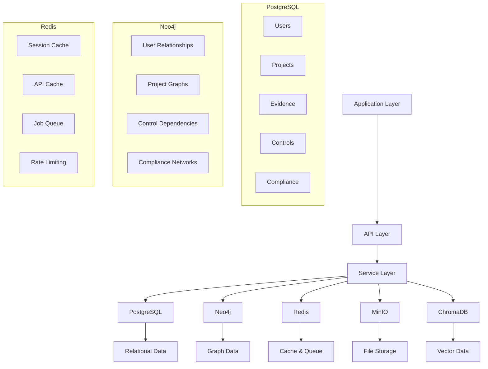

# Database Schema

Comprehensive guide to Studio Platform's database architecture, including schema design, relationships, and data management patterns.

## 🗄️ Database Overview

### **Database Architecture**

Studio Platform uses a multi-database architecture optimized for different data types and access patterns:



### **Database Selection Rationale**

| Database | Use Case | Data Type | Performance | Scalability |
|----------|----------|-----------|------------|------------|
| **PostgreSQL** | Primary data storage | Relational data | High | Horizontal |
| **Neo4j** | Graph relationships | Graph data | Medium | Vertical |
| **Redis** | Cache & queue | Key-value | Very High | Horizontal |
| **MinIO** | File storage | Object files | High | Horizontal |
| **ChromaDB** | Vector embeddings | Vector data | High | Horizontal |

## 📊 PostgreSQL Schema

### **Core Tables**

#### **Users Table**

```sql
CREATE TABLE users (
    id UUID PRIMARY KEY DEFAULT gen_random_uuid(),
    email VARCHAR(255) UNIQUE NOT NULL,
    password_hash VARCHAR(255) NOT NULL,
    name VARCHAR(255) NOT NULL,
    role VARCHAR(50) NOT NULL DEFAULT 'customer',
    status VARCHAR(50) NOT NULL DEFAULT 'active',
    preferences JSONB DEFAULT '{}',
    created_at TIMESTAMP WITH TIME ZONE DEFAULT CURRENT_TIMESTAMP,
    updated_at TIMESTAMP WITH TIME ZONE DEFAULT CURRENT_TIMESTAMP,
    last_login TIMESTAMP WITH TIME ZONE,
    email_verified BOOLEAN DEFAULT FALSE,
    phone VARCHAR(50),
    department VARCHAR(100),
    location VARCHAR(255),
    avatar_url VARCHAR(500)
);

-- Indexes
CREATE INDEX idx_users_email ON users(email);
CREATE INDEX idx_users_role ON users(role);
CREATE INDEX idx_users_status ON users(status);
CREATE INDEX idx_users_created_at ON users(created_at);
CREATE INDEX idx_users_preferences ON users USING GIN(preferences);

-- Triggers
CREATE OR REPLACE FUNCTION update_updated_at_column()
RETURNS TRIGGER AS $$
BEGIN
    NEW.updated_at = CURRENT_TIMESTAMP;
    RETURN NEW;
END;
$$ language 'plpgsql';

CREATE TRIGGER update_users_updated_at 
    BEFORE UPDATE ON users 
    FOR EACH ROW EXECUTE FUNCTION update_updated_at_column();
```

#### **Projects Table**

```sql
CREATE TABLE projects (
    id UUID PRIMARY KEY DEFAULT gen_random_uuid(),
    name VARCHAR(255) NOT NULL,
    description TEXT,
    framework VARCHAR(50) NOT NULL,
    status VARCHAR(50) NOT NULL DEFAULT 'active',
    compliance_score INTEGER DEFAULT 0,
    target_score INTEGER DEFAULT 85,
    start_date DATE,
    end_date DATE,
    created_by UUID REFERENCES users(id) ON DELETE SET NULL,
    settings JSONB DEFAULT '{}',
    metadata JSONB DEFAULT '{}',
    created_at TIMESTAMP WITH TIME ZONE DEFAULT CURRENT_TIMESTAMP,
    updated_at TIMESTAMP WITH TIME ZONE DEFAULT CURRENT_TIMESTAMP
);

-- Indexes
CREATE INDEX idx_projects_framework ON projects(framework);
CREATE INDEX idx_projects_status ON projects(status);
CREATE INDEX idx_projects_created_by ON projects(created_by);
CREATE INDEX idx_projects_start_date ON projects(start_date);
CREATE INDEX idx_projects_end_date ON projects(end_date);
CREATE INDEX idx_projects_settings ON projects USING GIN(settings);
CREATE INDEX idx_projects_metadata ON projects USING GIN(metadata);

-- Trigger
CREATE TRIGGER update_projects_updated_at 
    BEFORE UPDATE ON projects 
    FOR EACH ROW EXECUTE FUNCTION update_updated_at_column();
```

#### **Evidence Table**

```sql
CREATE TABLE evidence (
    id UUID PRIMARY KEY DEFAULT gen_random_uuid(),
    title VARCHAR(255) NOT NULL,
    description TEXT,
    file_name VARCHAR(255) NOT NULL,
    file_size BIGINT NOT NULL,
    file_path VARCHAR(500) NOT NULL,
    content_type VARCHAR(100) NOT NULL,
    checksum VARCHAR(64) NOT NULL,
    project_id UUID REFERENCES projects(id) ON DELETE CASCADE,
    control_id VARCHAR(100) NOT NULL,
    uploaded_by UUID REFERENCES users(id) ON DELETE SET NULL,
    quality_score INTEGER DEFAULT 0,
    status VARCHAR(50) NOT NULL DEFAULT 'pending',
    tags TEXT[] DEFAULT '{}',
    metadata JSONB DEFAULT '{}',
    uploaded_at TIMESTAMP WITH TIME ZONE DEFAULT CURRENT_TIMESTAMP,
    updated_at TIMESTAMP WITH TIME ZONE DEFAULT CURRENT_TIMESTAMP,
    reviewed_at TIMESTAMP WITH TIME ZONE,
    reviewed_by UUID REFERENCES users(id) ON DELETE SET NULL,
    version INTEGER DEFAULT 1,
    parent_id UUID REFERENCES evidence(id) ON DELETE SET NULL
);

-- Indexes
CREATE INDEX idx_evidence_project_id ON evidence(project_id);
CREATE INDEX idx_evidence_control_id ON evidence(control_id);
CREATE INDEX idx_evidence_uploaded_by ON evidence(uploaded_by);
CREATE INDEX idx_evidence_status ON evidence(status);
CREATE INDEX idx_evidence_quality_score ON evidence(quality_score);
CREATE INDEX idx_evidence_tags ON evidence USING GIN(tags);
CREATE INDEX idx_evidence_metadata ON evidence USING GIN(metadata);
CREATE INDEX idx_evidence_uploaded_at ON evidence(uploaded_at);
CREATE INDEX idx_evidence_checksum ON evidence(checksum);

-- Trigger
CREATE TRIGGER update_evidence_updated_at 
    BEFORE UPDATE ON evidence 
    FOR EACH ROW EXECUTE FUNCTION update_updated_at_column();
```

#### **Controls Table**

```sql
CREATE TABLE controls (
    id UUID PRIMARY KEY DEFAULT gen_random_uuid(),
    framework VARCHAR(50) NOT NULL,
    control_number VARCHAR(50) NOT NULL,
    title VARCHAR(255) NOT NULL,
    description TEXT,
    category VARCHAR(100),
    priority VARCHAR(50) DEFAULT 'medium',
    evidence_requirements TEXT[] DEFAULT '{}',
    implementation_guidance TEXT,
    verification_procedures TEXT,
    created_at TIMESTAMP WITH TIME ZONE DEFAULT CURRENT_TIMESTAMP,
    updated_at TIMESTAMP WITH TIME ZONE DEFAULT CURRENT_TIMESTAMP,
    UNIQUE(framework, control_number)
);

-- Indexes
CREATE INDEX idx_controls_framework ON controls(framework);
CREATE INDEX idx_controls_control_number ON controls(control_number);
CREATE INDEX idx_controls_category ON controls(category);
CREATE INDEX idx_controls_priority ON controls(priority);
CREATE INDEX idx_controls_evidence_requirements ON controls USING GIN(evidence_requirements);

-- Trigger
CREATE TRIGGER update_controls_updated_at 
    BEFORE UPDATE ON controls 
    FOR EACH ROW EXECUTE FUNCTION update_updated_at_column();
```

### **Relationship Tables**

#### **Project Members Table**

```sql
CREATE TABLE project_members (
    id UUID PRIMARY KEY DEFAULT gen_random_uuid(),
    project_id UUID REFERENCES projects(id) ON DELETE CASCADE,
    user_id UUID REFERENCES users(id) ON DELETE CASCADE,
    role VARCHAR(50) NOT NULL DEFAULT 'member',
    permissions JSONB DEFAULT '{}',
    joined_at TIMESTAMP WITH TIME ZONE DEFAULT CURRENT_TIMESTAMP,
    invited_by UUID REFERENCES users(id) ON DELETE SET NULL,
    status VARCHAR(50) NOT NULL DEFAULT 'active',
    UNIQUE(project_id, user_id)
);

-- Indexes
CREATE INDEX idx_project_members_project_id ON project_members(project_id);
CREATE INDEX idx_project_members_user_id ON project_members(user_id);
CREATE INDEX idx_project_members_role ON project_members(role);
CREATE INDEX idx_project_members_status ON project_members(status);
CREATE INDEX idx_project_members_permissions ON project_members USING GIN(permissions);
```

#### **Evidence Reviews Table**

```sql
CREATE TABLE evidence_reviews (
    id UUID PRIMARY KEY DEFAULT gen_random_uuid(),
    evidence_id UUID REFERENCES evidence(id) ON DELETE CASCADE,
    reviewer_id UUID REFERENCES users(id) ON DELETE SET NULL,
    status VARCHAR(50) NOT NULL DEFAULT 'pending',
    score INTEGER CHECK (score >= 0 AND score <= 100),
    comments TEXT,
    recommendations TEXT,
    reviewed_at TIMESTAMP WITH TIME ZONE DEFAULT CURRENT_TIMESTAMP,
    updated_at TIMESTAMP WITH TIME ZONE DEFAULT CURRENT_TIMESTAMP
);

-- Indexes
CREATE INDEX idx_evidence_reviews_evidence_id ON evidence_reviews(evidence_id);
CREATE INDEX idx_evidence_reviews_reviewer_id ON evidence_reviews(reviewer_id);
CREATE INDEX idx_evidence_reviews_status ON evidence_reviews(status);
CREATE INDEX idx_evidence_reviews_score ON evidence_reviews(score);
CREATE INDEX idx_evidence_reviews_reviewed_at ON evidence_reviews(reviewed_at);

-- Trigger
CREATE TRIGGER update_evidence_reviews_updated_at 
    BEFORE UPDATE ON evidence_reviews 
    FOR EACH ROW EXECUTE FUNCTION update_updated_at_column();
```

### **Compliance Tables**

#### **Compliance Scores Table**

```sql
CREATE TABLE compliance_scores (
    id UUID PRIMARY KEY DEFAULT gen_random_uuid(),
    project_id UUID REFERENCES projects(id) ON DELETE CASCADE,
    framework VARCHAR(50) NOT NULL,
    overall_score INTEGER NOT NULL,
    control_coverage JSONB DEFAULT '{}',
    evidence_quality JSONB DEFAULT '{}',
    risk_assessment JSONB DEFAULT '{}',
    calculated_at TIMESTAMP WITH TIME ZONE DEFAULT CURRENT_TIMESTAMP,
    UNIQUE(project_id, framework)
);

-- Indexes
CREATE INDEX idx_compliance_scores_project_id ON compliance_scores(project_id);
CREATE INDEX idx_compliance_scores_framework ON compliance_scores(framework);
CREATE INDEX idx_compliance_scores_overall_score ON compliance_scores(overall_score);
CREATE INDEX idx_compliance_scores_calculated_at ON compliance_scores(calculated_at);
CREATE INDEX idx_compliance_scores_control_coverage ON compliance_scores USING GIN(control_coverage);
CREATE INDEX idx_compliance_scores_evidence_quality ON compliance_scores USING GIN(evidence_quality);
CREATE INDEX idx_compliance_scores_risk_assessment ON compliance_scores USING GIN(risk_assessment);
```

#### **Compliance Gaps Table**

```sql
CREATE TABLE compliance_gaps (
    id UUID PRIMARY KEY DEFAULT gen_random_uuid(),
    project_id UUID REFERENCES projects(id) ON DELETE CASCADE,
    control_id VARCHAR(100) NOT NULL,
    gap_type VARCHAR(50) NOT NULL,
    severity VARCHAR(50) NOT NULL,
    description TEXT,
    recommendations TEXT,
    status VARCHAR(50) NOT NULL DEFAULT 'open',
    assigned_to UUID REFERENCES users(id) ON DELETE SET NULL,
    due_date DATE,
    created_at TIMESTAMP WITH TIME ZONE DEFAULT CURRENT_TIMESTAMP,
    updated_at TIMESTAMP WITH TIME ZONE DEFAULT CURRENT_TIMESTAMP,
    resolved_at TIMESTAMP WITH TIME ZONE
);

-- Indexes
CREATE INDEX idx_compliance_gaps_project_id ON compliance_gaps(project_id);
CREATE INDEX idx_compliance_gaps_control_id ON compliance_gaps(control_id);
CREATE INDEX idx_compliance_gaps_gap_type ON compliance_gaps(gap_type);
CREATE INDEX idx_compliance_gaps_severity ON compliance_gaps(severity);
CREATE INDEX idx_compliance_gaps_status ON compliance_gaps(status);
CREATE INDEX idx_compliance_gaps_assigned_to ON compliance_gaps(assigned_to);
CREATE INDEX idx_compliance_gaps_due_date ON compliance_gaps(due_date);

-- Trigger
CREATE TRIGGER update_compliance_gaps_updated_at 
    BEFORE UPDATE ON compliance_gaps 
    FOR EACH ROW EXECUTE FUNCTION update_updated_at_column();
```

## 🔗 Neo4j Graph Schema

### **Graph Model Design**

#### **Node Types**

**User Nodes:**
```cypher
CREATE CONSTRAINT user_id_unique IF NOT EXISTS FOR (u:User) REQUIRE u.id IS UNIQUE;
CREATE INDEX user_email_index IF NOT EXISTS FOR (u:User) ON (u.email);
CREATE INDEX user_role_index IF NOT EXISTS FOR (u:User) ON (u.role);

CREATE (u:User {
    id: 'user_1234567890',
    email: 'user@example.com',
    name: 'John Doe',
    role: 'customer',
    status: 'active',
    created_at: datetime(),
    last_login: datetime(),
    preferences: {}
});
```

**Project Nodes:**
```cypher
CREATE CONSTRAINT project_id_unique IF NOT EXISTS FOR (p:Project) REQUIRE p.id IS UNIQUE;
CREATE INDEX project_framework_index IF NOT EXISTS FOR (p:Project) ON (p.framework);
CREATE INDEX project_status_index IF NOT EXISTS FOR (p:Project) ON (p.status);

CREATE (p:Project {
    id: 'proj_1234567890',
    name: 'SOC 2 Type II Assessment',
    framework: 'soc2',
    status: 'active',
    compliance_score: 78,
    created_at: datetime(),
    start_date: date(),
    end_date: date()
});
```

**Control Nodes:**
```cypher
CREATE CONSTRAINT control_id_unique IF NOT EXISTS FOR (c:Control) REQUIRE c.id IS UNIQUE;
CREATE INDEX control_framework_index IF NOT EXISTS FOR (c:Control) ON (c.framework);
CREATE INDEX control_category_index IF NOT EXISTS FOR (c:Control) ON (c.category);

CREATE (c:Control {
    id: 'ctrl_1234567890',
    framework: 'soc2',
    control_number: 'A1.1',
    title: 'Information Security Policies',
    description: 'Establish and maintain information security policies',
    category: 'security',
    priority: 'high',
    created_at: datetime()
});
```

**Evidence Nodes:**
```cypher
CREATE CONSTRAINT evidence_id_unique IF NOT EXISTS FOR (e:Evidence) REQUIRE e.id IS UNIQUE;
CREATE INDEX evidence_status_index IF NOT EXISTS FOR (e:Evidence) ON (e.status);
CREATE INDEX evidence_quality_score_index IF NOT EXISTS FOR (e:Evidence) ON (e.quality_score);

CREATE (e:Evidence {
    id: 'ev_1234567890',
    title: 'Security Policy v2.1',
    file_name: 'security_policy_v2.1.pdf',
    status: 'approved',
    quality_score: 92,
    uploaded_at: datetime(),
    file_size: 2048576,
    content_type: 'application/pdf'
});
```

#### **Relationship Types**

**User-Project Relationships:**
```cypher
CREATE (u:User {id: 'user_123'})-[:MEMBER_OF {
    role: 'manager',
    permissions: ['read', 'write', 'admin'],
    joined_at: datetime(),
    invited_by: 'user_456'
}]->(p:Project {id: 'proj_123'});

CREATE (u:User {id: 'user_123'})-[:OWNS]->(p:Project {id: 'proj_123'});
CREATE (u:User {id: 'user_123'})-[:MANAGES]->(p:Project {id: 'proj_123'});
```

**Project-Control Relationships:**
```cypher
CREATE (p:Project {id: 'proj_123'})-[:INCLUDES {
    status: 'active',
    priority: 'high',
    assigned_to: 'user_123',
    due_date: date()
}]->(c:Control {id: 'ctrl_123'});

CREATE (p:Project {id: 'proj_123'})-[:REQUIRES]->(c:Control {id: 'ctrl_123'});
```

**Control-Evidence Relationships:**
```cypher
CREATE (c:Control {id: 'ctrl_123'})-[:HAS_EVIDENCE {
    quality_score: 92,
    status: 'approved',
    uploaded_by: 'user_123',
    uploaded_at: datetime()
}]->(e:Evidence {id: 'ev_123'});

CREATE (c:Control {id: 'ctrl_123'})-[:SATISFIED_BY]->(e:Evidence {id: 'ev_123'});
```

**User-Evidence Relationships:**
```cypher
CREATE (u:User {id: 'user_123'})-[:UPLOADED {
    uploaded_at: datetime(),
    file_size: 2048576,
    content_type: 'application/pdf'
}]->(e:Evidence {id: 'ev_123'});

CREATE (u:User {id: 'user_123'})-[:REVIEWED {
    score: 92,
    comments: 'Excellent quality',
    reviewed_at: datetime()
}]->(e:Evidence {id: 'ev_123'});
```

### **Graph Queries**

#### **User Project Access**

```cypher
// Get all projects for a user
MATCH (u:User {id: $user_id})-[:MEMBER_OF|OWNS|MANAGES]->(p:Project)
WHERE p.status = 'active'
RETURN p, 
       CASE 
           WHEN EXISTS((u)-[:OWNS]->(p)) THEN 'owner'
           WHEN EXISTS((u)-[:MANAGES]->(p)) THEN 'manager'
           ELSE 'member'
       END as access_level
ORDER BY p.created_at DESC;
```

#### **Project Compliance Graph**

```cypher
// Get project compliance graph
MATCH (p:Project {id: $project_id})-[:INCLUDES]->(c:Control)
OPTIONAL MATCH (c)-[:HAS_EVIDENCE]->(e:Evidence)
RETURN p, c, 
       count(e) as evidence_count,
       CASE 
           WHEN count(e) > 0 THEN 'complete'
           WHEN EXISTS((c)-[:SATISFIED_BY]->()) THEN 'partial'
           ELSE 'missing'
       END as status
ORDER BY c.control_number;
```

#### **Evidence Quality Analysis**

```cypher
// Get evidence quality analysis
MATCH (c:Control)-[:HAS_EVIDENCE]->(e:Evidence)
WHERE c.framework = $framework
RETURN c.control_number,
       c.title,
       avg(e.quality_score) as avg_quality,
       count(e) as evidence_count,
       collect(e.title) as evidence_titles
ORDER BY avg_quality DESC;
```

## 🗃️ Redis Data Structure

### **Cache Patterns**

#### **Session Cache**

```redis
# User session
session:user_1234567890 = {
    "user_id": "user_1234567890",
    "email": "user@example.com",
    "name": "John Doe",
    "role": "customer",
    "permissions": ["read", "write"],
    "last_activity": "2024-01-15T10:30:00Z",
    "ip_address": "192.168.1.100"
}
TTL: 3600 seconds

# API session
session:api_9876543210 = {
    "client_id": "client_123",
    "scopes": ["read", "write"],
    "rate_limit": {
        "requests": 100,
        "window": 3600
    },
    "created_at": "2024-01-15T10:00:00Z"
}
TTL: 3600 seconds
```

#### **Data Cache**

```redis
# Project cache
project:proj_1234567890 = {
    "id": "proj_1234567890",
    "name": "SOC 2 Type II Assessment",
    "framework": "soc2",
    "status": "active",
    "compliance_score": 78,
    "team_members": 5,
    "controls_count": 60,
    "evidence_count": 127
}
TTL: 300 seconds

# Control cache
control:soc2:A1.1 = {
    "id": "ctrl_1234567890",
    "framework": "soc2",
    "control_number": "A1.1",
    "title": "Information Security Policies",
    "description": "Establish and maintain information security policies",
    "category": "security",
    "priority": "high"
}
TTL: 600 seconds
```

#### **Rate Limiting**

```redis
# Rate limiting bucket
rate_limit:user_1234567890:api = {
    "requests": 45,
    "window_start": "2024-01-15T10:00:00Z",
    "limit": 100,
    "window": 3600
}
TTL: 3600 seconds

# Global rate limiting
rate_limit:global:api = {
    "requests": 5000,
    "window_start": "2024-01-15T10:00:00Z",
    "limit": 10000,
    "window": 3600
}
TTL: 3600 seconds
```

### **Queue Patterns**

#### **Job Queue**

```redis
# Evidence processing queue
LPUSH queue:evidence_processing '{"id": "ev_123", "type": "upload", "priority": "high"}'
LPUSH queue:evidence_processing '{"id": "ev_124", "type": "analysis", "priority": "medium"}'
LPUSH queue:evidence_processing '{"id": "ev_125", "type": "review", "priority": "low"}'

# AI processing queue
LPUSH queue:ai_processing '{"id": "task_123", "type": "chat", "user_id": "user_123"}'
LPUSH queue:ai_processing '{"id": "task_124", "type": "analysis", "evidence_id": "ev_123"}'
LPUSH queue:ai_processing '{"id": "task_125", "type": "generation", "type": "policy"}'

# Notification queue
LPUSH queue:notifications '{"id": "notif_123", "type": "email", "user_id": "user_123"}'
LPUSH queue:notifications '{"id": "notif_124", "type": "webhook", "event": "evidence.uploaded"}'
LPUSH queue:notifications '{"id": "notif_125", "type": "sms", "user_id": "user_123"}'
```

## 📊 Data Migration

### **Migration Scripts**

#### **Initial Schema Migration**

```sql
-- 001_initial_schema.sql
-- Create initial database schema

-- Enable UUID extension
CREATE EXTENSION IF NOT EXISTS "uuid-ossp";

-- Create enum types
CREATE TYPE user_role AS ENUM ('super_admin', 'admin', 'manager', 'auditor', 'customer', 'viewer');
CREATE TYPE project_status AS ENUM ('active', 'inactive', 'archived');
CREATE TYPE evidence_status AS ENUM ('pending', 'in_review', 'approved', 'rejected');
CREATE TYPE control_priority AS ENUM ('low', 'medium', 'high', 'critical');

-- Create core tables
-- (Table creation statements from above sections)
```

#### **Data Migration Script**

```sql
-- 002_migrate_legacy_data.sql
-- Migrate data from legacy system

-- Migrate users
INSERT INTO users (id, email, name, role, created_at)
SELECT 
    gen_random_uuid(),
    email,
    name,
    CASE 
        WHEN role = 'admin' THEN 'admin'
        WHEN role = 'user' THEN 'customer'
        ELSE 'customer'
    END,
    created_at
FROM legacy_users;

-- Migrate projects
INSERT INTO projects (id, name, framework, status, created_at)
SELECT 
    gen_random_uuid(),
    project_name,
    framework,
    'active',
    created_at
FROM legacy_projects;

-- Update sequences
SELECT setval('users_id_seq', (SELECT MAX(id) FROM users));
SELECT setval('projects_id_seq', (SELECT MAX(id) FROM projects));
```

### **Schema Updates**

#### **Schema Evolution**

```sql
-- 003_add_user_preferences.sql
-- Add user preferences column

ALTER TABLE users ADD COLUMN preferences JSONB DEFAULT '{}';
ALTER TABLE users ALTER COLUMN preferences SET DEFAULT '{}';
UPDATE users SET preferences = '{}' WHERE preferences IS NULL;

-- Add index for JSONB queries
CREATE INDEX idx_users_preferences ON users USING GIN(preferences);
```

```sql
-- 004_add_evidence_versioning.sql
-- Add versioning support for evidence

ALTER TABLE evidence ADD COLUMN version INTEGER DEFAULT 1;
ALTER TABLE evidence ADD COLUMN parent_id UUID REFERENCES evidence(id) ON DELETE SET NULL;
ALTER TABLE evidence ADD COLUMN checksum VARCHAR(64) NOT NULL DEFAULT '';

-- Add unique constraint on parent_id and version
CREATE UNIQUE INDEX idx_evidence_parent_version ON evidence(parent_id, version) WHERE parent_id IS NOT NULL;

-- Update existing records
UPDATE evidence SET checksum = MD5(file_path || uploaded_at::TEXT) WHERE checksum = '';
```

## ✅ Database Best Practices

### **Design Principles**

#### **Schema Design**
- **Normalization** - Normalize data to reduce redundancy
- **Indexing** - Create appropriate indexes for performance
- **Constraints** - Use constraints to ensure data integrity
- **Data Types** - Use appropriate data types for efficiency
- **Naming Conventions** - Use consistent naming conventions

#### **Performance Optimization**
- **Query Optimization** - Optimize queries for performance
- **Index Strategy** - Implement effective indexing strategy
- **Connection Pooling** - Use connection pooling
- **Caching** - Implement caching strategies
- **Monitoring** - Monitor database performance

### **Common Database Mistakes**

❌ **Avoid These Mistakes:**
- Not normalizing data properly
- Not creating appropriate indexes
- Not using constraints for data integrity
- Not implementing proper caching
- Not monitoring database performance

✅ **Follow These Best Practices:**
- Normalize data to reduce redundancy
- Create appropriate indexes for performance
- Use constraints to ensure data integrity
- Implement effective caching strategies
- Monitor database performance regularly

---

!!! tip **Schema Versioning**
    Use schema versioning and migration scripts to manage database changes safely and consistently.

!!! note **Performance Monitoring**
    Regularly monitor database performance and optimize queries based on actual usage patterns.

!!! question **Need Help?**
    Check our [Database Support](https://support.studio.com) for database assistance, or join our developer community.
