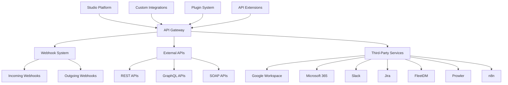

# Integrations

Comprehensive guide to integrating Studio Platform with external services, including third-party APIs, webhooks, and custom integrations.

## 🔌 Integration Overview

### **Integration Architecture**

Studio Platform provides multiple integration options to connect with external services, enabling seamless workflow automation and data exchange.



### **Integration Types**

| Integration Type | Description | Use Case | Complexity |
|-----------------|-------------|----------|-----------|
| **API Integration** | Direct API calls | Data synchronization | Low |
| **Webhook Integration** | Event-based notifications | Real-time updates | Medium |
| **OAuth Integration** | Secure authentication | Third-party access | Medium |
| **File Integration** | File exchange | Document management | Low |
| **Database Integration** | Direct database access | Data migration | High |
| **Custom Integration** | Custom development | Specific requirements | High |

## 🌐 Third-Party Integrations

### **Google Workspace Integration**

#### **Configuration**

**Google Workspace Setup:**
```yaml
# google-workspace.yml
integration:
  name: google-workspace
  type: oauth2
  version: 1.0.0
  
authentication:
  provider: google
  client_id: ${GOOGLE_CLIENT_ID}
  client_secret: ${GOOGLE_CLIENT_SECRET}
  scopes:
    - https://www.googleapis.com/auth/drive
    - https://www.googleapis.com/auth/calendar
    - https://www.googleapis.com/auth/gmail.readonly
    - https://www.googleapis.com/auth/spreadsheets
  
services:
  drive:
    enabled: true
    folder_id: ${GOOGLE_DRIVE_FOLDER_ID}
    auto_sync: true
    sync_interval: 3600
  
  calendar:
    enabled: true
    calendar_id: ${GOOGLE_CALENDAR_ID}
    auto_create_events: true
  
  gmail:
    enabled: true
    label: "Studio Compliance"
    auto_process: true
  
  sheets:
    enabled: true
    spreadsheet_id: ${GOOGLE_SHEET_ID}
    auto_export: true
```

#### **API Integration**

**Google Drive Integration:**
```javascript
// Google Drive API integration
const { google } = require('googleapis');
const drive = google.drive('v3');

class GoogleDriveIntegration {
  constructor(auth) {
    this.auth = auth;
    this.drive = drive;
  }

  async uploadEvidence(evidence) {
    try {
      const fileMetadata = {
        name: evidence.file_name,
        parents: [process.env.GOOGLE_DRIVE_FOLDER_ID]
      };

      const media = {
        mimeType: evidence.content_type,
        body: fs.createReadStream(evidence.file_path)
      };

      const response = await this.drive.files.create({
        resource: fileMetadata,
        media: media,
        fields: 'id, name, webViewLink, webContentLink'
      });

      return {
        success: true,
        data: {
          id: response.data.id,
          name: response.data.name,
          link: response.data.webViewLink,
          download_link: response.data.webContentLink
        }
      };
    } catch (error) {
      return {
        success: false,
        error: error.message
      };
    }
  }

  async searchFiles(query) {
    try {
      const response = await this.drive.files.list({
        q: query,
        fields: 'files(id, name, webViewLink, createdTime)'
      });

      return response.data.files;
    } catch (error) {
      throw new Error(`Google Drive search failed: ${error.message}`);
    }
  }
}
```

**Google Calendar Integration:**
```javascript
// Google Calendar API integration
const { google } = require('googleapis');
const calendar = google.calendar('v3');

class GoogleCalendarIntegration {
  constructor(auth) {
    this.auth = auth;
    this.calendar = calendar;
  }

  async createEvent(project, milestone) {
    try {
      const event = {
        summary: `${project.name} - ${milestone.name}`,
        description: milestone.description,
        start: {
          dateTime: milestone.due_date.toISOString(),
          timeZone: 'UTC'
        },
        end: {
          dateTime: milestone.due_date.add(1, 'hour').toISOString(),
          timezone: 'UTC'
        },
        attendees: project.team_members.map(member => ({
          email: member.email
        })),
        reminders: {
          useDefault: false,
          overrides: [
            { method: 'email', minutes: 24 * 60 },
            { method: 'popup', minutes: 10 }
          ]
        }
      };

      const response = await this.calendar.events.insert({
        calendarId: process.env.GOOGLE_CALENDAR_ID,
        resource: event
      });

      return {
        success: true,
        data: {
          id: response.data.id,
          link: response.data.htmlLink
        }
      };
    } catch (error) {
      return {
        success: false,
        error: error.message
      };
    }
  }
}
```

### **Microsoft 365 Integration**

#### **Configuration**

**Microsoft 365 Setup:**
```yaml
# microsoft-365.yml
integration:
  name: microsoft-365
  type: oauth2
  version: 1.0.0
  
authentication:
  provider: microsoft
  client_id: ${MICROSOFT_CLIENT_ID}
  client_secret: ${MICROSOFT_CLIENT_SECRET}
  tenant_id: ${MICROSOFT_TENANT_ID}
  scopes:
    - https://graph.microsoft.com/Files.ReadWrite
    - https://graph.microsoft.com/Calendars.ReadWrite
    - https://graph.microsoft.com/Mail.Read
    - https://graph.microsoft.com/Sites.ReadWrite.All
  
services:
  onedrive:
    enabled: true
    folder_path: /Studio/Compliance
    auto_sync: true
    sync_interval: 3600
  
  outlook:
    enabled: true
    folder: "Compliance"
    auto_process: true
  
  sharepoint:
    enabled: true
    site_id: ${SHAREPOINT_SITE_ID}
    document_library: "Compliance Documents"
```

#### **API Integration**

**OneDrive Integration:**
```javascript
// Microsoft OneDrive API integration
const { Client } = require('@microsoft/microsoft-graph-client');

class OneDriveIntegration {
  constructor(authProvider) {
    this.client = Client.initWithMiddleware({ authProvider });
  }

  async uploadEvidence(evidence) {
    try {
      const fileContent = fs.readFileSync(evidence.file_path);
      
      const response = await this.client
        .api(`/me/drive/root:/Studio/Compliance/${evidence.file_name}:/content`)
        .put(fileContent);

      return {
        success: true,
        data: {
          id: response.id,
          name: response.name,
          link: response.webUrl,
          download_link: response['@microsoft.graph.downloadUrl']
        }
      };
    } catch (error) {
      return {
        success: false,
        error: error.message
      };
    }
  }

  async searchFiles(query) {
    try {
      const response = await this.client
        .api(`/me/drive/search(q='${query}')`)
        .get();

      return response.value;
    } catch (error) {
      throw new Error(`OneDrive search failed: ${error.message}`);
    }
  }
}
```

### **Slack Integration**

#### **Configuration**

**Slack Setup:**
```yaml
# slack.yml
integration:
  name: slack
  type: webhook
  version: 1.0.0
  
authentication:
  bot_token: ${SLACK_BOT_TOKEN}
  signing_secret: ${SLACK_SIGNING_SECRET}
  
channels:
  compliance: "#compliance"
  alerts: "#compliance-alerts"
  reports: "#compliance-reports"
  
webhooks:
  incoming: ${SLACK_WEBHOOK_URL}
  outgoing: ${SLACK_OUTGOING_WEBHOOK_URL}
  
features:
  notifications: true
  commands: true
  interactive: true
```

#### **API Integration**

**Slack Bot Integration:**
```javascript
// Slack API integration
const { WebClient } = require('@slack/web-api');

class SlackIntegration {
  constructor(token) {
    this.client = new WebClient(token);
  }

  async sendNotification(channel, message, attachments = []) {
    try {
      const response = await this.client.chat.postMessage({
        channel: channel,
        text: message,
        attachments: attachments
      });

      return {
        success: true,
        data: {
          ts: response.ts,
          channel: response.channel
        }
      };
    } catch (error) {
      return {
        success: false,
        error: error.message
      };
    }
  }

  async sendComplianceAlert(project, alert) {
    const attachments = [
      {
        color: alert.severity === 'high' ? 'danger' : 'warning',
        title: `Compliance Alert: ${alert.type}`,
        text: alert.message,
        fields: [
          {
            title: 'Project',
            value: project.name,
            short: true
          },
          {
            title: 'Control',
            value: alert.control_number,
            short: true
          },
          {
            title: 'Severity',
            value: alert.severity,
            short: true
          }
        ],
        actions: [
          {
            type: 'button',
            text: 'View Details',
            url: `${process.env.STUDIO_URL}/projects/${project.id}`
          }
        ]
      }
    ];

    return await this.sendNotification('#compliance-alerts', '', attachments);
  }

  async sendProjectReport(project, report) {
    const attachments = [
      {
        color: 'good',
        title: `Compliance Report: ${project.name}`,
        text: `Overall Score: ${report.score}%`,
        fields: [
          {
            title: 'Framework',
            value: project.framework,
            short: true
          },
          {
            title: 'Status',
            value: project.status,
            short: true
          },
          {
            title: 'Controls Complete',
            value: `${report.controls_complete}/${report.controls_total}`,
            short: true
          },
          {
            title: 'Evidence Count',
            value: report.evidence_count,
            short: true
          }
        ],
        actions: [
          {
            type: 'button',
            text: 'View Report',
            url: report.link
          }
        ]
      }
    ];

    return await this.sendNotification('#compliance-reports', '', attachments);
  }
}
```

### **Jira Integration**

#### **Configuration**

**Jira Setup:**
```yaml
# jira.yml
integration:
  name: jira
  type: rest
  version: 1.0.0
  
authentication:
  type: basic
  username: ${JIRA_USERNAME}
  api_token: ${JIRA_API_TOKEN}
  base_url: ${JIRA_BASE_URL}
  
project:
  key: STUDIO
  name: Studio Compliance
  issue_types:
    - task
    - bug
    - improvement
  
mappings:
  evidence_review:
    issue_type: task
    priority: medium
    assignee: compliance_team
  
  compliance_gap:
    issue_type: task
    priority: high
    assignee: security_team
  
  risk_assessment:
    issue_type: task
    priority: high
    assignee: risk_team
```

#### **API Integration**

**Jira API Integration:**
```javascript
// Jira API integration
const axios = require('axios');

class JiraIntegration {
  constructor(config) {
    this.baseURL = config.base_url;
    this.auth = {
      username: config.username,
      api_token: config.api_token
    };
  }

  async createIssue(type, summary, description, assignee = null) {
    try {
      const issueData = {
        fields: {
          project: {
            key: 'STUDIO'
          },
          summary: summary,
          description: description,
          issuetype: {
            name: type
          }
        }
      };

      if (assignee) {
        issueData.fields.assignee = {
          name: assignee
        };
      }

      const response = await axios.post(
        `${this.baseURL}/rest/api/2/issue`,
        issueData,
        {
          auth: {
            username: this.auth.username,
            password: this.auth.api_token
          },
          headers: {
            'Content-Type': 'application/json'
          }
        }
      );

      return {
        success: true,
        data: {
          id: response.data.id,
          key: response.data.key,
          url: `${this.baseURL}/browse/${response.data.key}`
        }
      };
    } catch (error) {
      return {
        success: false,
        error: error.message
      };
    }
  }

  async createEvidenceReviewIssue(evidence) {
    const summary = `Evidence Review: ${evidence.title}`;
    const description = `
      Evidence ID: ${evidence.id}
      Project: ${evidence.project_name}
      Control: ${evidence.control_number}
      Uploaded by: ${evidence.uploader_name}
      
      Please review the evidence for compliance requirements.
      
      Evidence Link: ${evidence.link}
    `;

    return await this.createIssue('Task', summary, description, 'compliance_team');
  }

  async createComplianceGapIssue(gap) {
    const summary = `Compliance Gap: ${gap.control_number}`;
    const description = `
      Gap ID: ${gap.id}
      Project: ${gap.project_name}
      Control: ${gap.control_number}
      Severity: ${gap.severity}
      
      Description: ${gap.description}
      Recommendations: ${gap.recommendations}
      
      Due Date: ${gap.due_date}
    `;

    return await this.createIssue('Task', summary, description, 'security_team');
  }
}
```

## 🔗 Webhooks

### **Webhook Configuration**

#### **Incoming Webhooks**

**Webhook Setup:**
```yaml
# webhooks.yml
webhooks:
  incoming:
    slack:
      url: /webhooks/slack
      secret: ${SLACK_WEBHOOK_SECRET}
      events:
        - message
        - reaction_added
        - file_share
    
    jira:
      url: /webhooks/jira
      secret: ${JIRA_WEBHOOK_SECRET}
      events:
        - issue_created
        - issue_updated
        - comment_created
    
    github:
      url: /webhooks/github
      secret: ${GITHUB_WEBHOOK_SECRET}
      events:
        - push
        - pull_request
        - issue_comment
```

#### **Webhook Handler**

**Webhook Handler Implementation:**
```javascript
// Webhook handler
const crypto = require('crypto');
const express = require('express');

class WebhookHandler {
  constructor() {
    this.handlers = new Map();
    this.setupHandlers();
  }

  setupHandlers() {
    // Slack webhook handler
    this.handlers.set('slack', async (req, res) => {
      const signature = req.headers['x-slack-signature'];
      const timestamp = req.headers['x-slack-request-timestamp'];
      const body = JSON.stringify(req.body);
      
      const expectedSignature = 'v0=' + crypto
        .createHmac('sha256', process.env.SLACK_WEBHOOK_SECRET)
        .update(`v0:${timestamp}:${body}`)
        .digest('hex');

      if (signature !== expectedSignature) {
        return res.status(401).json({ error: 'Invalid signature' });
      }

      // Handle Slack event
      const { type, event } = req.body;
      
      switch (type) {
        case 'url_verification':
          return res.json({ challenge: req.body.challenge });
        
        case 'event_callback':
          await this.handleSlackEvent(event);
          return res.json({ status: 'ok' });
        
        default:
          return res.json({ status: 'ok' });
      }
    });

    // Jira webhook handler
    this.handlers.set('jira', async (req, res) => {
      const { webhookEvent } = req.body;
      
      switch (webhookEvent) {
        case 'jira:issue_created':
          await this.handleJiraIssueCreated(req.body.issue);
          break;
        
        case 'jira:issue_updated':
          await this.handleJiraIssueUpdated(req.body.issue);
          break;
        
        default:
          break;
      }
      
      return res.json({ status: 'ok' });
    });
  }

  async handleSlackEvent(event) {
    switch (event.type) {
      case 'message':
        await this.handleSlackMessage(event);
        break;
      
      case 'file_share':
        await this.handleSlackFileShare(event);
        break;
      
      default:
        break;
    }
  }

  async handleSlackMessage(event) {
    // Handle Slack message
    const { text, user, channel, ts } = event;
    
    // Process message and respond if needed
    if (text.includes('compliance score')) {
      // Get compliance score and send response
      const score = await this.getComplianceScore();
      await this.sendSlackResponse(channel, `Current compliance score: ${score}%`, ts);
    }
  }

  async handleJiraIssueCreated(issue) {
    // Handle Jira issue creation
    const { key, fields } = issue;
    
    // Create notification in Studio Platform
    await this.createNotification({
      type: 'jira_issue_created',
      title: `Jira Issue Created: ${key}`,
      description: fields.summary,
      link: `${process.env.JIRA_BASE_URL}/browse/${key}`
    });
  }
}

// Express webhook routes
const app = express();
const webhookHandler = new WebhookHandler();

app.use(express.json());

// Slack webhook
app.post('/webhooks/slack', webhookHandler.handlers.get('slack'));

// Jira webhook
app.post('/webhooks/jira', webhookHandler.handlers.get('jira'));
```

### **Outgoing Webhooks**

#### **Webhook Events**

**Event Configuration:**
```yaml
# webhook-events.yml
events:
  evidence_uploaded:
    name: Evidence Uploaded
    description: Triggered when evidence is uploaded
    payload:
      evidence_id: string
      project_id: string
      control_id: string
      uploader_id: string
      file_name: string
      uploaded_at: datetime
    
  compliance_score_updated:
    name: Compliance Score Updated
    description: Triggered when compliance score changes
    payload:
      project_id: string
      old_score: integer
      new_score: integer
      framework: string
      updated_at: datetime
    
  project_created:
    name: Project Created
    description: Triggered when a new project is created
    payload:
      project_id: string
      project_name: string
      framework: string
      created_by: string
      created_at: datetime
```

#### **Webhook Sender**

**Webhook Implementation:**
```javascript
// Webhook sender
const axios = require('axios');

class WebhookSender {
  constructor() {
    this.webhooks = new Map();
    this.loadWebhooks();
  }

  async loadWebhooks() {
    // Load webhooks from database
    const webhooks = await WebhookModel.findAll({ where: { active: true } });
    
    webhooks.forEach(webhook => {
      this.webhooks.set(webhook.id, webhook);
    });
  }

  async sendEvent(eventType, payload) {
    const relevantWebhooks = Array.from(this.webhooks.values())
      .filter(webhook => webhook.events.includes(eventType));

    for (const webhook of relevantWebhooks) {
      try {
        await this.sendWebhook(webhook, eventType, payload);
      } catch (error) {
        console.error(`Failed to send webhook ${webhook.id}:`, error);
      }
    }
  }

  async sendWebhook(webhook, eventType, payload) {
    const data = {
      event: eventType,
      timestamp: new Date().toISOString(),
      payload: payload
    };

    const signature = this.generateSignature(data, webhook.secret);
    
    const response = await axios.post(webhook.url, data, {
      headers: {
        'Content-Type': 'application/json',
        'X-Studio-Signature': signature,
        'X-Studio-Event': eventType
      },
      timeout: 10000
    });

    // Log webhook delivery
    await this.logWebhookDelivery(webhook.id, eventType, response.status);
  }

  generateSignature(data, secret) {
    return crypto
      .createHmac('sha256', secret)
      .update(JSON.stringify(data))
      .digest('hex');
  }

  async logWebhookDelivery(webhookId, eventType, status) {
    await WebhookDeliveryLog.create({
      webhook_id: webhookId,
      event_type: eventType,
      status: status,
      delivered_at: new Date()
    });
  }
}

// Usage in application
const webhookSender = new WebhookSender();

// Send webhook when evidence is uploaded
app.post('/api/v1/evidence', async (req, res) => {
  const evidence = await Evidence.create(req.body);
  
  // Send webhook
  await webhookSender.sendEvent('evidence_uploaded', {
    evidence_id: evidence.id,
    project_id: evidence.project_id,
    control_id: evidence.control_id,
    uploader_id: evidence.uploaded_by,
    file_name: evidence.file_name,
    uploaded_at: evidence.uploaded_at
  });
  
  res.json({ success: true, data: evidence });
});
```

## 🔧 Custom Integrations

### **Plugin System**

#### **Plugin Architecture**

**Plugin Interface:**
```javascript
// Plugin interface
class PluginInterface {
  constructor(config) {
    this.config = config;
    this.name = config.name;
    this.version = config.version;
  }

  async initialize() {
    // Initialize plugin
    throw new Error('initialize() must be implemented');
  }

  async execute(data) {
    // Execute plugin logic
    throw new Error('execute() must be implemented');
  }

  async cleanup() {
    // Cleanup resources
    throw new Error('cleanup() must be implemented');
  }
}

// Example custom plugin
class CustomEvidenceProcessor extends PluginInterface {
  constructor(config) {
    super(config);
    this.apiEndpoint = config.api_endpoint;
    this.apiKey = config.api_key;
  }

  async initialize() {
    // Initialize plugin
    console.log(`Initializing ${this.name} plugin`);
    
    // Validate configuration
    if (!this.apiEndpoint || !this.apiKey) {
      throw new Error('API endpoint and key are required');
    }
  }

  async execute(evidence) {
    // Process evidence with external API
    try {
      const response = await axios.post(
        this.apiEndpoint,
        {
          file: evidence.file_path,
          metadata: evidence.metadata
        },
        {
          headers: {
            'Authorization': `Bearer ${this.apiKey}`,
            'Content-Type': 'application/json'
          }
        }
      );

      return {
        success: true,
        data: response.data
      };
    } catch (error) {
      return {
        success: false,
        error: error.message
      };
    }
  }

  async cleanup() {
    // Cleanup resources
    console.log(`Cleaning up ${this.name} plugin`);
  }
}
```

#### **Plugin Manager**

**Plugin Manager Implementation:**
```javascript
// Plugin manager
class PluginManager {
  constructor() {
    this.plugins = new Map();
    this.pluginConfigs = new Map();
  }

  async loadPlugin(pluginName, config) {
    try {
      // Load plugin class
      const PluginClass = require(`./plugins/${pluginName}`);
      
      // Create plugin instance
      const plugin = new PluginClass(config);
      
      // Initialize plugin
      await plugin.initialize();
      
      // Store plugin
      this.plugins.set(pluginName, plugin);
      this.pluginConfigs.set(pluginName, config);
      
      console.log(`Plugin ${pluginName} loaded successfully`);
    } catch (error) {
      console.error(`Failed to load plugin ${pluginName}:`, error);
      throw error;
    }
  }

  async executePlugin(pluginName, data) {
    const plugin = this.plugins.get(pluginName);
    
    if (!plugin) {
      throw new Error(`Plugin ${pluginName} not found`);
    }

    return await plugin.execute(data);
  }

  async unloadPlugin(pluginName) {
    const plugin = this.plugins.get(pluginName);
    
    if (plugin) {
      await plugin.cleanup();
      this.plugins.delete(pluginName);
      this.pluginConfigs.delete(pluginName);
      
      console.log(`Plugin ${pluginName} unloaded successfully`);
    }
  }

  getLoadedPlugins() {
    return Array.from(this.plugins.keys());
  }

  getPluginConfig(pluginName) {
    return this.pluginConfigs.get(pluginName);
  }
}

// Usage
const pluginManager = new PluginManager();

// Load custom plugin
await pluginManager.loadPlugin('custom-processor', {
  name: 'Custom Evidence Processor',
  version: '1.0.0',
  api_endpoint: 'https://api.example.com/process',
  api_key: process.env.CUSTOM_API_KEY
});

// Execute plugin
const result = await pluginManager.executePlugin('custom-processor', evidence);
```

## ✅ Integration Best Practices

### **Development Best Practices**

#### **API Integration**
- **Authentication** - Use secure authentication methods
- **Error Handling** - Handle errors gracefully
- **Rate Limiting** - Respect rate limits
- **Retry Logic** - Implement retry logic with exponential backoff
- **Logging** - Log all integration activities

#### **Webhook Integration**
- **Security** - Use webhook signatures
- **Idempotency** - Make webhook handlers idempotent
- **Error Handling** - Handle webhook failures gracefully
- **Retry Logic** - Implement retry logic for failed webhooks
- **Monitoring** - Monitor webhook delivery

### **Common Integration Mistakes**

❌ **Avoid These Mistakes:**
- Not handling authentication properly
- Not implementing error handling
- Not respecting rate limits
- Not implementing retry logic
- Not monitoring integration health

✅ **Follow These Best Practices:**
- Use secure authentication methods
- Handle errors gracefully and appropriately
- Respect rate limits and implement backoff
- Implement retry logic with exponential backoff
- Monitor integration health and performance

---

!!! tip **Start Simple**
    Begin with simple integrations and gradually add complexity as needed. Use existing libraries and frameworks when possible.

!!! note **Security First**
    Always prioritize security in integrations. Use secure authentication methods and validate all incoming data.

!!! question **Need Help?**
    Check our [Integration Support](https://support.studio.com) for integration assistance, or join our developer community.
