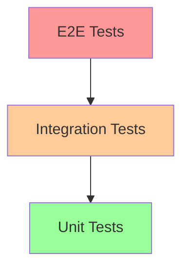

# Testing Guide

This guide covers the comprehensive testing framework for the Studio Platform, including existing tests, how to run them, and how to ensure you haven't broken anything when making changes.

## 🧪 Testing Overview

### **Testing Pyramid**


#### **Unit Tests (70%)**
- Fast execution
- Individual component testing
- Business logic validation
- Mock external dependencies

#### **Integration Tests (20%)**
- Component interaction testing
- Database integration
- API endpoint testing
- External service integration

#### **End-to-End Tests (10%)**
- User workflow testing
- Full system validation
- UI interaction testing
- Cross-browser testing

## 🏗️ Existing Test Infrastructure

The Studio Platform has a comprehensive test suite covering all major components:

### **Test Components**

#### **Frontend Tests (React/Next.js)**
- **Framework**: Playwright for E2E testing
- **Location**: `frontend/e2e/`
- **Coverage**: Authentication, dashboard, projects, reports, user management
- **Configuration**: `frontend/playwright.config.ts`

#### **Backend Tests (Node.js/TypeScript)**
- **Framework**: Jest for unit and integration tests
- **Location**: `backend/src/tests/`
- **Coverage**: API endpoints, services, database operations
- **Configuration**: `backend/jest.config.js`

#### **AI Service Tests (Python)**
- **Framework**: pytest
- **Location**: `ai-service/tests/`
- **Coverage**: AI model integration, prompt processing
- **Configuration**: `ai-service/pytest.ini`

#### **Vector Store Tests (Python)**
- **Framework**: pytest
- **Location**: `database/vector-store/tests/`
- **Coverage**: Vector operations, embedding services, database connectivity
- **Configuration**: `database/vector-store/pytest.ini`

#### **Document RAG Tests (Python)**
- **Framework**: pytest
- **Location**: `document-rag-service/tests/`
- **Coverage**: Document processing, RAG pipelines, access control

#### **Integration Tests**
- **Location**: Root level `test_*.py` files
- **Coverage**: Cross-service integration, API connectivity
- **Scripts**: `test_lib.py`, `test_chunking.py`, `test_shares_api.py`, `test_onedrive.py`

## 🚀 Running Existing Tests

### **Master Test Suite**

The Studio Platform includes a master test orchestrator that runs tests across all microservices:

#### **Run All Tests**
```bash
# Using the master test script
./scripts/test-all.sh

# On Windows
./scripts/test-all.ps1
```

This script runs:
1. **AI Service Unit Tests** - Validates AI processing functionality
2. **Backend Integration Tests** - Tests API connectivity and database operations
3. **Fleet Service Health Check** - Verifies fleet management service health

### **Individual Service Tests**

#### **Frontend E2E Tests**
```bash
cd frontend

# Install dependencies
npm install

# Run all E2E tests
npm run test:e2e
# or
npx playwright test

# Run specific test file
npx playwright test auth.spec.ts

# Run tests in specific browser
npx playwright test --project=chromium
npx playwright test --project=firefox
npx playwright test --project=webkit

# Run tests with UI
npx playwright test --ui

# Run tests in headed mode
npx playwright test --headed
```

#### **Backend Tests**
```bash
cd backend

# Install dependencies
npm install

# Run all tests
npm test

# Run integration tests only
npm run test:integration

# Run tests with coverage
npm test -- --coverage

# Run specific test file
npm test -- auth.test.ts

# Run tests in watch mode
npm test -- --watch
```

#### **AI Service Tests**
```bash
cd ai-service

# Install dependencies
pip install -r requirements.txt

# Run all tests
python -m pytest

# Run tests with coverage
python -m pytest --cov=app --cov-report=html

# Run specific test file
python -m pytest tests/test_main.py

# Run tests with verbose output
python -m pytest -v
```

#### **Vector Store Tests**
```bash
cd database/vector-store

# Install dependencies
pip install -r requirements.txt

# Run all tests
python -m pytest

# Run specific test file
python -m pytest tests/test_vector_service.py

# Run tests with coverage
python -m pytest --cov=app --cov-report=html
```

#### **Document RAG Service Tests**
```bash
cd document-rag-service

# Install dependencies
pip install -r requirements.txt

# Run all tests
python -m pytest

# Run specific test file
python -m pytest tests/test_main.py
python -m pytest tests/test_access_control.py
```

### **Integration and Connectivity Tests**

#### **API Connectivity Tests**
```bash
# Test library functionality
python test_lib.py

# Test document chunking
python test_chunking.py

# Test SharePoint API
python test_shares_api.py

# Test OneDrive integration
python test_onedrive.py
```

## 🔍 Pre-commit Testing Workflow

### **Before Making Changes**

Always run the full test suite before committing changes:

```bash
# 1. Run the master test suite
./scripts/test-all.sh

# 2. If any tests fail, investigate the specific component
cd frontend && npx playwright test --reporter=list
cd backend && npm test
cd ai-service && python -m pytest
```

### **After Making Changes**

Follow this workflow to ensure you haven't broken anything:

#### **Step 1: Quick Health Check**
```bash
# Run the master test suite for quick feedback
./scripts/test-all.sh
```

#### **Step 2: Component-Specific Testing**
If you modified a specific component, run its tests in detail:

```bash
# Frontend changes
cd frontend && npx playwright test --reporter=list

# Backend changes
cd backend && npm test -- --verbose

# AI Service changes
cd ai-service && python -m pytest -v
```

#### **Step 3: Integration Testing**
If you changed APIs or integration points:

```bash
# Test API connectivity
python test_shares_api.py
python test_onedrive.py

# Run backend integration tests
cd backend && npm run test:integration
```

#### **Step 4: Cross-Browser Testing (Frontend Changes)**
```bash
cd frontend

# Run in all browsers
npx playwright test --project=all

# Run in headed mode to visually verify
npx playwright test --headed --project=chromium
```

## 📊 Test Coverage and Quality

### **Coverage Reports**

#### **Backend Coverage**
```bash
cd backend
npm test -- --coverage

# View detailed coverage report
open coverage/lcov-report/index.html
```

#### **Python Service Coverage**
```bash
cd ai-service  # or vector-store, document-rag-service
python -m pytest --cov=app --cov-report=html

# View coverage report
open htmlcov/index.html
```

### **Quality Gates**

The following quality gates should be met before merging:

- ✅ **All tests pass** - No failing tests in any component
- ✅ **Coverage > 80%** - Maintain at least 80% test coverage
- ✅ **No new lint errors** - Code passes all linting rules
- ✅ **Integration tests pass** - Cross-service functionality works

## 🛠️ Test Configuration

### **Backend Jest Configuration**
```javascript
// backend/jest.config.js
module.exports = {
    preset: 'ts-jest',
    testEnvironment: 'node',
    testMatch: ['**/__tests__/**/*.test.ts', '**/tests/integration/**/*.test.ts'],
    moduleNameMapper: {
        '^@/(.*)$': '<rootDir>/src/$1',
    },
    coverageDirectory: 'coverage',
    collectCoverageFrom: [
        'src/**/*.{ts,tsx}',
        '!**/node_modules/**',
        '!**/vendor/**',
    ],
};
```

### **Frontend Playwright Configuration**
```typescript
// frontend/playwright.config.ts
export default defineConfig({
    testDir: './e2e',
    fullyParallel: true,
    forbidOnly: !!process.env.CI,
    retries: process.env.CI ? 2 : 0,
    workers: process.env.CI ? 1 : undefined,
    reporter: 'html',
    use: {
        baseURL: 'http://localhost:3000',
        trace: 'on-first-retry',
    },
    projects: [
        { name: 'chromium', use: { ...devices['Desktop Chrome'] } },
        { name: 'firefox', use: { ...devices['Desktop Firefox'] } },
        { name: 'webkit', use: { ...devices['Desktop Safari'] } },
    ],
    webServer: {
        command: 'npm run dev',
        url: 'http://localhost:3000',
        reuseExistingServer: !process.env.CI,
    },
});
```

## 🐛 Troubleshooting Common Test Issues

### **Test Failures**

#### **Frontend E2E Tests Fail**
```bash
# Check if frontend is running
curl http://localhost:3000

# Start frontend if needed
cd frontend && npm run dev

# Check Playwright browsers
npx playwright install

# Run tests with debugging
npx playwright test --debug
```

#### **Backend Tests Fail**
```bash
# Check database connection
docker-compose ps

# Reset database if needed
docker-compose exec backend npx prisma migrate reset

# Check environment variables
docker-compose exec backend env | grep NODE_ENV
```

#### **AI Service Tests Fail**
```bash
# Check Python dependencies
pip install -r requirements.txt

# Check AI model availability
docker-compose logs ai-service

# Run tests with verbose output
python -m pytest -v -s
```

### **Performance Issues**

#### **Slow Tests**
```bash
# Run tests in parallel
npx playwright test --workers=4

# Run specific tests only
npx playwright test --grep "Authentication"

# Use test caching
npm test -- --cache
```

#### **Memory Issues**
```bash
# Increase Node.js memory limit
NODE_OPTIONS="--max-old-space-size=4096" npm test

# Run tests individually
npm test -- --testNamePattern="specific test"
```

## 📋 Test Checklist

### **Before Committing**
- [ ] Run `./scripts/test-all.sh` - All components pass
- [ ] Run component-specific tests for changed code
- [ ] Check test coverage is > 80%
- [ ] Verify integration tests pass
- [ ] Run linting checks

### **Before Merging**
- [ ] All tests pass in CI environment
- [ ] Cross-browser E2E tests pass
- [ ] Performance tests meet criteria
- [ ] Security tests pass
- [ ] Documentation is updated

### **Release Testing**
- [ ] Full test suite passes on all environments
- [ ] Load testing meets performance requirements
- [ ] Security scanning passes
- [ ] User acceptance tests pass
- [ ] Documentation tests pass

## 🔧 Continuous Integration

### **CI/CD Pipeline**
The test suite runs automatically in CI/CD pipelines:

1. **Pull Request** - Runs all tests, coverage, and linting
2. **Merge to Main** - Runs full test suite including performance tests
3. **Release** - Runs comprehensive tests including security scanning

### **Test Reports**
- **HTML Reports** - Generated in `test-results/` directories
- **Coverage Reports** - Available in `coverage/` directories
- **JUnit XML** - For CI/CD integration
- **Allure Reports** - Comprehensive test visualization

---

This testing guide ensures that all developers can effectively run and maintain the test suite, preventing regressions and maintaining code quality across the Studio Platform.
