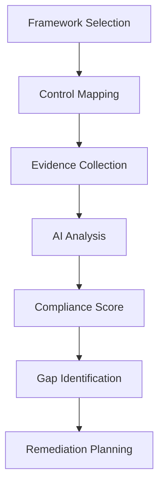
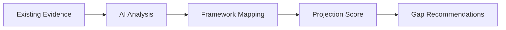
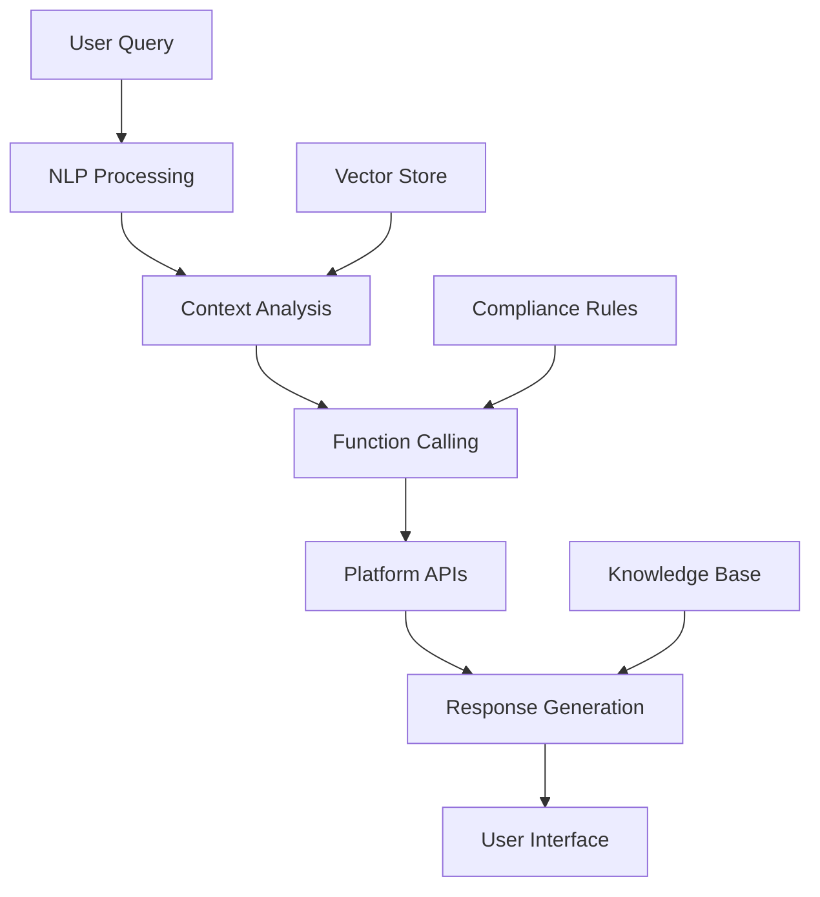
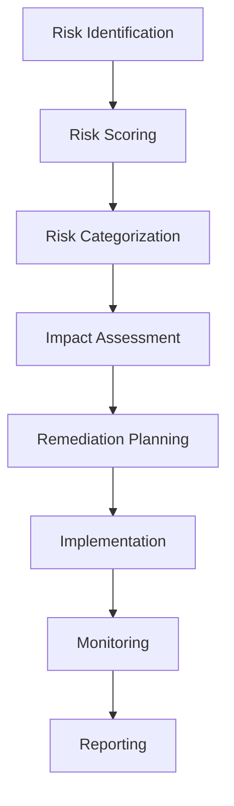
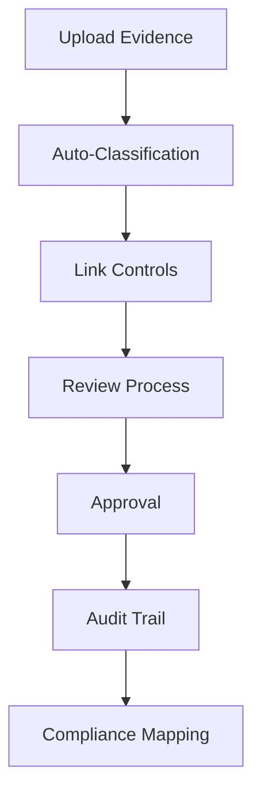
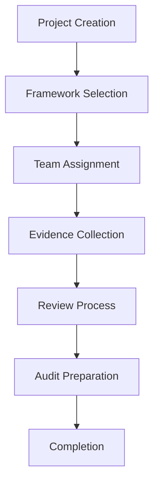

# Platform Features

Studio Platform combines advanced AI capabilities with enterprise-grade security to deliver a comprehensive compliance and audit management solution.

## 🌟 Core Features Overview

### 🛡️ Compliance Management
Real-time compliance tracking across multiple frameworks with intelligent gap analysis and cross-framework evidence mapping.

### 🤖 AI-Powered Assistant
Context-aware intelligent assistance using Google Gemini AI for policy generation, semantic search, and compliance guidance.

### 🔍 Risk Management
Unified risk dashboard aggregating findings from FleetDM agents and Prowler cloud scans with automated scoring and prioritization.

### 📁 Evidence Management
Secure document handling with role-based access control, visual annotations, and intelligent tagging.

### 👥 Collaboration Tools
Secure chat system, project workflows, and integration hub for seamless team collaboration.

---

## 🛡️ Compliance Management

### **Real-Time Compliance Scoring**

Track compliance progress with live scoring and gap analysis:

#### **Key Capabilities:**
- **Multi-Framework Support** - SOC 2, ISO 27001, GDPR, HIPAA, PCI DSS
- **Live Progress Tracking** - Real-time compliance scores (0-100%)
- **Control-Level Granularity** - Track individual control completion status
- **Gap Analysis** - Automatic identification of missing controls
- **Cross-Framework Mapping** - Leverage evidence across multiple frameworks

#### **Compliance Frameworks Supported:**
| Framework | Industry | Coverage | Status |
|-----------|----------|----------|---------|
| **SOC 2** | Technology | Type I & II | ✅ Full Support |
| **ISO 27001** | Global | All Annex A controls | ✅ Full Support |
| **GDPR** | Data Privacy | All articles | ✅ Full Support |
| **HIPAA** | Healthcare | All requirements | ✅ Full Support |
| **PCI DSS** | Payments | v4.0 requirements | ✅ Full Support |
| **NIST CSF** | Cybersecurity | All functions | ✅ Full Support |

### **Compliance Projection Engine**

Advanced AI-powered projection system that maps existing evidence to new frameworks:

#### **Projection Features:**
- **What-If Analysis** - Test compliance against new frameworks
- **Evidence Reuse** - Maximize evidence utilization
- **Risk-Based Prioritization** - Focus on high-impact gaps
- **Automated Recommendations** - AI-suggested remediation steps

---

## 🤖 AI-Powered Assistant

### **Intelligent Compliance Helper**

Studio's AI Assistant leverages Google's Gemini 2.5 Flash model to provide context-aware assistance:

#### **Core AI Capabilities:**
- **Natural Language Processing** - Understand complex compliance queries
- **Context Awareness** - Knows user role and current context
- **Function Calling** - Execute platform tools autonomously
- **Learning Engine** - Improves with user interactions

### **AI Assistant Features**

#### **🗣️ Conversational Interface**
- **Role-Based Guidance** - Tailored advice for different user roles
- **Context-Aware Responses** - Understands project and compliance context
- **Multi-Language Support** - Communicate in preferred language
- **Voice Input** - Hands-free compliance assistance

#### **📝 Policy Generation**
- **Template Library** - 50+ professional security policy templates
- **Contextual Customization** - Auto-fill with company-specific data
- **Policy Refinement** - Improve existing policies with AI suggestions
- **Compliance Alignment** - Ensure policies meet framework requirements

#### **🔍 Semantic Search**
- **Document Understanding** - Search across all uploaded documents
- **Meaning-Based Results** - Find relevant content, not just keywords
- **Cross-Reference Search** - Link related information across documents
- **Q&A Interface** - Natural language queries get precise answers

#### **📊 Compliance Analysis**
- **Gap Detection** - AI identifies missing controls and evidence
- **Risk Assessment** - Intelligent risk scoring and prioritization
- **Trend Analysis** - Identify compliance patterns and trends
- **Predictive Insights** - Forecast compliance challenges

### **AI Integration Architecture**

---

## 🔍 Risk Management

### **Unified Risk Dashboard**

Aggregate and analyze security findings from multiple sources:

#### **Data Sources:**
- **FleetDM Agents** - Endpoint security monitoring
- **Prowler Scans** - Cloud security posture
- **Manual Assessments** - Human-identified risks
- **Third-Party Tools** - Integrated security tools

### **Risk Scoring Engine**

Intelligent risk assessment with weighted scoring:

#### **Scoring Methodology:**
| Severity | Points | Risk Level | Response Time |
|----------|--------|------------|---------------|
| **Critical** | 100 | High | Immediate |
| **High** | 50 | High | 24 hours |
| **Medium** | 25 | Medium | 72 hours |
| **Low** | 10 | Low | 1 week |
| **Info** | 5 | Low | 2 weeks |

#### **Risk Categories:**
- **Technical Risks** - Vulnerabilities, misconfigurations
- **Operational Risks** - Process gaps, training needs
- **Compliance Risks** - Framework violations
- **Strategic Risks** - Policy misalignments

### **Risk Management Workflow**

---

## 📁 Evidence Management

### **Secure Document Handling**

Enterprise-grade evidence management with comprehensive security controls:

#### **Security Features:**
- **Role-Based Access Control** - Granular permissions by user role
- **Encryption at Rest** - AES-256 encryption for all stored files
- **Secure Transfer** - TLS 1.3 for all data in transit
- **Audit Logging** - Complete access and modification tracking

### **Evidence Workflow**

#### **Key Features:**
- **Multi-Format Support** - PDF, images, documents, spreadsheets
- **Intelligent Tagging** - Automatic tagging based on content and context
- **Version Control** - Track changes and maintain history
- **Expiration Management** - Automated evidence lifecycle management

### **Visual Annotation System**

Advanced annotation capabilities for collaborative review:

#### **Annotation Tools:**
- **Drawing Tools** - Highlight, underline, shapes
- **Text Comments** - Detailed feedback and explanations
- **Issue Tracking** - Flag problems requiring attention
- **Resolution Workflow** - Track annotation resolution

#### **Collaboration Features:**
- **Real-Time Updates** - Live collaboration on evidence
- **Notification System** - Alert stakeholders to new annotations
- **Discussion Threads** - Contextual conversations around evidence
- **Approval Workflows** - Multi-level approval processes

---

## 👥 Collaboration Tools

### **Secure Chat System**

Role-based messaging system with scoped contacts:

#### **Contact Scoping Rules:**
| User Role | Can Chat With | Purpose |
|-----------|---------------|---------|
| **Customers** | Assigned Manager & Auditors | Project communication |
| **Auditors** | Assigned Customers & Manager | Audit coordination |
| **Managers** | Team & Admin | Team management |
| **Admins** | Everyone | System administration |

#### **Chat Features:**
- **End-to-End Encryption** - Secure message transmission
- **Message History** - Complete conversation archive
- **File Sharing** - Share documents within conversations
- **Search Functionality** - Find relevant conversations quickly

### **Project Management**

Comprehensive project workflow management:

#### **Project Lifecycle:**

#### **Management Features:**
- **Guided Onboarding** - Step-by-step project setup
- **Template Library** - Pre-configured project templates
- **Progress Tracking** - Real-time project status
- **Milestone Management** - Key dates and deliverables

### **Integration Hub**

Connect with your existing tools and workflows:

#### **Supported Integrations:**
- **Google Calendar** - Sync audit meetings and deadlines
- **Jira** - Push findings and compliance gaps as issues
- **Slack** - Send notifications and alerts to channels
- **Microsoft 365** - Calendar sync and Teams notifications (planned)

#### **Integration Features:**
- **Webhook Support** - Real-time event notifications
- **API Access** - Custom integration development
- **Data Synchronization** - Bi-directional data sync
- **Workflow Automation** - Trigger actions based on events

---

## 🏗️ Advanced Features

### **Workflow Automation**

Event-driven automation with n8n integration:

#### **Automated Workflows:**
- **Project Approval** - Generate certificates and notify stakeholders
- **Hours Logging** - Sync time tracking to billing systems
- **Meeting Creation** - Schedule and coordinate audit meetings
- **Evidence Review** - Automated review and approval processes

### **Analytics & Reporting**

Comprehensive reporting and analytics capabilities:

#### **Dashboard Features:**
- **Real-Time Metrics** - Live compliance and risk scores
- **Trend Analysis** - Historical performance tracking
- **Custom Reports** - Drag-and-drop report builder
- **Executive Summaries** - AI-generated insights and recommendations

#### **Export Capabilities:**
- **PDF Reports** - Professional audit-ready documentation
- **Excel Exports** - Data analysis and spreadsheet integration
- **API Access** - Programmatic data access
- **Scheduled Reports** - Automated report generation and delivery

### **Enterprise Security**

Security-first architecture with comprehensive protections:

#### **Security Features:**
- **Zero-Trust Architecture** - Verify everything, trust nothing
- **Multi-Factor Authentication** - Additional security layer
- **Session Management** - Secure session handling and timeout
- **Audit Logging** - Complete security event tracking

#### **Compliance Standards:**
- **SOC 2 Type II** - Security and availability controls
- **ISO 27001** - Information security management
- **GDPR Compliance** - Data protection and privacy
- **FedRAMP Ready** - Government security requirements

---

## 📊 Platform Capabilities Summary

| Feature Category | Key Capabilities | Business Value |
|-----------------|------------------|----------------|
| **Compliance** | Multi-framework tracking, AI projections | Reduce compliance costs by 60% |
| **AI Assistant** | Policy generation, semantic search | 70% faster evidence collection |
| **Risk Management** | Unified dashboard, automated scoring | Proactive risk identification |
| **Evidence Management** | Secure storage, visual annotations | Streamlined audit preparation |
| **Collaboration** | Secure chat, project workflows | Improved team coordination |
| **Integrations** | Third-party tools, API access | Seamless workflow integration |

---

## 🎯 Benefits & ROI

### **Time Savings**
- **70% faster** evidence collection with AI assistance
- **50% reduction** in audit preparation time
- **40% fewer** manual compliance tasks

### **Cost Reduction**
- **60% lower** compliance management costs
- **45% reduction** in external audit fees
- **30% fewer** tools and subscriptions needed

### **Risk Mitigation**
- **Real-time** compliance monitoring
- **Automated** gap detection and remediation
- **Proactive** risk identification and management

---

!!! tip "Want to learn more?"
    Check out our [User Guide](user-guide/index.md) for detailed feature walkthroughs, or explore our [Developer Guide](developer-guide/index.md) for integration possibilities.

!!! question "Need a demo?"
    Contact our team for a personalized demo showcasing how these features can transform your compliance management process.
