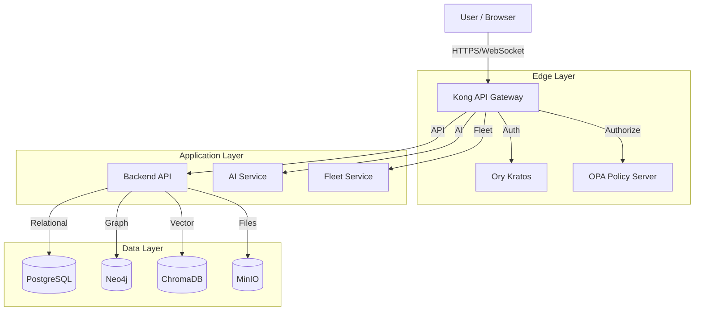

<div class="theme-logo-container">
  
  
</div>

<br clear="left">

# Studio Platform Documentation

Welcome to the **Studio Platform** - an enterprise-grade Compliance, Audit, and Security Management platform that unifies evidence collection, policy management, infrastructure monitoring, and reporting into a single collaborative interface.

## 🚀 Quick Start

<div class="grid cards" markdown>

-   :material-rocket:{ .lg .middle } __Quick Start__

    ---

    Get Studio running in minutes with Docker

    [:octicons-arrow-right-24: Quick Start Guide](quick-start.md)

-   :material-book-open:{ .lg .middle } __User Guide__

    ---

    Learn how to use Studio's features effectively

    [:octicons-arrow-right-24: User Guide](user-guide/index.md)

-   :material-cog:{ .lg .middle } __Admin Guide__

    ---

    Configure and manage your Studio deployment

    [:octicons-arrow-right-24: Admin Guide](admin-guide/index.md)

-   :material-code-braces:{ .lg .middle } __Developer Guide__

    ---

    API documentation and development resources

    [:octicons-arrow-right-24: Developer Guide](developer-guide/index.md)

</div>

## 🌟 Key Features

### 🛡️ Compliance Management
- **Real-time Compliance Scoring** - Track progress against SOC2, ISO 27001, GDPR, and more
- **Cross-Framework Mapping** - Leverage evidence across multiple compliance frameworks
- **Gap Analysis** - Identify and prioritize missing controls automatically

### 🤖 AI-Powered Assistant
- **Context-Aware Chat** - Get intelligent assistance based on your role and context
- **Policy Generation** - Create customized security policies from professional templates
- **Smart Search** - Find relevant information across all your documents and evidence

### 🔍 Risk Management
- **Unified Risk Dashboard** - Aggregate findings from FleetDM agents and Prowler cloud scans
- **Automated Scoring** - Weighted risk scoring with severity-based categorization
- **Real-time Monitoring** - Continuous security posture assessment

### 📁 Evidence Management
- **Secure Storage** - Role-based access control for all evidence files
- **Visual Annotations** - Draw and comment directly on PDFs and images
- **Smart Tagging** - Automatic tagging and graph-based relationship mapping

### 👥 Collaboration Tools
- **Secure Chat** - Role-based messaging between auditors, managers, and customers
- **Project Management** - Guided onboarding and project workflows
- **Integration Hub** - Connect with Jira, Slack, Google Calendar, and more

## 🏗️ Architecture Overview



## 📦 Deployment Options

### Docker Compose (Recommended)
```bash
# Clone the repository
git clone https://github.com/OmerRastgar/studio.git
cd studio

# Configure environment
cp .env.example .env
# Edit .env with your configuration

# Start the platform
docker-compose up -d --build
```

### Production Deployment
- **Kubernetes** - Scalable container orchestration
- **Docker Swarm** - Simple multi-host deployment
- **Cloud Platforms** - AWS, Azure, GCP deployment guides

## 🔧 Technology Stack

| Component | Technology | Purpose |
|-----------|------------|---------|
| **Frontend** | Next.js 14 + TypeScript | Modern web interface |
| **Backend** | Node.js + Express | API and business logic |
| **Database** | PostgreSQL + pgvector | Primary data store |
| **Graph DB** | Neo4j | Relationship mapping |
| **Vector Store** | ChromaDB | AI knowledge base |
| **Auth** | Ory Kratos | Identity management |
| **Gateway** | Kong API Gateway | API routing & security |
| **AI** | Google Gemini | Intelligent assistance |
| **Monitoring** | Grafana + Prometheus | Observability |

## 📚 Documentation Structure

- **[Installation](installation/)** - Setup and deployment guides
- **[User Guide](user-guide/)** - End-user documentation
- **[Admin Guide](admin-guide/)** - System administration
- **[Developer Guide](developer-guide/)** - API and development
- **[Architecture](architecture/)** - Technical architecture
- **[Integrations](integrations/)** - Third-party integrations
- **[Troubleshooting](troubleshooting/)** - Common issues and solutions

## 🆘 Getting Help

- **Documentation** - You're here! Browse the guides for detailed information
- **GitHub Issues** - [Report bugs and request features](https://github.com/OmerRastgar/studio/issues)
- **Community** - Join our community discussions
- **Support** - Contact our support team for enterprise assistance

## 📈 What's Next?

1. **[Quick Start Guide](quick-start.md)** - Get Studio running in minutes
2. **[User Guide](user-guide/)** - Learn the platform features
3. **[Admin Guide](admin-guide/)** - Configure your deployment
4. **[Developer Guide](developer-guide/)** - Explore APIs and integrations

---

!!! tip "Need Help?"
    Check out our [Quick Start Guide](quick-start.md) or [Troubleshooting](troubleshooting/) section if you run into any issues.

!!! note "Enterprise Features"
    Looking for advanced features, custom integrations, or dedicated support? [Contact us](mailto:enterprise@cybergaar.com) for enterprise options.
