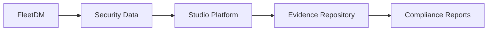

# FleetDM Integration

FleetDM provides osquery-based endpoint security and management capabilities. This integration allows the Studio Platform to collect security data, manage endpoints, and monitor compliance across your infrastructure.

## 🎯 Integration Benefits

### Security Monitoring
- Real-time endpoint visibility
- Vulnerability assessment
- Configuration compliance checking
- Security policy enforcement

### Compliance Support
- Automated evidence collection
- Compliance reporting
- Audit trail generation
- Policy validation

### Operational Efficiency
- Centralized endpoint management
- Automated security scanning
- Alert-driven workflows
- Reduced manual overhead

## 🔧 Prerequisites

### FleetDM Requirements
- FleetDM server (version 4.0+)
- Admin access to FleetDM
- FleetDM API credentials
- osquery agents deployed on endpoints

### Network Requirements
- FleetDM API accessible from Studio Platform
- HTTPS connectivity (port 443)
- Firewall rules for API communication

### Permissions Required
- FleetDM API read access
- Host management permissions
- Query execution permissions
- Result access permissions

## 📋 Setup Instructions

### Step 1: Generate FleetDM API Token

1. **Login to FleetDM Admin Console**
   ```
   https://your-fleetdm.example.com
   ```

2. **Navigate to Settings > Organization**
   - Click "Add new API token"
   - Enter descriptive name (e.g., "Studio Platform Integration")
   - Select appropriate permissions
   - Copy generated token

3. **Configure Token Permissions**
   ```
   Required scopes:
   - hosts:read
   - queries:read
   - queries:write
   - results:read
   ```

### Step 2: Configure Studio Platform Integration

1. **Access Integration Settings**
   - Navigate to Admin > Integrations
   - Select FleetDM from available integrations

2. **Enter Connection Details**
   ```yaml
   fleetdm_config:
     api_url: "https://your-fleetdm.example.com"
     api_token: "your-api-token-here"
     verify_ssl: true
     timeout: 30
   ```

3. **Test Connection**
   - Click "Test Connection" button
   - Verify successful API response
   - Check token permissions

### Step 3: Configure Data Collection

1. **Select Data Types**
   - [ ] Host inventory data
   - [ ] Vulnerability scan results
   - [ ] Compliance query results
   - [ ] Software inventory
   - [ ] System configuration

2. **Set Collection Frequency**
   ```yaml
   collection_schedule:
     host_inventory: "0 2 * * *"  # Daily at 2 AM
     vulnerability_scan: "0 3 * * 1"  # Weekly on Monday
     compliance_checks: "0 1 * * *"  # Daily at 1 AM
   ```

3. **Configure Filters**
   - Host groups to include
   - Operating systems to monitor
   - Compliance frameworks to check

## 🔍 Integration Features

### Automated Evidence Collection


### Supported Data Types

#### Host Inventory
- System information
- Hardware details
- Network configuration
- Installed software

#### Security Data
- Vulnerability scan results
- Patch status
- Security configuration
- User accounts

#### Compliance Results
- CIS benchmarks
- Custom compliance queries
- Policy validation results
- Exception tracking

### Query Templates

#### Vulnerability Assessment
```sql
-- Find vulnerable software packages
SELECT 
  name,
  version,
  source,
  arch,
  CASE 
    WHEN version LIKE '%CVE%' THEN 'Potential Vulnerability'
    ELSE 'Unknown'
  END as status
FROM software 
WHERE name LIKE '%openssl%' 
   OR name LIKE '%apache%' 
   OR name LIKE '%nginx%';
```

#### Compliance Check
```sql
-- Check password policy compliance
SELECT 
  user,
  uid,
  gid,
  description,
  directory,
  shell
FROM users 
WHERE uid > 1000 
AND shell NOT LIKE '%nologin%';
```

## 📊 Dashboard Integration

### FleetDM Widgets
- **Endpoint Status** - Online/offline hosts
- **Vulnerability Summary** - Critical/high/medium/low counts
- **Compliance Score** - Overall compliance percentage
- **Recent Activity** - Latest security events

### Automated Reports
- **Daily Security Summary** - New vulnerabilities, compliance status
- **Weekly Compliance Report** - Policy adherence trends
- **Monthly Risk Assessment** - Risk posture analysis

## 🔔 Alerting & Notifications

### Alert Types
- **Critical Vulnerabilities** - CVEs with CVSS > 7.0
- **Compliance Failures** - Policy violations
- **Endpoint Issues** - Offline hosts, agent problems
- **Security Events** - Suspicious activities

### Notification Channels
- In-app notifications
- Email alerts
- Slack integration
- Custom webhooks

### Alert Configuration
```yaml
alerts:
  critical_vulnerability:
    enabled: true
    threshold: "CVSS > 7.0"
    channels: ["email", "slack"]
    cooldown: "1h"
  
  compliance_failure:
    enabled: true
    threshold: "any"
    channels: ["email"]
    cooldown: "4h"
```

## 🛠️ Advanced Configuration

### Custom Queries
1. **Create Query in FleetDM**
   - Navigate to Queries > New Query
   - Write SQL query
   - Test and validate results

2. **Import to Studio Platform**
   - Use query ID in integration settings
   - Configure schedule and alerts

### Data Retention
```yaml
retention_policy:
  host_inventory: "90 days"
  vulnerability_data: "365 days"
  compliance_results: "2 years"
  audit_logs: "7 years"
```

### Performance Optimization
- Use efficient queries
- Implement result caching
- Schedule heavy queries off-peak
- Monitor API usage limits

## 🔒 Security Best Practices

### API Security
- Use encrypted API tokens
- Rotate tokens regularly
- Implement IP restrictions
- Monitor API usage

### Data Protection
- Encrypt sensitive data at rest
- Use secure transmission (HTTPS)
- Implement access controls
- Regular security audits

### Compliance Considerations
- Follow data retention policies
- Maintain audit trails
- Document data flows
- Regular compliance reviews

## 🐛 Troubleshooting

### Common Issues

#### Connection Failures
```bash
# Test FleetDM API connectivity
curl -H "Authorization: Bearer YOUR_TOKEN" \
     https://your-fleetdm.example.com/api/v1/fleet/hosts
```

#### Permission Errors
- Verify API token scopes
- Check user permissions in FleetDM
- Ensure proper role assignments

#### Data Sync Issues
- Check collection schedules
- Verify query syntax
- Review error logs
- Validate network connectivity

### Debug Mode
```yaml
debug_config:
  enabled: true
  log_level: "debug"
  api_timeout: 60
  retry_attempts: 3
```

## 📈 Monitoring & Metrics

### Key Performance Indicators
- **API Response Time** - < 500ms target
- **Data Sync Success Rate** - > 99%
- **Alert Accuracy** - Low false positive rate
- **System Availability** - 99.9% uptime

### Health Checks
```bash
# Check integration health
curl -X GET https://studio.example.com/api/integrations/fleetdm/health
```

## 🔄 Maintenance

### Regular Tasks
- **Weekly**: Review alert configurations
- **Monthly**: Update query templates
- **Quarterly**: Security audit
- **Annually**: Integration review

### Updates & Upgrades
- Test FleetDM updates in staging
- Review breaking changes
- Update integration configuration
- Validate functionality

## 📞 Support

### Resources
- [FleetDM Documentation](https://fleetdm.com/docs)
- [osquery Documentation](https://osquery.io/docs/)
- [Studio Platform API Reference](../developer-guide/api-reference.md)

### Getting Help
1. Check troubleshooting section
2. Review FleetDM logs
3. Contact support team
4. Submit GitHub issue

---

!!! tip "Best Practice"
    Start with a pilot deployment on a subset of endpoints to validate the integration before full rollout.

!!! warning "Rate Limits"
    Be aware of FleetDM API rate limits. Implement appropriate throttling and caching strategies.

!!! note "Data Privacy"
    Ensure compliance with data protection regulations when collecting and storing endpoint data.
