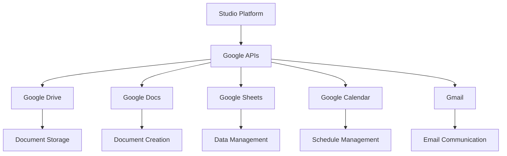

# Google Services Integration

Google Workspace and Google Cloud Platform integration enables the Studio Platform to leverage Google's productivity and cloud services for enhanced collaboration, data management, and workflow automation.

## 🎯 Integration Benefits

### Productivity Enhancement
- Seamless document collaboration
- Shared workspace management
- Team communication tools
- Cloud storage integration

### Data Management
- Centralized document storage
- Automated backup processes
- Data synchronization
- Version control

### Workflow Automation
- Google Apps Script integration
- Automated document processing
- Calendar-based workflows
- Email automation

## 🔧 Prerequisites

### Google Requirements
- Google Workspace account (Business/Enterprise)
- Google Cloud Platform project
- Service account credentials
- Admin access to Google Admin Console

### API Enablement
Required Google APIs:
- Google Drive API
- Google Docs API
- Google Sheets API
- Google Calendar API
- Gmail API
- Google Admin SDK API

### Permissions Required
- Google Workspace admin privileges
- Service account key access
- API management permissions
- Domain-wide delegation

## 📋 Setup Instructions

### Step 1: Configure Google Cloud Project

1. **Create Google Cloud Project**
   ```bash
   # Using gcloud CLI
   gcloud projects create studio-integration
   gcloud config set project studio-integration
   ```

2. **Enable Required APIs**
   ```bash
   # Enable Drive API
   gcloud services enable drive.googleapis.com
   
   # Enable Docs API
   gcloud services enable docs.googleapis.com
   
   # Enable Sheets API
   gcloud services enable sheets.googleapis.com
   
   # Enable Calendar API
   gcloud services enable calendar.googleapis.com
   
   # Enable Gmail API
   gcloud services enable gmail.googleapis.com
   ```

3. **Create Service Account**
   ```bash
   # Create service account
   gcloud iam service-accounts create studio-integration \
     --display-name "Studio Platform Integration" \
     --description "Service account for Studio Platform"
   
   # Create service account key
   gcloud iam service-accounts keys create ~/studio-key.json \
     --iam-account studio-integration@studio-integration.iam.gserviceaccount.com
   ```

### Step 2: Configure Domain-Wide Delegation

1. **Access Google Admin Console**
   ```
   https://admin.google.com
   ```

2. **Navigate to Security > API Controls > Domain-Wide Delegation**
   - Click "Add New"
   - Enter client ID from service account
   - Add OAuth scopes:
     ```
     https://www.googleapis.com/auth/drive
     https://www.googleapis.com/auth/documents
     https://www.googleapis.com/auth/spreadsheets
     https://www.googleapis.com/auth/calendar
     https://www.googleapis.com/auth/gmail.modify
     https://www.googleapis.com/auth/admin.directory.user
     ```

### Step 3: Configure Studio Platform Integration

1. **Access Integration Settings**
   - Navigate to Admin > Integrations
   - Select Google Services from available integrations

2. **Enter Connection Details**
   ```yaml
   google_config:
     service_account_key: "path/to/service-account-key.json"
     admin_email: "admin@yourdomain.com"
     domain: "yourdomain.com"
     drive_folder_id: "your-shared-drive-id"
     calendar_id: "team@yourdomain.com"
   ```

3. **Test Connection**
   - Click "Test Connection" button
   - Verify successful API response
   - Check permissions

## 🔍 Integration Features

### Service Architecture


### Google Drive Integration

#### Document Management
- **Evidence Storage** - Store compliance evidence
- **Template Library** - Document templates
- **Version Control** - Document versioning
- **Access Control** - Permission management

#### Automated Workflows
```yaml
drive_workflows:
  evidence_upload:
    trigger: "evidence_created"
    action: "upload_to_drive"
    folder: "compliance/evidence/{{year}}/{{month}}"
    
  report_generation:
    trigger: "report_ready"
    action: "create_document"
    template: "report_template"
    share_with: ["compliance@yourdomain.com"]
```

### Google Docs Integration

#### Document Automation
- **Report Generation** - Automated report creation
- **Template Processing** - Template-based documents
- **Collaborative Editing** - Real-time collaboration
- **Comment Management** - Review and approval

#### Document Templates
```javascript
// Google Apps Script for report generation
function generateComplianceReport(reportData) {
  const templateId = "your-template-id";
  const doc = DriveApp.getFileById(templateId).makeCopy();
  
  // Replace placeholders
  const body = DocumentApp.openById(doc.getId()).getBody();
  body.replaceText("{{REPORT_DATE}}", new Date().toLocaleDateString());
  body.replaceText("{{COMPLIANCE_SCORE}}", reportData.score);
  body.replaceText("{{FINDINGS}}", reportData.findings.join("\n"));
  
  return doc.getId();
}
```

### Google Sheets Integration

#### Data Management
- **Data Import/Export** - Spreadsheet data exchange
- **Data Analysis** - Built-in analysis tools
- **Dashboard Creation** - Visual dashboards
- **Data Validation** - Data quality checks

#### Automated Data Processing
```yaml
sheets_workflows:
  data_import:
    trigger: "daily_schedule"
    action: "import_compliance_data"
    sheet: "Compliance Dashboard"
    range: "A:Z"
    
  data_analysis:
    trigger: "data_updated"
    action: "run_analysis"
    calculations: ["compliance_score", "risk_level", "trend_analysis"]
```

### Google Calendar Integration

#### Schedule Management
- **Meeting Scheduling** - Automated meeting setup
- **Deadline Tracking** - Compliance deadline monitoring
- **Audit Planning** - Audit schedule management
- **Reminder System** - Automated notifications

#### Calendar Automation
```yaml
calendar_workflows:
  audit_scheduling:
    trigger: "audit_required"
    action: "create_event"
    title: "Compliance Audit - {{department}}"
    attendees: ["audit-team@yourdomain.com"]
    reminders: ["1 week", "1 day", "1 hour"]
    
  deadline_reminders:
    trigger: "deadline_approaching"
    action: "send_reminder"
    message: "Compliance deadline approaching for {{requirement}}"
```

### Gmail Integration

#### Email Automation
- **Notification System** - Automated email alerts
- **Report Distribution** - Automated report sharing
- **Response Management** - Email processing
- **Archive Management** - Email archiving

#### Email Workflows
```yaml
gmail_workflows:
  compliance_alerts:
    trigger: "compliance_issue"
    action: "send_email"
    recipients: ["compliance-team@yourdomain.com"]
    subject: "Compliance Alert - {{severity}}"
    template: "compliance_alert_template"
    
  report_distribution:
    trigger: "report_generated"
    action: "distribute_report"
    recipients: ["management@yourdomain.com"]
    subject: "Monthly Compliance Report"
    attachment: "{{report_file}}"
```

## 📊 Dashboard Integration

### Google Services Widgets
- **Storage Usage** - Drive storage metrics
- **Document Activity** - Recent document changes
- **Calendar Events** - Upcoming compliance events
- **Email Statistics** - Communication metrics

### Automated Reports
- **Storage Analysis** - Drive usage patterns
- **Document Metrics** - Creation and modification trends
- **Calendar Analytics** - Meeting and deadline patterns
- **Email Insights** - Communication effectiveness

## 🔔 Alerting & Notifications

### Alert Types
- **Storage Limits** - Drive space warnings
- **Document Changes** - Important document updates
- **Calendar Conflicts** - Scheduling issues
- **Email Failures** - Delivery problems

### Alert Configuration
```yaml
alerts:
  storage_warning:
    enabled: true
    threshold: "90% storage used"
    channels: ["email", "slack"]
    cooldown: "1h"
  
  document_changes:
    enabled: true
    documents: ["compliance_policies", "procedures"]
    channels: ["email"]
    cooldown: "15m"
```

## 🛠️ Advanced Configuration

### Custom Apps Scripts

#### Evidence Processing Script
```javascript
function processEvidenceUpload() {
  const folderId = "your-evidence-folder-id";
  const folder = DriveApp.getFolderById(folderId);
  const files = folder.getFiles();
  
  while (files.hasNext()) {
    const file = files.next();
    const metadata = extractMetadata(file);
    
    // Update Studio Platform
    const response = UrlFetchApp.fetch("https://studio.example.com/api/evidence", {
      method: "POST",
      headers: {
        "Authorization": "Bearer " + getAccessToken(),
        "Content-Type": "application/json"
      },
      payload: JSON.stringify(metadata)
    });
  }
}

function extractMetadata(file) {
  return {
    name: file.getName(),
    size: file.getSize(),
    created: file.getDateCreated(),
    modified: file.getLastUpdated(),
    mimeType: file.getMimeType(),
    url: file.getUrl()
  };
}
```

### Data Synchronization
```yaml
sync_configuration:
  drive_sync:
    enabled: true
    sync_interval: "15m"
    folders: ["evidence", "reports", "templates"]
    file_types: ["pdf", "docx", "xlsx", "pptx"]
    
  calendar_sync:
    enabled: true
    sync_interval: "5m"
    calendars: ["compliance", "audits", "deadlines"]
    
  contacts_sync:
    enabled: true
    sync_interval: "1h"
    groups: ["compliance_team", "auditors", "management"]
```

## 🔒 Security Best Practices

### Access Control
- Implement principle of least privilege
- Use service accounts for automation
- Regular permission reviews
- Audit access logs

### Data Protection
- Encrypt sensitive documents
- Use secure file sharing
- Implement data retention policies
- Regular backup verification

### Compliance Considerations
- Follow data protection regulations
- Maintain audit trails
- Document data flows
- Regular compliance reviews

## 🐛 Troubleshooting

### Common Issues

#### Authentication Failures
```bash
# Test service account access
gcloud auth activate-service-account \
  --key-file=studio-key.json

# Test API access
gcloud drive files list --limit=1
```

#### Permission Errors
- Verify domain-wide delegation
- Check service account permissions
- Ensure API enablement
- Review OAuth scopes

#### Sync Issues
```bash
# Check Drive API quota
gcloud quotas list --service=drive.googleapis.com

# Test file upload
curl -X POST https://www.googleapis.com/upload/drive/v3/files \
  -H "Authorization: Bearer $(gcloud auth print-access-token)" \
  -F "metadata=@metadata.json" \
  -F "file=@test.txt"
```

### Debug Mode
```yaml
debug_config:
  enabled: true
  log_level: "debug"
  api_timeout: 60
  retry_attempts: 3
  detailed_logging: true
```

## 📈 Monitoring & Metrics

### Key Performance Indicators
- **API Response Time** - < 500ms target
- **Sync Success Rate** - > 99%
- **Storage Utilization** - < 80% capacity
- **System Availability** - 99.9% uptime

### Health Checks
```bash
# Check integration health
curl -X GET https://studio.example.com/api/integrations/google/health
```

## 🔄 Maintenance

### Regular Tasks
- **Weekly**: Review storage usage
- **Monthly**: Update API quotas
- **Quarterly**: Security audit
- **Annually**: Integration review

### Updates & Upgrades
- Test API changes in staging
- Review breaking changes
- Update integration configuration
- Validate functionality

## 📞 Support

### Resources
- [Google Workspace Documentation](https://support.google.com/a/)
- [Google Cloud Documentation](https://cloud.google.com/docs)
- [Apps Script Documentation](https://developers.google.com/apps-script)
- [Studio Platform API Reference](../developer-guide/api-reference.md)

### Getting Help
1. Check troubleshooting section
2. Review Google API logs
3. Contact support team
4. Submit GitHub issue

---

!!! tip "Best Practice"
    Use shared drives for team collaboration and individual drives for personal documents to maintain clear ownership and access controls.

!!! warning "API Quotas"
    Monitor Google API usage to avoid hitting quotas, especially during high-volume operations like bulk document processing.

!!! note "Data Privacy"
    Ensure compliance with data protection regulations when storing and processing sensitive information in Google services.
