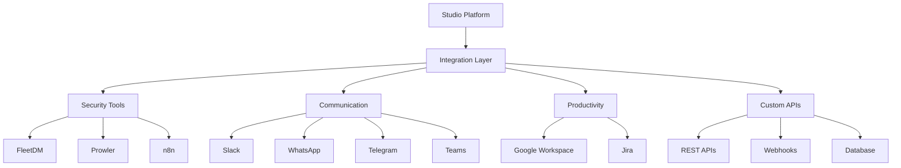

# Integrations Overview

The Studio Platform integrates with a wide range of third-party services and tools to enhance functionality, automate workflows, and provide comprehensive security and compliance monitoring.

## 🔄 Supported Integrations

### Security & Compliance
- **FleetDM** - Endpoint security and osquery management
- **Prowler** - Cloud security scanning and compliance
- **n8n Workflows** - Automation and workflow orchestration

### Communication & Collaboration
- **Google Services** - Workspace, Drive, and Cloud integration
- **Jira** - Issue tracking and project management
- **Slack** - Team communication and notifications
- **WhatsApp** - Business messaging and alerts
- **Telegram** - Bot notifications and updates
- **Microsoft Teams** - Enterprise collaboration

### Development & Operations
- **Custom APIs** - RESTful API integrations
- **Webhooks** - Event-driven integrations
- **Database Connectors** - Direct database access

## 🔧 Integration Architecture

## 📋 Integration Benefits

### Automated Workflows
- Reduce manual data entry
- Streamline compliance processes
- Improve response times

### Enhanced Security
- Centralized security monitoring
- Automated threat detection
- Compliance validation

### Improved Collaboration
- Real-time notifications
- Cross-platform communication
- Team coordination

## 🚀 Getting Started

1. **Review Available Integrations** - Explore supported services
2. **Check Prerequisites** - Verify requirements for each integration
3. **Configure Authentication** - Set up API keys and permissions
4. **Test Connections** - Validate integration functionality
5. **Monitor Performance** - Track integration health and usage

## 🔐 Security Considerations

- All integrations use secure authentication methods
- API credentials are encrypted at rest
- Access is logged and audited
- Integration permissions follow principle of least privilege

## 📞 Support

For integration-specific questions:
- Review individual integration guides
- Check troubleshooting documentation
- Contact support team
- Review community forums

---

!!! tip "Need Help?"
    Start with our [FleetDM integration guide](fleetdm.md) for a comprehensive example of setting up a security integration.

!!! note "Request New Integration"
    Don't see your required integration? Submit a feature request through our [contributing guidelines](../developer-guide/contributing.md).
