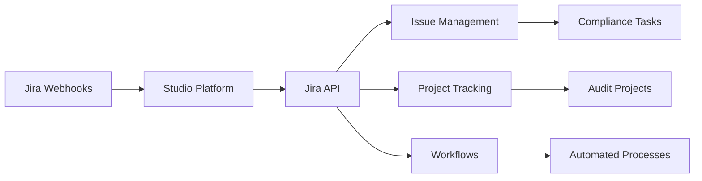
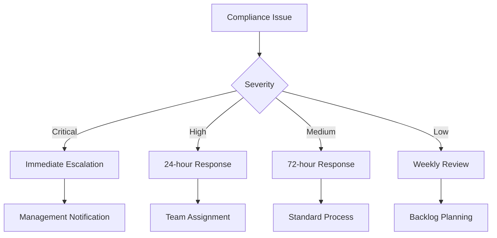

# Jira Integration

Jira integration enables the Studio Platform to connect with Atlassian Jira for issue tracking, project management, and workflow automation, providing seamless coordination between compliance activities and development/IT operations.

## 🎯 Integration Benefits

### Issue Management
- Centralized issue tracking
- Automated issue creation
- Status synchronization
- Cross-team collaboration

### Project Management
- Compliance project tracking
- Task assignment and monitoring
- Progress reporting
- Resource management

### Workflow Automation
- Automated ticket creation
- Status-based workflows
- Notification systems
- Escalation procedures

## 🔧 Prerequisites

### Jira Requirements
- Jira Cloud or Jira Server (version 8.0+)
- Administrator access to Jira
- API token or OAuth credentials
- Appropriate project permissions

### API Access
- Jira REST API enabled
- Webhook support
- API rate limits considered
- SSL/TLS configuration

### Permissions Required
- Jira API read/write access
- Project administration permissions
- Issue creation permissions
- Webhook management access

## 📋 Setup Instructions

### Step 1: Configure Jira API Access

1. **Generate API Token (Jira Cloud)**
   ```
   https://id.atlassian.com/manage-profile/security/api-tokens
   ```
   - Click "Create API token"
   - Enter descriptive label (e.g., "Studio Platform")
   - Copy generated token

2. **Configure OAuth (Jira Server)**
   ```bash
   # Navigate to Jira Admin > Applications > Application Links
   # Create application link for Studio Platform
   # Configure OAuth authentication
   ```

3. **Verify API Access**
   ```bash
   # Test Jira API
   curl -u "email@example.com:API_TOKEN" \
        -X GET "https://your-domain.atlassian.net/rest/api/3/myself"
   ```

### Step 2: Configure Webhooks

1. **Create Webhook in Jira**
   - Navigate to Project Settings > Webhooks
   - Click "Create webhook"
   - Enter webhook URL: `https://studio.example.com/webhooks/jira`
   - Select events to monitor
   - Configure authentication

2. **Webhook Events**
   ```yaml
   webhook_events:
     - "issue_created"
     - "issue_updated"
     - "issue_assigned"
     - "comment_added"
     - "status_changed"
     - "sprint_started"
     - "sprint_closed"
   ```

### Step 3: Configure Studio Platform Integration

1. **Access Integration Settings**
   - Navigate to Admin > Integrations
   - Select Jira from available integrations

2. **Enter Connection Details**
   ```yaml
   jira_config:
     url: "https://your-domain.atlassian.net"
     username: "email@example.com"
     api_token: "your-api-token"
     project_key: "COMP"
     default_issue_type: "Task"
     webhook_secret: "your-webhook-secret"
   ```

3. **Test Connection**
   - Click "Test Connection" button
   - Verify successful API response
   - Test webhook connectivity

## 🔍 Integration Features

### Integration Architecture


### Issue Management

#### Automated Issue Creation
```yaml
issue_templates:
  compliance_finding:
    project: "COMP"
    issue_type: "Task"
    summary: "Compliance Finding: {{finding_type}}"
    description: |
      h2. Compliance Finding Details
      
      *Finding Type:* {{finding_type}}
      *Severity:* {{severity}}
      *Description:* {{description}}
      *Evidence:* [Evidence Link|{{evidence_url}}]
      *Due Date:* {{due_date}}
      
      h3. Required Actions
      # Investigate the finding
      # Implement remediation
      # Update compliance status
    labels: ["compliance", "security", "{{finding_type}}"]
    priority: "{{severity}}"
    assignee: "{{assignee}}"
  
  audit_task:
    project: "AUDIT"
    issue_type: "Story"
    summary: "Audit Task: {{task_name}}"
    description: |
      h2. Audit Task Details
      
      *Audit Type:* {{audit_type}}
      *Scope:* {{scope}}
      *Requirements:* {{requirements}}
      *Deadline:* {{deadline}}
      
      h3. Acceptance Criteria
      - [ ] Complete audit procedures
      - [ ] Document findings
      - [ ] Submit audit report
    labels: ["audit", "{{audit_type}}"]
    priority: "High"
```

#### Status Synchronization
```yaml
status_mapping:
  studio_to_jira:
    "pending_review": "In Review"
    "approved": "Done"
    "rejected": "Blocked"
    "in_progress": "In Progress"
    "completed": "Done"
  
  jira_to_studio:
    "To Do": "pending"
    "In Progress": "in_progress"
    "In Review": "pending_review"
    "Done": "completed"
    "Blocked": "rejected"
```

### Project Management

#### Compliance Project Templates
```yaml
project_templates:
  compliance_audit:
    name: "Compliance Audit - {{framework}}"
    key: "AUD{{year}}"
    lead: "compliance-manager"
    issue_types:
      - "Epic"
      - "Story"
      - "Task"
      - "Bug"
    workflows:
      - "Compliance Workflow"
      - "Review Process"
    
  security_assessment:
    name: "Security Assessment - {{assessment_type}}"
    key: "SEC{{quarter}}"
    lead: "security-lead"
    issue_types:
      - "Epic"
      - "Task"
      - "Sub-task"
    workflows:
      - "Security Review"
      - "Remediation"
```

#### Sprint Management
```yaml
sprint_configuration:
  compliance_sprints:
    duration: "2 weeks"
    start_day: "Monday"
    capacity_calculation: "story_points"
    default_velocity: 40
    retrospective_enabled: true
```

### Workflow Automation

#### Compliance Workflows


#### Automated Actions
```yaml
automated_actions:
  issue_creation:
    trigger: "compliance_finding"
    action: "create_jira_issue"
    template: "compliance_finding"
    
  status_updates:
    trigger: "jira_status_change"
    action: "update_studio_status"
    mapping: "status_mapping"
    
  notifications:
    trigger: "issue_assigned"
    action: "send_notification"
    channels: ["email", "slack"]
    template: "assignment_notification"
```

## 📊 Dashboard Integration

### Jira Widgets
- **Issue Summary** - Active/completed issues
- **Sprint Progress** - Current sprint status
- **Team Velocity** - Performance metrics
- **Bug Reports** - Quality indicators

### Automated Reports
- **Compliance Status** - Open compliance issues
- **Project Progress** - Milestone tracking
- **Team Performance** - Productivity metrics
- **Risk Assessment** - Issue-based risk analysis

## 🔔 Alerting & Notifications

### Alert Types
- **Critical Issues** - High-priority compliance findings
- **Overdue Tasks** - Missed deadlines
- **Status Changes** - Important status updates
- **Assignments** - New task assignments

### Alert Configuration
```yaml
alerts:
  critical_issue:
    enabled: true
    priority: ["Highest", "High"]
    channels: ["email", "slack", "sms"]
    cooldown: "1h"
    escalation: true
  
  overdue_task:
    enabled: true
    threshold: "due_date < today"
    channels: ["email"]
    cooldown: "4h"
```

## 🛠️ Advanced Configuration

### Custom Fields

#### Compliance-Specific Fields
```yaml
custom_fields:
  compliance_framework:
    type: "select"
    options: ["SOC2", "ISO27001", "PCI-DSS", "HIPAA", "GDPR"]
    required: true
    
  risk_level:
    type: "select"
    options: ["Critical", "High", "Medium", "Low"]
    required: true
    
  evidence_required:
    type: "checkbox"
    default: true
    
  remediation_deadline:
    type: "date"
    required: true
```

### Advanced Workflows

#### Multi-Stage Approval
```yaml
approval_workflow:
  stages:
    - name: "Initial Review"
      approvers: ["compliance-analyst"]
      conditions: ["risk_level != Critical"]
      
    - name: "Management Review"
      approvers: ["compliance-manager"]
      conditions: ["risk_level in [Critical, High]"]
      
    - name: "Final Approval"
      approvers: ["compliance-director"]
      conditions: ["framework in [SOC2, ISO27001]"]
```

### Integration Scripts

#### Jira API Client
```python
import requests
from requests.auth import HTTPBasicAuth

class JiraClient:
    def __init__(self, url, username, api_token):
        self.url = url
        self.auth = HTTPBasicAuth(username, api_token)
        self.headers = {"Accept": "application/json"}
    
    def create_issue(self, issue_data):
        """Create a new Jira issue"""
        api_url = f"{self.url}/rest/api/3/issue"
        response = requests.post(
            api_url,
            json=issue_data,
            headers=self.headers,
            auth=self.auth
        )
        return response.json()
    
    def update_issue(self, issue_key, update_data):
        """Update an existing issue"""
        api_url = f"{self.url}/rest/api/3/issue/{issue_key}"
        response = requests.put(
            api_url,
            json=update_data,
            headers=self.headers,
            auth=self.auth
        )
        return response.status_code == 204
    
    def get_issue(self, issue_key):
        """Get issue details"""
        api_url = f"{self.url}/rest/api/3/issue/{issue_key}"
        response = requests.get(
            api_url,
            headers=self.headers,
            auth=self.auth
        )
        return response.json()
```

## 🔒 Security Best Practices

### API Security
- Use encrypted API tokens
- Implement token rotation
- IP restriction policies
- Monitor API usage

### Data Protection
- Encrypt sensitive data
- Use secure transmission
- Implement access controls
- Regular security audits

### Compliance Considerations
- Follow data retention policies
- Maintain audit trails
- Document data flows
- Regular compliance reviews

## 🐛 Troubleshooting

### Common Issues

#### Authentication Failures
```bash
# Test Jira API authentication
curl -u "email@example.com:API_TOKEN" \
     -X GET "https://your-domain.atlassian.net/rest/api/3/myself"
```

#### Permission Errors
- Verify user permissions
- Check project access
- Ensure API token validity
- Review webhook permissions

#### Rate Limiting
```bash
# Check API rate limits
curl -u "email@example.com:API_TOKEN" \
     -X GET "https://your-domain.atlassian.net/rest/api/3/myself" \
     -H "X-Atlassian-Token: no-check"
```

### Debug Mode
```yaml
debug_config:
  enabled: true
  log_level: "debug"
  api_timeout: 60
  retry_attempts: 3
  detailed_logging: true
```

## 📈 Monitoring & Metrics

### Key Performance Indicators
- **API Response Time** - < 500ms target
- **Issue Creation Success Rate** - > 99%
- **Webhook Delivery Rate** - > 98%
- **System Availability** - 99.9% uptime

### Health Checks
```bash
# Check integration health
curl -X GET https://studio.example.com/api/integrations/jira/health
```

## 🔄 Maintenance

### Regular Tasks
- **Weekly**: Review issue metrics
- **Monthly**: Update workflow configurations
- **Quarterly**: Security audit
- **Annually**: Integration review

### Updates & Upgrades
- Test Jira updates in staging
- Review breaking changes
- Update integration configuration
- Validate functionality

## 📞 Support

### Resources
- [Jira REST API Documentation](https://developer.atlassian.com/cloud/jira/platform/rest/v3/)
- [Jira Webhooks Documentation](https://developer.atlassian.com/cloud/jira/platform/webhooks/)
- [Studio Platform API Reference](../developer-guide/api-reference.md)

### Getting Help
1. Check troubleshooting section
2. Review Jira logs
3. Contact support team
4. Submit GitHub issue

---

!!! tip "Best Practice"
    Use issue templates and custom fields to standardize compliance-related issues and ensure consistent data capture.

!!! warning "API Limits"
    Be aware of Jira API rate limits. Implement appropriate throttling and caching strategies for high-volume operations.

!!! note "Data Privacy"
    Ensure compliance with data protection regulations when storing and processing sensitive information in Jira issues.
