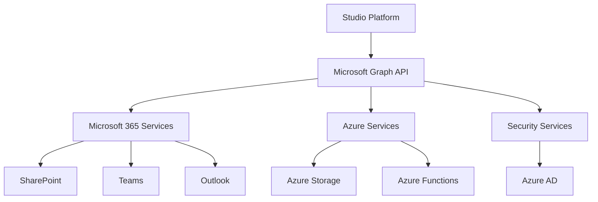

# Microsoft Integration

Microsoft integration enables the Studio Platform to connect with Microsoft 365, Azure, and other Microsoft services for comprehensive enterprise integration, leveraging Microsoft's extensive ecosystem for productivity, cloud services, and security.

## 🎯 Integration Benefits

### Enterprise Integration
- Seamless Microsoft 365 connectivity
- Azure cloud services integration
- Active Directory synchronization
- Enterprise-grade security

### Productivity Enhancement
- Microsoft Teams collaboration
- SharePoint document management
- Outlook email integration
- Power BI analytics

### Cloud Services
- Azure storage and compute
- Microsoft Graph API
- Azure Active Directory
- Power Automate workflows

## 🔧 Prerequisites

### Microsoft Requirements
- Microsoft 365 subscription (Enterprise plan recommended)
- Azure subscription
- Global administrator access
- App registration permissions

### API Access
- Microsoft Graph API access
- Azure API permissions
- Application registration
- Service principal configuration

### Permissions Required
- Microsoft Graph API permissions
- Azure resource access
- SharePoint site permissions
- Teams admin access

## 📋 Setup Instructions

### Step 1: Register Azure Application

1. **Access Azure Portal**
   ```
   https://portal.azure.com
   ```
   - Navigate to Azure Active Directory
   - Select App registrations
   - Click "New registration"

2. **Configure Application**
   ```yaml
   app_registration:
     name: "Studio Platform Integration"
     supported_account_types: "Accounts in this organizational directory only"
     redirect_uri: "https://studio.example.com/auth/microsoft/callback"
     sign_in_audience: "AzureADMyOrg"
   ```

3. **Configure API Permissions**
   ```yaml
   api_permissions:
     microsoft_graph:
       - "User.Read.All"
       - "Mail.Read"
       - "Mail.Send"
       - "Files.ReadWrite.All"
       - "Sites.ReadWrite.All"
       - "Team.ReadBasic.All"
       - "Channel.ReadBasic.All"
       - "Chat.ReadWrite"
       - "Directory.Read.All"
     sharepoint:
       - "Sites.ReadWrite.All"
       - "Files.ReadWrite.All"
     teams:
       - "Team.ReadBasic.All"
       - "Channel.ReadBasic.All"
       - "Chat.ReadWrite"
   ```

### Step 2: Configure Authentication

1. **Create Client Secret**
   - Navigate to Certificates & secrets
   - Click "New client secret"
   - Enter description and expiration
   - Copy secret value

2. **Set Up Certificate (Optional)**
   ```bash
   # Create self-signed certificate
   openssl req -x509 -newkey rsa:2048 -keyout key.pem -out cert.pem -days 365
   
   # Upload certificate to Azure
   # Use Azure CLI or portal
   ```

3. **Configure Authentication**
   ```yaml
   authentication:
     client_id: "your-application-client-id"
     client_secret: "your-client-secret"
     tenant_id: "your-tenant-id"
     authority: "https://login.microsoftonline.com/your-tenant-id"
     scopes: ["https://graph.microsoft.com/.default"]
   ```

### Step 3: Configure Studio Platform Integration

1. **Access Integration Settings**
   - Navigate to Admin > Integrations
   - Select Microsoft from available integrations

2. **Enter Connection Details**
   ```yaml
   microsoft_config:
     tenant_id: "your-tenant-id"
     client_id: "your-application-client-id"
     client_secret: "your-client-secret"
     authority: "https://login.microsoftonline.com/your-tenant-id"
     default_domain: "yourdomain.onmicrosoft.com"
     sharepoint_site: "https://yourdomain.sharepoint.com/sites/compliance"
     teams_team_id: "your-teams-team-id"
   ```

3. **Test Connection**
   - Click "Test Connection" button
   - Verify successful API response
   - Test authentication flow

## 🔍 Integration Features

### Integration Architecture


### Microsoft 365 Integration

#### SharePoint Document Management
```python
class SharePointIntegration:
    def __init__(self, graph_client):
        self.graph = graph_client
        self.site_id = "your-sharepoint-site-id"
    
    def upload_evidence_to_sharepoint(self, file_content, file_name, metadata):
        """Upload evidence to SharePoint"""
        
        # Get document library
        library = self.graph.sites[self.site_id].drives.get().top(1)
        
        # Upload file
        uploaded_file = self.graph.drives[library[0].id].root \
            .item_with_path(f"compliance/evidence/{file_name}") \
            .content.upload(file_content)
        
        # Set metadata
        self.graph.drives[library[0].id].items[uploaded_file.id].fields.update({
            "ComplianceFramework": metadata.get('framework'),
            "EvidenceType": metadata.get('type'),
            "UploadDate": datetime.now().isoformat(),
            "UploadedBy": metadata.get('user_id')
        })
        
        return uploaded_file.id
    
    def create_compliance_folder_structure(self):
        """Create compliance folder structure"""
        
        folders = [
            "compliance/evidence",
            "compliance/reports",
            "compliance/audits",
            "compliance/policies",
            "compliance/templates"
        ]
        
        for folder_path in folders:
            try:
                self.graph.sites[self.site_id].drives.get().top(1)[0].root \
                    .item_with_path(folder_path).create_folder()
            except Exception as e:
                print(f"Folder {folder_path} may already exist: {e}")
```

#### Microsoft Teams Integration
```python
class TeamsIntegration:
    def __init__(self, graph_client):
        self.graph = graph_client
        self.team_id = "your-teams-team-id"
    
    def send_compliance_notification(self, message_data):
        """Send compliance notification to Teams"""
        
        # Get compliance channel
        channels = self.graph.teams[self.team_id].channels.get()
        compliance_channel = next(
            (c for c in channels if c.display_name == "Compliance"), 
            None
        )
        
        if compliance_channel:
            # Create message
            message = self.graph.teams[self.team_id].channels[compliance_channel.id] \
                .messages.post({
                    "body": {
                        "content": self.format_teams_message(message_data),
                        "contentType": "html"
                    }
                })
            
            return message.id
        else:
            raise Exception("Compliance channel not found")
    
    def format_teams_message(self, data):
        """Format message for Teams"""
        
        severity_colors = {
            'critical': 'FF0000',
            'high': 'FF6600',
            'medium': 'FFAA00',
            'low': '00AA00'
        }
        
        color = severity_colors.get(data.get('severity', 'low'), '00AA00')
        
        message = f"""
        <div style="border-left: 4px solid #{color}; padding-left: 10px;">
            <h3>🚨 Compliance Alert: {data.get('title', 'Unknown')}</h3>
            <p><strong>Severity:</strong> {data.get('severity', 'Unknown')}</p>
            <p><strong>Description:</strong> {data.get('description', 'No description')}</p>
        """
        
        if data.get('action_required'):
            message += f"<p><strong>Action Required:</strong> {data['action_required']}</p>"
        
        if data.get('link'):
            message += f'<p><a href="{data["link"]}">View Details</a></p>'
        
        message += "</div>"
        
        return message
    
    def create_compliance_team(self, team_name):
        """Create new compliance team"""
        
        team_data = {
            "displayName": team_name,
            "description": f"Compliance team for {team_name}",
            "template@odata.bind": "https://graph.microsoft.com/v1.0/teamsTemplates('standard')",
            "members": [
                {
                    "@odata.type": "#microsoft.graph.aadUserConversationMember",
                    "roles": ["owner"],
                    "user@odata.bind": f"https://graph.microsoft.com/v1.0/users('{user_id}')"
                }
            ]
        }
        
        team = self.graph.teams.post(team_data)
        return team.id
```

#### Outlook Email Integration
```python
class OutlookIntegration:
    def __init__(self, graph_client):
        self.graph = graph_client
    
    def send_compliance_email(self, email_data):
        """Send compliance email via Outlook"""
        
        message = {
            "message": {
                "subject": email_data.get('subject', 'Compliance Notification'),
                "body": {
                    "contentType": "HTML",
                    "content": self.format_email_content(email_data)
                },
                "toRecipients": [
                    {
                        "emailAddress": {
                            "address": email_data['recipient']
                        }
                    }
                ]
            }
        }
        
        # Send email
        sent_message = self.graph.me.send_mail.post(message)
        return sent_message.id
    
    def format_email_content(self, data):
        """Format email content"""
        
        content = f"""
        <html>
        <body>
            <div style="font-family: Arial, sans-serif; max-width: 600px; margin: 0 auto;">
                <div style="background-color: #f8f9fa; padding: 20px; border-radius: 5px;">
                    <h2 style="color: #dc3545;">🚨 Compliance Alert</h2>
                    <p><strong>Subject:</strong> {data.get('title', 'Unknown')}</p>
                    <p><strong>Severity:</strong> {data.get('severity', 'Unknown')}</p>
                    <p><strong>Description:</strong> {data.get('description', 'No description')}</p>
        """
        
        if data.get('action_required'):
            content += f"<p><strong>Action Required:</strong> {data['action_required']}</p>"
        
        if data.get('due_date'):
            content += f"<p><strong>Due Date:</strong> {data['due_date']}</p>"
        
        if data.get('link'):
            content += f'<p><a href="{data["link"]}" style="background-color: #007bff; color: white; padding: 10px 20px; text-decoration: none; border-radius: 3px;">View Details</a></p>'
        
        content += """
                </div>
                <div style="margin-top: 20px; font-size: 12px; color: #6c757d;">
                    <p>This message was sent automatically by the Studio Platform Compliance System.</p>
                </div>
            </div>
        </body>
        </html>
        """
        
        return content
    
    def schedule_compliance_reminder(self, reminder_data):
        """Schedule compliance reminder email"""
        
        event = {
            "subject": reminder_data.get('subject', 'Compliance Reminder'),
            "body": {
                "contentType": "HTML",
                "content": self.format_email_content(reminder_data)
            },
            "start": {
                "dateTime": reminder_data['start_time'],
                "timeZone": "UTC"
            },
            "end": {
                "dateTime": reminder_data['end_time'],
                "timeZone": "UTC"
            },
            "attendees": [
                {
                    "emailAddress": {
                        "address": reminder_data['recipient']
                    },
                    "type": "required"
                }
            ],
            "isReminderOn": True,
            "reminderMinutesBeforeStart": 15
        }
        
        created_event = self.graph.me.events.post(event)
        return created_event.id
```

### Azure Integration

#### Azure Storage Integration
```python
class AzureStorageIntegration:
    def __init__(self, storage_account_name, storage_account_key):
        self.account_name = storage_account_name
        self.account_key = storage_account_key
        self.blob_service = BlobServiceClient(
            account_url=f"https://{storage_account_name}.blob.core.windows.net",
            credential=storage_account_key
        )
    
    def upload_evidence_to_blob(self, container_name, blob_name, file_content, metadata):
        """Upload evidence to Azure Blob Storage"""
        
        container_client = self.blob_service.get_container_client(container_name)
        
        # Upload blob with metadata
        blob_client = container_client.get_blob_client(blob_name)
        blob_client.upload_blob(
            file_content,
            metadata=metadata,
            overwrite=True
        )
        
        return blob_client.url
    
    def create_compliance_containers(self):
        """Create compliance containers"""
        
        containers = [
            "compliance-evidence",
            "compliance-reports",
            "compliance-audits",
            "compliance-backups"
        ]
        
        for container in containers:
            try:
                self.blob_service.create_container(container)
            except Exception as e:
                print(f"Container {container} may already exist: {e}")
```

#### Azure Functions Integration
```python
class AzureFunctionsIntegration:
    def __init__(self, function_app_url, function_key):
        self.base_url = function_app_url
        self.function_key = function_key
    
    def trigger_compliance_check(self, check_data):
        """Trigger compliance check via Azure Function"""
        
        url = f"{self.base_url}/api/compliance-check"
        headers = {
            "Content-Type": "application/json",
            "x-functions-key": self.function_key
        }
        
        response = requests.post(url, json=check_data, headers=headers)
        return response.json()
    
    def generate_compliance_report(self, report_config):
        """Generate compliance report via Azure Function"""
        
        url = f"{self.base_url}/api/generate-report"
        headers = {
            "Content-Type": "application/json",
            "x-functions-key": self.function_key
        }
        
        response = requests.post(url, json=report_config, headers=headers)
        return response.json()
```

## 📊 Dashboard Integration

### Microsoft Widgets
- **SharePoint Storage** - Document storage metrics
- **Teams Activity** - Team collaboration statistics
- **Email Analytics** - Communication metrics
- **Azure Resources** - Cloud resource usage

### Automated Reports
- **Microsoft 365 Usage** - Platform adoption metrics
- **Compliance Collaboration** - Team engagement analysis
- **Storage Analytics** - Document management insights
- **Communication Patterns** - Email and Teams usage

## 🔔 Alerting & Notifications

### Alert Configuration
```yaml
alert_configuration:
  critical_compliance:
    enabled: true
    channels: ["teams", "email"]
    teams_channel: "Compliance"
    email_recipients: ["compliance@yourdomain.com"]
    priority: "high"
    
  evidence_deadline:
    enabled: true
    channels: ["teams", "email"]
    teams_channel: "Compliance"
    email_recipients: ["team@yourdomain.com"]
    priority: "medium"
    schedule: "0 9 * * *"  # Daily at 9 AM
    
  compliance_updates:
    enabled: true
    channels: ["teams"]
    teams_channel: "Compliance Updates"
    priority: "low"
    schedule: "0 17 * * *"  # Daily at 5 PM
```

### Notification Routing
```yaml
routing_rules:
  security_incidents:
    condition: "category == 'security' AND severity == 'critical'"
    channels: ["teams", "email", "mobile"]
    teams_channels: ["Security", "Compliance"]
    email_recipients: ["security@yourdomain.com", "compliance@yourdomain.com"]
    
  audit_deadlines:
    condition: "type == 'deadline' AND days_remaining <= 2"
    channels: ["teams", "email"]
    teams_channels: ["Audit Team"]
    email_recipients: ["auditors@yourdomain.com"]
    
  compliance_reports:
    condition: "type == 'report_ready'"
    channels: ["teams", "email", "sharepoint"]
    teams_channels: ["Compliance", "Management"]
    email_recipients: ["management@yourdomain.com"]
    sharepoint_library: "Compliance Reports"
```

## 🛠️ Advanced Configuration

### Power Automate Integration

#### Workflow Automation
```python
class PowerAutomateIntegration:
    def __init__(self, flow_url, flow_key):
        self.flow_url = flow_url
        self.flow_key = flow_key
    
    def trigger_evidence_workflow(self, evidence_data):
        """Trigger evidence collection workflow"""
        
        flow_data = {
            "evidence_id": evidence_data['id'],
            "evidence_type": evidence_data['type'],
            "assigned_to": evidence_data['assigned_user'],
            "deadline": evidence_data['deadline'],
            "description": evidence_data['description']
        }
        
        headers = {
            "Content-Type": "application/json",
            "Ocp-Apim-Subscription-Key": self.flow_key
        }
        
        response = requests.post(self.flow_url, json=flow_data, headers=headers)
        return response.json()
    
    def trigger_compliance_review(self, review_data):
        """Trigger compliance review workflow"""
        
        flow_data = {
            "review_id": review_data['id'],
            "framework": review_data['framework'],
            "reviewer": review_data['reviewer'],
            "deadline": review_data['deadline'],
            "scope": review_data['scope']
        }
        
        headers = {
            "Content-Type": "application/json",
            "Ocp-Apim-Subscription-Key": self.flow_key
        }
        
        response = requests.post(f"{self.flow_url}/compliance-review", json=flow_data, headers=headers)
        return response.json()
```

### Power BI Integration

#### Analytics Dashboard
```python
class PowerBIIntegration:
    def __init__(self, workspace_id, dataset_id, client_id, client_secret):
        self.workspace_id = workspace_id
        self.dataset_id = dataset_id
        self.client_id = client_id
        self.client_secret = client_secret
        self.access_token = None
    
    def get_access_token(self):
        """Get Power BI access token"""
        
        auth_url = "https://login.microsoftonline.com/common/oauth2/token"
        data = {
            "grant_type": "client_credentials",
            "client_id": self.client_id,
            "client_secret": self.client_secret,
            "resource": "https://analysis.windows.net/powerbi/api"
        }
        
        response = requests.post(auth_url, data=data)
        self.access_token = response.json()['access_token']
        return self.access_token
    
    def push_compliance_data(self, compliance_data):
        """Push compliance data to Power BI"""
        
        if not self.access_token:
            self.get_access_token()
        
        headers = {
            "Authorization": f"Bearer {self.access_token}",
            "Content-Type": "application/json"
        }
        
        url = f"https://api.powerbi.com/v1.0/myorg/groups/{self.workspace_id}/datasets/{self.dataset_id}/tables/ComplianceData/rows"
        
        response = requests.post(url, json=compliance_data, headers=headers)
        return response.status_code == 200
```

## 🔒 Security Best Practices

### Authentication Security
- Use certificate-based authentication
- Implement token rotation
- Use Azure Key Vault for secrets
- Monitor authentication logs

### Data Protection
- Encrypt data at rest and in transit
- Use Azure Information Protection
- Implement DLP policies
- Regular security audits

### Compliance Considerations
- Follow Microsoft compliance frameworks
- Maintain audit trails
- Document data flows
- Regular compliance reviews

## 🐛 Troubleshooting

### Common Issues

#### Authentication Failures
```bash
# Test Microsoft Graph API authentication
curl -X POST "https://login.microsoftonline.com/your-tenant-id/oauth2/v2.0/token" \
     -H "Content-Type: application/x-www-form-urlencoded" \
     -d "client_id=your-client-id&client_secret=your-client-secret&grant_type=client_credentials&scope=https://graph.microsoft.com/.default"
```

#### Permission Errors
- Verify API permissions in Azure AD
- Check admin consent status
- Review application registration
- Ensure proper scope configuration

#### SharePoint Access Issues
```bash
# Test SharePoint API access
curl -X GET "https://graph.microsoft.com/v1.0/sites/your-site-id" \
     -H "Authorization: Bearer YOUR_ACCESS_TOKEN"
```

### Debug Mode
```yaml
debug_config:
  enabled: true
  log_level: "debug"
  api_timeout: 60
  retry_attempts: 3
  detailed_logging: true
```

## 📈 Monitoring & Metrics

### Key Performance Indicators
- **API Response Time** - < 500ms target
- **Authentication Success Rate** - > 99%
- **File Upload Success Rate** - > 98%
- **System Availability** - 99.9% uptime

### Health Checks
```bash
# Check integration health
curl -X GET https://studio.example.com/api/integrations/microsoft/health
```

## 🔄 Maintenance

### Regular Tasks
- **Weekly**: Review API usage metrics
- **Monthly**: Update application permissions
- **Quarterly**: Security audit
- **Annually**: Integration review

### Updates & Upgrades
- Test Microsoft API changes in staging
- Review breaking changes
- Update integration configuration
- Validate functionality

## 📞 Support

### Resources
- [Microsoft Graph API Documentation](https://docs.microsoft.com/graph/)
- [Microsoft Teams Documentation](https://docs.microsoft.com/microsoftteams/)
- [SharePoint REST API](https://docs.microsoft.com/sharepoint/dev/sp-add-ins/working-with-the-rest-api)
- [Studio Platform API Reference](../developer-guide/api-reference.md)

### Getting Help
1. Check troubleshooting section
2. Review Microsoft service logs
3. Contact support team
4. Submit GitHub issue

---

!!! tip "Best Practice"
    Use Microsoft Graph API for unified access to all Microsoft 365 services instead of separate APIs for each service.

!!! warning "API Limits"
    Be aware of Microsoft Graph API rate limits. Implement appropriate throttling and caching strategies for high-volume operations.

!!! note "Data Governance"
    Ensure compliance with Microsoft's data processing agreements and your organization's data governance policies.
