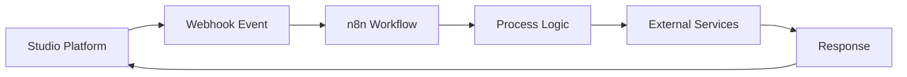

# n8n Workflows Integration

n8n is a workflow automation tool that enables the Studio Platform to create sophisticated automation workflows, connect various services, and streamline business processes through visual workflow design.

## 🎯 Integration Benefits

### Workflow Automation
- Visual workflow designer
- No-code/low-code automation
- Complex business logic implementation
- Multi-step process orchestration

### Process Integration
- Connect disparate systems
- Data transformation and mapping
- Event-driven automation
- Scheduled task execution

### Operational Efficiency
- Reduce manual processes
- Improve data accuracy
- Accelerate response times
- Standardize procedures

## 🔧 Prerequisites

### n8n Requirements
- n8n instance (version 1.0+)
- Admin access to n8n
- API credentials
- Workflow templates (optional)

### Network Requirements
- n8n API accessible from Studio Platform
- HTTPS connectivity (port 443)
- Firewall rules for API communication
- Webhook endpoints accessibility

### Permissions Required
- n8n API read/write access
- Workflow execution permissions
- Credential management access
- Webhook creation permissions

## 📋 Setup Instructions

### Step 1: Configure n8n

1. **Deploy n8n**
   ```bash
   # Using Docker
   docker run -it --rm \
     --name n8n \
     -p 5678:5678 \
     -v n8n_data:/home/node/.n8n \
     n8nio/n8n
   
   # Or using npm
   npm install n8n -g
   n8n start
   ```

2. **Generate API Credentials**
   - Access n8n web interface
   - Navigate to Settings > API
   - Create new API token
   - Configure appropriate permissions
   - Copy API token

3. **Configure Webhook Settings**
   ```yaml
   webhook_config:
     base_url: "https://n8n.example.com"
     webhook_path: "/webhook/studio"
     authentication: "bearer"
     response_timeout: 30
   ```

### Step 2: Configure Studio Platform Integration

1. **Access Integration Settings**
   - Navigate to Admin > Integrations
   - Select n8n from available integrations

2. **Enter Connection Details**
   ```yaml
   n8n_config:
     api_url: "https://n8n.example.com"
     api_token: "your-api-token-here"
     verify_ssl: true
     timeout: 30
     webhook_secret: "your-webhook-secret"
   ```

3. **Test Connection**
   - Click "Test Connection" button
   - Verify successful API response
   - Test webhook connectivity

### Step 3: Configure Workflow Templates

1. **Import Workflow Templates**
   ```bash
   # Import compliance workflow
   curl -X POST https://n8n.example.com/api/v1/workflows \
     -H "Authorization: Bearer YOUR_TOKEN" \
     -H "Content-Type: application/json" \
     -d @compliance-workflow.json
   ```

2. **Set Up Webhooks**
   - Configure Studio Platform webhooks
   - Map events to workflow triggers
   - Test webhook delivery

## 🔍 Integration Features

### Workflow Architecture


### Workflow Categories

#### Compliance Workflows
- **Evidence Collection** - Automated evidence gathering
- **Policy Validation** - Compliance rule checking
- **Report Generation** - Automated report creation
- **Audit Trail** - Activity logging and tracking

#### Security Workflows
- **Incident Response** - Security event handling
- **Threat Detection** - Automated security scanning
- **Alert Management** - Alert processing and escalation
- **User Onboarding** - Security-aware user setup

#### Operational Workflows
- **Data Synchronization** - Cross-system data sync
- **User Management** - Automated user lifecycle
- **Backup Management** - Automated backup processes
- **Maintenance Tasks** - Scheduled system maintenance

### Workflow Templates

#### Evidence Collection Workflow

```json
{
  "name": "Automated Evidence Collection",
  "nodes": [
    {
      "name": "Studio Trigger",
      "type": "n8n-nodes-base.studioWebhook",
      "parameters": {
        "httpMethod": "POST",
        "path": "evidence-collection"
      }
    },
    {
      "name": "Parse Request",
      "type": "n8n-nodes-base.function",
      "parameters": {
        "functionCode": "return { data: JSON.parse($input.first().json.body) };"
      }
    },
    {
      "name": "Collect Evidence",
      "type": "n8n-nodes-base.httpRequest",
      "parameters": {
        "url": "=&#123;&#123; $json.data.source &#125;&#125;",
        "method": "GET"
      }
    },
    {
      "name": "Store Evidence",
      "type": "n8n-nodes-base.studioApi",
      "parameters": {
        "operation": "uploadEvidence",
        "evidenceId": "=&#123;&#123; $json.data.evidenceId &#125;&#125;"
      }
    }
  ]
}
```


#### Compliance Validation Workflow
```json
{
  "name": "Compliance Validation",
  "nodes": [
    {
      "name": "Schedule Trigger",
      "type": "n8n-nodes-base.cron",
      "parameters": {
        "cronExpression": "0 2 * * *"
      }
    },
    {
      "name": "Get Compliance Rules",
      "type": "n8n-nodes-base.studioApi",
      "parameters": {
        "operation": "getComplianceRules"
      }
    },
    {
      "name": "Validate Rules",
      "type": "n8n-nodes-base.function",
      "parameters": {
        "functionCode": "// Validation logic here"
      }
    },
    {
      "name": "Report Results",
      "type": "n8n-nodes-base.studioApi",
      "parameters": {
        "operation": "createComplianceReport"
      }
    }
  ]
}
```

## 📊 Dashboard Integration

### n8n Widgets
- **Workflow Status** - Active/inactive workflows
- **Execution Metrics** - Success/failure rates
- **Processing Time** - Average execution duration
- **Error Summary** - Recent workflow errors

### Automated Reports
- **Workflow Performance** - Execution statistics
- **Error Analysis** - Failure patterns
- **Process Efficiency** - Automation metrics
- **Resource Utilization** - System resource usage

## 🔔 Alerting & Notifications

### Alert Types
- **Workflow Failures** - Execution errors
- **Performance Issues** - Slow workflows
- **Resource Exhaustion** - Memory/CPU limits
- **Security Events** - Unauthorized access

### Alert Configuration
```yaml
alerts:
  workflow_failure:
    enabled: true
    threshold: "any failure"
    channels: ["email", "slack"]
    cooldown: "5m"
  
  performance_issue:
    enabled: true
    threshold: "execution_time > 300s"
    channels: ["email"]
    cooldown: "15m"
```

## 🛠️ Advanced Configuration

### Custom Nodes
1. **Create Custom Node**
   ```javascript
   // Studio Platform custom node
   const { StudioApiNode } = require('./nodes/StudioApiNode');
   
   module.exports = {
     displayName: 'Studio API',
     name: 'studioApi',
     group: ['transform'],
     version: 1,
     description: 'Interact with Studio Platform API',
     defaults: {
       name: 'Studio API',
       color: '#1E88E5'
     },
     inputs: ['main'],
     outputs: ['main'],
     properties: {
       operation: {
         type: 'options',
         options: [
           { name: 'Get Evidence', value: 'getEvidence' },
           { name: 'Create Report', value: 'createReport' }
         ]
       }
     },
     async execute() {
       // Node implementation
     }
   };
   ```

### Workflow Optimization
```yaml
optimization:
  parallel_execution: true
  max_concurrent_workflows: 10
  execution_timeout: 300
  retry_failed_workflows: true
  batch_processing: true
```

### Error Handling
```yaml
error_handling:
  retry_policy:
    max_attempts: 3
    backoff_strategy: "exponential"
    max_delay: 300
  
  error_notifications:
    enabled: true
    channels: ["email", "slack"]
    include_stack_trace: true
```

## 🔒 Security Best Practices

### API Security
- Use encrypted API tokens
- Implement token rotation
- IP restriction policies
- Monitor API usage

### Workflow Security
- Validate webhook payloads
- Implement input sanitization
- Secure credential storage
- Audit workflow execution

### Data Protection
- Encrypt sensitive data
- Use secure transmission
- Implement access controls
- Regular security audits

## 🐛 Troubleshooting

### Common Issues

#### Connection Failures
```bash
# Test n8n API connectivity
curl -H "Authorization: Bearer YOUR_TOKEN" \
     https://n8n.example.com/api/v1/workflows
```

#### Webhook Issues
```bash
# Test webhook delivery
curl -X POST https://n8n.example.com/webhook/studio \
     -H "Content-Type: application/json" \
     -d '{"test": "data"}'
```

#### Workflow Failures
- Check workflow logs
- Verify node configurations
- Review error messages
- Test individual nodes

### Debug Mode
```yaml
debug_config:
  enabled: true
  log_level: "debug"
  execution_timeout: 600
  detailed_logging: true
  save_execution_data: true
```

## 📈 Monitoring & Metrics

### Key Performance Indicators
- **Workflow Success Rate** - > 95%
- **Average Execution Time** - < 60 seconds
- **Error Rate** - < 5%
- **System Availability** - 99.9% uptime

### Health Checks
```bash
# Check integration health
curl -X GET https://studio.example.com/api/integrations/n8n/health
```

## 🔄 Maintenance

### Regular Tasks
- **Weekly**: Review workflow performance
- **Monthly**: Update workflow templates
- **Quarterly**: Security audit
- **Annually**: Integration review

### Updates & Upgrades
- Test n8n updates in staging
- Review breaking changes
- Update integration configuration
- Validate functionality

## 📞 Support

### Resources
- [n8n Documentation](https://docs.n8n.io/)
- [Workflow Examples](https://n8n.io/workflows/)
- [Studio Platform API Reference](../developer-guide/api-reference.md)

### Getting Help
1. Check troubleshooting section
2. Review n8n logs
3. Contact support team
4. Submit GitHub issue

---

!!! tip "Best Practice"
    Start with simple workflows and gradually add complexity as you become familiar with the platform.

!!! warning "Resource Limits"
    Monitor system resources when running multiple workflows simultaneously to avoid performance issues.

!!! note "Version Compatibility"
    Ensure n8n version compatibility with custom nodes and workflow templates.
