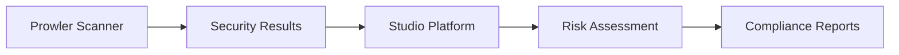

# Prowler Integration

Prowler is an open-source security tool for cloud security auditing, compliance monitoring, and hardening. This integration enables the Studio Platform to automatically scan cloud environments for security misconfigurations and compliance violations.

## 🎯 Integration Benefits

### Cloud Security
- Automated security scanning
- Misconfiguration detection
- Vulnerability assessment
- Threat intelligence

### Compliance Management
- Multi-framework compliance checks
- Automated evidence collection
- Compliance reporting
- Audit trail generation

### Risk Management
- Risk scoring and prioritization
- Remediation guidance
- Trend analysis
- Continuous monitoring

## 🔧 Prerequisites

### Prowler Requirements
- Prowler CLI (version 3.0+)
- Cloud provider accounts (AWS, Azure, GCP)
- Appropriate IAM permissions
- S3 bucket for reports (optional)

### Cloud Provider Setup

#### AWS
```bash
# Install Prowler
pip install prowler

# Configure AWS credentials
aws configure
```

Required IAM permissions:
```json
{
  "Version": "2012-10-17",
  "Statement": [
    {
      "Effect": "Allow",
      "Action": [
        "iam:*",
        "ec2:*",
        "s3:*",
        "cloudtrail:*",
        "cloudwatch:*",
        "logs:*",
        "kms:*",
        "rds:*",
        "lambda:*"
      ],
      "Resource": "*"
    }
  ]
}
```

#### Azure
```bash
# Install Azure CLI
curl -sL https://aka.ms/InstallAzureCLIDeb | sudo bash

# Login to Azure
az login
```

#### Google Cloud
```bash
# Install gcloud CLI
curl https://sdk.cloud.google.com | bash
exec -l $SHELL

# Authenticate
gcloud auth login
```

### Network Requirements
- Internet access to cloud provider APIs
- HTTPS connectivity (port 443)
- Firewall rules for API communication

## 📋 Setup Instructions

### Step 1: Configure Prowler

1. **Install Prowler**
   ```bash
   pip install prowler
   prowler --version
   ```

2. **Configure Cloud Credentials**
   ```bash
   # AWS
   export AWS_ACCESS_KEY_ID="your-access-key"
   export AWS_SECRET_ACCESS_KEY="your-secret-key"
   export AWS_DEFAULT_REGION="us-east-1"
   
   # Azure
   export AZURE_CLIENT_ID="your-client-id"
   export AZURE_CLIENT_SECRET="your-client-secret"
   export AZURE_TENANT_ID="your-tenant-id"
   
   # GCP
   export GOOGLE_APPLICATION_CREDENTIALS="/path/to/service-account.json"
   ```

3. **Test Prowler Installation**
   ```bash
   prowler aws --checks-checklist
   ```

### Step 2: Configure Studio Platform Integration

1. **Access Integration Settings**
   - Navigate to Admin > Integrations
   - Select Prowler from available integrations

2. **Enter Connection Details**
   ```yaml
   prowler_config:
     provider: "aws"  # aws, azure, gcp, multi
     credentials_method: "env_vars"  # env_vars, instance_profile, service_account
     output_format: "json"
     compliance_frameworks: ["cis", "pci", "hipaa", "soc2", "gdpr"]
     scan_regions: ["us-east-1", "us-west-2", "eu-west-1"]
     excluded_checks: ["access_keys_rotated", "cloudtrail_enabled"]
   ```

3. **Test Connection**
   - Click "Test Connection" button
   - Verify successful API response
   - Check permissions

### Step 3: Configure Scan Schedule

1. **Set Scan Frequency**
   ```yaml
   scan_schedule:
     full_scan: "0 2 * * 1"  # Weekly on Monday at 2 AM
     compliance_scan: "0 3 * * *"  # Daily at 3 AM
     quick_scan: "0 */6 * * *"  # Every 6 hours
   ```

2. **Configure Scan Scope**
   - Select cloud providers
   - Choose compliance frameworks
   - Define resource types
   - Set exclusions

## 🔍 Integration Features

### Automated Scanning


### Supported Cloud Providers

#### AWS Services
- **IAM** - Identity and Access Management
- **EC2** - Elastic Compute Cloud
- **S3** - Simple Storage Service
- **RDS** - Relational Database Service
- **Lambda** - Serverless Functions
- **CloudTrail** - Audit Logging
- **CloudWatch** - Monitoring

#### Azure Services
- **Azure AD** - Identity Management
- **Storage Accounts** - Blob Storage
- **Virtual Machines** - Compute Resources
- **SQL Database** - Database Services
- **Key Vault** - Secret Management

#### Google Cloud Services
- **Cloud IAM** - Identity Management
- **Cloud Storage** - Object Storage
- **Compute Engine** - Virtual Machines
- **Cloud SQL** - Database Services
- **Cloud KMS** - Key Management

### Compliance Frameworks

#### CIS Benchmarks
- CIS AWS Foundations Benchmark
- CIS Azure Foundations Benchmark
- CIS Google Cloud Foundations Benchmark

#### Industry Standards
- **PCI DSS** - Payment Card Industry
- **HIPAA** - Healthcare Privacy
- **SOC 2** - Service Organization Control
- **GDPR** - Data Protection
- **NIST** - Cybersecurity Framework

### Check Categories

#### Identity & Access Management
- MFA enforcement
- Access key rotation
- Role-based access
- Permission reviews

#### Data Protection
- Encryption at rest
- Encryption in transit
- Data classification
- Backup policies

#### Network Security
- Security groups
- Network ACLs
- VPC configuration
- Firewall rules

#### Monitoring & Logging
- Audit logging
- CloudTrail enabled
- CloudWatch alarms
- Log retention

## 📊 Dashboard Integration

### Prowler Widgets
- **Security Score** - Overall security posture
- **Compliance Status** - Framework adherence
- **Risk Summary** - High/medium/low risks
- **Recent Findings** - Latest security issues

### Automated Reports
- **Daily Security Summary** - New findings, risk changes
- **Weekly Compliance Report** - Framework compliance status
- **Monthly Risk Assessment** - Risk trends and metrics

## 🔔 Alerting & Notifications

### Alert Types
- **Critical Findings** - High-risk security issues
- **Compliance Failures** - Framework violations
- **New Vulnerabilities** - Recently discovered issues
- **Configuration Changes** - Security-relevant changes

### Alert Configuration
```yaml
alerts:
  critical_finding:
    enabled: true
    severity: ["critical", "high"]
    frameworks: ["cis", "pci"]
    channels: ["email", "slack"]
    cooldown: "1h"
  
  compliance_failure:
    enabled: true
    frameworks: ["hipaa", "soc2"]
    channels: ["email"]
    cooldown: "4h"
```

### Notification Channels
- In-app notifications
- Email alerts
- Slack integration
- Custom webhooks

## 🛠️ Advanced Configuration

### Custom Checks
1. **Create Custom Check**
   ```bash
   prowler custom-check create \
     --name "custom_security_check" \
     --category "Custom Security" \
     --description "Custom security validation"
   ```

2. **Implement Check Logic**
   ```python
   def check_custom_security():
       # Your custom check logic
       return {
           "status": "PASS",
           "message": "Custom security check passed"
       }
   ```

### Scan Optimization
```yaml
optimization:
  parallel_scans: true
  max_concurrent_checks: 10
  timeout_per_check: 300
  retry_failed_checks: true
  cache_results: true
```

### Data Retention
```yaml
retention_policy:
  scan_results: "90 days"
  compliance_reports: "1 year"
  audit_logs: "7 years"
  remediation_history: "3 years"
```

## 🔒 Security Best Practices

### Credential Management
- Use environment variables for credentials
- Rotate credentials regularly
- Implement least privilege access
- Monitor credential usage

### Data Protection
- Encrypt sensitive data at rest
- Use secure transmission (HTTPS)
- Implement access controls
- Regular security audits

### Compliance Considerations
- Follow data retention policies
- Maintain audit trails
- Document data flows
- Regular compliance reviews

## 🐛 Troubleshooting

### Common Issues

#### Authentication Failures
```bash
# Test AWS credentials
aws sts get-caller-identity

# Test Azure credentials
az account show

# Test GCP credentials
gcloud auth list
```

#### Permission Errors
- Verify IAM permissions
- Check service account roles
- Ensure proper resource access

#### Scan Failures
```bash
# Run Prowler in debug mode
prowler aws --debug --log-level DEBUG

# Check specific check
prowler aws --checks-checklist iam_user_mfa_enabled
```

### Debug Mode
```yaml
debug_config:
  enabled: true
  log_level: "debug"
  scan_timeout: 600
  retry_attempts: 3
  verbose_output: true
```

## 📈 Monitoring & Metrics

### Key Performance Indicators
- **Scan Success Rate** - > 95%
- **Scan Duration** - < 30 minutes
- **Alert Accuracy** - Low false positive rate
- **System Availability** - 99.9% uptime

### Health Checks
```bash
# Check integration health
curl -X GET https://studio.example.com/api/integrations/prowler/health
```

## 🔄 Maintenance

### Regular Tasks
- **Weekly**: Review scan results
- **Monthly**: Update check definitions
- **Quarterly**: Security audit
- **Annually**: Integration review

### Updates & Upgrades
- Test Prowler updates in staging
- Review breaking changes
- Update integration configuration
- Validate functionality

## 📞 Support

### Resources
- [Prowler Documentation](https://www.prowler.com/docs/)
- [Cloud Provider Documentation](https://docs.aws.amazon.com/)
- [Studio Platform API Reference](../developer-guide/api-reference.md)

### Getting Help
1. Check troubleshooting section
2. Review Prowler logs
3. Contact support team
4. Submit GitHub issue

---

!!! tip "Best Practice"
    Start with CIS benchmarks for foundational security, then add industry-specific frameworks as needed.

!!! warning "API Limits"
    Be aware of cloud provider API rate limits. Implement appropriate throttling and caching strategies.

!!! note "Cost Management"
    Monitor cloud API usage to avoid unexpected costs, especially for large-scale deployments.
