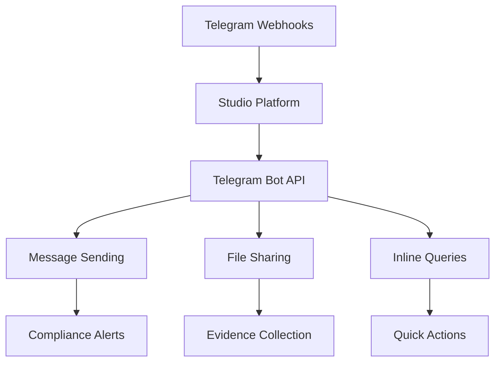

# Telegram Integration

Telegram integration enables the Studio Platform to leverage Telegram's secure messaging platform for compliance notifications, team communication, and automated workflows with enhanced privacy and security features.

## 🎯 Integration Benefits

### Secure Communication
- End-to-end encryption
- Self-destructing messages
- Two-factor authentication
- Privacy-focused design

### Global Accessibility
- Cross-platform support
- Cloud synchronization
- Large file sharing (up to 2GB)
- Multi-device access

### Automation Capabilities
- Bot framework integration
- Custom commands
- Inline queries
- Webhook support

## 🔧 Prerequisites

### Telegram Requirements
- Telegram account
- Bot creation access
- API token generation
- Channel/group management

### Technical Requirements
- Telegram Bot API access
- Webhook endpoint for receiving messages
- SSL certificate for webhook security
- Python/Node.js bot framework

### Permissions Required
- Bot token from @BotFather
- Group/channel admin rights
- Message sending permissions
- Webhook configuration access

## 📋 Setup Instructions

### Step 1: Create Telegram Bot

1. **Create Bot with BotFather**
   ```
   1. Open Telegram and search for @BotFather
   2. Send /newbot command
   3. Choose bot name and username
   4. Copy the bot token
   ```

2. **Configure Bot Settings**
   ```bash
   # Set bot description
   /setdescription
   # Select your bot
   # Enter description: "Studio Platform Compliance Bot"
   
   # Set bot commands
   /setcommands
   # Select your bot
   # Enter commands list
   compliance - Check compliance status
   evidence - Upload evidence
   risk - View risk assessment
   audit - Start audit process
   help - Show available commands
   ```

3. **Get Bot Token**
   ```
   Bot token format: 1234567890:ABCdefGHIjklMNOpqrsTUVwxyz
   ```

### Step 2: Configure Webhooks

1. **Set Up Webhook Endpoint**
   ```python
   # Flask webhook handler example
   from flask import Flask, request
   import telegram
   
   app = Flask(__name__)
   bot = telegram.Bot(token='YOUR_BOT_TOKEN')
   
   @app.route('/webhooks/telegram', methods=['POST'])
   def telegram_webhook():
       update = telegram.Update.de_json(request.get_json(force=True), bot)
       process_telegram_update(update)
       return 'OK'
   ```

2. **Set Webhook URL**
   ```bash
   # Set webhook using curl
   curl -X POST "https://api.telegram.org/botYOUR_BOT_TOKEN/setWebhook" \
        -H "Content-Type: application/json" \
        -d '{"url": "https://studio.example.com/webhooks/telegram"}'
   
   # Or using python-telegram-bot
   from telegram import Bot
   bot = Bot(token='YOUR_BOT_TOKEN')
   bot.set_webhook(url='https://studio.example.com/webhooks/telegram')
   ```

### Step 3: Configure Studio Platform Integration

1. **Access Integration Settings**
   - Navigate to Admin > Integrations
   - Select Telegram from available integrations

2. **Enter Connection Details**
   ```yaml
   telegram_config:
     bot_token: "1234567890:ABCdefGHIjklMNOpqrsTUVwxyz"
     webhook_url: "https://studio.example.com/webhooks/telegram"
     default_chat_id: "@compliance_team"
     notification_chats:
       critical: "@compliance_alerts"
       reports: "@compliance_reports"
       general: "@compliance_team"
     max_message_length: 4096
   ```

3. **Test Connection**
   - Click "Test Connection" button
   - Verify successful API response
   - Test bot functionality

## 🔍 Integration Features

### Integration Architecture


### Bot Commands

#### Command Definitions
```yaml
bot_commands:
  /compliance:
    description: "Check current compliance status"
    usage: "/compliance [framework]"
    handler: "compliance_status_command"
    
  /evidence:
    description: "Upload compliance evidence"
    usage: "/evidence [type] [description]"
    handler: "evidence_upload_command"
    
  /risk:
    description: "View risk assessment"
    usage: "/risk [level]"
    handler: "risk_assessment_command"
    
  /audit:
    description: "Start audit process"
    usage: "/audit [type]"
    handler: "audit_start_command"
    
  /reports:
    description: "Generate compliance reports"
    usage: "/reports [type] [period]"
    handler: "reports_command"
    
  /help:
    description: "Show available commands"
    usage: "/help"
    handler: "help_command"
```

#### Command Handlers
```python
from telegram import Update, InlineKeyboardButton, InlineKeyboardMarkup
from telegram.ext import Updater, CommandHandler, MessageHandler, Filters

class TelegramBotHandler:
    def __init__(self, bot_token, studio_api):
        self.updater = Updater(token=bot_token)
        self.studio = studio_api
        self.setup_handlers()
    
    def setup_handlers(self):
        """Setup bot command handlers"""
        dispatcher = self.updater.dispatcher
        
        # Command handlers
        dispatcher.add_handler(CommandHandler("compliance", self.compliance_command))
        dispatcher.add_handler(CommandHandler("evidence", self.evidence_command))
        dispatcher.add_handler(CommandHandler("risk", self.risk_command))
        dispatcher.add_handler(CommandHandler("audit", self.audit_command))
        dispatcher.add_handler(CommandHandler("reports", self.reports_command))
        dispatcher.add_handler(CommandHandler("help", self.help_command))
        
        # Message handlers
        dispatcher.add_handler(MessageHandler(Filters.document, self.handle_document))
        dispatcher.add_handler(MessageHandler(Filters.photo, self.handle_photo))
    
    def compliance_command(self, update: Update, context):
        """Handle /compliance command"""
        args = context.args
        framework = args[0] if args else None
        
        # Get compliance data
        compliance_data = self.studio.get_compliance_status(framework)
        
        # Format response
        response = self.format_compliance_response(compliance_data)
        
        # Send response
        update.message.reply_text(response, parse_mode='Markdown')
    
    def evidence_command(self, update: Update, context):
        """Handle /evidence command"""
        args = context.args
        
        if len(args) < 2:
            update.message.reply_text(
                "Usage: /evidence <type> <description>\n"
                "Example: /evidence document \"Quarterly compliance report\""
            )
            return
        
        evidence_type = args[0]
        description = " ".join(args[1:])
        
        # Create evidence record
        evidence_id = self.studio.create_evidence_record(
            type=evidence_type,
            description=description,
            user_id=update.effective_user.id
        )
        
        # Send upload instructions
        keyboard = [
            [InlineKeyboardButton("Upload Document", callback_data=f"upload_doc_{evidence_id}")],
            [InlineKeyboardButton("Upload Photo", callback_data=f"upload_photo_{evidence_id}")]
        ]
        
        reply_markup = InlineKeyboardMarkup(keyboard)
        
        update.message.reply_text(
            f"Evidence record created (ID: {evidence_id}). "
            "Please upload the evidence file:",
            reply_markup=reply_markup
        )
    
    def risk_command(self, update: Update, context):
        """Handle /risk command"""
        args = context.args
        level_filter = args[0] if args else None
        
        # Get risk assessment
        risk_data = self.studio.get_risk_assessment(level_filter)
        
        # Format response
        response = self.format_risk_response(risk_data)
        
        # Send response
        update.message.reply_text(response, parse_mode='Markdown')
    
    def format_compliance_response(self, data):
        """Format compliance status response"""
        response = f"📊 *Compliance Status*\n\n"
        response += f"Overall Score: {data['overall_score']}/100\n"
        response += f"Critical Issues: {data['critical_issues']}\n"
        response += f"Open Tasks: {data['open_tasks']}\n"
        response += f"Last Updated: {data['last_updated']}\n\n"
        
        if data['frameworks']:
            response += "*Framework Details:*\n"
            for framework in data['frameworks']:
                response += f"• {framework['name']}: {framework['score']}/100\n"
        
        return response
    
    def format_risk_response(self, data):
        """Format risk assessment response"""
        response = f"⚠️ *Risk Assessment*\n\n"
        response += f"Total Risks: {data['total_risks']}\n"
        response += f"Critical: {data['critical_risks']}\n"
        response += f"High: {data['high_risks']}\n"
        response += f"Medium: {data['medium_risks']}\n"
        response += f"Low: {data['low_risks']}\n\n"
        
        if data['top_risks']:
            response += "*Top Risks:*\n"
            for risk in data['top_risks'][:5]:
                response += f"• {risk['title']} ({risk['level']})\n"
        
        return response
```

### File Handling

#### Evidence Collection
```python
def handle_document(self, update: Update, context):
    """Handle document uploads"""
    document = update.message.document
    
    # Download file
    file_info = context.bot.get_file(document.file_id)
    file_content = file_info.download_as_bytearray()
    
    # Upload to Studio Platform
    evidence_id = self.studio.upload_evidence(
        file_content=file_content,
        file_name=document.file_name,
        file_size=document.file_size,
        mime_type=document.mime_type,
        user_id=update.effective_user.id,
        source='telegram'
    )
    
    # Send confirmation
    update.message.reply_text(
        f"✅ Document uploaded successfully!\n"
        f"File: {document.file_name}\n"
        f"Evidence ID: {evidence_id}"
    )

def handle_photo(self, update: Update, context):
    """Handle photo uploads"""
    photo = update.message.photo[-1]  # Get highest resolution
    
    # Download file
    file_info = context.bot.get_file(photo.file_id)
    file_content = file_info.download_as_bytearray()
    
    # Upload to Studio Platform
    evidence_id = self.studio.upload_evidence(
        file_content=file_content,
        file_name=f"photo_{photo.file_unique_id}.jpg",
        file_size=photo.file_size,
        mime_type='image/jpeg',
        user_id=update.effective_user.id,
        source='telegram'
    )
    
    # Send confirmation
    update.message.reply_text(
        f"✅ Photo uploaded successfully!\n"
        f"Evidence ID: {evidence_id}"
    )
```

### Notification System

#### Alert Messages
```python
class TelegramNotificationService:
    def __init__(self, bot_token, studio_api):
        self.bot = telegram.Bot(token=bot_token)
        self.studio = studio_api
    
    def send_compliance_alert(self, alert_data):
        """Send compliance alert"""
        chat_id = alert_data.get('chat_id', '@compliance_alerts')
        
        # Format message
        message = self.format_alert_message(alert_data)
        
        # Send message
        self.bot.send_message(
            chat_id=chat_id,
            text=message,
            parse_mode='Markdown',
            disable_web_page_preview=True
        )
    
    def format_alert_message(self, data):
        """Format alert message"""
        severity_emoji = {
            'critical': '🚨',
            'high': '⚠️',
            'medium': '📋',
            'low': 'ℹ️'
        }
        
        emoji = severity_emoji.get(data['severity'], '📢')
        
        message = f"{emoji} *{data['title']}*\n\n"
        message += f"*Severity:* {data['severity'].title()}\n"
        message += f"*Description:* {data['description']}\n"
        
        if data.get('action_required'):
            message += f"*Action Required:* {data['action_required']}\n"
        
        if data.get('due_date'):
            message += f"*Due Date:* {data['due_date']}\n"
        
        if data.get('link'):
            message += f"\n[View Details]({data['link']})"
        
        return message
    
    def send_report_notification(self, report_data):
        """Send report ready notification"""
        chat_id = report_data.get('chat_id', '@compliance_reports')
        
        message = f"📊 *Report Ready*\n\n"
        message += f"*Report:* {report_data['title']}\n"
        message += f"*Period:* {report_data['period']}\n"
        message += f"*Generated:* {report_data['generated_date']}\n\n"
        
        if report_data.get('download_link'):
            message += f"[Download Report]({report_data['download_link']})"
        
        self.bot.send_message(
            chat_id=chat_id,
            text=message,
            parse_mode='Markdown'
        )
```

## 📊 Dashboard Integration

### Telegram Widgets
- **Message Statistics** - Sent/received messages
- **Bot Activity** - Command usage patterns
- **File Uploads** - Evidence collection metrics
- **Response Times** - Team engagement rates

### Automated Reports
- **Communication Analytics** - Message effectiveness
- **Usage Statistics** - Feature adoption rates
- **Response Metrics** - Team responsiveness
- **Error Analysis** - Failed message patterns

## 🔔 Alerting & Notifications

### Alert Configuration
```yaml
alert_configuration:
  critical_compliance:
    enabled: true
    chat_id: "@compliance_alerts"
    message_template: "critical_alert"
    priority: "high"
    retry_attempts: 3
    
  evidence_deadline:
    enabled: true
    chat_id: "@compliance_team"
    message_template: "deadline_reminder"
    priority: "medium"
    schedule: "0 9 * * *"  # Daily at 9 AM
    
  compliance_updates:
    enabled: true
    chat_id: "@compliance_team"
    message_template: "status_update"
    priority: "low"
    schedule: "0 17 * * *"  # Daily at 5 PM
```

### Notification Routing
```yaml
routing_rules:
  security_incidents:
    condition: "category == 'security' AND severity == 'critical'"
    chat_ids: ["@security_alerts", "@compliance_alerts"]
    template: "security_incident"
    escalation: true
    
  audit_deadlines:
    condition: "type == 'deadline' AND days_remaining <= 2"
    chat_ids: ["@audit_team"]
    template: "deadline_reminder"
    
  compliance_reports:
    condition: "type == 'report_ready'"
    chat_ids: ["@compliance_reports", "@management"]
    template: "report_notification"
```

## 🛠️ Advanced Configuration

### Custom Bots

#### Compliance Assistant Bot
```python
class ComplianceAssistantBot:
    def __init__(self, bot_token, studio_api):
        self.bot = telegram.Bot(token=bot_token)
        self.studio = studio_api
        self.setup_handlers()
    
    def setup_handlers(self):
        """Setup advanced bot handlers"""
        # Inline query handler
        self.dispatcher.add_handler(InlineQueryHandler(self.inline_query_handler))
        
        # Callback query handler
        self.dispatcher.add_handler(CallbackQueryHandler(self.callback_query_handler))
    
    def inline_query_handler(self, update: Update, context):
        """Handle inline queries"""
        query = update.inline_query.query
        results = []
        
        if query.startswith('compliance'):
            # Search compliance items
            compliance_items = self.studio.search_compliance(query[11:])
            
            for item in compliance_items:
                results.append(
                    telegram.InlineQueryResultArticle(
                        id=item['id'],
                        title=item['title'],
                        description=item['description'],
                        input_message_content=telegram.InputTextMessageContent(
                            message_text=f"Compliance Item: {item['title']}\n{item['description']}"
                        )
                    )
                )
        
        update.inline_query.answer(results)
    
    def callback_query_handler(self, update: Update, context):
        """Handle button callbacks"""
        query = update.callback_query
        query.answer()
        
        if query.data.startswith('upload_'):
            self.handle_upload_callback(query)
        elif query.data.startswith('approve_'):
            self.handle_approve_callback(query)
    
    def handle_upload_callback(self, query):
        """Handle upload button callback"""
        evidence_id = query.data.split('_')[2]
        
        query.edit_message_text(
            text=f"Please upload the evidence file for Evidence ID: {evidence_id}"
        )
```

### Workflow Integration

#### Automated Compliance Workflows
```python
class TelegramWorkflowIntegration:
    def __init__(self, telegram_bot, studio_api):
        self.telegram = telegram_bot
        self.studio = studio_api
    
    def start_compliance_workflow(self, user_id, workflow_type):
        """Start compliance workflow via Telegram"""
        
        if workflow_type == 'evidence_collection':
            self.start_evidence_collection_workflow(user_id)
        elif workflow_type == 'compliance_review':
            self.start_compliance_review_workflow(user_id)
        elif workflow_type == 'risk_assessment':
            self.start_risk_assessment_workflow(user_id)
    
    def start_evidence_collection_workflow(self, user_id):
        """Start evidence collection workflow"""
        
        # Create workflow instance
        workflow_id = self.studio.create_workflow(
            type='evidence_collection',
            user_id=user_id
        )
        
        # Send initial message
        keyboard = [
            [telegram.InlineKeyboardButton("Upload Document", callback_data=f"upload_doc_{workflow_id}")],
            [telegram.InlineKeyboardButton("Upload Photo", callback_data=f"upload_photo_{workflow_id}")],
            [telegram.InlineKeyboardButton("Cancel", callback_data=f"cancel_{workflow_id}")]
        ]
        
        reply_markup = telegram.InlineKeyboardMarkup(keyboard)
        
        self.telegram.bot.send_message(
            chat_id=user_id,
            text="📋 Evidence Collection Workflow\n\n"
                 "Please select the type of evidence you want to upload:",
            reply_markup=reply_markup
        )
```

## 🔒 Security Best Practices

### Bot Security
- Protect bot token
- Use environment variables
- Implement rate limiting
- Monitor bot activity

### Data Protection
- Encrypt sensitive files
- Secure webhook endpoints
- Implement access controls
- Regular security audits

### Privacy Compliance
- Follow Telegram ToS
- User consent management
- Data retention policies
- GDPR compliance

## 🐛 Troubleshooting

### Common Issues

#### Bot Token Issues
```bash
# Test bot token
curl -X GET "https://api.telegram.org/botYOUR_BOT_TOKEN/getMe"
```

#### Webhook Problems
```bash
# Check webhook status
curl -X GET "https://api.telegram.org/botYOUR_BOT_TOKEN/getWebhookInfo"

# Remove webhook (to use polling)
curl -X POST "https://api.telegram.org/botYOUR_BOT_TOKEN/deleteWebhook"
```

#### Message Sending Failures
- Check bot permissions
- Verify chat ID format
- Review message content
- Check rate limits

### Debug Mode
```yaml
debug_config:
  enabled: true
  log_level: "debug"
  api_timeout: 60
  retry_attempts: 3
  detailed_logging: true
```

## 📈 Monitoring & Metrics

### Key Performance Indicators
- **Message Delivery Rate** - > 98%
- **Bot Response Time** - < 200ms
- **File Upload Success** - > 95%
- **System Availability** - 99.9% uptime

### Health Checks
```bash
# Check integration health
curl -X GET https://studio.example.com/api/integrations/telegram/health
```

## 🔄 Maintenance

### Regular Tasks
- **Weekly**: Review bot activity
- **Monthly**: Update command configurations
- **Quarterly**: Security audit
- **Annually**: Integration review

### Updates & Upgrades
- Test Telegram API changes in staging
- Review breaking changes
- Update integration configuration
- Validate functionality

## 📞 Support

### Resources
- [Telegram Bot API Documentation](https://core.telegram.org/bots/api)
- [python-telegram-bot Documentation](https://python-telegram-bot.readthedocs.io/)
- [Studio Platform API Reference](../developer-guide/api-reference.md)

### Getting Help
1. Check troubleshooting section
2. Review Telegram bot logs
3. Contact support team
4. Submit GitHub issue

---

!!! tip "Best Practice"
    Use inline keyboards for interactive workflows to provide a better user experience and reduce message clutter.

!!! warning "Rate Limits"
    Be aware of Telegram API rate limits. Implement appropriate throttling and caching strategies for high-volume operations.

!!! note "File Size Limits"
    Telegram supports files up to 2GB, but consider bandwidth and storage costs when handling large evidence files.
