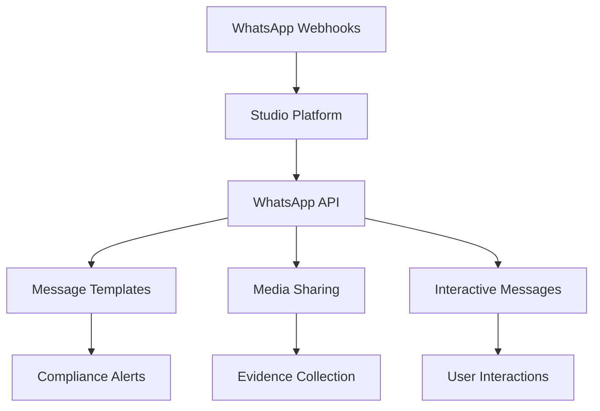
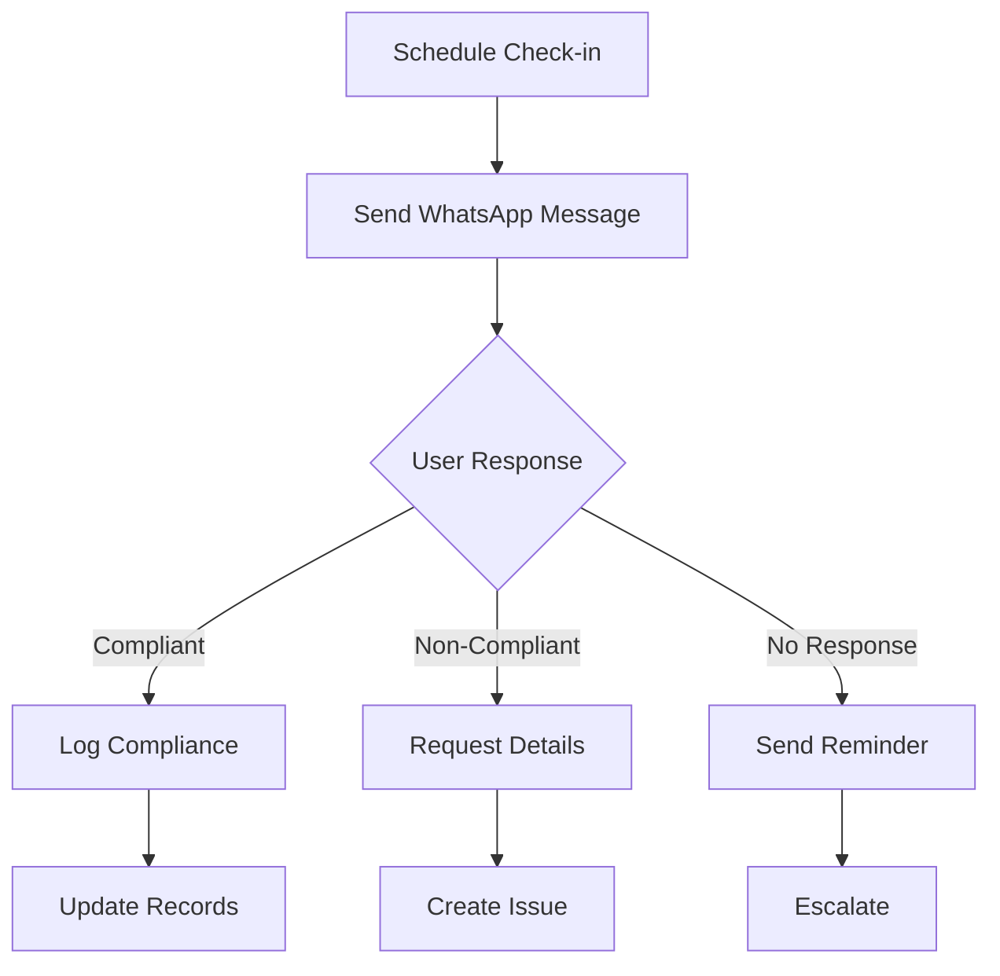

# WhatsApp Integration

WhatsApp Business Platform integration enables the Studio Platform to leverage WhatsApp's extensive messaging capabilities for compliance notifications, evidence collection, and team communication through the world's most popular messaging platform.

## 🎯 Integration Benefits

### Global Reach
- Connect with teams worldwide
- Mobile-first communication
- High engagement rates
- Cross-platform accessibility

### Real-Time Communication
- Instant compliance alerts
- Quick evidence sharing
- Mobile notifications
- Team coordination

### Workflow Integration
- Automated message sending
- Interactive message templates
- Media file sharing
- Status updates

## 🔧 Prerequisites

### WhatsApp Business Requirements
- WhatsApp Business API account
- Facebook Business verification
- Phone number for WhatsApp Business
- Meta Business Suite access

### Technical Requirements
- WhatsApp Business API client
- Webhook endpoint for receiving messages
- SSL certificate for webhook security
- Cloud hosting for API client

### Permissions Required
- WhatsApp Business API access
- Phone number verification
- Message template approval
- Webhook configuration permissions

## 📋 Setup Instructions

### Step 1: Set Up WhatsApp Business API

1. **Create Meta Business Account**
   ```
   https://business.facebook.com
   ```
   - Create or access existing business account
   - Verify business details
   - Add payment method

2. **Set Up WhatsApp Business Account**
   - Navigate to WhatsApp Manager
   - Create WhatsApp Business account
   - Add and verify phone number
   - Complete business verification

3. **Configure API Access**
   ```bash
   # Install WhatsApp Business API client
   curl -sL https://github.com/WhatsApp/flutter-web-api/releases/download/v2.42.2/whatsapp-business-api-client.tar.gz | tar -xz
   cd whatsapp-business-api-client
   npm install
   ```

### Step 2: Configure Webhooks

1. **Set Up Webhook Endpoint**
   ```python
   # Flask webhook handler example
   from flask import Flask, request
   
   app = Flask(__name__)
   
   @app.route('/webhooks/whatsapp', methods=['POST'])
   def whatsapp_webhook():
       data = request.json
       
       # Verify webhook
       if not verify_webhook_signature(request):
           return "Unauthorized", 401
       
       # Process message
       process_whatsapp_message(data)
       
       return "OK", 200
   ```

2. **Configure WhatsApp Webhooks**
   - Set webhook URL in WhatsApp Manager
   - Configure message events
   - Set up verification token
   - Test webhook connectivity

### Step 3: Configure Studio Platform Integration

1. **Access Integration Settings**
   - Navigate to Admin > Integrations
   - Select WhatsApp from available integrations

2. **Enter Connection Details**
   ```yaml
   whatsapp_config:
     api_url: "https://graph.facebook.com/v18.0"
     phone_number_id: "your-phone-number-id"
     access_token: "your-access-token"
     webhook_url: "https://studio.example.com/webhooks/whatsapp"
     webhook_verify_token: "your-verify-token"
     business_account_id: "your-business-account-id"
   ```

3. **Test Connection**
   - Click "Test Connection" button
   - Verify successful API response
   - Test webhook connectivity

## 🔍 Integration Features

### Integration Architecture


### Message Templates

#### Compliance Alert Templates
```yaml
message_templates:
  critical_alert:
    name: "compliance_critical_alert"
    category: "UTILITY"
    language: "en"
    components:
      - type: "header"
        format: "TEXT"
        text: "🚨 Critical Compliance Alert"
      - type: "body"
        text: "A critical compliance issue has been detected:\n\n*Issue:* {{1}}\n*Severity:* {{2}}\n*Action Required:* {{3}}\n\nPlease address this immediately."
      - type: "footer"
        text: "Studio Platform Compliance System"
    parameters:
      - type: "text"
        text: "issue_description"
      - type: "text"
        text: "severity_level"
      - type: "text"
        text: "required_action"
  
  evidence_request:
    name: "evidence_collection_request"
    category: "UTILITY"
    language: "en"
    components:
      - type: "header"
        format: "TEXT"
        text: "📋 Evidence Collection Request"
      - type: "body"
        text: "Evidence is required for compliance audit:\n\n*Audit:* {{1}}\n*Evidence Type:* {{2}}\n*Deadline:* {{3}}\n\nPlease upload the required evidence."
      - type: "button"
        text: "Upload Evidence"
        action: "upload_evidence"
    parameters:
      - type: "text"
        text: "audit_name"
      - type: "text"
        text: "evidence_type"
      - type: "text"
        text: "deadline"
```

#### Interactive Message Templates
```python
class WhatsAppMessageTemplates:
    @staticmethod
    def create_compliance_alert(issue_data):
        """Create compliance alert message"""
        return {
            "messaging_product": "whatsapp",
            "to": issue_data['phone_number'],
            "type": "template",
            "template": {
                "name": "compliance_critical_alert",
                "language": {"code": "en"},
                "components": [
                    {
                        "type": "body",
                        "parameters": [
                            {"type": "text", "text": issue_data['issue']},
                            {"type": "text", "text": issue_data['severity']},
                            {"type": "text", "text": issue_data['action']}
                        ]
                    }
                ]
            }
        }
    
    @staticmethod
    def create_evidence_request(request_data):
        """Create evidence collection request"""
        return {
            "messaging_product": "whatsapp",
            "to": request_data['phone_number'],
            "type": "template",
            "template": {
                "name": "evidence_collection_request",
                "language": {"code": "en"},
                "components": [
                    {
                        "type": "body",
                        "parameters": [
                            {"type": "text", "text": request_data['audit']},
                            {"type": "text", "text": request_data['evidence_type']},
                            {"type": "text", "text": request_data['deadline']}
                        ]
                    }
                ]
            }
        }
```

### Media Sharing

#### Evidence Collection via WhatsApp
```python
class WhatsAppEvidenceHandler:
    def __init__(self, whatsapp_client, studio_api):
        self.whatsapp = whatsapp_client
        self.studio = studio_api
    
    def handle_media_message(self, message_data):
        """Handle incoming media messages"""
        media_id = message_data['media_id']
        media_type = message_data['media_type']
        from_number = message_data['from']
        
        # Download media file
        media_content = self.download_media(media_id)
        
        # Upload to Studio Platform
        evidence_id = self.studio.upload_evidence(
            file_content=media_content,
            file_type=media_type,
            source="whatsapp",
            user_phone=from_number
        )
        
        # Send confirmation
        self.send_confirmation(from_number, evidence_id)
    
    def download_media(self, media_id):
        """Download media from WhatsApp"""
        url = f"https://graph.facebook.com/v18.0/{media_id}"
        headers = {"Authorization": f"Bearer {self.whatsapp.access_token}"}
        
        response = requests.get(url, headers=headers)
        media_data = response.json()
        
        # Download actual file
        file_response = requests.get(media_data['url'], headers=headers)
        return file_response.content
    
    def send_confirmation(self, phone_number, evidence_id):
        """Send upload confirmation"""
        message = {
            "messaging_product": "whatsapp",
            "to": phone_number,
            "type": "text",
            "text": {
                "body": f"✅ Evidence uploaded successfully! Evidence ID: {evidence_id}"
            }
        }
        
        self.whatsapp.send_message(message)
```

### Interactive Workflows

#### Compliance Check-in Workflow


#### Interactive Message Handling
```python
@app.route('/webhooks/whatsapp', methods=['POST'])
def handle_whatsapp_webhook():
    data = request.json
    
    # Handle different message types
    if data.get('object') == 'whatsapp_business_account':
        for entry in data.get('entry', []):
            for change in entry.get('changes', []):
                if change.get('field') == 'messages':
                    messages = change.get('value', {}).get('messages', [])
                    for message in messages:
                        process_message(message)
    
    return "OK", 200

def process_message(message):
    """Process incoming WhatsApp message"""
    message_type = message.get('type')
    from_number = message.get('from')
    
    if message_type == 'text':
        handle_text_message(message, from_number)
    elif message_type == 'image':
        handle_image_message(message, from_number)
    elif message_type == 'document':
        handle_document_message(message, from_number)
    elif message_type == 'interactive':
        handle_interactive_message(message, from_number)

def handle_interactive_message(message, from_number):
    """Handle interactive message responses"""
    interactive_response = message.get('interactive', {})
    button_reply = interactive_response.get('button_reply', {})
    
    button_id = button_reply.get('id')
    
    if button_id == 'upload_evidence':
        send_upload_instructions(from_number)
    elif button_id == 'mark_compliant':
        mark_compliance_status(from_number, True)
    elif button_id == 'mark_non_compliant':
        request_non_compliance_details(from_number)

def send_upload_instructions(phone_number):
    """Send instructions for evidence upload"""
    message = {
        "messaging_product": "whatsapp",
        "to": phone_number,
        "type": "text",
        "text": {
            "body": "📎 Please upload the evidence file directly to this chat. Supported formats: PDF, DOC, DOCX, JPG, PNG"
        }
    }
    
    whatsapp_client.send_message(message)
```

## 📊 Dashboard Integration

### WhatsApp Widgets
- **Message Statistics** - Sent/received messages
- **Response Rates** - User engagement metrics
- **Media Uploads** - Evidence collection stats
- **Delivery Status** - Message delivery rates

### Automated Reports
- **Communication Analytics** - Message effectiveness
- **Evidence Collection** - Upload patterns and trends
- **Response Metrics** - Team responsiveness
- **Usage Statistics** - Feature adoption rates

## 🔔 Alerting & Notifications

### Alert Configuration
```yaml
alert_configuration:
  critical_compliance:
    enabled: true
    recipients: ["+1234567890", "+0987654321"]
    template: "critical_alert"
    priority: "high"
    retry_attempts: 3
    
  evidence_deadline:
    enabled: true
    recipients: ["+1234567890"]
    template: "evidence_reminder"
    priority: "medium"
    schedule: "0 9 * * *"  # Daily at 9 AM
    
  compliance_check_in:
    enabled: true
    recipients: ["team_whatsapp_group"]
    template: "compliance_check_in"
    priority: "low"
    schedule: "0 10 * * 1"  # Weekly on Monday
```

### Notification Routing
```yaml
routing_rules:
  security_incidents:
    condition: "category == 'security' AND severity == 'critical'"
    recipients: ["security_team_lead", "compliance_manager"]
    template: "critical_alert"
    escalation: true
    
  audit_deadlines:
    condition: "type == 'deadline' AND days_remaining <= 2"
    recipients: ["auditor_phone"]
    template: "deadline_reminder"
    
  compliance_updates:
    condition: "type == 'status_update'"
    recipients: ["compliance_team_group"]
    template: "status_update"
```

## 🛠️ Advanced Configuration

### Custom Workflows

#### Automated Compliance Verification
```python
class WhatsAppComplianceWorkflow:
    def __init__(self, whatsapp_client, studio_api):
        self.whatsapp = whatsapp_client
        self.studio = studio_api
    
    def start_compliance_check(self, user_phone, compliance_area):
        """Start compliance verification via WhatsApp"""
        
        # Send initial check-in message
        check_in_message = {
            "messaging_product": "whatsapp",
            "to": user_phone,
            "type": "template",
            "template": {
                "name": "compliance_check_in",
                "language": {"code": "en"},
                "components": [
                    {
                        "type": "body",
                        "parameters": [
                            {"type": "text", "text": compliance_area}
                        ]
                    }
                ]
            }
        }
        
        self.whatsapp.send_message(check_in_message)
        
        # Schedule follow-up if no response
        self.schedule_follow_up(user_phone, compliance_area)
    
    def schedule_follow_up(self, phone_number, compliance_area):
        """Schedule follow-up message"""
        import threading
        import time
        
        def follow_up():
            time.sleep(3600)  # Wait 1 hour
            
            # Check if response received
            if not self.check_response_received(phone_number, compliance_area):
                self.send_reminder(phone_number, compliance_area)
        
        thread = threading.Thread(target=follow_up)
        thread.start()
```

### Media Processing

#### Automated Evidence Processing
```python
class WhatsAppMediaProcessor:
    def __init__(self, whatsapp_client, studio_api):
        self.whatsapp = whatsapp_client
        self.studio = studio_api
    
    def process_uploaded_media(self, message_data):
        """Process uploaded media files"""
        media_id = message_data['media_id']
        media_type = message_data['media_type']
        from_number = message_data['from']
        
        # Download media
        media_content = self.download_media(media_id)
        
        # Process based on type
        if media_type == 'image':
            self.process_image(media_content, from_number)
        elif media_type == 'document':
            self.process_document(media_content, from_number)
    
    def process_image(self, image_content, from_number):
        """Process uploaded image"""
        # OCR processing if needed
        text_content = self.extract_text_from_image(image_content)
        
        # Upload to Studio Platform
        evidence_id = self.studio.upload_evidence(
            file_content=image_content,
            file_type='image',
            metadata={'extracted_text': text_content},
            source='whatsapp',
            user_phone=from_number
        )
        
        return evidence_id
    
    def process_document(self, document_content, from_number):
        """Process uploaded document"""
        # Extract metadata
        document_metadata = self.extract_document_metadata(document_content)
        
        # Upload to Studio Platform
        evidence_id = self.studio.upload_evidence(
            file_content=document_content,
            file_type='document',
            metadata=document_metadata,
            source='whatsapp',
            user_phone=from_number
        )
        
        return evidence_id
```

## 🔒 Security Best Practices

### Data Protection
- Encrypt all media files
- Secure webhook endpoints
- Implement access controls
- Regular security audits

### Privacy Compliance
- Follow WhatsApp Business policies
- Obtain user consent
- Data retention policies
- GDPR compliance

### API Security
- Use secure access tokens
- Implement rate limiting
- Monitor API usage
- Token rotation policies

## 🐛 Troubleshooting

### Common Issues

#### Authentication Failures
```bash
# Test WhatsApp API authentication
curl -H "Authorization: Bearer YOUR_ACCESS_TOKEN" \
     https://graph.facebook.com/v18.0/me
```

#### Webhook Issues
```bash
# Test webhook endpoint
curl -X POST https://studio.example.com/webhooks/whatsapp \
     -H "Content-Type: application/json" \
     -d '{"test": "data"}'
```

#### Template Rejection
- Verify template approval status
- Check template parameters
- Review WhatsApp Business policies
- Ensure content compliance

### Debug Mode
```yaml
debug_config:
  enabled: true
  log_level: "debug"
  api_timeout: 60
  retry_attempts: 3
  detailed_logging: true
```

## 📈 Monitoring & Metrics

### Key Performance Indicators
- **Message Delivery Rate** - > 95%
- **Response Rate** - > 80%
- **Media Upload Success** - > 98%
- **System Availability** - 99.9% uptime

### Health Checks
```bash
# Check integration health
curl -X GET https://studio.example.com/api/integrations/whatsapp/health
```

## 🔄 Maintenance

### Regular Tasks
- **Weekly**: Review message metrics
- **Monthly**: Update template configurations
- **Quarterly**: Security audit
- **Annually**: Integration review

### Updates & Upgrades
- Test WhatsApp API changes in staging
- Review breaking changes
- Update integration configuration
- Validate functionality

## 📞 Support

### Resources
- [WhatsApp Business API Documentation](https://developers.facebook.com/docs/whatsapp/)
- [WhatsApp Business Platform](https://www.whatsapp.com/business)
- [Studio Platform API Reference](../developer-guide/api-reference.md)

### Getting Help
1. Check troubleshooting section
2. Review WhatsApp Business logs
3. Contact support team
4. Submit GitHub issue

---

!!! tip "Best Practice"
    Use message templates for compliance communications to ensure consistency and maintain WhatsApp Business policy compliance.

!!! warning "Rate Limits"
    Be aware of WhatsApp Business API rate limits. Implement appropriate throttling and caching strategies for high-volume operations.

!!! note "User Consent"
    Always obtain proper user consent before sending messages and ensure compliance with WhatsApp Business policies and data protection regulations.
