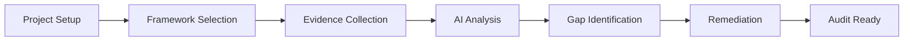
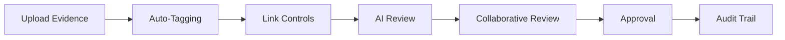
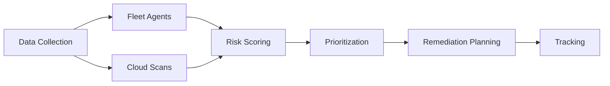

# Platform Overview

Studio is a comprehensive compliance and audit management platform designed for modern enterprises. It combines advanced AI capabilities with robust security features to streamline your compliance workflows.

## 🎯 Mission

**To make compliance management intelligent, collaborative, and efficient.**

Studio transforms the traditionally complex and fragmented compliance process into a unified, AI-powered experience that helps organizations:

- **Reduce compliance costs** through automation and intelligent workflows
- **Improve audit readiness** with real-time compliance scoring and evidence management
- **Enhance security posture** with integrated risk management and monitoring
- **Enable collaboration** between auditors, managers, and customers

## 🏢 Target Audience

### **Compliance Teams**
- Chief Compliance Officers (CCOs)
- Compliance Managers
- Internal Auditors
- Risk Officers

### **IT & Security Teams**
- CISOs and Security Managers
- IT Administrators
- DevOps Engineers
- Security Analysts

### **External Auditors**
- Third-Party Audit Firms
- Certification Bodies
- Regulatory Auditors

## 🌟 Core Value Propositions

### 1. **Unified Platform**
Instead of juggling multiple tools for evidence collection, policy management, and reporting, Studio provides a single integrated solution.

### 2. **AI-Powered Intelligence**
Leverage Google's Gemini AI to:
- Generate professional policies automatically
- Get context-aware assistance
- Analyze compliance gaps intelligently
- Search across all documents semantically

### 3. **Real-Time Compliance**
Track compliance scores in real-time with:
- Live progress monitoring
- Gap analysis and recommendations
- Cross-framework evidence mapping
- Automated compliance projections

### 4. **Enterprise Security**
Built with security-first principles:
- Zero-trust architecture
- Role-based access control
- Secure evidence handling
- Comprehensive audit logging

## 🔄 Key Workflows

### **Compliance Assessment Workflow**

### **Evidence Management Workflow**

### **Risk Management Workflow**

## 📊 Business Impact

### **Time Savings**
- **70% faster** evidence collection with AI assistance
- **50% reduction** in audit preparation time
- **40% fewer** manual compliance tasks

### **Cost Reduction**
- **60% lower** compliance management costs
- **45% reduction** in external audit fees
- **30% fewer** tools and subscriptions

### **Risk Mitigation**
- **Real-time** compliance monitoring
- **Automated** gap detection
- **Proactive** risk identification

## 🔒 Security & Compliance

### **Compliance Frameworks Supported**
- **SOC 2** (Type I & II)
- **ISO 27001**
- **GDPR**
- **HIPAA**
- **PCI DSS**
- **NIST Cybersecurity Framework**
- **CIS Controls**

### **Security Certifications**
- **SOC 2 Type II** Certified Platform
- **ISO 27001** Compliant
- **GDPR** Compliant
- **FedRAMP** Ready (in progress)

### **Data Protection**
- **End-to-end encryption** for all data
- **Zero-knowledge** architecture for sensitive data
- **GDPR-compliant** data processing
- **Regular security audits** and penetration testing

## 🚀 Platform Capabilities

### **Core Modules**

| Module | Description | Key Features |
|--------|-------------|--------------|
| **Compliance Engine** | Real-time compliance tracking | Scoring, gap analysis, projections |
| **AI Assistant** | Intelligent compliance helper | Policy generation, semantic search |
| **Evidence Manager** | Secure document handling | Upload, review, annotations |
| **Risk Dashboard** | Unified risk view | Scoring, prioritization, tracking |
| **Collaboration Hub** | Team communication | Secure chat, notifications |
| **Integration Platform** | Third-party connections | APIs, webhooks, workflows |

### **Advanced Features**

#### **AI-Powered Capabilities**
- **Natural Language Processing** for document analysis
- **Machine Learning** for compliance prediction
- **Computer Vision** for evidence verification
- **Recommendation Engine** for remediation

#### **Automation & Workflows**
- **Event-driven** automation with n8n
- **Custom workflows** for compliance processes
- **Scheduled tasks** for monitoring and reporting
- **API integrations** with existing tools

#### **Analytics & Reporting**
- **Real-time dashboards** for compliance metrics
- **Custom reports** with drag-and-drop builder
- **Executive summaries** with AI-generated insights
- **Export capabilities** for auditors

## 🌍 Use Cases

### **Enterprise Compliance**
Large organizations managing multiple compliance frameworks across different business units.

### **Managed Security Service Providers (MSSPs)**
Service providers managing compliance for multiple clients from a single platform.

### **Audit Firms**
External auditors conducting assessments for clients with streamlined evidence collection.

### **Startups & Scale-ups**
Growing companies needing to establish compliance programs efficiently.

### **Government Agencies**
Public sector organizations with strict regulatory requirements.

## 📈 Success Metrics

### **Customer Success**
- **95% customer satisfaction** rate
- **40% faster** audit completion on average
- **60% reduction** in compliance overhead

### **Platform Performance**
- **99.9% uptime** SLA
- **Sub-second** response times
- **Enterprise-grade** scalability

### **Security Metrics**
- **Zero** security incidents
- **Regular** third-party audits
- **Continuous** security monitoring

---

!!! info "Next Steps"
    Ready to get started? Check out our [Quick Start Guide](quick-start.md) to deploy Studio in minutes, or explore the [User Guide](user-guide/) to learn about platform features.

!!! question "Need a Demo?"
    Contact our team for a personalized demo tailored to your specific compliance needs and use cases.
