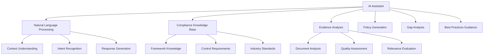
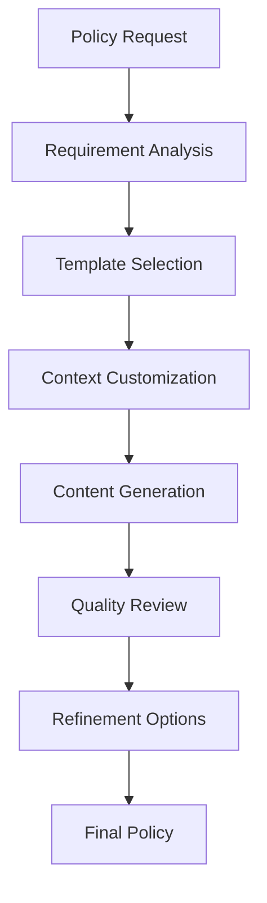
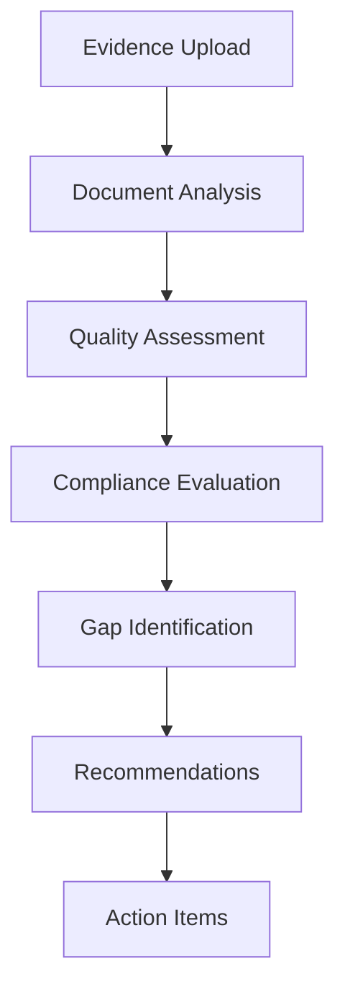

# AI Assistant

The Studio Platform AI Assistant is your intelligent compliance partner, powered by Google's Gemini AI. This comprehensive guide covers how to leverage AI for policy generation, compliance analysis, evidence review, and strategic guidance.

## 🤖 AI Assistant Overview

### **What is the AI Assistant?**

The AI Assistant is an advanced artificial intelligence system that understands compliance frameworks, analyzes evidence, and provides intelligent guidance for your compliance activities. It combines natural language processing with domain-specific knowledge to deliver context-aware assistance.

#### **Core Capabilities**



#### **AI Model Information**

**Technology Stack:**
- **Primary Model** - Google Gemini 2.5 Flash
- **Knowledge Base** - Comprehensive compliance framework database
- **Processing** - Real-time natural language processing
- **Integration** - Seamless platform integration
- **Security** - Enterprise-grade data protection

**AI Features:**
- **Context Awareness** - Understands your current context and role
- **Multi-Language Support** - Communicate in multiple languages
- **Function Calling** - Execute platform tools autonomously
- **Learning Capability** - Improves with user interactions
- **Privacy Protection** - Data processed with privacy safeguards

## 🎯 Getting Started with AI Assistant

### **Accessing the AI Assistant**

#### **Access Methods**

**Primary Access Points:**
- **Dashboard Widget** - Quick access from main dashboard
- **Sidebar Menu** - Dedicated AI Assistant section
- **Contextual Help** - AI help throughout the platform
- **Mobile App** - Full AI functionality on mobile

**Access Interface:**
```
🤖 AI Assistant
   Status: Online | Response Time: < 2 seconds
   Model: Gemini 2.5 Flash | Knowledge Base: Updated
   
   Quick Actions:
   💬 Start Conversation
   📝 Generate Policy
   🔍 Analyze Evidence
   📊 Compliance Review
   💡 Get Recommendations
```

### **First Interaction**

#### **Initial Setup**

**Welcome Process:**
1. **Introduction** - AI introduces capabilities
2. **Role Understanding** - AI learns your role and context
3. **Preference Setup** - Configure AI interaction preferences
4. **Privacy Settings** - Configure data privacy options
5. **Tutorial** - Interactive AI assistant tutorial

**Role Configuration:**
```
👤 User Role Setup
   Current Role: Compliance Manager
   Team: IT Security Team
   Frameworks: SOC 2, ISO 27001
   Experience Level: Advanced
   
   AI Understanding:
   ✅ Your responsibilities and priorities
   ✅ Relevant compliance frameworks
   ✅ Team structure and workflows
   ✅ Current projects and deadlines
```

## 💬 Conversational AI

### **Natural Language Interaction**

#### **Conversation Capabilities**

**Supported Interactions:**
- **Questions** - Ask compliance-related questions
- **Requests** - Request specific actions or analysis
- **Discussions** - Engage in detailed compliance discussions
- **Guidance** - Get step-by-step guidance
- **Clarification** - Request clarification on complex topics

**Conversation Example:**
```
👤 User: "I'm working on SOC 2 control A6.1 for incident response. What evidence do I need?"

🤖 AI: "For SOC 2 A6.1 (Incident Response), you'll need:
   
   📋 Required Evidence:
   1. Incident Response Plan (comprehensive)
   2. Incident Response Procedures (step-by-step)
   3. Incident Response Team assignments
   4. Incident Response testing records
   5. Incident logs and documentation
   
   🎯 Best Practices:
   - Include specific response timelines
   - Define severity levels and escalation procedures
   - Document communication protocols
   - Include post-incident review processes
   
   Would you like me to help you create any of these documents?"
```

#### **Context Awareness**

**Context Understanding:**
- **Project Context** - Knows current projects and frameworks
- **Role Context** - Understands your role and responsibilities
- **Team Context** - Aware of team structure and assignments
- **History Context** - Remembers previous conversations
- **Deadline Context** - Considers upcoming deadlines and priorities

**Context Example:**
```
👤 User: "How am I doing on my Q4 SOC 2 project?"

🤖 AI: "Based on your Q4 SOC 2 Type II project:
   
   📊 Current Status: 78% compliance score
   📈 Progress: On track with +5% improvement this month
   ⏰ Timeline: 75% complete, on schedule for Dec 15 completion
   👥 Team Performance: All team members on track
   
   🎯 Key Achievements:
   - Completed all Security Common Criteria controls
   - Excellent evidence quality (85% average)
   - Team productivity above target
   
   ⚠️ Areas for Attention:
   - 3 critical gaps in Availability controls
   - Evidence review for A6.1 overdue
   - Risk assessment for A7.1 needs update
   
   📝 Recommended Actions:
   1. Focus on Availability controls this week
   2. Complete evidence review backlog
   3. Update risk assessments
   
   Would you like me to help prioritize these tasks?"
```

### **Advanced Conversation Features**

#### **Multi-Turn Conversations**

**Conversation Flow:**
- **Context Retention** - Remembers previous messages
- **Topic Tracking** - Follows conversation topics
- **Reference Resolution** - Understands pronouns and references
- **Coherence** - Maintains logical conversation flow

**Multi-Turn Example:**
```
👤 User: "I need help with our incident response plan."

🤖 AI: "I can help you create a comprehensive incident response plan. 
       What specific aspects do you need help with?"

👤 User: "The response procedures and team roles."

🤖 AI: "For incident response procedures, I recommend:
       
       📋 Response Procedures:
       1. Incident Detection and Reporting
       2. Incident Classification and Prioritization
       3. Response Coordination
       4. Communication Protocols
       5. Documentation and Reporting
       
       👥 Team Roles:
       - Incident Response Manager
       - Technical Lead
       - Communications Lead
       - Legal/Compliance Liaison
       
       Would you like me to generate detailed procedures for any of these?"

👤 User: "Yes, for the detection and reporting procedures."

🤖 AI: "Here are detailed incident detection and reporting procedures:
       [Generates comprehensive procedures with specific steps and timelines]
       
       Does this align with your current incident response capabilities?"
```

#### **Specialized Conversations**

**Compliance Discussions:**
- **Framework-Specific** - Deep knowledge of compliance frameworks
- **Industry-Specific** - Industry-relevant compliance guidance
- **Role-Specific** - Tailored advice for different roles
- **Project-Specific** - Context-aware project guidance

**Example Specialized Conversation:**
```
👤 User: "As a fintech startup, what GDPR considerations should I prioritize?"

🤖 AI: "For fintech startups, GDPR priorities should focus on:
       
       🎯 Critical GDPR Areas for Fintech:
       1. Data Processing Records (Art. 30)
       2. Data Protection Impact Assessments (Art. 35)
       3. Data Subject Rights Implementation (Arts. 15-22)
       4. Data Breach Notification (Art. 33)
       5. International Data Transfers (Ch. 5)
       
       💡 Fintech-Specific Considerations:
       - Financial data classification
       - Transaction processing records
       - Customer consent management
       - Third-party processor agreements
       - Regulatory reporting requirements
       
       📊 Risk Assessment:
       High Risk: Payment processing data, customer financial information
       Medium Risk: Transaction metadata, user behavior data
       Low Risk: Marketing data, analytics data
       
       Would you like me to help you create a GDPR implementation plan?"
```

## 📝 Policy Generation

### **AI-Powered Policy Creation**

#### **Policy Generation Process**



**Policy Generation Workflow:**
1. **Requirement Analysis** - AI analyzes your specific requirements
2. **Template Selection** - Chooses appropriate policy template
3. **Context Customization** - Customizes for your organization
4. **Content Generation** - Generates comprehensive policy content
5. **Quality Review** - Reviews for completeness and accuracy
6. **Refinement Options** - Provides refinement suggestions
7. **Final Policy** - Delivers final policy document

#### **Policy Templates**

**Available Policy Templates:**
- **Information Security Policy** - Comprehensive security framework
- **Acceptable Use Policy** - Technology and resource usage
- **Incident Response Policy** - Security incident management
- **Data Classification Policy** - Data classification and handling
- **Access Control Policy** - User access management
- **Backup and Recovery Policy** - Data backup procedures
- **Vendor Management Policy** - Third-party risk management
- **Remote Work Policy** - Remote work security requirements

**Policy Generation Example:**
```
👤 User: "Generate a data classification policy for our healthcare organization."

🤖 AI: "I'll create a comprehensive data classification policy for healthcare:
       
       📋 Data Classification Policy for Healthcare
       
       1. Purpose and Scope
       2. Classification Levels
          - Public
          - Internal
          - Confidential
          - Restricted (PHI)
       3. Classification Criteria
       4. Handling Requirements
       5. Access Controls
       6. Storage and Transmission
       7. Retention and Disposal
       8. Employee Responsibilities
       9. Incident Response
       10. Policy Review and Updates
       
       🏥 Healthcare-Specific Sections:
       - PHI identification and labeling
       - HIPAA compliance requirements
       - Patient data handling procedures
       - Medical record access controls
       - Research data classification
       
       Would you like me to customize any sections for your specific healthcare operations?"
```

### **Policy Customization

#### **Contextual Customization**

**Customization Factors:**
- **Industry** - Industry-specific requirements and standards
- **Company Size** - Scale-appropriate policies
- **Geography** - Regional and international requirements
- **Technology Stack** - Technology-specific considerations
- **Business Model** - Business process alignment

**Customization Example:**
```
👤 User: "Customize the incident response policy for our 50-employee SaaS company."

🤖 AI: "I'll customize the incident response policy for your SaaS company:
       
       🏢 Company-Specific Customizations:
       
       📊 Scale Considerations:
       - Incident Response Team: 3-5 members (vs. 10+ in enterprise)
       - Response Times: 1-hour critical response (vs. 30-min enterprise)
       - Escalation: Direct to CEO (vs. multi-layer enterprise)
       
       🌐 SaaS-Specific Sections:
       - Service Availability Incidents
       - Customer Data Breaches
       - Service Provider Incidents
       - Multi-tenant Isolation Incidents
       
       👥 Team Structure:
       - Technical Lead (Primary responder)
       - Customer Success (Customer communication)
       - CEO/Founder (Executive decisions)
       - Legal Counsel (Legal guidance)
       
       ⏰ Response Timelines:
       - Critical: 1 hour detection, 4 hour containment
       - High: 4 hour detection, 24 hour containment
       - Medium: 24 hour detection, 72 hour containment
       - Low: 72 hour detection, 1 week containment
       
       Does this structure align with your current team capabilities?"
```

#### **Policy Refinement

**Refinement Options:**
- **Content Enhancement** - Add specific sections or details
- **Compliance Alignment** - Ensure compliance with specific frameworks
- **Risk Mitigation** - Add risk-specific provisions
- **Operational Details** - Add operational procedures
- **Review and Approval** - Facilitate review processes

**Refinement Example:**
```
👤 User: "Add SOC 2 compliance requirements to the incident response policy."

🤖 AI: "I'll enhance the policy with SOC 2 compliance requirements:
       
       🔒 SOC 2 Compliance Enhancements:
       
       A6.1 - Incident Response:
       ✅ Added detection procedures
       ✅ Added response timelines
       ✅ Added communication protocols
       ✅ Added documentation requirements
       
       A6.2 - Incident Response Testing:
       ✅ Added testing procedures
       ✅ Added test frequency requirements
       ✅ Added test documentation
       
       A6.3 - Incident Communication:
       ✅ Added internal communication
       ✅ Added external communication
       ✅ Added regulatory notification
       
       📋 Additional SOC 2 Sections:
       - Incident Classification Criteria
       - Severity Level Definitions
       - Escalation Procedures
       - Post-Incident Review Requirements
       
       The policy now fully addresses SOC 2 A6 requirements. Would you like me to add any other framework requirements?"
```

## 🔍 Evidence Analysis

### **AI-Powered Evidence Review

#### **Evidence Analysis Process**



**Analysis Capabilities:**
- **Document Understanding** - Comprehend document content and context
- **Quality Assessment** - Evaluate evidence quality and completeness
- **Compliance Evaluation** - Assess compliance with control requirements
- **Gap Identification** - Identify missing or insufficient evidence
- **Recommendations** - Provide improvement suggestions

#### **Quality Assessment**

**Quality Criteria:**
- **Completeness** - Addresses all control requirements
- **Accuracy** - Information is factual and correct
- **Currency** - Information is current and valid
- **Clarity** - Content is clear and understandable
- **Relevance** - Directly addresses control requirements

**Quality Assessment Example:**
```
📄 Evidence Analysis: Security Policy v2.1
   Control: SOC 2 A1.1 - Information Security Policies
   Uploaded by: Jane Smith | Size: 2.4 MB | Pages: 15
   
   🤖 AI Quality Assessment: 92% (Excellent)
   
   Quality Breakdown:
   ✅ Completeness: 95% - Covers all required elements
   ✅ Accuracy: 92% - No factual errors detected
   ✅ Currency: 88% - Recent update with current date
   ✅ Clarity: 94% - Well-written and organized
   ✅ Relevance: 95% - Directly addresses SOC 2 A1.1
   
   💡 Strengths:
   - Comprehensive coverage of security topics
   - Clear organizational structure
   - Recent update with current standards
   - Professional formatting and presentation
   
   ⚠️ Improvement Opportunities:
   - Add specific incident response timeline
   - Include emergency contact information
   - Add remote work security procedures
   - Include vendor management procedures
   
   🎯 Recommendation: Approve with minor improvements suggested
```

### **Compliance Evaluation

#### **Control Mapping**

**Mapping Process:**
- **Requirement Analysis** - Understand control requirements
- **Content Analysis** - Analyze evidence content
- **Mapping Assessment** - Evaluate evidence-to-control mapping
- **Gap Analysis** - Identify coverage gaps
- **Compliance Score** - Calculate compliance percentage

**Compliance Evaluation Example:**
```
📊 Compliance Evaluation: Access Control Policy
   Evidence: Access Control Policy v3.0
   Controls: SOC 2 A7.1, A7.2, A7.3, A7.4
   
   🤖 AI Compliance Assessment:
   
   Control Coverage Analysis:
   ✅ A7.1 - Access Control Program: 95% coverage
   ✅ A7.2 - Access Control Mechanisms: 88% coverage
   ✅ A7.3 - Access Control Reviews: 82% coverage
   ✅ A7.4 - Remote Access: 75% coverage
   
   📈 Overall Compliance Score: 85%
   
   🎯 Strengths:
   - Comprehensive access control framework
   - Detailed user access procedures
   - Regular review schedule
   - Multi-factor authentication requirements
   
   ⚠️ Identified Gaps:
   - A7.2: Limited privileged access procedures
   - A7.3: Missing automated review processes
   - A7.4: Insufficient remote access monitoring
   
   💡 Recommendations:
   1. Enhance privileged access management
   2. Implement automated access review tools
   3. Strengthen remote access monitoring
   
   📋 Action Items:
   - Update privileged access procedures (Priority: High)
   - Research automated review solutions (Priority: Medium)
   - Enhance remote access logging (Priority: Medium)
```

### **Gap Analysis**

#### **Automated Gap Detection**

**Gap Detection Process:**
- **Requirement Comparison** - Compare evidence to requirements
- **Missing Element Identification** - Identify missing requirements
- **Insufficient Coverage** - Identify partial coverage
- **Quality Issues** - Identify quality deficiencies
- **Risk Assessment** - Evaluate gap impact

**Gap Analysis Example:**
```
🔍 Gap Analysis: Incident Response Documentation
   Evidence: Current incident response documentation
   Target: SOC 2 A6.1, A6.2, A6.3
   
   🤖 AI Gap Analysis Results:
   
   📊 Gap Score: 22% (Target: <10%)
   
   🔴 Critical Gaps:
   1. Missing incident response testing procedures (A6.2)
   2. No documented communication protocols (A6.3)
   3. Incident classification criteria not defined (A6.1)
   
   🟡 Moderate Gaps:
   1. Limited post-incident review procedures (A6.1)
   2. Incomplete escalation procedures (A6.1)
   3. Missing regulatory notification procedures (A6.3)
   
   🟢 Minor Gaps:
   1. Response timeframes not specified (A6.1)
   2. Team role definitions need clarification (A6.1)
   
   🎯 Prioritized Actions:
   1. Develop incident response testing procedures (Critical)
   2. Document communication protocols (Critical)
   3. Define incident classification criteria (Critical)
   4. Enhance post-incident review procedures (Medium)
   
   📅 Recommended Timeline:
   Week 1: Critical gaps
   Week 2-3: Moderate gaps
   Week 4: Minor gaps
   
   📊 Expected Impact:
   - Gap reduction: 22% → 8%
   - Compliance score improvement: 78% → 88%
   - Risk reduction: High → Medium
```

## 📊 Strategic Guidance

### **Compliance Strategy

#### **Strategic Planning Assistance**

**Strategic Analysis:**
- **Current State Assessment** - Evaluate current compliance posture
- **Target State Definition** - Define compliance objectives
- **Gap Analysis** - Identify strategic gaps
- **Roadmap Development** - Create improvement roadmap
- **Resource Planning** - Optimize resource allocation

**Strategic Guidance Example:**
```
🎯 Strategic Compliance Assessment
   Organization: Mid-size SaaS company
   Current Frameworks: SOC 2, GDPR
   Target Frameworks: SOC 2, GDPR, ISO 27001
   
   🤖 AI Strategic Analysis:
   
   📊 Current State:
   - SOC 2: 78% compliance (Good)
   - GDPR: 82% compliance (Good)
   - Team Capability: Strong
   - Resource Allocation: Adequate
   
   🎯 Target State (12 months):
   - SOC 2: 90% compliance (Excellent)
   - GDPR: 90% compliance (Excellent)
   - ISO 27001: 85% compliance (Good)
   - Team Capability: Enhanced
   
   📈 Strategic Recommendations:
   
   1. 🎯 Phase 1 (Months 1-3): SOC 2 Enhancement
      - Focus on critical controls
      - Improve evidence quality
      - Address high-risk gaps
   
   2. 🎯 Phase 2 (Months 4-6): GDPR Optimization
      - Enhance data protection procedures
      - Improve privacy controls
      - Strengthen documentation
   
   3. 🎯 Phase 3 (Months 7-9): ISO 27001 Implementation
      - Framework gap analysis
      - ISMS implementation
      - Certification preparation
   
   4. 🎯 Phase 4 (Months 10-12): Integration & Optimization
      - Cross-framework optimization
      - Process automation
      - Continuous improvement
   
   💡 Success Factors:
   - Executive sponsorship
   - Adequate resource allocation
   - Regular progress monitoring
   - Continuous training and awareness
```

### **Risk Management

#### **Risk Assessment and Mitigation

**Risk Analysis:**
- **Risk Identification** - Identify compliance risks
- **Risk Assessment** - Evaluate risk likelihood and impact
- **Risk Prioritization** - Prioritize risks by severity
- **Mitigation Planning** - Develop risk mitigation strategies
- **Monitoring** - Continuous risk monitoring

**Risk Management Example:**
```
⚠️ Compliance Risk Assessment
   Assessment Period: Q4 2024
   Frameworks: SOC 2, GDPR, ISO 27001
   
   🤖 AI Risk Analysis:
   
   🎯 Identified Risks:
   
   1. 🔴 High Risk: SOC 2 Availability Control Gaps
      - Likelihood: Medium
      - Impact: High
      - Business Impact: Service availability, customer trust
      - Mitigation: Implement backup and disaster recovery procedures
   
   2. 🟡 Medium Risk: GDPR Data Processing Records
      - Likelihood: Medium
      - Impact: Medium
      - Business Impact: Regulatory penalties, compliance costs
      - Mitigation: Complete data processing inventory
   
   3. 🟡 Medium Risk: ISO 27001 Physical Security
      - Likelihood: Low
      - Impact: Medium
      - Business Impact: Physical security incidents
      - Mitigation: Enhance physical security controls
   
   📊 Risk Matrix:
   High Risk: 1 issue | Medium Risk: 2 issues | Low Risk: 3 issues
   
   🎯 Risk Mitigation Strategy:
   
   Immediate Actions (Week 1):
   - Address SOC 2 availability gaps
   - Complete GDPR data processing records
   
   Short-term Actions (Month 1):
   - Implement ISO 27001 physical security
   - Enhance risk monitoring procedures
   
   Long-term Actions (Quarter 1):
   - Establish continuous risk monitoring
   - Implement automated risk assessment tools
   
   📈 Expected Risk Reduction:
   - High Risk: 1 → 0 issues
   - Medium Risk: 2 → 1 issue
   - Low Risk: 3 → 2 issues
   - Overall Risk Level: High → Medium
```

## 🎯 Best Practices

### **AI Assistant Best Practices**

#### **Effective AI Interaction**

**Communication Best Practices:**
- **Be Specific** - Provide detailed context and requirements
- **Be Clear** - Use clear, unambiguous language
- **Provide Context** - Include relevant background information
- **Iterate** - Refine requests based on AI responses
- **Validate** - Review AI-generated content for accuracy

**Prompt Engineering Tips:**
```
✅ Effective Prompts:
   "Generate a data retention policy for our fintech startup that processes customer financial data and must comply with GDPR and PCI DSS requirements. Include specific retention periods for different data categories."

❌ Less Effective Prompts:
   "Write a data retention policy."
   
   📝 Key Elements of Good Prompts:
   - Specific industry context (fintech)
   - Data types mentioned (financial data)
   - Compliance frameworks (GDPR, PCI DSS)
   - Specific requirements (retention periods)
```

#### **Quality Assurance**

**Review Process:**
- **Content Validation** - Review AI-generated content for accuracy
- **Compliance Verification** - Ensure compliance with requirements
- **Context Appropriateness** - Verify content fits your context
- **Legal Review** - Legal review for policy documents
- **Stakeholder Approval** - Obtain appropriate approvals

**Quality Checklist:**
- [ ] Content is accurate and factual
- [ ] Addresses all requirements
- [ ] Fits organizational context
- [ ] Meets quality standards
- [ ] Aligns with strategic objectives
- [ ] Has appropriate approvals

### **Common AI Mistakes to Avoid**

❌ **Avoid These Mistakes:**
- Using vague or ambiguous prompts
- Not providing sufficient context
- Accepting AI output without review
- Ignoring AI recommendations and insights
- Not iterating on AI responses

✅ **Follow These Best Practices:**
- Provide specific, detailed prompts
- Include relevant context and background
- Review and validate AI-generated content
- Leverage AI insights and recommendations
- Iterate and refine AI interactions

---

!!! tip **Continuous Learning**
    The AI Assistant learns from your interactions. Provide feedback on AI responses to improve future performance and accuracy.

!!! note **Privacy Protection**
    All AI interactions are processed with enterprise-grade privacy protection. Your data is never used to train public AI models.

!!! question **Need Help?**
    Check our [Troubleshooting Guide](../troubleshooting/) for common AI Assistant issues, or contact our support team for personalized assistance.
