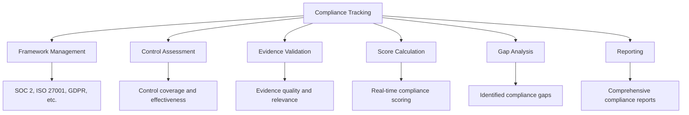
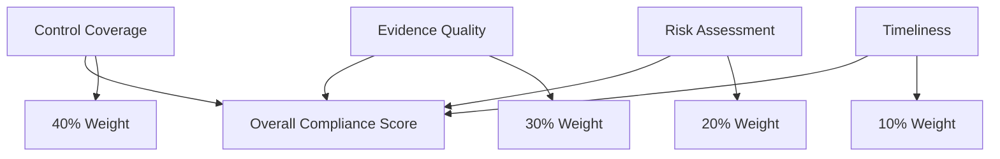
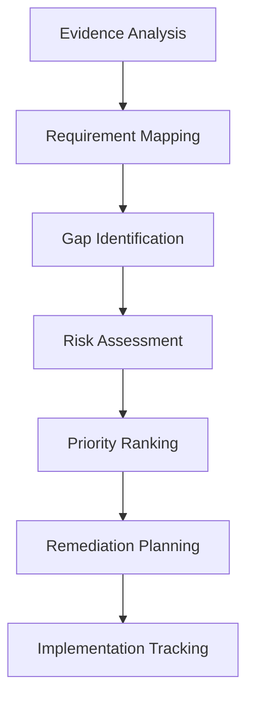
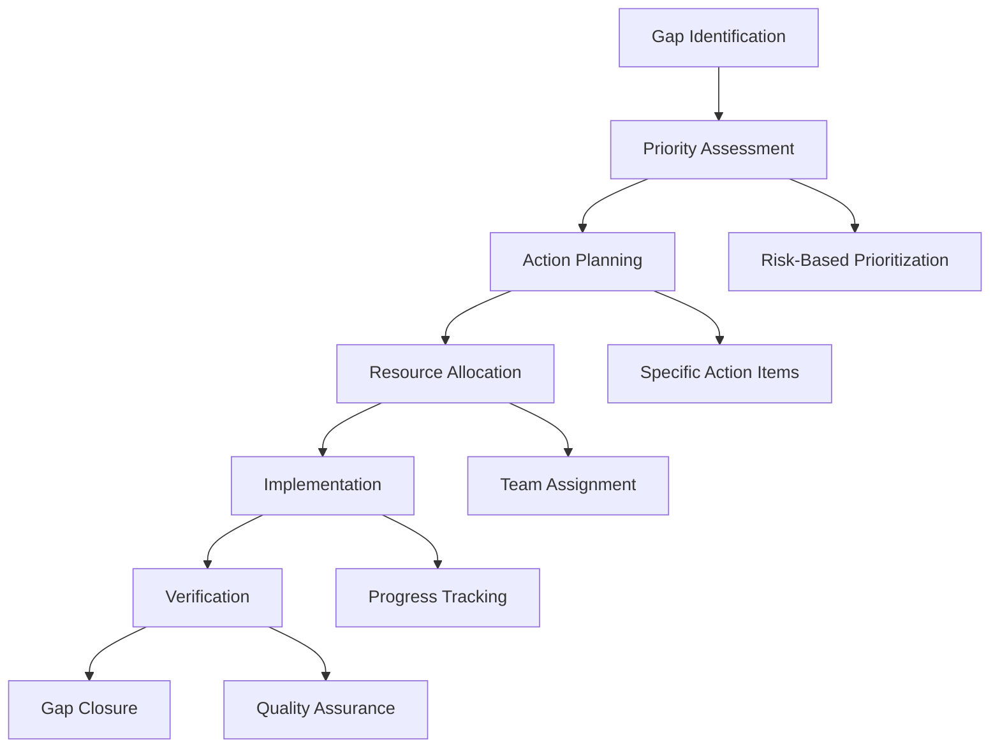

# Compliance Tracking

Compliance tracking is the core function of Studio Platform, providing real-time visibility into your compliance posture across multiple frameworks. This comprehensive guide covers everything from score calculation to gap analysis and continuous monitoring.

## 📊 Compliance Overview

### **What is Compliance Tracking?**

Compliance tracking is the systematic process of monitoring, measuring, and reporting your organization's adherence to regulatory requirements and internal controls. Studio Platform provides automated compliance tracking with AI-powered insights and real-time scoring.

#### **Key Components**



### **Compliance Frameworks**

#### **Supported Frameworks**

| Framework | Type | Controls | Typical Duration | Complexity |
|-----------|------|----------|------------------|------------|
| **SOC 2 Type I** | Assessment | 64-90 | 2-4 weeks | Medium |
| **SOC 2 Type II** | Assessment | 64-90 | 6-12 months | High |
| **ISO 27001** | Certification | 114 (Annex A) | 3-6 months | High |
| **GDPR** | Compliance | 99 Articles | Ongoing | Medium |
| **HIPAA** | Compliance | 18+ Requirements | Ongoing | Medium |
| **PCI DSS** | Assessment | 12 Requirements | 4-8 weeks | High |
| **NIST CSF** | Assessment | 108 Functions | 8-12 weeks | Medium |

#### **Framework Categories**

**Security Frameworks:**
- **SOC 2** - Service Organization Control 2
- **ISO 27001** - Information Security Management
- **PCI DSS** - Payment Card Industry Data Security Standard
- **NIST CSF** - Cybersecurity Framework

**Privacy Frameworks:**
- **GDPR** - General Data Protection Regulation
- **CCPA** - California Consumer Privacy Act
- **HIPAA** - Health Insurance Portability and Accountability Act

**Industry-Specific:**
- **FINRA** - Financial Industry Regulatory Authority
- **FISMA** - Federal Information Security Management Act
- **GLBA** - Gramm-Leach-Bliley Act

## 🎯 Compliance Scoring

### **Score Calculation Methodology**

#### **Scoring Formula**



**Score Calculation:**
```
Overall Score = (Control Coverage × 0.4) + (Evidence Quality × 0.3) + (Risk Assessment × 0.2) + (Timeliness × 0.1)

Example Calculation:
- Control Coverage: 75% × 0.4 = 30%
- Evidence Quality: 85% × 0.3 = 25.5%
- Risk Assessment: 80% × 0.2 = 16%
- Timeliness: 90% × 0.1 = 9%
Overall Score: 80.5%
```

#### **Component Breakdown**

**Control Coverage (40% Weight):**
- **Controls with Evidence** - Percentage of controls with supporting evidence
- **Evidence Completeness** - How well evidence addresses control requirements
- **Control Implementation** - Actual implementation of control measures
- **Documentation Quality** - Quality of control documentation

**Evidence Quality (30% Weight):**
- **AI Quality Assessment** - Automated quality scoring
- **Human Review Scores** - Manual quality evaluations
- **Evidence Relevance** - How relevant evidence is to controls
- **Documentation Standards** - Adherence to documentation standards

**Risk Assessment (20% Weight):**
- **Risk Identification** - Identification of compliance risks
- **Risk Mitigation** - Effectiveness of risk mitigation measures
- **Residual Risk** - Remaining risk after mitigation
- **Risk Monitoring** - Ongoing risk monitoring processes

**Timeliness (10% Weight):**
- **Evidence Currency** - How current the evidence is
- **Update Frequency** - Regularity of evidence updates
- **Review Timeliness** - How quickly evidence is reviewed
- **Response Time** - Time to address compliance issues

### **Score Ranges and Interpretation**

#### **Score Classification**

| Score Range | Status | Color | Action Required | Business Impact |
|-------------|--------|-------|-----------------|----------------|
| **90-100%** | Excellent | 🟢 Green | Maintain current practices | Minimal risk |
| **80-89%** | Good | 🟢 Green | Address minor gaps | Low risk |
| **70-79%** | Satisfactory | 🟡 Yellow | Focus on improvement areas | Moderate risk |
| **60-69%** | Needs Improvement | 🟡 Yellow | Significant attention required | High risk |
| **50-59%** | Poor | 🔴 Red | Immediate action required | Very high risk |
| **Below 50%** | Critical | 🔴 Red | Emergency remediation needed | Critical risk |

#### **Score Trends**

**Trend Analysis:**
- **📈 Improving** - Score increasing over time
- **📉 Declining** - Score decreasing, requires attention
- **➡️ Stable** - Consistent score maintenance
- **🔄 Fluctuating** - Variable performance, investigate causes

**Trend Metrics:**
```
📈 Compliance Score Trends
   Current Score: 78% 🟡
   7-Day Change: +2% 📈
   30-Day Change: +5% 📈
   90-Day Change: +12% 📈
   
   Trend Analysis:
   - Positive momentum over all periods
   - Accelerating improvement in last 30 days
   - On track to reach 85% target in 60 days
```

### **Framework-Specific Scoring**

#### **SOC 2 Scoring**

**Trust Services Criteria:**
- **Security (Common Criteria)** - Access control, encryption, monitoring
- **Availability** - Backup, disaster recovery, uptime
- **Processing Integrity** - Data accuracy, processing controls
- **Confidentiality** - Data classification, encryption
- **Privacy** - Personal data handling, consent

**SOC 2 Score Example:**
```
📊 SOC 2 Type II Compliance Score: 82%
   Security (CC): 85% | Availability: 78%
   Processing Integrity: 80% | Confidentiality: 82%
   Privacy: 85%
   
   Control Categories:
   🔒 Access Control: 88% | 🛡️ Security Operations: 80%
   ⚡ Availability Management: 75% | 🔄 Processing Integrity: 82%
   🔐 Confidentiality: 85% | 👤 Privacy: 85%
```

#### **ISO 27001 Scoring**

**Annex A Control Categories:**
- **A.5 Information Security Policies** - Policy framework
- **A.6 Organization of Information Security** - Internal organization
- **A.7 Human Resource Security** - Personnel security
- **A.8 Asset Management** - Asset classification and control
- **A.9 Access Control** - Physical and logical access
- **A.10 Cryptography** - Encryption and key management
- **A.11 Physical and Environmental Security** - Physical security
- **A.12 Operations Security** - Operational procedures
- **A.13 Communications Security** - Network security
- **A.14 System Acquisition, Development and Maintenance** - Secure development
- **A.15 Supplier Relationships** - Third-party risk management
- **A.16 Incident Management** - Incident response
- **A.17 Business Continuity** - Disaster recovery
- **A.18 Compliance** - Legal and regulatory compliance

**ISO 27001 Score Example:**
```
📊 ISO 27001 Compliance Score: 76%
   A.5 Policies: 85% | A.6 Organization: 80%
   A.7 HR Security: 75% | A.8 Asset Management: 70%
   A.9 Access Control: 78% | A.10 Cryptography: 82%
   A.11 Physical Security: 75% | A.12 Operations: 78%
   A.13 Communications: 80% | A.14 Development: 72%
   A.15 Suppliers: 68% | A.16 Incidents: 85%
   A.17 Business Continuity: 80% | A.18 Compliance: 82%
```

## 🔍 Gap Analysis

### **Automated Gap Detection**

#### **AI-Powered Gap Analysis**



**Gap Detection Process:**
1. **Evidence Analysis** - AI analyzes uploaded evidence
2. **Requirement Mapping** - Maps evidence to control requirements
3. **Gap Identification** - Identifies missing or insufficient evidence
4. **Risk Assessment** - Evaluates risk implications of gaps
5. **Priority Ranking** - Ranks gaps by risk and impact
6. **Remediation Planning** - Generates remediation recommendations
7. **Implementation Tracking** - Tracks remediation progress

#### **Gap Categories**

**Critical Gaps:**
- **Missing Evidence** - No evidence for critical controls
- **Quality Issues** - Evidence doesn't meet quality standards
- **Implementation Gaps** - Controls not properly implemented
- **Documentation Gaps** - Incomplete or outdated documentation

**Moderate Gaps:**
- **Partial Coverage** - Evidence partially addresses requirements
- **Quality Concerns** - Evidence quality needs improvement
- **Process Gaps** - Processes need refinement
- **Training Gaps** - Staff training deficiencies

**Minor Gaps:**
- **Documentation Issues** - Minor documentation problems
- **Process Improvements** - Opportunities for enhancement
- **Best Practice Gaps** - Not following industry best practices
- **Optimization Opportunities** - Areas for efficiency improvement

### **Gap Analysis Dashboard**

#### **Gap Overview**

**Gap Summary Example:**
```
🔍 Gap Analysis Results
   Overall Gap Score: 22% (Target: <10%)
   🔴 Critical Gaps: 3 controls requiring immediate action
   🟡 Moderate Gaps: 7 controls needing attention
   🟢 Minor Gaps: 12 controls for improvement
   
   Gap Distribution by Framework:
   SOC 2: 18% | ISO 27001: 25% | GDPR: 15%
   
   Priority Actions:
   1. SOC 2 A6.1 - Incident Response Plan (Critical)
   2. ISO 27001 A.12.6 - Vulnerability Management (Critical)
   3. GDPR Art.32 - Security of Processing (Critical)
```

#### **Detailed Gap Analysis**

**Control-Specific Gap Analysis:**
```
🔍 Control: SOC 2 A6.1 - Incident Response Plan
   Current Status: ❌ Critical Gap
   Evidence Status: No evidence uploaded
   Risk Level: High | Business Impact: High
   Priority: 1 (Immediate Action Required)
   
   Gap Details:
   - Missing incident response plan
   - No documented incident response procedures
   - No incident response team assignments
   - No incident response testing records
   
   Remediation Recommendations:
   1. Develop comprehensive incident response plan
   2. Document incident response procedures
   3. Assign incident response team roles
   4. Conduct incident response testing
   5. Document all incident response activities
   
   Estimated Effort: 40 hours | Timeline: 2 weeks
   Assigned To: IT Security Team | Deadline: Nov 30, 2024
```

### **Remediation Planning**

#### **Remediation Workflow**



**Remediation Planning Process:**
1. **Priority Assessment** - Evaluate gaps based on risk and impact
2. **Action Planning** - Develop specific remediation actions
3. **Resource Allocation** - Assign team members and resources
4. **Implementation** - Execute remediation actions
5. **Verification** - Verify gap closure effectiveness
6. **Documentation** - Document remediation activities

#### **Remediation Templates**

**Standard Remediation Actions:**
- **Policy Development** - Create missing policies and procedures
- **Process Implementation** - Implement required processes
- **System Configuration** - Configure systems to meet requirements
- **Training Programs** - Develop and deliver training
- **Documentation Updates** - Update existing documentation
- **Testing and Validation** - Test and validate implementations

**Remediation Example:**
```
🔧 Remediation Plan: SOC 2 A6.1 - Incident Response Plan
   
   Action Items:
   1. 📝 Develop Incident Response Plan
      - Owner: IT Security Manager
      - Effort: 16 hours
      - Deadline: Nov 20, 2024
      - Status: In Progress
   
   2. 📋 Document Response Procedures
      - Owner: Security Analyst
      - Effort: 8 hours
      - Deadline: Nov 22, 2024
      - Status: Not Started
   
   3. 👥 Assign Response Team Roles
      - Owner: IT Director
      - Effort: 4 hours
      - Deadline: Nov 18, 2024
      - Status: Completed
   
   4. 🧪 Conduct Response Testing
      - Owner: Security Team
      - Effort: 12 hours
      - Deadline: Nov 28, 2024
      - Status: Not Started
   
   Progress: 25% Complete | On Track: Yes | Risk: Low
```

## 📈 Continuous Monitoring

### **Real-Time Monitoring**

#### **Monitoring Dashboard**

**Key Metrics:**
- **Live Compliance Score** - Real-time score updates
- **Evidence Status** - Current evidence collection status
- **Team Activity** - Team member activity and contributions
- **Risk Indicators** - Current risk levels and trends

**Monitoring Interface:**
```
📊 Real-Time Compliance Monitoring
   Current Score: 78% 🟡 | Last Updated: 2 minutes ago
   Active Controls: 45/60 | Evidence Uploads: 3 today
   Team Activity: 8 members online | Risk Level: Medium
   
   Live Activity Feed:
   📄 14:32 - Jane Smith uploaded "Security Policy v2.1"
   ✅ 14:28 - John Doe approved evidence for SOC 2 A1.1
   📊 14:25 - Compliance score updated to 78%
   💬 14:20 - Team message: "Ready for weekly review meeting"
   
   Alerts:
   🔴 Critical: SOC 2 A6.1 - No evidence uploaded
   🟡 Warning: ISO 27001 A.12.6 - Evidence review overdue
   🟢 Info: GDPR Art.28 - New evidence uploaded
```

#### **Automated Alerts**

**Alert Types:**
- **Score Changes** - Significant score changes
- **Deadlines** - Upcoming deadlines and overdue tasks
- **Quality Issues** - Evidence quality problems
- **Risk Events** - New or increased risks
- **Team Activity** - Team member activities and achievements

**Alert Configuration:**
```
🔔 Alert Configuration
   Enabled Alerts:
   ✅ Score drops > 5%
   ✅ Critical control gaps
   ✅ Upcoming deadlines (7 days)
   ✅ Evidence quality < 70%
   ✅ High-risk events
   
   Notification Methods:
   📧 Email: Immediate
   📱 Push Notifications: Real-time
   💬 In-App: Real-time
   📞 SMS: Critical only
   
   Frequency:
   📊 Daily Summary: 6:00 PM
   📈 Weekly Report: Monday 9:00 AM
   🔄 Real-Time: Critical events
```

### **Performance Analytics**

#### **Trend Analysis**

**Historical Performance:**
```
📈 Compliance Performance Trends
   90-Day Performance: +12% improvement
   30-Day Performance: +5% improvement
   7-Day Performance: +2% improvement
   
   Monthly Breakdown:
   August: 65% → September: 72% (+7%)
   September: 72% → October: 78% (+6%)
   October: 78% → November: 78% (stable)
   
   Performance Drivers:
   📈 Evidence Quality: +8% (AI assistance)
   📈 Team Productivity: +15% (workflow optimization)
   📈 Review Speed: +20% (automated review)
   📉 Gap Resolution: -25% (fewer new gaps)
```

#### **Predictive Analytics**

**AI-Powered Predictions:**
- **Score Projections** - Predict future compliance scores
- **Gap Forecasting** - Anticipate potential compliance gaps
- **Resource Planning** - Optimize team allocation
- **Risk Prediction** - Identify emerging compliance risks

**Prediction Example:**
```
🔮 Compliance Predictions
   30-Day Projection: 82% (current: 78%)
   90-Day Projection: 87% (target: 85%)
   
   Predictive Factors:
   📈 Evidence Upload Rate: +15% (positive impact)
   📈 Team Productivity: +10% (positive impact)
   📉 New Risks: +5% (negative impact)
   📉 Team Turnover: +2% (negative impact)
   
   Recommendations:
   1. Focus on high-impact controls for quick wins
   2. Increase evidence upload frequency
   3. Address emerging risks proactively
   4. Plan for potential team changes
```

## 📊 Reporting and Analytics

### **Compliance Reports**

#### **Report Types**

| Report Type | Purpose | Frequency | Audience | Key Metrics |
|-------------|---------|-----------|----------|-------------|
| **Compliance Summary** | Overall compliance status | Monthly | Management | Overall score, framework scores |
| **Gap Analysis** | Identified gaps and risks | Weekly | Compliance Team | Gap count, risk levels |
| **Progress Report** | Project advancement | Bi-weekly | Stakeholders | Progress percentage, milestones |
| **Executive Summary** | High-level overview | Quarterly | Executive Leadership | Risk posture, business impact |
| **Detailed Assessment** | Comprehensive analysis | On-demand | Auditors | Control details, evidence inventory |

#### **Custom Report Builder**

**Report Configuration:**
- **Template Selection** - Choose from pre-built templates
- **Content Sections** - Select included report sections
- **Data Filters** - Filter by date, framework, team
- **Format Options** - PDF, Excel, Word formats
- **Branding** - Add company logo and styling

**Report Preview:**
```
📊 Q4 2024 Compliance Report
   Generated: Nov 15, 2024 | Status: Draft
   Pages: 45 | File Size: 3.2 MB
   
   Report Sections:
   ✅ Executive Summary
   ✅ Compliance Overview
   ✅ Framework Breakdown
   ✅ Gap Analysis
   ✅ Risk Assessment
   ✅ Evidence Inventory
   ✅ Team Performance
   ✅ Recommendations
   
   Actions:
   📥 Download PDF
   📧 Share Report
   ✏️ Edit Report
   📅 Schedule Generation
```

### **Analytics Dashboard**

#### **Performance Metrics**

**Key Performance Indicators:**
- **Compliance Score** - Overall compliance percentage
- **Evidence Quality** - Average evidence quality score
- **Team Productivity** - Team member productivity metrics
- **Gap Resolution Time** - Time to resolve compliance gaps
- **Review Cycle Time** - Time from upload to approval

**Analytics Interface:**
```
📊 Compliance Analytics Dashboard
   Current Period: November 2024 | Comparison: October 2024
   
   Key Metrics:
   📈 Compliance Score: 78% (+5% vs October)
   📄 Evidence Quality: 85% (+3% vs October)
   👥 Team Productivity: 92% (+8% vs October)
   ⏱️ Gap Resolution: 4.2 days (-1.8 days vs October)
   🔄 Review Cycle: 2.1 days (-0.9 days vs October)
   
   Trend Analysis:
   📈 Positive trend in all metrics
   📊 Accelerating improvement in team productivity
   🎯 On track to meet Q4 targets
   ⚡ Efficiency gains across all processes
```

#### **Comparative Analysis**

**Framework Comparison:**
```
📊 Framework Performance Comparison
   Overall Performance: 78% (Target: 85%)
   
   Framework Rankings:
   1. SOC 2: 82% (+4% vs last month)
   2. GDPR: 85% (+2% vs last month)
   3. ISO 27001: 76% (+6% vs last month)
   4. HIPAA: 72% (+3% vs last month)
   
   Performance Leaders:
   🥇 GDPR: Privacy controls excellence
   🥈 SOC 2: Security operations improvement
   🥉 ISO 27001: Risk management progress
   
   Improvement Opportunities:
   🔻 HIPAA: Training and awareness programs
   🔻 ISO 27001: Physical security controls
   🔻 SOC 2: Availability management
```

## 🎯 Best Practices

### **Compliance Management Best Practices**

#### **Strategic Planning**
- **Framework Selection** - Choose frameworks relevant to your business
- **Resource Planning** - Allocate adequate resources for compliance
- **Risk Assessment** - Conduct regular risk assessments
- **Continuous Improvement** - Establish continuous improvement processes

#### **Operational Excellence**
- **Evidence Management** - Maintain high-quality evidence
- **Regular Reviews** - Conduct regular compliance reviews
- **Team Training** - Provide ongoing training to team members
- **Process Optimization** - Continuously optimize compliance processes

#### **Technology Utilization**
- **AI Assistance** - Leverage AI for gap analysis and insights
- **Automation** - Automate routine compliance tasks
- **Integration** - Integrate with existing business systems
- **Analytics** - Use analytics for data-driven decisions

### **Common Compliance Mistakes**

❌ **Avoid These Mistakes:**
- Treating compliance as a one-time project
- Ignoring continuous monitoring and improvement
- Focusing on documentation over implementation
- Neglecting team training and awareness
- Underestimating resource requirements

✅ **Follow These Best Practices:**
- Treat compliance as an ongoing process
- Implement continuous monitoring and improvement
- Focus on actual implementation, not just documentation
- Invest in team training and awareness
- Plan resources realistically and adequately

---

!!! tip **AI-Powered Insights**
    Use the AI Assistant for continuous gap analysis and compliance insights. The AI can identify patterns and recommendations that might be missed in manual reviews.

!!! note **Continuous Monitoring**
    Set up automated alerts and regular monitoring to stay ahead of compliance issues. Early detection of problems prevents costly remediation efforts.

!!! question **Need Help?**
    Check our [Troubleshooting Guide](../troubleshooting/) for common compliance tracking issues, or contact our support team for personalized assistance.
