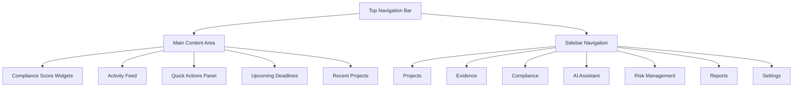
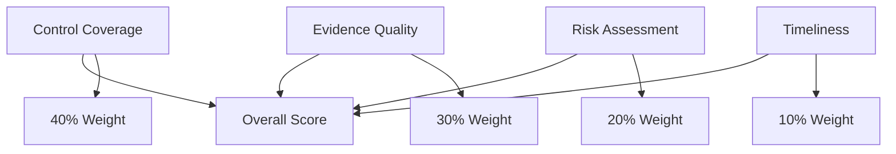
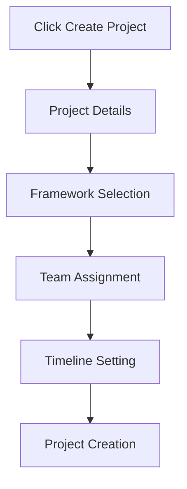
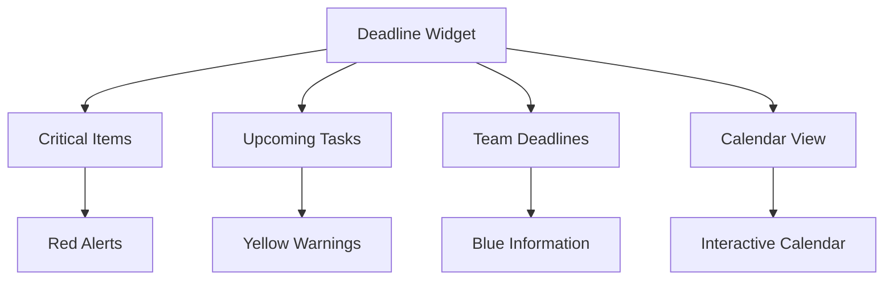
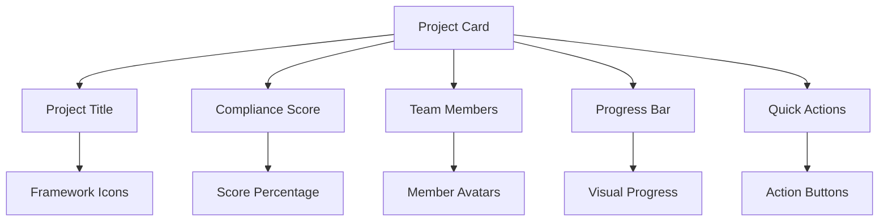

# Dashboard Guide

The Studio Platform dashboard is your command center for compliance management. This comprehensive guide will help you master all dashboard features and customize it for your workflow.

## 🏠 Dashboard Overview

### **Main Dashboard Layout**



### **Dashboard Components**

#### **1. Compliance Score Section**
- **Overall Score** - Primary compliance percentage
- **Framework Breakdown** - Individual framework scores
- **Trend Analysis** - Historical progress tracking
- **Gap Indicators** - Critical areas needing attention

#### **2. Activity Feed**
- **Real-time Updates** - Latest platform activities
- **Team Actions** - What your team is working on
- **System Notifications** - Important platform updates
- **Filter Options** - Sort by relevance, date, or type

#### **3. Quick Actions Panel**
- **Create Project** - Start new compliance initiatives
- **Upload Evidence** - Quick document upload
- **Generate Report** - Instant report creation
- **AI Assistant** - Access intelligent help

#### **4. Upcoming Deadlines**
- **Critical Tasks** - Items requiring immediate attention
- **Audit Dates** - Scheduled compliance reviews
- **Report Due Dates** - Report submission deadlines
- **Training Sessions** - Compliance training schedules

## 📊 Compliance Score Widgets

### **Understanding Compliance Scores**

#### **Score Calculation Methodology**



**Score Components:**
- **Control Coverage (40%)** - Percentage of framework controls with evidence
- **Evidence Quality (30%)** - AI assessment of evidence completeness and relevance
- **Risk Assessment (20%)** - Weighted evaluation of identified risks
- **Timeliness (10%)** - Recency of evidence updates and activities

#### **Score Ranges and Interpretation**

| Score Range | Status | Color | Action Required |
|-------------|--------|-------|-----------------|
| **90-100%** | Excellent | 🟢 Green | Maintain current practices |
| **75-89%** | Good | 🟡 Yellow | Address minor gaps |
| **50-74%** | Fair | 🟠 Orange | Focus on high-priority areas |
| **25-49%** | Poor | 🔴 Red | Immediate action needed |
| **0-24%** | Critical | 🔴 Red | Emergency remediation required |

### **Framework-Specific Scores**

#### **SOC 2 Compliance**
- **Security (Common Criteria)** - Access control, encryption, monitoring
- **Availability** - Backup, disaster recovery, uptime SLAs
- **Processing Integrity** - Data accuracy, processing controls
- **Confidentiality** - Data classification, encryption standards
- **Privacy** - Personal data handling, consent management

#### **ISO 27001 Compliance**
- **Annex A Controls** - 114 controls across 4 categories
- **Statement of Applicability** - Customized control selection
- **Risk Assessment** - Formal risk evaluation process
- **Continuous Improvement** - PDCA cycle implementation

#### **GDPR Compliance**
- **Data Protection** - Privacy by design and default
- **Rights Management** - Subject rights implementation
- **Breach Notification** - 72-hour breach reporting
- **DPIAs** - Data protection impact assessments

### **Score Trends and Analytics**

#### **Historical Progress Tracking**

**Trend Indicators:**
- **📈 Improving** - Score increasing over time
- **📉 Declining** - Score decreasing, requires attention
- **➡️ Stable** - Consistent score maintenance
- **🔄 Fluctuating** - Variable performance, investigate causes

**Progress Metrics:**
- **Weekly Change** - Short-term progress tracking
- **Monthly Trend** - Medium-term performance analysis
- **Quarterly Review** - Long-term strategic assessment
- **Year-over-Year** - Annual compliance evolution

#### **Predictive Analytics**

**AI-Powered Insights:**
- **Projection Modeling** - Predict future compliance scores
- **Risk Forecasting** - Anticipate potential compliance gaps
- **Resource Planning** - Optimize team allocation
- **Deadline Alerts** - Proactive deadline management

## 🔄 Activity Feed

### **Activity Types and Filtering**

#### **Activity Categories**

| Category | Description | Typical Actions |
|----------|-------------|-----------------|
| **Evidence** | Document uploads and reviews | Upload, review, approve, reject |
| **Projects** | Project lifecycle events | Create, update, complete, archive |
| **Compliance** | Score changes and assessments | Score updates, gap analysis |
| **Team** | User activities and collaboration | Login, assignments, messages |
| **System** | Platform updates and maintenance | Updates, downtime, features |

#### **Filter Options**

**Time-Based Filters:**
- **Last Hour** - Most recent activities
- **Today** - Current day activities
- **This Week** - Weekly activity summary
- **This Month** - Monthly overview
- **Custom Range** - Specific date range selection

**User-Based Filters:**
- **My Activities** - Personal actions only
- **Team Activities** - All team member actions
- **Specific User** - Individual user activity
- **Role-Based** - Filter by user roles

**Activity Type Filters:**
- **Evidence Only** - Document-related activities
- **Projects Only** - Project lifecycle events
- **Compliance Only** - Score and assessment changes
- **System Only** - Platform notifications

### **Activity Details and Actions**

#### **Evidence Activities**

**Upload Notifications:**
```
📄 John Doe uploaded "Security Policy v2.1" for SOC 2 A1.1
   Project: Q4 2024 SOC 2 Assessment
   Size: 2.4 MB | Pages: 15 | Status: Pending Review
```

**Review Actions:**
```
✅ Jane Smith approved "Incident Response Plan" for ISO 27001 A.16
   Review Comments: "Comprehensive and well-structured. Approved."
   Quality Score: 92% | Risk Level: Low
```

**Gap Analysis:**
```
⚠️ AI Analysis identified 3 missing controls for GDPR Art.32
   Priority: High | Impact: Medium | Suggested Actions: 5
   View Details → Generate Remediation Plan
```

#### **Project Activities**

**Milestone Updates:**
```
🎯 Project "Q4 2024 SOC 2" reached 75% completion
   Controls Complete: 45/60 | Evidence Count: 127
   Estimated Completion: December 15, 2024
```

**Team Assignments:**
```
👥 Mike Johnson assigned to SOC 2 A6.1, A6.2, A6.3
   Due Date: November 30, 2024 | Priority: High
   Send Message → View Assignment Details
```

### **Interactive Features**

#### **Real-Time Updates**
- **Live Feed** - Activities appear instantly
- **Push Notifications** - Browser and mobile alerts
- **Email Digests** - Daily/weekly activity summaries
- **Sound Alerts** - Optional audio notifications

#### **Action Buttons**
- **Quick Response** - Respond directly from feed
- **View Details** - Drill down to full context
- **Assign Tasks** - Create follow-up actions
- **Share Updates** - Forward to team members

## ⚡ Quick Actions Panel

### **Primary Quick Actions**

#### **Create New Project**


**Project Creation Flow:**
1. **Basic Information**
   - Project name and description
   - Compliance framework(s)
   - Project timeline

2. **Team Configuration**
   - Project manager assignment
   - Team member invitations
   - External auditor access

3. **Control Selection**
   - Framework control mapping
   - Custom control additions
   - Priority level setting

#### **Upload Evidence**
**Quick Upload Options:**
- **Drag & Drop** - Direct file upload
- **Browse Files** - File system navigation
- **Bulk Upload** - Multiple file selection
- **Mobile Upload** - Camera/document capture

**Upload Workflow:**
1. **File Selection**
2. **Metadata Entry** (title, description, tags)
3. **Control Linking**
4. **Review and Submit**

#### **Generate Report**
**Report Types:**
- **Compliance Summary** - Overall compliance status
- **Evidence Inventory** - Complete evidence listing
- **Gap Analysis** - Missing controls and recommendations
- **Risk Assessment** - Current risk landscape
- **Executive Summary** - High-level overview for leadership

**Report Options:**
- **Format Selection** - PDF, Excel, Word
- **Date Range** - Custom time period
- **Framework Filter** - Specific frameworks
- **Audience** - Technical vs. executive

#### **AI Assistant Access**
**Quick AI Actions:**
- **Policy Generation** - Create security policies
- **Gap Analysis** - Identify compliance gaps
- **Best Practices** - Get implementation guidance
- **Document Review** - Analyze uploaded evidence

### **Customizable Quick Actions**

#### **Personalization Options**
- **Action Priority** - Reorder frequently used actions
- **Custom Shortcuts** - Add personalized actions
- **Workflow Templates** - Pre-configured action sequences
- **Keyboard Shortcuts** - Hotkey combinations

#### **Workflow Automation**
- **One-Click Workflows** - Multi-step processes
- **Template Actions** - Pre-defined sequences
- **Conditional Logic** - Smart action routing
- **Integration Triggers** - External service actions

## 📅 Upcoming Deadlines

### **Deadline Types and Management**

#### **Critical Deadlines**

| Deadline Type | Priority | Typical Notice | Impact |
|---------------|----------|----------------|--------|
| **External Audit** | Critical | 30-60 days | Non-compliance risk |
| **Report Submission** | High | 7-14 days | Regulatory penalties |
| **Evidence Review** | Medium | 3-5 days | Project delays |
| **Training Completion** | Low | 1-2 weeks | Knowledge gaps |

#### **Deadline Display**


**Deadline Cards:**
```
🔴 CRITICAL: SOC 2 Type II Audit - Dec 15, 2024
   Days Remaining: 23 | Status: In Progress
   Action Items: 5 | Team: Compliance Team
   View Details → Send Reminder

🟡 UPCOMING: Q4 Risk Assessment Report - Nov 30, 2024
   Days Remaining: 8 | Status: On Track
   Progress: 75% Complete | Assignee: John Doe
   Update Progress → Extend Deadline
```

### **Calendar Integration**

#### **Google Calendar Sync**
- **Two-Way Sync** - Bidirectional calendar updates
- **Meeting Scheduling** - Automated meeting coordination
- **Reminder Management** - Custom notification settings
- **Team Calendars** - Shared deadline visibility

#### **Calendar Features**
- **Monthly View** - Comprehensive deadline overview
- **Weekly Planning** - Detailed task scheduling
- **Daily Focus** - Immediate priority items
- **Timeline View** - Project Gantt chart visualization

### **Deadline Management**

#### **Alert System**
**Notification Types:**
- **Email Alerts** - Automated email reminders
- **Browser Notifications** - Desktop push notifications
- **Mobile Alerts** - SMS/app notifications
- **Team Messages** - In-app team notifications

**Alert Timing:**
- **30 Days** - Long-term planning alerts
- **7 Days** - Weekly deadline reminders
- **3 Days** - Urgent action alerts
- **24 Hours** - Critical deadline warnings

#### **Deadline Actions**
**Available Actions:**
- **Extend Deadline** - Request deadline extension
- **Reassign Task** - Change responsibility
- **Update Progress** - Mark completion percentage
- **Add Comments** - Contextual notes
- **Escalate** - Notify management of issues

## 🎯 Recent Projects

### **Project Overview Cards**

#### **Project Status Display**


**Project Card Example:**
```
📊 Q4 2024 SOC 2 Assessment
   Compliance Score: 78% 🟡 | Framework: SOC 2 Type II
   Team: 5 members | Progress: 45/60 controls complete
   
   📈 Score Trend: +5% this week
   ⏰ Next Deadline: Evidence Review - Nov 25
   🎯 Priority: High | Status: On Track
   
   [Open Project] [View Dashboard] [Team Chat] [Generate Report]
```

### **Project Filtering and Sorting**

#### **Filter Options**
- **Status** - Active, completed, archived, on hold
- **Framework** - SOC 2, ISO 27001, GDPR, etc.
- **Team** - Specific team member assignments
- **Timeline** - Current, upcoming, completed projects
- **Priority** - High, medium, low priority projects

#### **Sorting Options**
- **Last Updated** - Most recently modified
- **Deadline** - Nearest upcoming deadline
- **Compliance Score** - Highest to lowest score
- **Project Name** - Alphabetical order
- **Team Size** - Number of team members

### **Project Quick Actions**

#### **Direct Access Actions**
- **Open Project** - Navigate to project dashboard
- **View Evidence** - Access project evidence library
- **Team Chat** - Open project-specific chat
- **Generate Report** - Create project reports
- **Invite Members** - Add team members

#### **Management Actions**
- **Edit Project** - Modify project details
- **Archive Project** - Move to archived status
- **Duplicate Project** - Create similar project
- **Export Data** - Download project information
- **Delete Project** - Remove project (with confirmation)

## 🎨 Dashboard Customization

### **Personalization Options**

#### **Widget Configuration**
**Available Widgets:**
- **Compliance Score** - Primary score display
- **Framework Breakdown** - Individual framework scores
- **Activity Feed** - Recent activity stream
- **Upcoming Deadlines** - Deadline tracking
- **Recent Projects** - Project overview
- **Team Status** - Team member availability
- **AI Insights** - AI-powered recommendations
- **Quick Actions** - Action shortcuts

**Widget Management:**
- **Add Widgets** - Add new dashboard widgets
- **Remove Widgets** - Hide unused widgets
- **Resize Widgets** - Adjust widget dimensions
- **Reorder Widgets** - Drag and drop positioning
- **Configure Widgets** - Widget-specific settings

#### **Theme and Layout**
**Display Options:**
- **Color Scheme** - Light, dark, auto modes
- **Density** - Compact, normal, spacious layouts
- **Font Size** - Small, medium, large text options
- **Language** - Interface language selection
- **Time Zone** - Local time configuration

**Layout Options:**
- **Grid Layout** - Traditional grid arrangement
- **List Layout** - Vertical list display
- **Card Layout** - Card-based organization
- **Custom Layout** - User-defined arrangement

### **Role-Based Customization**

#### **User Role Dashboards**
**Customer Dashboard:**
- Personal compliance score
- Assigned tasks and deadlines
- Evidence upload status
- Team communication

**Auditor Dashboard:**
- Review queue and assignments
- Evidence quality metrics
- Gap analysis results
- Report generation tools

**Manager Dashboard:**
- Team performance metrics
- Project oversight
- Risk assessment overview
- Resource allocation

**Admin Dashboard:**
- System health monitoring
- User management tools
- Configuration settings
- Platform analytics

### **Advanced Customization**

#### **Custom Widgets**
- **KPI Widgets** - Custom key performance indicators
- **Integration Widgets** - Third-party service displays
- **Report Widgets** - Embedded report views
- **Alert Widgets** - Custom notification displays

#### **Dashboard Templates**
- **Role Templates** - Pre-configured role-based layouts
- **Industry Templates** - Industry-specific configurations
- **Framework Templates** - Compliance framework layouts
- **Custom Templates** - User-created templates

## 📱 Mobile Dashboard

### **Mobile-Optimized Features**

#### **Responsive Design**
- **Touch Interface** - Mobile-friendly interactions
- **Swipe Navigation** - Gesture-based controls
- **Compact Layout** - Optimized for small screens
- **Quick Actions** - Mobile-optimized action buttons

#### **Mobile-Specific Features**
- **Push Notifications** - Real-time mobile alerts
- **Offline Mode** - Limited offline functionality
- **Camera Integration** - Direct photo evidence upload
- **Voice Commands** - Hands-free operation

### **Mobile Workflows**

#### **On-the-Go Tasks**
- **Evidence Upload** - Capture and upload photos/documents
- **Compliance Checks** - Quick status verification
- **Team Communication** - Mobile chat and messaging
- **Report Viewing** - Access reports and dashboards

#### **Mobile Security**
- **Biometric Authentication** - Fingerprint/face ID
- **Device Management** - Mobile device security
- **Secure Storage** - Encrypted mobile data
- **Remote Wipe** - Data protection on device loss

## ✅ Dashboard Success Tips

### **Best Practices**

#### **Daily Dashboard Routine**
1. **Morning Review** - Check compliance scores and deadlines
2. **Activity Monitoring** - Review team activities and updates
3. **Priority Setting** - Identify and address critical items
4. **Team Coordination** - Communicate with team members

#### **Weekly Dashboard Review**
1. **Score Analysis** - Review compliance score trends
2. **Progress Assessment** - Evaluate project advancement
3. **Risk Evaluation** - Assess emerging risks and gaps
4. **Resource Planning** - Adjust team allocation as needed

#### **Monthly Dashboard Strategy**
1. **Performance Review** - Analyze monthly metrics
2. **Strategic Planning** - Plan upcoming compliance activities
3. **Team Performance** - Evaluate team effectiveness
4. **Process Optimization** - Improve workflows and procedures

### **Common Dashboard Mistakes to Avoid**

❌ **Don't:**
- Ignore dashboard alerts and notifications
- Overload dashboard with unnecessary widgets
- Skip regular dashboard reviews
- Use dashboard as the only communication tool

✅ **Do:**
- Customize dashboard for your specific role
- Set up appropriate notifications and alerts
- Use dashboard insights for strategic planning
- Integrate dashboard with other tools and workflows

---

!!! tip **Dashboard Optimization**
    Customize your dashboard layout to match your daily workflow. Place frequently used widgets in prominent positions for maximum efficiency.

!!! note **Mobile Access**
    Download the mobile app for full dashboard functionality on the go, including push notifications and offline access.

!!! question **Need Help?**
    Use the AI Assistant for dashboard optimization tips, or check our [Troubleshooting Guide](../troubleshooting/) for common dashboard issues.
