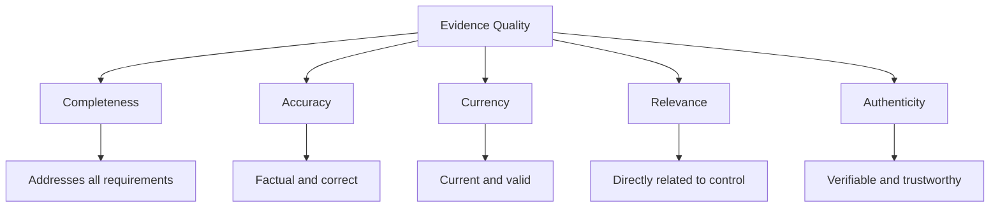
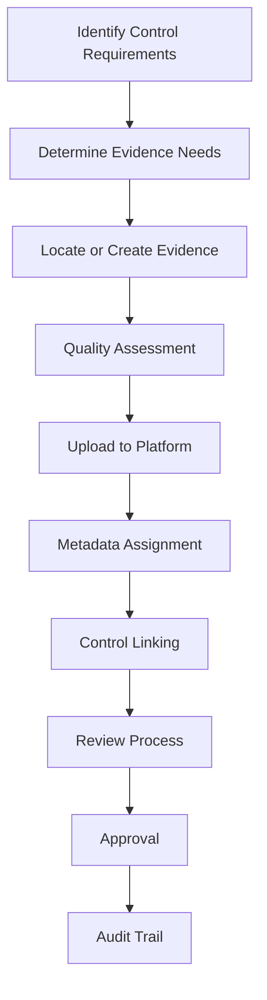
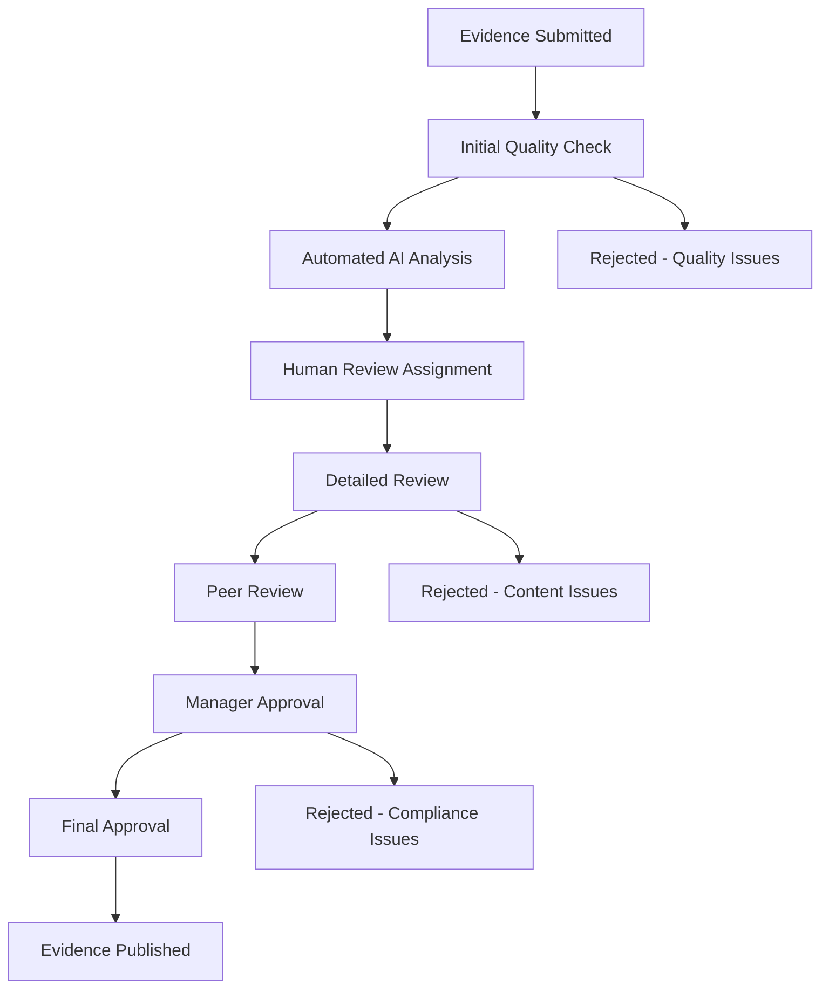
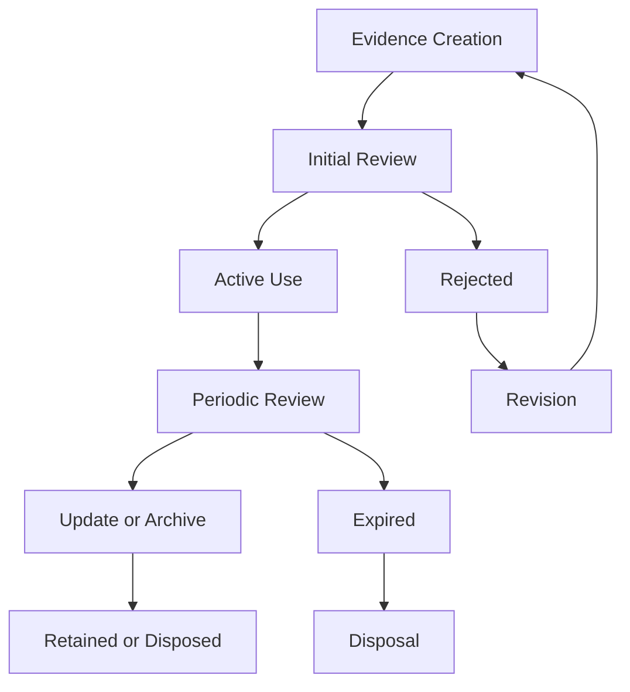

# Evidence Management

Evidence management is the cornerstone of compliance activities. This comprehensive guide covers everything from evidence collection and organization to review, approval, and maintenance.

## 📁 Evidence Overview

### **What is Compliance Evidence?**

Compliance evidence is the documentation, records, and artifacts that demonstrate adherence to regulatory requirements and internal controls. Evidence serves as proof that your organization has implemented and maintains the controls required for compliance.

#### **Evidence Types**

| Evidence Type | Description | Common Examples | Use Cases |
|--------------|-------------|-----------------|-----------|
| **Policies** | Formal organizational policies | Security policies, procedures, guidelines | Framework compliance, governance |
| **Procedures** | Step-by-step process documentation | Incident response, backup procedures | Operational controls |
| **Records** | Activity logs and documentation | Meeting minutes, training logs | Activity proof, audit trails |
| **Technical** | System configurations and outputs | Config files, screenshots, logs | Technical controls |
| **Reports** | Assessment and analysis documents | Audit reports, risk assessments | Third-party validation |
| **Certificates** | Formal certifications and attestations | ISO certificates, compliance attestations | External validation |

#### **Evidence Quality Characteristics**



## 🚀 Evidence Collection

### **Collection Process Overview**

#### **Evidence Collection Workflow**



#### **Step-by-Step Collection**

**Step 1: Requirements Analysis**
- **Review Control Requirements** - Understand what the control requires
- **Identify Evidence Types** - Determine what documentation is needed
- **Assess Current State** - Check if evidence already exists
- **Plan Collection Strategy** - Decide how to obtain or create evidence

**Step 2: Evidence Sourcing**
- **Document Review** - Search existing documentation
- **System Configuration** - Capture system settings and outputs
- **Process Documentation** - Document current procedures
- **Interviews** - Gather information from subject matter experts

**Step 3: Evidence Creation**
- **Policy Development** - Create missing policies and procedures
- **Documentation Updates** - Update existing documentation
- **System Configuration** - Configure systems to meet requirements
- **Process Implementation** - Implement required procedures

### **Evidence Sources**

#### **Internal Sources**

**Documentation Sources:**
- **Policy Repository** - Central policy and procedure storage
- **System Documentation** - Technical documentation and manuals
- **Meeting Records** - Meeting minutes and decisions
- **Training Materials** - Training content and attendance records

**System Sources:**
- **Configuration Files** - System and application configurations
- **Log Files** - System, application, and security logs
- **Audit Trails** - User activity and system access logs
- **Monitoring Data** - Performance and security monitoring

**Process Sources:**
- **Workflow Documentation** - Process flow diagrams and descriptions
- **Checklists** - Standard operating procedures and checklists
- **Forms and Templates** - Standard forms and templates
- **Approval Records** - Change requests and approvals

#### **External Sources**

**Third-Party Documentation:**
- **Audit Reports** - External audit findings and reports
- **Assessment Results** - Third-party security assessments
- **Certification Documents** - ISO, SOC, and other certifications
- **Attestation Letters** - Third-party attestations of compliance

**Vendor Documentation:**
- **Security Documentation** - Vendor security documentation
- **Compliance Statements** - Vendor compliance attestations
- **Service Level Agreements** - SLAs and service commitments
- **Audit Rights** - Vendor audit rights and procedures

### **Collection Best Practices**

#### **Documentation Standards**

**Naming Conventions:**
- **Descriptive Names** - Clear, descriptive file names
- **Version Control** - Include version numbers and dates
- **Consistent Format** - Use standardized naming patterns
- **No Special Characters** - Avoid special characters in file names

**Content Standards:**
- **Company Branding** - Include company name and logo
- **Date Information** - Include creation and revision dates
- **Approval Information** - Include approval signatures and dates
- **Version Control** - Maintain version history

#### **Quality Assurance**

**Quality Checklist:**
- [ ] **Completeness** - All required content included
- [ ] **Accuracy** - Information is factual and correct
- [ ] **Currency** - Information is current and valid
- [ ] **Clarity** - Content is clear and understandable
- [ ] **Professionalism** - Professional appearance and formatting

**Common Quality Issues:**
- **Missing Pages** - Incomplete documents
- **Outdated Information** - Old or superseded content
- **Poor Quality** - Illegible or poor formatting
- **Irrelevant Content** - Information not related to control
- **No Approval** - Missing signatures or approvals

## 📤 Evidence Upload

### **Upload Interface and Process**

#### **Upload Methods**

**Drag and Drop Upload:**
1. **Navigate to Control** - Go to the specific control page
2. **Select Files** - Drag files from computer to upload area
3. **Drop Files** - Release files to begin upload
4. **Monitor Progress** - Watch upload progress bar
5. **Complete Upload** - Wait for upload to complete

**Browse and Upload:**
1. **Click Upload Button** - Select "Upload Evidence" button
2. **Browse Files** - Navigate to file location
3. **Select Files** - Choose one or multiple files
4. **Confirm Upload** - Click to begin upload process
5. **Complete Metadata** - Add required information

**Mobile Upload:**
1. **Open Mobile App** - Launch Studio Platform mobile app
2. **Select Upload** - Choose evidence upload option
3. **Capture or Select** - Take photo or select existing file
4. **Add Information** - Enter metadata and description
5. **Submit Evidence** - Complete upload process

#### **Supported File Formats**

**Document Formats:**
- **PDF** - Portable Document Format (recommended)
- **Microsoft Word** - .doc, .docx files
- **Microsoft Excel** - .xls, .xlsx files
- **Microsoft PowerPoint** - .ppt, .pptx files
- **Text Files** - .txt, .rtf files

**Image Formats:**
- **JPEG** - .jpg, .jpeg files
- **PNG** - .png files
- **GIF** - .gif files
- **TIFF** - .tiff, .tif files
- **BMP** - .bmp files

**Archive Formats:**
- **ZIP** - .zip files (multiple documents)
- **RAR** - .rar files (limited support)
- **7Z** - .7z files (limited support)

#### **Upload Specifications**

**File Size Limits:**
- **Single File** - Maximum 100MB per file
- **Total Upload** - Maximum 500MB per session
- **Monthly Quota** - Based on subscription plan
- **Enterprise Limits** - Custom limits available

**Security Considerations:**
- **Virus Scanning** - All files scanned for malware
- **Content Analysis** - AI analysis for sensitive information
- **Access Control** - Role-based access to uploaded files
- **Encryption** - Files encrypted at rest and in transit

### **Metadata Management**

#### **Required Metadata Fields**

**Basic Information:**
- **Title** - Descriptive document title
- **Description** - Brief description of evidence purpose
- **Document Type** - Policy, procedure, record, etc.
- **Date Range** - Period evidence covers

**Classification Information:**
- **Control Mapping** - Primary and secondary control assignments
- **Framework Association** - Related compliance frameworks
- **Risk Level** - Low, medium, or high risk classification
- **Sensitivity** - Public, internal, or confidential classification

#### **Optional Metadata Fields**

**Additional Details:**
- **Author** - Document creator or owner
- **Department** - Organizational unit responsible
- **Keywords** - Search terms and tags
- **Language** - Document language
- **Version** - Document version number

**Review Information:**
- **Review Status** - Pending, in review, approved, rejected
- **Reviewers** - Assigned review team members
- **Review Date** - Scheduled or completed review date
- **Quality Score** - AI-assessed quality rating

#### **Best Practices for Metadata**

**Title Guidelines:**
- **Be Descriptive** - Include document type and purpose
- **Include Dates** - Add relevant date information
- **Use Consistency** - Follow established naming conventions
- **Avoid Abbreviations** - Use full terms and descriptions

**Description Guidelines:**
- **Be Specific** - Clearly explain evidence purpose
- **Include Context** - Provide relevant background information
- **Highlight Relevance** - Explain how evidence addresses controls
- **Keep Concise** - Provide essential information without excessive detail

## 🔍 Evidence Review and Approval

### **Review Process Overview

#### **Review Workflow**



#### **Review Roles and Responsibilities**

**Primary Reviewer:**
- **Content Assessment** - Evaluate evidence completeness and relevance
- **Quality Check** - Verify document quality and formatting
- **Compliance Validation** - Ensure evidence meets control requirements
- **Recommendation** - Provide approval or rejection recommendation

**Peer Reviewer:**
- **Second Opinion** - Provide independent assessment
- **Validation** - Confirm primary reviewer findings
- **Additional Insights** - Identify issues primary reviewer missed
- **Quality Assurance** - Ensure review process consistency

**Approving Manager:**
- **Final Decision** - Make final approval or rejection decision
- **Risk Assessment** - Evaluate compliance risk implications
- **Strategic Alignment** - Ensure alignment with organizational goals
- **Accountability** - Take responsibility for approval decisions

### **Review Criteria and Standards

#### **Quality Assessment Criteria**

**Completeness (40% Weight):**
- **All Requirements Met** - Evidence addresses all control requirements
- **Sufficient Detail** - Adequate detail to demonstrate compliance
- **Comprehensive Coverage** - Covers all aspects of the control
- **No Missing Elements** - No gaps in evidence coverage

**Accuracy (30% Weight):**
- **Factual Correctness** - Information is accurate and truthful
- **Technical Accuracy** - Technical details are correct
- **Date Accuracy** - Dates and timeframes are accurate
- **No Misinformation** - No false or misleading information

**Currency (20% Weight):**
- **Current Information** - Information is up-to-date
- **Recent Updates** - Evidence reflects current state
- **Valid Timeframe** - Evidence covers appropriate time period
- **No Outdated Content** - No obsolete or superseded information

**Relevance (10% Weight):**
- **Direct Relationship** - Evidence directly addresses control
- **Specific Focus** - Evidence is specific to control requirements
- **Appropriate Scope** - Evidence scope matches control scope
- **Targeted Content** - Content is relevant to control purpose

#### **Review Scoring System**

**Score Ranges:**
- **90-100% (Excellent)** - Exceeds expectations, ready for approval
- **80-89% (Good)** - Meets requirements with minor issues
- **70-79% (Acceptable)** - Meets minimum requirements, needs improvement
- **60-69% (Marginal)** - Barely meets requirements, significant issues
- **Below 60% (Unacceptable)** - Does not meet requirements, major issues

**Score Calculation:**
```
Evidence Quality Score = (Completeness × 0.4) + (Accuracy × 0.3) + (Currency × 0.2) + (Relevance × 0.1)

Example: Security Policy v2.1
- Completeness: 95% × 0.4 = 38%
- Accuracy: 92% × 0.3 = 27.6%
- Currency: 88% × 0.2 = 17.6%
- Relevance: 95% × 0.1 = 9.5%
Total Score: 92.7% (Excellent)
```

### **Collaborative Review Features

#### **Annotation System**

**Annotation Tools:**
- **Text Highlighting** - Highlight important text sections
- **Drawing Tools** - Draw shapes and arrows on documents
- **Text Comments** - Add detailed comments and feedback
- **Issue Flagging** - Flag specific problems or concerns

**Annotation Workflow:**
1. **Select Area** - Click and drag to select text or area
2. **Add Comment** - Type comment or feedback
3. **Assign Action** - Assign follow-up actions to team members
4. **Track Resolution** - Monitor issue resolution progress

**Annotation Example:**
```
📝 Evidence: Security Policy v2.1
   📍 Page 3, Paragraph 2: "Add specific incident response timeline"
   👤 Comment by: John Doe | Date: Nov 15, 2024
   🏷️ Tags: #incident-response #timeline #gap
   ✅ Status: Open | 👥 Assigned to: Jane Smith
   
   📍 Page 7, Table 1: "Include emergency contact information"
   👤 Comment by: Mike Johnson | Date: Nov 15, 2024
   🏷️ Tags: #contacts #emergency #missing
   ✅ Status: Resolved | 👥 Assigned to: Jane Smith
```

#### **Discussion Threads**

**Thread Organization:**
- **Evidence-Specific** - Discussions tied to specific evidence items
- **Control-Focused** - Discussions organized by control requirements
- **Team-Based** - Discussions visible to appropriate team members
- **Time-Ordered** - Chronological organization of discussions

**Discussion Features:**
- **Rich Text Formatting** - Bold, italic, lists, and formatting
- **File Attachments** - Share supporting documents
- **Mentions** - @mention team members for notifications
- **Emoji Reactions** - Quick responses and acknowledgments

### **Approval Workflows

#### **Multi-Level Approval

**Approval Levels:**
1. **Initial Review** - Quality and relevance assessment
2. **Peer Validation** - Independent review confirmation
3. **Manager Approval** - Final decision and accountability
4. **Executive Sign-off** - High-risk or critical evidence

**Approval Conditions:**
- **Minimum Score Threshold** - Evidence must meet minimum quality score
- **All Reviewers Complete** - All assigned reviewers must complete review
- **No Outstanding Issues** - All identified issues must be resolved
- **Compliance Validation** - Evidence must meet compliance requirements

#### **Automated Approval Rules

**Rule-Based Approvals:**
- **High-Quality Auto-Approval** - Evidence scoring 95%+ auto-approved
- **Standard Evidence** - Routine evidence with standard requirements
- **Low-Risk Controls** - Low-risk controls with simplified approval
- **Trusted Uploaders** - Uploaders with proven quality track record

**Conditional Approvals:**
- **Conditional Acceptance** - Approved with minor required changes
- **Provisional Approval** - Temporary approval pending final validation
- **Escalated Approval** - Requiring higher-level review
- **Special Circumstances** - Exceptional situations requiring special handling

## 🏷️ Evidence Organization and Management

### **Classification and Tagging

#### **Evidence Categories**

**Primary Categories:**
- **Policies & Procedures** - Formal organizational documentation
- **Technical Evidence** - System configurations and technical artifacts
- **Operational Records** - Day-to-day operational documentation
- **Assessment Results** - Audit and assessment findings
- **Training & Awareness** - Training materials and awareness records

**Subcategories:**
- **Security** - Security-related evidence
- **Privacy** - Privacy and data protection evidence
- **Availability** - System availability and uptime evidence
- **Processing Integrity** - Data processing and integrity evidence
- **Confidentiality** - Data confidentiality evidence

#### **Tagging System**

**Standard Tags:**
- **Framework Tags** - SOC2, ISO27001, GDPR, HIPAA, PCI-DSS
- **Control Tags** - Specific control numbers and categories
- **Risk Tags** - High, medium, low risk classifications
- **Quality Tags** - Excellent, good, needs improvement
- **Status Tags** - Draft, review, approved, archived

**Custom Tags:**
- **Department Tags** - IT, HR, Finance, Legal, Operations
- **System Tags** - Specific systems or applications
- **Process Tags** - Specific business processes
- **Location Tags** - Geographic or facility locations
- **Vendor Tags** - Third-party service providers

### **Evidence Relationships

#### **Linking Evidence to Controls**

**One-to-One Relationships:**
- **Single Evidence to Single Control** - Most common relationship
- **Direct Mapping** - Evidence directly addresses specific control
- **Clear Association** - Easy to understand and validate
- **Simple Maintenance** - Easy to maintain and update

**One-to-Many Relationships:**
- **Single Evidence to Multiple Controls** - Evidence addresses multiple controls
- **Efficient Documentation** - Reduces documentation redundancy
- **Complex Validation** - Requires careful review and validation
- **Cross-Reference Management** - Requires careful relationship tracking

**Many-to-One Relationships:**
- **Multiple Evidence to Single Control** - Multiple pieces of evidence for one control
- **Comprehensive Coverage** - Provides thorough control coverage
- **Validation Complexity** - Requires comprehensive review
- **Maintenance Overhead** - Higher maintenance requirements

#### **Evidence Dependencies**

**Sequential Dependencies:**
- **Prerequisite Evidence** - Evidence that must exist before other evidence
- **Build Relationships** - Evidence builds upon previous evidence
- **Validation Chains** - Evidence validates other evidence
- **Timeline Dependencies** - Evidence must follow specific sequence

**Logical Dependencies:**
- **Supporting Evidence** - Evidence that supports primary evidence
- **Corroborating Evidence** - Evidence that validates other evidence
- **Contextual Evidence** - Evidence that provides context for other evidence
- **Complementary Evidence** - Evidence that completes other evidence

### **Search and Discovery

#### **Advanced Search Capabilities

**Search Filters:**
- **Text Search** - Full-text search across all evidence
- **Metadata Search** - Search by metadata fields
- **Tag Search** - Search by tags and categories
- **Date Range Search** - Search by creation or coverage dates

**Search Operators:**
- **Boolean Operators** - AND, OR, NOT operators
- **Phrase Search** - Exact phrase matching
- **Wildcard Search** - Partial word matching
- **Proximity Search** - Words near each other

#### **Semantic Search**

**AI-Powered Search:**
- **Concept Matching** - Find evidence by concept, not just keywords
- **Similarity Search** - Find similar evidence items
- **Context Understanding** - Understand evidence context and purpose
- **Natural Language Queries** - Use natural language for complex searches

**Search Examples:**
```
🔍 Search Examples:
   "incident response policy" - Find incident response documentation
   "SOC 2 A1.1" - Find evidence for specific control
   "access review 2024" - Find access reviews from 2024
   "security training completion" - Find training completion records
```

## 🔄 Evidence Maintenance

### **Evidence Lifecycle Management

#### **Evidence Lifecycle Stages**



**Stage Descriptions:**
- **Creation** - New evidence is created or collected
- **Initial Review** - Evidence undergoes quality and compliance review
- **Active Use** - Evidence is actively used for compliance demonstration
- **Periodic Review** - Evidence is reviewed for currency and relevance
- **Update or Archive** - Evidence is updated or moved to archive
- **Retention or Disposal** - Evidence is retained or disposed according to policy

#### **Evidence Refresh Requirements**

**Refresh Triggers:**
- **Time-Based** - Regular periodic refresh (annually, quarterly)
- **Event-Based** - Refresh triggered by specific events (system changes, policy updates)
- **Compliance Changes** - Refresh required by compliance framework changes
- **Quality Issues** - Refresh required due to quality degradation

**Refresh Process:**
1. **Assessment** - Evaluate current evidence for currency and relevance
2. **Update Planning** - Plan required updates and improvements
3. **Implementation** - Implement evidence updates and improvements
4. **Validation** - Validate updated evidence meets requirements
5. **Approval** - Obtain approval for updated evidence

### **Version Control

#### **Document Versioning**

**Version Numbering:**
- **Major Versions** - Significant changes (1.0, 2.0, 3.0)
- **Minor Versions** - Moderate changes (1.1, 1.2, 1.3)
- **Patch Versions** - Minor fixes (1.1.1, 1.1.2)
- **Draft Versions** - Work-in-progress versions (Draft 1, Draft 2)

**Version History:**
```
📋 Version History: Security Policy
   v3.0 (Nov 15, 2024) - Major rewrite for SOC 2 compliance
   v2.1 (Jun 10, 2024) - Added incident response procedures
   v2.0 (Jan 5, 2024) - Updated for ISO 27001 alignment
   v1.1 (Aug 20, 2023) - Added remote work procedures
   v1.0 (Mar 15, 2023) - Initial version
   
   📊 Version Statistics:
   - Total Versions: 5
   - Average Update Frequency: 4 months
   - Latest Version: v3.0
   - Active Version: v3.0
```

#### **Change Management

**Change Tracking:**
- **Change Description** - Detailed description of changes made
- **Change Reason** - Why changes were necessary
- **Change Impact** - Impact of changes on compliance
- **Change Approval** - Approval for changes

**Change Workflow:**
1. **Change Request** - Request for evidence changes
2. **Impact Assessment** - Assess impact on compliance
3. **Change Implementation** - Implement approved changes
4. **Review and Approval** - Review and approve changes
5. **Version Update** - Update version and documentation

### **Evidence Retention and Disposal

#### **Retention Policies**

**Regulatory Requirements:**
- **SOC 2** - Retain evidence for 7 years
- **ISO 27001** - Retain evidence for 3 years minimum
- **GDPR** - Retain evidence as required by data protection laws
- **HIPAA** - Retain evidence for 6 years
- **PCI DSS** - Retain evidence for 1 year

**Retention Categories:**
- **Active Evidence** - Currently used for compliance demonstration
- **Archive Evidence** - No longer active but must be retained
- **Historical Evidence** - Retained for historical reference
- **Disposed Evidence** - Securely destroyed after retention period

#### **Secure Disposal**

**Disposal Methods:**
- **Secure Deletion** - Digital files securely deleted
- **Physical Destruction** - Physical documents securely destroyed
- **Certificate of Disposal** - Documentation of disposal process
- **Audit Trail** - Record of disposal activities

**Disposal Process:**
1. **Retention Review** - Review retention requirements
2. **Disposal Authorization** - Obtain authorization for disposal
3. **Secure Disposal** - Securely destroy evidence
4. **Documentation** - Document disposal process
5. **Verification** - Verify complete disposal

## ✅ Evidence Management Success Tips

### **Best Practices**

#### **Collection Best Practices**
- **Start Early** - Begin evidence collection early in the process
- **Be Systematic** - Use systematic approach to evidence collection
- **Document Sources** - Keep track of evidence sources and locations
- **Maintain Quality** - Focus on quality over quantity

#### **Organization Best Practices**
- **Consistent Naming** - Use consistent naming conventions
- **Proper Classification** - Classify evidence appropriately
- **Regular Reviews** - Conduct regular evidence reviews
- **Version Control** - Maintain proper version control

#### **Quality Assurance**
- **Quality Standards** - Establish and maintain quality standards
- **Regular Audits** - Conduct regular quality audits
- **Continuous Improvement** - Continuously improve processes
- **Training** - Provide regular training to team members

### **Common Mistakes to Avoid**

❌ **Avoid These Mistakes:**
- Waiting until the last minute to collect evidence
- Submitting poor quality or incomplete evidence
- Ignoring evidence organization and classification
- Neglecting regular evidence reviews and updates

✅ **Follow These Best Practices:**
- Collect evidence continuously throughout the process
- Maintain high quality standards for all evidence
- Organize evidence systematically with proper classification
- Review and update evidence regularly

---

!!! tip **AI Assistance**
    Use the AI Assistant to help identify evidence gaps and improve evidence quality through automated analysis and recommendations.

!!! note **Security Considerations**
    Always review evidence for sensitive information before upload and use appropriate security classifications for confidential data.

!!! question **Need Help?**
    Check our [Troubleshooting Guide](../troubleshooting/) for common evidence management issues, or contact our support team for personalized assistance.
