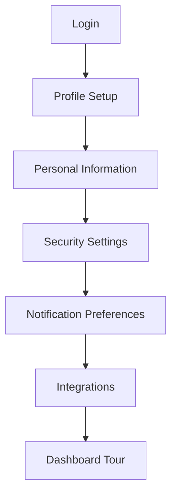
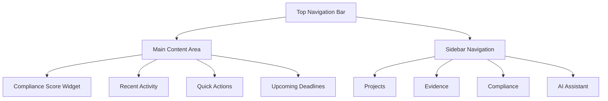
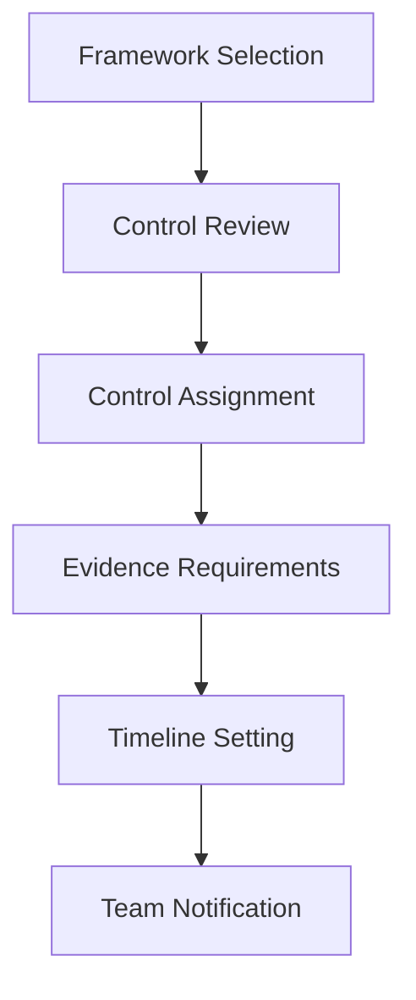
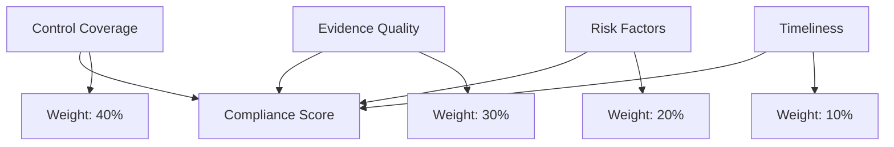

# Getting Started

Welcome to Studio Platform! This guide will help you get up and running quickly, from your first login to completing your first compliance assessment.

## 🚀 First Steps

### **Account Setup**

#### **1. Initial Login**

1. **Navigate to Platform**
   - Open your web browser
   - Go to your Studio Platform URL (e.g., `https://your-company.studio.com`)
   - Bookmark the page for easy access

2. **Enter Credentials**
   - Email: Your work email address
   - Password: Provided by your administrator
   - Click "Sign In"

3. **Two-Factor Authentication** (if enabled)
   - Enter the code from your authenticator app
   - Or use SMS verification
   - Click "Verify"

#### **2. Complete Your Profile**



**Required Information:**
- **Full Name** - Your legal name for reports
- **Job Title** - Your role in the organization
- **Department** - Your team or business unit
- **Phone Number** - For urgent notifications

**Optional Information:**
- **Profile Picture** - Helps team members recognize you
- **Time Zone** - For accurate scheduling
- **Language** - Interface language preference

### **Security Setup**

#### **Enable Two-Factor Authentication**

1. **Access Security Settings**
   - Click your profile icon (top right)
   - Select "Security"
   - Click "Enable 2FA"

2. **Configure Authenticator**
   - Scan QR code with authenticator app
   - Enter verification code
   - Save backup codes in secure location

#### **Session Management**

- **Active Sessions** - Review logged-in devices
- **Session Timeout** - Set automatic logout time
- **API Keys** - Generate for programmatic access

## 🏠 Dashboard Overview

### **Main Dashboard Layout**



### **Key Dashboard Components**

#### **Compliance Score Widget**
- **Overall Score** - Your current compliance percentage
- **Framework Breakdown** - Scores by framework (SOC 2, ISO 27001, etc.)
- **Trend Indicator** - Improving, declining, or stable
- **Last Updated** - When the score was last calculated

#### **Recent Activity Feed**
- **Evidence Uploads** - New documents added
- **Review Actions** - Evidence reviewed and approved
- **Team Messages** - Important communications
- **System Updates** - Platform changes and features

#### **Quick Actions**
- **Create Project** - Start new compliance assessment
- **Upload Evidence** - Add documents quickly
- **Generate Report** - Create compliance reports
- **Chat with AI** - Get help from AI Assistant

#### **Upcoming Deadlines**
- **Audit Dates** - Scheduled compliance audits
- **Report Due** - Report submission deadlines
- **Review Tasks** - Evidence review due dates
- **Training** - Compliance training sessions

### **Navigation Guide**

#### **Sidebar Menu**

| Menu Item | Purpose | Quick Actions |
|-----------|---------|---------------|
| **Dashboard** | Home base | View overview, quick stats |
| **Projects** | Compliance projects | Create, manage, track |
| **Evidence** | Document management | Upload, review, organize |
| **Compliance** | Framework tracking | View scores, gaps, reports |
| **AI Assistant** | Intelligent help | Get guidance, generate policies |
| **Risk** | Risk management | View findings, mitigation |
| **Reports** | Documentation | Generate, export, schedule |
| **Settings** | Personalization | Profile, preferences, integrations |

#### **Top Bar Features**

- **Search Bar** - Find projects, evidence, or help
- **Notifications** - Alerts and updates
- **Help Center** - Documentation and support
- **User Menu** - Profile, settings, logout

## 🎯 Your First Project

### **Creating Your First Compliance Project**

#### **Step 1: Initiate Project**

1. **Click "Create Project"** (Dashboard or Projects page)
2. **Project Details**
   - **Project Name** - Descriptive title (e.g., "Q4 2024 SOC 2 Assessment")
   - **Description** - Project scope and objectives
   - **Framework** - Choose compliance framework(s)
   - **Timeline** - Start and end dates

3. **Team Configuration**
   - **Project Manager** - Lead for the project
   - **Team Members** - Internal team participants
   - **External Auditors** - Third-party reviewers
   - **Stakeholders** - Leadership and interested parties

#### **Step 2: Framework Selection**

**Available Frameworks:**
- **SOC 2 Type I** - Security controls at a point in time
- **SOC 2 Type II** - Security controls over time (6-12 months)
- **ISO 27001** - Information security management
- **GDPR** - Data protection and privacy
- **HIPAA** - Healthcare information protection
- **PCI DSS** - Payment card security
- **NIST CSF** - Cybersecurity framework

**Framework Selection Tips:**
- **Start with One** - Choose your primary framework first
- **Consider Requirements** - What do auditors/regulators require?
- **Resource Availability** - Do you have team resources for multiple frameworks?
- **Timeline** - Some frameworks require longer assessment periods

#### **Step 3: Control Mapping**



**Control Categories:**
- **Security** - Access control, encryption, monitoring
- **Availability** - Backup, disaster recovery, uptime
- **Processing Integrity** - Data accuracy, processing controls
- **Confidentiality** - Data classification, encryption
- **Privacy** - Personal data protection, consent

**Assignment Strategy:**
- **Subject Matter Experts** - Assign controls to knowledgeable team members
- **Workload Distribution** - Balance assignments across team
- **Dependencies** - Consider control interdependencies
- **Timeline** - Set realistic deadlines for each control

### **Project Dashboard**

#### **Project Overview**

Once your project is created, you'll see:

- **Project Status** - Not started, in progress, or completed
- **Compliance Score** - Current compliance percentage
- **Team Members** - Active participants and their roles
- **Timeline** - Project milestones and deadlines
- **Recent Activity** - Latest updates and actions

#### **Control Tracking**

**Control Status Indicators:**
- **✅ Complete** - Evidence uploaded and approved
- **🟡 In Progress** - Evidence being collected or reviewed
- **❌ Missing** - No evidence provided yet
- **⚠️ At Risk** - Deadline approaching or issues identified

**Control Details:**
- **Control Number** - Framework-specific identifier
- **Control Title** - Brief description of requirement
- **Assigned To** - Team member responsible
- **Evidence Count** - Number of documents uploaded
- **Last Activity** - Most recent update

## 📁 Uploading Your First Evidence

### **Evidence Types**

#### **Supported Document Formats**
- **PDF** - Policies, procedures, reports
- **Microsoft Office** - Word, Excel, PowerPoint documents
- **Images** - Screenshots, diagrams, photos
- **Text Files** - Configuration files, logs
- **Archives** - ZIP files with multiple documents

#### **Evidence Categories**

| Category | Examples | Typical Use |
|----------|----------|-------------|
| **Policies** | Security policies, procedures | Framework compliance |
| **Procedures** | Step-by-step guides | Operational compliance |
| **Records** | Meeting minutes, training logs | Evidence of activities |
| **Technical** | Configurations, screenshots | System controls |
| **Reports** - Audit reports, assessments | Third-party validation |

### **Upload Process**

#### **Step 1: Select Control**

1. **Navigate to Project** → "Controls" tab
2. **Find Control** - Use search or browse by category
3. **Click "Upload Evidence"** - Blue button on control card

#### **Step 2: Upload Documents**

1. **Choose Files**
   - Drag and drop files onto upload area
   - Or click "Browse Files" to select from computer
   - Multiple files can be uploaded at once

2. **Add Metadata**
   - **Title** - Descriptive document title
   - **Description** - What the evidence proves
   - **Date Range** - Period the evidence covers
   - **Tags** - Keywords for searching

3. **Link to Controls**
   - **Primary Control** - Main control this evidence supports
   - **Additional Controls** - Other related controls
   - **Framework Mapping** - Cross-framework applicability

#### **Step 3: Review and Submit**

1. **Preview Documents**
   - Verify file quality and readability
   - Check for sensitive information
   - Ensure all pages are included

2. **Submit for Review**
   - Click "Submit Evidence"
   - Evidence enters review queue
   - Notifications sent to reviewers

### **Evidence Quality Guidelines**

#### **Best Practices**

**Document Quality:**
- **Clear and Legible** - Easy to read and understand
- **Complete** - All pages included, no missing sections
- **Current** - Recent and relevant to current controls
- **Specific** - Directly addresses control requirements

**Content Standards:**
- **Company Branding** - Include company name/logo
- **Date Information** - Clear dates of creation and validity
- **Signatures** - Authorized signatures where required
- **Version Control** - Document version numbers

#### **Common Pitfalls to Avoid**

❌ **Don't Upload:**
- Password-protected files
- Personal information not relevant to compliance
- Outdated or superseded documents
- Incomplete or partial documents

✅ **Do Upload:**
- Current, approved policies and procedures
- Recent audit reports or assessments
- System configuration screenshots
- Training records and certifications

## 🤖 Using the AI Assistant

### **First AI Interaction**

#### **Accessing AI Assistant**

1. **Click AI Assistant** - Sidebar menu or dashboard widget
2. **Start Conversation** - Type your question or request
3. **Provide Context** - Include relevant project or control information

#### **Sample AI Prompts**

**Getting Started:**
```
"Hi, I'm new to SOC 2 compliance. Can you explain what I need to do for control A1.1?"
```

**Policy Generation:**
```
"Generate a password policy for our company that must comply with SOC 2 and PCI DSS requirements."
```

**Gap Analysis:**
```
"I'm working on ISO 27001 control A.8.2. What evidence am I missing and what should I prioritize?"
```

### **AI Capabilities**

#### **Policy Generation**
- **Template Library** - 50+ professional policy templates
- **Contextual Customization** - Auto-fill with company information
- **Framework Alignment** - Ensure compliance with selected frameworks
- **Review and Refine** - Improve existing policies

#### **Compliance Analysis**
- **Gap Identification** - Find missing controls and evidence
- **Risk Assessment** - Evaluate compliance risks
- **Prioritization** - Rank tasks by importance and urgency
- **Best Practices** - Industry-standard recommendations

#### **Document Review**
- **Content Analysis** - Understand document content and relevance
- **Quality Assessment** - Evaluate evidence completeness and quality
- **Recommendations** - Suggest improvements and additions
- **Compliance Mapping** - Link documents to relevant controls

## 📊 Understanding Your Progress

### **Compliance Score Breakdown**

#### **Score Calculation**

Your compliance score is calculated using:



**Score Components:**
- **Control Coverage (40%)** - Percentage of controls with evidence
- **Evidence Quality (30%)** - AI assessment of evidence completeness
- **Risk Factors (20%)** - Weighted risk assessment
- **Timeliness (10%)** - Recency of evidence and updates

#### **Interpreting Your Score**

| Score Range | Status | Action Required |
|-------------|--------|-----------------|
| **90-100%** | 🟢 Excellent | Maintain current practices |
| **75-89%** | 🟡 Good | Address minor gaps |
| **50-74%**** 🟠 Fair | Focus on high-priority controls |
| **25-49%** | 🔴 Poor | Immediate action required |
| **0-24%** | 🔴 Critical | Emergency remediation needed |

### **Progress Tracking**

#### **Milestone Tracking**

**Project Milestones:**
- **Project Kickoff** - Initial planning and team setup
- **Evidence Collection** - 50% of evidence uploaded
- **Internal Review** - All evidence reviewed internally
- **External Audit** - Third-party review completed
- **Report Generation** - Final compliance report created

#### **Activity Monitoring**

**Key Metrics:**
- **Evidence Upload Rate** - Documents uploaded per week
- **Review Speed** - Time from upload to approval
- **Team Engagement** - Active team members and contributions
- **AI Utilization** - AI assistant usage and effectiveness

## 🎯 Next Steps

### **Week 1 Goals**

- [ ] Complete profile setup and security configuration
- [ ] Create your first compliance project
- [ ] Upload initial evidence for 3-5 controls
- [ ] Try the AI Assistant for policy generation
- [ ] Invite team members to your project

### **Week 2 Goals**

- [ ] Complete evidence collection for primary controls
- [ ] Conduct internal review of uploaded evidence
- [ ] Generate your first compliance report
- [ ] Set up integrations with external tools
- [ ] Establish regular workflow processes

### **Month 1 Goals**

- [ ] Achieve 75%+ compliance score
- [ ] Complete internal compliance assessment
- [ ] Prepare for external audit (if applicable)
- [ ] Document processes and procedures
- [ ] Train team members on platform usage

## ✅ Success Tips

### **Best Practices**

#### **Evidence Management**
- **Be Consistent** - Use standard naming conventions
- **Be Thorough** - Provide complete, high-quality evidence
- **Be Timely** - Upload evidence promptly after creation
- **Be Organized** - Link evidence to appropriate controls

#### **Team Collaboration**
- **Communicate** - Use chat and comments for coordination
- **Assign Clearly** - Define responsibilities and deadlines
- **Review Regularly** - Schedule periodic progress reviews
- **Document Everything** - Keep records of decisions and actions

#### **AI Utilization**
- **Be Specific** - Provide detailed context in AI prompts
- **Iterate** - Refine prompts based on AI responses
- **Verify** - Review AI-generated content for accuracy
- **Learn** - Use AI recommendations to improve processes

### **Common Mistakes to Avoid**

❌ **Don't:**
- Wait until the last minute to upload evidence
- Upload incomplete or poor-quality documents
- Ignore AI recommendations and insights
- Work in isolation without team collaboration

✅ **Do:**
- Start early and work consistently
- Provide high-quality, complete evidence
- Leverage AI for guidance and efficiency
- Collaborate with your team throughout the process

---

!!! tip "Start Small**
    Begin with a single framework and expand as you become comfortable with the platform. The AI Assistant can help you prioritize tasks effectively.

!!! note **Security First**
    Always review uploaded documents for sensitive information before submission. Use the platform's security features to protect your data.

!!! question **Need Help?**
    Use the AI Assistant for guidance, or check our comprehensive [Troubleshooting Guide](../troubleshooting/) for common issues and solutions.
