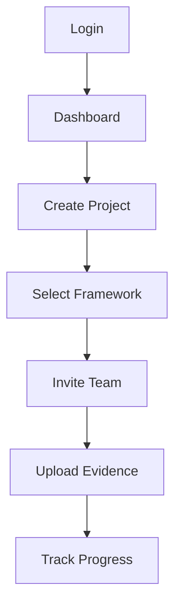
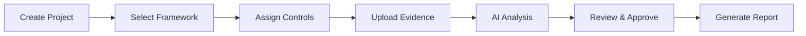
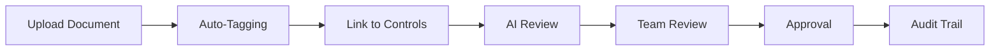

# User Guide

Welcome to the Studio Platform User Guide! This comprehensive guide will help you master all features of the platform, from basic navigation to advanced compliance management.

## 🎯 Who This Guide Is For

This guide is designed for:

- **Compliance Teams** - Managing compliance frameworks and evidence
- **Auditors** - Conducting audits and reviewing evidence
- **Managers** - Overseeing compliance projects and teams
- **Security Teams** - Managing risk and security posture
- **End Users** - Using the platform for daily compliance tasks

## 📚 Guide Structure

### **Getting Started**
- **[Getting Started](getting-started.md)** - Platform overview and first steps
- **[Dashboard](dashboard.md)** - Understanding the main interface
- **[Projects](projects.md)** - Managing compliance projects

### **Core Features**
- **[Evidence Management](evidence-management.md)** - Upload, organize, and review evidence
- **[Compliance Tracking](compliance-tracking.md)** - Monitor compliance scores and progress
- **[AI Assistant](ai-assistant.md)** - Use AI for policy generation and analysis
- **[Risk Management](risk-management.md)** - Assess and mitigate security risks

### **Advanced Features**
- **[Reports](reports.md)** - Generate compliance and audit reports
- **[Collaboration](collaboration.md)** - Work with team members and external parties
- **[Integrations](integrations.md)** - Connect with external tools and services

## 🚀 Quick Start

### **First Login**

1. **Access the Platform**
   - Navigate to your Studio Platform URL
   - Enter your credentials
   - Complete two-factor authentication if enabled

2. **Dashboard Overview**
   - View your compliance score
   - Check recent activities
   - Review pending tasks

3. **Complete Your Profile**
   - Update your personal information
   - Set your preferences
   - Configure notifications

### **Your First Project**



## 🎨 Understanding the Interface

### **Main Navigation**

| Section | Purpose | Key Features |
|---------|---------|--------------|
| **Dashboard** | Overview & quick access | Compliance score, recent activity, quick actions |
| **Projects** | Compliance projects | Project list, creation, management |
| **Evidence** | Document management | Upload, review, annotations |
| **Compliance** | Framework tracking | Scores, gaps, projections |
| **AI Assistant** | Intelligent help | Policy generation, analysis |
| **Risk** | Risk management | Dashboard, findings, mitigation |
| **Reports** | Documentation | Generate, export, schedule |
| **Settings** | Personalization | Profile, preferences, integrations |

### **Common UI Elements**

#### **Navigation Elements**
- **Sidebar Navigation** - Main menu with all sections
- **Top Bar** - Search, notifications, user menu
- **Breadcrumbs** - Current location navigation
- **Quick Actions** - Frequently used actions

#### **Data Display**
- **Cards** - Information widgets with key metrics
- **Tables** - Structured data with sorting and filtering
- **Charts** - Visual representations of compliance data
- **Progress Bars** - Visual progress indicators

#### **Interactive Elements**
- **Buttons** - Primary and secondary actions
- **Forms** - Data input and configuration
- **Modals** - Dialog boxes for detailed actions
- **Tooltips** - Contextual help information

## 👤 User Roles and Permissions

### **Role-Based Access**

| Role | Primary Responsibilities | Key Permissions |
|------|------------------------|-----------------|
| **Customer** | Compliance tasks, evidence upload | Upload evidence, view reports, chat with team |
| **Auditor** | Review, analysis, reporting | Review evidence, create reports, manage findings |
| **Manager** | Oversight, team management | Manage projects, approve evidence, assign tasks |
| **Admin** | System administration | User management, system configuration, full access |

### **Permission Matrix**

| Action | Customer | Auditor | Manager | Admin |
|--------|----------|----------|---------|-------|
| **View Dashboard** | ✅ | ✅ | ✅ | ✅ |
| **Create Projects** | ✅ | ✅ | ✅ | ✅ |
| **Upload Evidence** | ✅ | ✅ | ✅ | ✅ |
| **Review Evidence** | ❌ | ✅ | ✅ | ✅ |
| **Approve Evidence** | ❌ | ❌ | ✅ | ✅ |
| **Manage Users** | ❌ | ❌ | ❌ | ✅ |
| **System Settings** | ❌ | ❌ | ❌ | ✅ |

## 🎯 Common Workflows

### **Compliance Assessment Workflow**



#### **Step-by-Step Guide**

1. **Project Setup**
   - Create new compliance project
   - Select appropriate framework (SOC 2, ISO 27001, etc.)
   - Set project timeline and milestones

2. **Control Mapping**
   - Review framework controls
   - Assign controls to team members
   - Set evidence requirements

3. **Evidence Collection**
   - Upload relevant documents
   - Link evidence to controls
   - Add descriptions and tags

4. **Review Process**
   - Internal review by team members
   - AI-powered gap analysis
   - Manager approval

5. **Reporting**
   - Generate compliance reports
   - Export for auditors
   - Schedule regular updates

### **Evidence Management Workflow**



#### **Best Practices**

1. **Document Organization**
   - Use consistent naming conventions
   - Add relevant metadata
   - Organize by control or category

2. **Quality Assurance**
   - Ensure documents are complete
   - Verify relevance to controls
   - Check for sensitive information

3. **Collaboration**
   - Use annotations for feedback
   - Leverage chat for discussions
   - Track changes and versions

## 🤖 AI Assistant Usage

### **Getting Help from AI**

The AI Assistant can help with:

- **Policy Generation** - Create security policies from templates
- **Compliance Analysis** - Identify gaps and recommendations
- **Document Review** - Analyze uploaded documents
- **Best Practices** - Get guidance on compliance requirements

### **Effective AI Prompts**

#### **Policy Generation**
```
"Generate a data retention policy for a fintech startup that processes customer financial data and must comply with GDPR and PCI DSS requirements."
```

#### **Compliance Analysis**
```
"What evidence am I missing for SOC 2 control A1.1 related to information security policies and procedures?"
```

#### **Document Review**
```
"Review this incident response plan and identify any gaps in NIST Cybersecurity Framework alignment."
```

### **AI Tips and Tricks**

- **Be Specific** - Provide detailed context for better results
- **Reference Controls** - Mention specific framework controls
- **Include Context** - Describe your industry and requirements
- **Iterate** - Refine prompts based on initial results

## 📊 Understanding Compliance Scores

### **Score Calculation**

Compliance scores are calculated based on:

- **Control Coverage** - Percentage of controls with evidence
- **Evidence Quality** - AI assessment of evidence completeness
- **Risk Factors** - Weighted risk assessment
- **Timeliness** - Recency of evidence and updates

### **Score Ranges**

| Score Range | Status | Meaning |
|-------------|--------|---------|
| **90-100%** | Excellent | Fully compliant with minor gaps |
| **75-89%** | Good | Mostly compliant with some gaps |
| **50-74%** | Fair | Partially compliant with significant gaps |
| **25-49%** | Poor | Minimal compliance with major gaps |
| **0-24%** | Critical | Non-compliant requiring immediate action |

### **Improving Your Score**

1. **Identify Gaps**
   - Use AI gap analysis
   - Review missing controls
   - Prioritize high-impact areas

2. **Enhance Evidence**
   - Add missing documentation
   - Improve evidence quality
   - Update outdated information

3. **Address Risks**
   - Mitigate identified risks
   - Implement security controls
   - Document remediation efforts

## 🔧 Personalization and Settings

### **User Preferences**

Configure your experience:

- **Notifications** - Email, in-app, and mobile alerts
- **Dashboard** - Custom widgets and layout
- **Language** - Interface language preferences
- **Time Zone** - Local time settings
- **Theme** - Light/dark mode preferences

### **Integration Setup**

Connect external services:

- **Google Calendar** - Sync audit meetings and deadlines
- **Slack** - Receive notifications and alerts
- **Jira** - Push compliance gaps as issues
- **Email** - Configure notification preferences

### **Security Settings**

Manage your account security:

- **Two-Factor Authentication** - Enable 2FA for enhanced security
- **Session Management** - Review active sessions
- **API Keys** - Generate and manage API access
- **Privacy Settings** - Configure data sharing preferences

## 📱 Mobile Access

### **Mobile Features**

Access Studio Platform on mobile devices:

- **Responsive Design** - Optimized for mobile screens
- **Touch Interface** - Mobile-friendly interactions
- **Push Notifications** - Real-time alerts on mobile
- **Offline Mode** - Limited offline functionality

### **Mobile Workflows**

- **Quick Evidence Upload** - Capture and upload photos/documents
- **Compliance Checks** - Review compliance status on the go
- **Team Communication** - Chat with team members
- **Report Viewing** - Access reports and dashboards

## 🆘 Getting Help

### **In-App Help**

- **Help Center** - Comprehensive documentation and tutorials
- **AI Assistant** - Context-aware help and guidance
- **Tooltips** - Hover-over help for interface elements
- **Guided Tours** - Interactive walkthroughs for new features

### **Support Channels**

- **Chat Support** - Real-time help from support team
- **Email Support** - Detailed issue reporting
- **Community Forum** - User discussions and best practices
- **Knowledge Base** - Self-service documentation

### **Training Resources**

- **Video Tutorials** - Step-by-step video guides
- **Webinars** - Live training sessions
- **Documentation** - Comprehensive guides and references
- **Best Practices** - Industry-standard compliance workflows

## ✅ User Success Checklist

### **First Week Goals**
- [ ] Complete profile setup
- [ ] Navigate the dashboard
- [ ] Create your first project
- [ ] Upload initial evidence
- [ ] Try the AI Assistant
- [ ] Configure notifications

### **First Month Goals**
- [ ] Complete compliance assessment
- [ ] Generate first report
- [ ] Set up integrations
- [ ] Invite team members
- [ ] Establish workflows
- [ ] Customize dashboard

### **Ongoing Success**
- [ ] Regular evidence updates
- [ ] Continuous compliance monitoring
- [ ] Team collaboration
- [ ] Report generation
- [ ] Risk management
- [ ] Process improvement

---

!!! tip "Start Small"
    Begin with a single framework and expand as you become familiar with the platform. The AI Assistant can help you prioritize tasks.

!!! note "Security First**
    Always follow security best practices when uploading sensitive documents. Use the platform's security features to protect your data.

!!! question "Need More Help?"
    Check our [Troubleshooting Guide](../troubleshooting/) for common issues, or contact our support team for personalized assistance.
