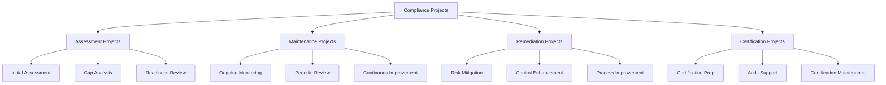
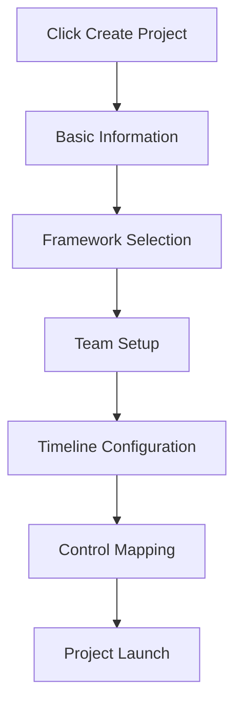
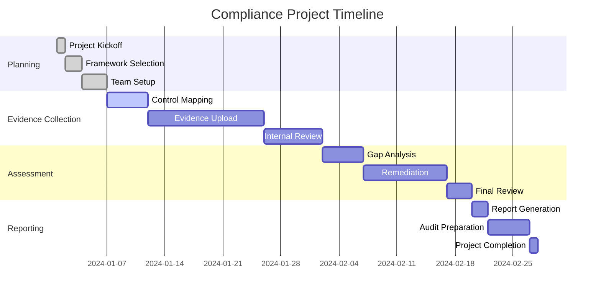
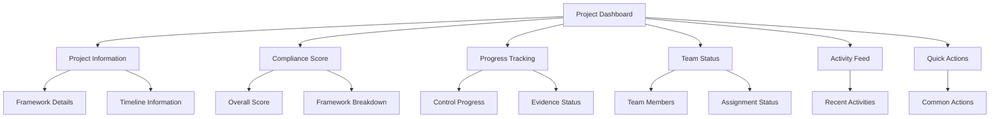
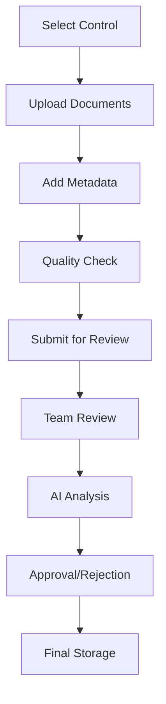
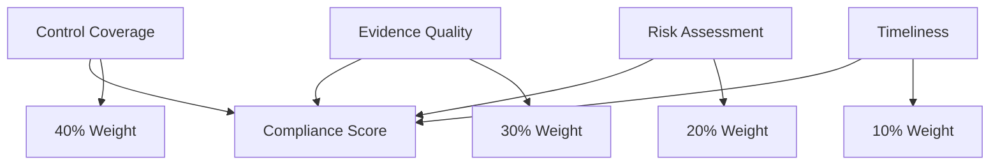
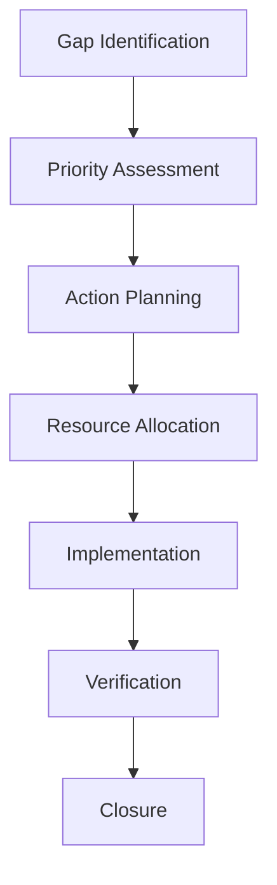

# Projects Guide

Projects are the core organizing structure for compliance activities in Studio Platform. This comprehensive guide covers everything from project creation to completion and beyond.

## 🎯 Project Overview

### **What is a Compliance Project?**

A compliance project is a structured initiative to assess, maintain, or improve compliance with specific regulatory frameworks or standards. Each project serves as a container for:

- **Framework Selection** - Specific compliance standards
- **Control Mapping** - Framework controls and requirements
- **Evidence Collection** - Supporting documentation
- **Team Collaboration** - Assignments and workflows
- **Progress Tracking** - Compliance scoring and metrics
- **Reporting** - Documentation and audit trails

### **Project Types**



## 🚀 Project Creation

### **Step-by-Step Project Setup**

#### **Step 1: Basic Project Information**



**Required Information:**
- **Project Name** - Clear, descriptive title
- **Project Description** - Scope and objectives
- **Project Type** - Assessment, maintenance, or remediation
- **Priority Level** - High, medium, or low priority
- **Expected Timeline** - Start and end dates

**Best Practices for Project Naming:**
- **Include Framework** - "SOC 2 Type II - Q4 2024"
- **Specify Period** - "ISO 27001 - Annual Review 2024"
- **Indicate Scope** - "GDPR - Marketing Department Only"
- **Use Consistent Format** - Establish naming conventions

#### **Step 2: Framework Selection**

**Available Frameworks:**

| Framework | Type | Typical Duration | Complexity |
|-----------|------|------------------|------------|
| **SOC 2 Type I** | Assessment | 2-4 weeks | Medium |
| **SOC 2 Type II** | Assessment | 6-12 months | High |
| **ISO 27001** | Certification | 3-6 months | High |
| **GDPR** | Compliance | Ongoing | Medium |
| **HIPAA** | Compliance | Ongoing | Medium |
| **PCI DSS** | Assessment | 4-8 weeks | High |
| **NIST CSF** | Assessment | 8-12 weeks | Medium |

**Framework Selection Criteria:**
- **Regulatory Requirements** - What standards apply to your organization?
- **Customer Requirements** - What do your customers or partners require?
- **Industry Standards** - What are common standards in your industry?
- **Resource Availability** - Do you have team resources for the assessment?
- **Timeline Constraints** - What are your deadline requirements?

#### **Step 3: Team Configuration**

**Team Roles and Responsibilities:**

| Role | Primary Responsibilities | Required Skills |
|------|------------------------|-----------------|
| **Project Manager** | Overall coordination, timeline management | Project management, compliance knowledge |
| **Compliance Lead** | Framework expertise, control mapping | Deep framework knowledge |
| **Technical Lead** | System configuration, technical evidence | IT infrastructure, security |
| **Business Stakeholder** | Process documentation, business evidence | Business process expertise |
| **Legal Counsel** | Legal review, regulatory guidance | Legal background, regulatory knowledge |
| **External Auditor** | Independent review, certification | Audit experience, framework expertise |

**Team Invitation Process:**
1. **Add Internal Team Members**
   - Search existing users
   - Assign roles and permissions
   - Send invitation notifications

2. **Configure External Access**
   - Create auditor accounts
   - Set access permissions
   - Configure secure access methods

3. **Define Communication Protocols**
   - Set up team chat channels
   - Establish meeting schedules
   - Configure notification preferences

#### **Step 4: Timeline and Milestones**

**Project Phases:**



**Key Milestones:**
- **Project Kickoff** - Team alignment and goal setting
- **Evidence Collection Complete** - All required evidence uploaded
- **Internal Review Complete** - Internal approval of evidence
- **Gap Analysis Complete** - Identification of compliance gaps
- **Remediation Complete** - All gaps addressed
- **External Audit** - Third-party review and certification
- **Project Closure** - Final reporting and documentation

#### **Step 5: Control Mapping**

**Control Selection Process:**

1. **Framework Controls Review**
   - Review all framework controls
   - Identify applicable controls
   - Document control requirements

2. **Custom Control Addition**
   - Add organization-specific controls
   - Map to framework requirements
   - Define evidence requirements

3. **Control Assignment**
   - Assign controls to team members
   - Set evidence requirements
   - Establish deadlines

**Control Categories:**

| Category | Example Controls | Evidence Types |
|----------|-----------------|----------------|
| **Access Control** | User access, privileged access, remote access | Access policies, access reviews, system logs |
| **Security Operations** | Incident response, vulnerability management, monitoring | IR plans, scan results, monitoring reports |
| **Risk Management** | Risk assessment, risk treatment, risk monitoring | Risk registers, treatment plans, monitoring reports |
| **Physical Security** | Facility access, environmental controls, visitor management | Access logs, camera footage, visitor records |
| **Data Protection** | Data classification, encryption, backup | Classification policies, encryption standards, backup procedures |

## 📊 Project Dashboard

### **Project Overview Interface**

#### **Main Dashboard Components**



**Project Information Panel:**
```
📋 Q4 2024 SOC 2 Type II Assessment
   Framework: SOC 2 Type II (Security, Availability, Confidentiality)
   Timeline: Oct 1, 2024 - Mar 31, 2025
   Status: In Progress | Priority: High
   
   👥 Team: 8 members | 📊 Score: 78% | 📈 Trend: +5%
   ⏰ Next Deadline: Evidence Review - Nov 15, 2024
   🎯 Completion: 45/60 controls (75%)
```

#### **Compliance Score Visualization**

**Score Breakdown Widget:**
- **Overall Compliance Score** - Primary percentage score
- **Framework Scores** - Individual framework compliance
- **Control Category Scores** - Scores by control category
- **Trend Analysis** - Historical progress tracking
- **Gap Analysis** - Identified compliance gaps

**Score Details:**
```
📊 Overall Compliance Score: 78% 🟡
   Security (CC): 82% | Availability: 75% | Processing Integrity: 80%
   Confidentiality: 70% | Privacy: 85%
   
   📈 Score Trend: Improving (+5% this month)
   ⚠️ Critical Gaps: 3 controls requiring immediate attention
   🎯 Target Score: 90% by project completion
```

### **Progress Tracking**

#### **Control Progress Overview**

**Progress Metrics:**
- **Controls Complete** - Number and percentage of completed controls
- **Evidence Count** - Total evidence items uploaded
- **Review Status** - Evidence review progress
- **Team Performance** - Individual team member contributions

**Control Status Distribution:**
```
📊 Control Progress Overview
   ✅ Complete: 45 controls (75%)
   🟡 In Progress: 10 controls (17%)
   ❌ Not Started: 5 controls (8%)
   
   📄 Evidence: 127 items uploaded
   👥 Team Activity: 8 active members
   ⏰ Average Review Time: 2.3 days
```

#### **Evidence Collection Status**

**Evidence Metrics:**
- **Total Evidence** - Overall evidence count
- **Evidence by Category** - Distribution across control categories
- **Review Queue** - Evidence awaiting review
- **Quality Scores** - AI-assessed evidence quality

**Evidence Quality Analysis:**
```
📄 Evidence Quality Overview
   🟢 High Quality: 89 items (70%)
   🟡 Good Quality: 28 items (22%)
   🔴 Needs Improvement: 10 items (8%)
   
   🤖 AI Quality Score: 85% average
   ⏱️ Average Upload Time: 3.2 days per control
   🔄 Review Cycle: 2.1 days average
```

## 👥 Team Collaboration

### **Team Member Management**

#### **Role-Based Access Control**

**Permission Matrix:**

| Action | Project Manager | Compliance Lead | Team Member | External Auditor |
|--------|----------------|----------------|------------|------------------|
| **View Project** | ✅ | ✅ | ✅ | ✅ |
| **Edit Project** | ✅ | ✅ | ❌ | ❌ |
| **Upload Evidence** | ✅ | ✅ | ✅ | ❌ |
| **Review Evidence** | ✅ | ✅ | ❌ | ✅ |
| **Assign Tasks** | ✅ | ✅ | ❌ | ❌ |
| **Generate Reports** | ✅ | ✅ | ❌ | ✅ |
| **Manage Team** | ✅ | ❌ | ❌ | ❌ |

#### **Team Communication Tools**

**Integrated Chat System:**
- **Project Channels** - Dedicated chat for each project
- **Direct Messages** - Private conversations between team members
- **File Sharing** - Share documents and evidence within chat
- **Video Calls** - Integrated video conferencing for team meetings
- **Screen Sharing** - Collaborative review sessions

**Communication Features:**
```
💬 Project Chat: Q4 2024 SOC 2 Assessment
   👥 8 members online | 📞 2 active calls | 📄 15 shared files
   
   Recent Messages:
   📝 Jane Smith: "Uploaded new security policy for A1.1"
   📎 John Doe: "Attached incident response plan for A6.1"
   🤖 AI Assistant: "Identified 3 gaps in A7.1 controls"
```

### **Task Management and Assignments**

#### **Control Assignment Workflow**

**Assignment Process:**
1. **Control Selection**
   - Browse controls by category
   - Filter by priority or difficulty
   - Review control requirements

2. **Team Member Assignment**
   - Select appropriate team member
   - Consider workload and expertise
   - Set assignment deadline

3. **Task Configuration**
   - Define evidence requirements
   - Set quality standards
   - Configure notifications

**Assignment Dashboard:**
```
🎯 Control Assignments
   📋 Total Controls: 60 | ✅ Assigned: 55 | ⏳ Unassigned: 5
   
   Team Performance:
   👤 Jane Smith: 12 controls (8 complete, 4 in progress)
   👤 John Doe: 10 controls (7 complete, 3 in progress)
   👤 Mike Johnson: 8 controls (6 complete, 2 in progress)
   
   Upcoming Deadlines:
   🔴 A1.2 - Due Tomorrow (John Doe)
   🟡 A2.1 - Due in 3 days (Jane Smith)
   🟡 A3.4 - Due in 5 days (Mike Johnson)
```

#### **Progress Monitoring**

**Individual Performance Tracking:**
- **Assignment Completion** - Controls completed by team member
- **Evidence Quality** - Quality scores for uploaded evidence
- **Timeliness** - On-time completion percentage
- **Collaboration** - Team communication and participation

**Team Analytics:**
```
📊 Team Performance Analytics
   🎯 Overall Progress: 75% complete
   ⚡ Average Completion Time: 4.2 days per control
   📄 Evidence Quality: 87% average score
   💬 Team Communication: 156 messages this week
   
   Top Performers:
   🥇 Jane Smith: 95% on-time completion
   🥈 John Doe: 92% evidence quality score
   🥉 Mike Johnson: Most controls completed
```

## 📁 Evidence Management

### **Evidence Collection Process**

#### **Evidence Upload Workflow**



**Upload Guidelines:**
- **Document Types** - PDF, Word, Excel, images, text files
- **File Size Limits** - Maximum 100MB per file
- **Naming Conventions** - Consistent, descriptive file names
- **Metadata Requirements** - Title, description, date range, tags

#### **Evidence Quality Standards**

**Quality Criteria:**

| Quality Factor | Excellent | Good | Needs Improvement |
|----------------|-----------|-------|-------------------|
| **Completeness** | All requirements met | Minor gaps | Significant gaps |
| **Clarity** | Clear and readable | Mostly clear | Difficult to read |
| **Relevance** | Directly addresses control | Somewhat relevant | Not relevant |
| **Currency** | Current and valid | Mostly current | Outdated |
| **Accuracy** | Accurate information | Minor inaccuracies | Major inaccuracies |

**AI Quality Assessment:**
```
🤖 AI Quality Analysis for "Security Policy v2.1"
   Overall Score: 92% 🟢 Excellent
   
   Quality Factors:
   ✅ Completeness: 95% - Covers all required elements
   ✅ Clarity: 90% - Well-written and organized
   ✅ Relevance: 95% - Directly addresses SOC 2 A1.1
   ✅ Currency: 88% - Recent update with current date
   ✅ Accuracy: 92% - No factual errors detected
   
   Recommendations:
   💡 Add version number and approval date
   💡 Include incident response procedures
   💡 Add emergency contact information
```

### **Evidence Review Process**

#### **Review Workflow**

**Review Stages:**
1. **Initial Review** - Basic quality and relevance check
2. **Detailed Analysis** - Comprehensive compliance assessment
3. **Peer Review** - Secondary reviewer validation
4. **Manager Approval** - Final approval and sign-off

**Review Interface:**
```
📄 Evidence Review: Security Policy v2.1
   Control: SOC 2 A1.1 - Information Security Policies
   Uploaded by: Jane Smith | Date: Nov 10, 2024
   File Size: 2.4 MB | Pages: 15
   
   🤖 AI Assessment: 92% Quality Score
   👥 Human Reviews: 2/3 complete
   
   Review Actions:
   ✅ Approve Evidence
   ✅ Request Changes
   ✅ Add Comments
   ✅ Assign to Different Control
```

#### **Collaborative Review**

**Review Features:**
- **Annotations** - Direct comments on evidence documents
- **Discussion Threads** - Contextual conversations
- **Version Control** - Track evidence changes
- **Approval Workflows** - Multi-level approval processes

**Annotation System:**
```
📝 Evidence Annotations
   📍 Page 3, Paragraph 2: "Add specific incident response timeline"
   👤 Comment by: John Doe | Status: Open
   
   📍 Page 7, Table 1: "Include emergency contact information"
   👤 Comment by: Mike Johnson | Status: Resolved
   
   📍 Page 12: "Good coverage of access control procedures"
   👤 Comment by: Jane Smith | Status: Approved
```

## 📈 Compliance Tracking

### **Real-Time Compliance Monitoring**

#### **Score Calculation Methodology**

**Score Components:**


**Dynamic Scoring:**
- **Real-Time Updates** - Scores update as evidence is added
- **Weighted Controls** - Critical controls have higher impact
- **Risk Adjustment** - High-risk areas affect scores more
- **Time Decay** - Older evidence has reduced impact

#### **Compliance Analytics**

**Trend Analysis:**
```
📈 Compliance Score Trends
   Current Score: 78% 🟡
   30-Day Change: +5% 📈
   90-Day Change: +12% 📈
   
   Progress by Category:
   🔒 Security Controls: 82% (+3% this month)
   ⚡ Availability: 75% (+7% this month)
   🔄 Processing Integrity: 80% (+2% this month)
   🔐 Confidentiality: 70% (+8% this month)
   👤 Privacy: 85% (+4% this month)
```

**Predictive Analytics:**
- **Completion Forecasting** - Predict final compliance score
- **Risk Projection** - Anticipate potential compliance gaps
- **Resource Planning** - Optimize team allocation
- **Deadline Alerts** - Proactive deadline management

### **Gap Analysis and Remediation**

#### **Automated Gap Detection**

**AI-Powered Gap Analysis:**
```
🔍 Gap Analysis Results
   📊 Overall Gap Score: 22% (Target: <10%)
   🔴 Critical Gaps: 3 controls requiring immediate action
   🟡 Moderate Gaps: 5 controls needing attention
   🟢 Minor Gaps: 8 controls for improvement
   
   Priority Actions:
   1. SOC 2 A6.1 - Incident Response Plan (Critical)
   2. SOC 2 A7.1 - User Access Reviews (Critical)
   3. SOC 2 A8.1 - System Monitoring (Critical)
```

**Gap Categories:**
- **Missing Evidence** - Controls with no supporting documentation
- **Insufficient Evidence** - Evidence doesn't fully address requirements
- **Outdated Evidence** - Evidence is no longer current
- **Quality Issues** - Evidence quality is below standards

#### **Remediation Planning**

**Remediation Workflow:**


**Action Planning:**
- **Specific Actions** - Detailed remediation steps
- **Responsibility Assignment** - Clear ownership of tasks
- **Timeline Setting** - Realistic completion deadlines
- **Success Criteria** - Measurable completion standards

## 📊 Reporting and Documentation

### **Report Generation**

#### **Report Types**

| Report Type | Purpose | Audience | Frequency |
|-------------|---------|----------|-----------|
| **Compliance Summary** | Overall compliance status | Management | Monthly |
| **Evidence Inventory** | Complete evidence listing | Auditors | On-demand |
| **Gap Analysis** | Compliance gaps and risks | Compliance Team | Weekly |
| **Progress Report** | Project advancement | Stakeholders | Bi-weekly |
| **Executive Summary** | High-level overview | Executive Leadership | Quarterly |

#### **Custom Report Builder**

**Report Configuration:**
- **Template Selection** - Choose from pre-built templates
- **Content Sections** - Select included report sections
- **Data Filters** - Filter by date, framework, team
- **Format Options** - PDF, Excel, Word formats
- **Branding** - Add company logo and styling

**Report Preview:**
```
📊 Q4 2024 SOC 2 Assessment Report
   Generated: Nov 15, 2024 | Status: Draft
   Pages: 45 | File Size: 3.2 MB
   
   Report Sections:
   ✅ Executive Summary
   ✅ Compliance Overview
   ✅ Evidence Inventory
   ✅ Gap Analysis
   ✅ Risk Assessment
   ✅ Recommendations
   
   Actions:
   📥 Download PDF
   📧 Share Report
   ✏️ Edit Report
   📅 Schedule Generation
```

### **Audit Trail and Documentation**

#### **Comprehensive Audit Logging**

**Logged Activities:**
- **User Actions** - Logins, uploads, reviews, approvals
- **System Events** - Score changes, notifications, system updates
- **Document Changes** - Evidence uploads, modifications, deletions
- **Communication** - Team messages, comments, discussions

**Audit Log Interface:**
```
📋 Audit Trail: Q4 2024 SOC 2 Assessment
   Total Events: 1,247 | Date Range: Oct 1 - Nov 15, 2024
   
   Recent Events:
   📝 Nov 15, 2024 14:32 - Jane Smith uploaded "Security Policy v2.1"
   ✅ Nov 15, 2024 14:35 - John Doe approved evidence for A1.1
   📊 Nov 15, 2024 14:40 - Compliance score updated to 78%
   💬 Nov 15, 2024 14:45 - Team message: "Ready for review meeting"
   
   Filter Options:
   🔍 Search by user, action, or control
   📅 Filter by date range
   🏷️ Filter by event type
   📥 Export audit log
```

## 🎯 Project Completion and Closure

### **Completion Criteria**

#### **Project Completion Checklist**

**Requirements for Project Closure:**
- [ ] **Evidence Collection** - All required evidence uploaded and approved
- [ ] **Compliance Score** - Target compliance score achieved
- [ ] **Gap Remediation** - All critical gaps addressed
- [ ] **Team Review** - Internal review and approval completed
- [ ] **Documentation** - All required reports generated
- [ ] **External Audit** - Third-party review completed (if applicable)
- [ ] **Sign-off** - Management approval and project sign-off

#### **Final Review Process**

**Review Steps:**
1. **Evidence Completeness Check**
   - Verify all controls have evidence
   - Confirm evidence meets quality standards
   - Validate evidence currency and relevance

2. **Compliance Score Validation**
   - Review score calculation methodology
   - Verify gap analysis results
   - Confirm risk assessment accuracy

3. **Documentation Review**
   - Check report completeness
   - Validate audit trail integrity
   - Ensure all deliverables are ready

### **Project Handoff**

#### **Deliverables Package**

**Handoff Documentation:**
- **Final Compliance Report** - Complete compliance assessment
- **Evidence Inventory** - Full evidence catalog
- **Gap Analysis Report** - Identified gaps and remediation
- **Risk Assessment** - Current risk landscape
- **Process Documentation** - Established procedures and controls
- **Maintenance Plan** - Ongoing compliance activities

**Handoff Meeting Agenda:**
- **Project Results Presentation** - Key findings and outcomes
- **Compliance Status Review** - Current compliance posture
- **Outstanding Items** - Any remaining issues or concerns
- **Maintenance Requirements** - Ongoing compliance activities
- **Next Steps** - Future compliance initiatives

### **Project Archive and Retention**

#### **Archive Process**

**Archive Steps:**
1. **Project Status Change** - Move to "Completed" status
2. **Data Backup** - Create project backup
3. **Access Control** - Limit access to read-only
4. **Documentation Storage** - Archive all project documents
5. **Knowledge Transfer** - Document lessons learned

**Retention Policy:**
- **Active Projects** - Current and ongoing projects
- **Completed Projects** - Retain for 7 years
- **Evidence Documents** - Retain according to regulatory requirements
- **Audit Logs** - Retain for compliance and legal requirements

## ✅ Project Success Tips

### **Best Practices**

#### **Project Planning**
- **Clear Objectives** - Define specific, measurable goals
- **Realistic Timelines** - Set achievable deadlines
- **Resource Planning** - Ensure adequate team resources
- **Risk Assessment** - Identify and mitigate project risks

#### **Team Management**
- **Clear Roles** - Define responsibilities and expectations
- **Regular Communication** - Maintain consistent team communication
- **Performance Monitoring** - Track team progress and performance
- **Recognition** - Acknowledge team achievements

#### **Quality Assurance**
- **Evidence Standards** - Maintain high evidence quality
- **Regular Reviews** - Conduct periodic quality reviews
- **Continuous Improvement** - Learn from experience and improve processes
- **Documentation** - Maintain comprehensive documentation

### **Common Project Pitfalls**

❌ **Avoid These Mistakes:**
- Starting without clear objectives and scope
- Underestimating timeline and resource requirements
- Neglecting team communication and coordination
- Waiting until the last minute for evidence collection
- Ignoring quality standards and review processes

✅ **Follow These Best Practices:**
- Plan thoroughly and set realistic expectations
- Maintain regular team communication and progress reviews
- Collect evidence continuously throughout the project
- Establish and maintain quality standards
- Document processes and lessons learned

---

!!! tip **Project Templates**
    Use project templates for common compliance frameworks to streamline setup and ensure consistency across projects.

!!! note **Continuous Monitoring**
    Even after project completion, continue monitoring compliance scores and evidence currency to maintain compliance posture.

!!! question **Need Help?**
    Use the AI Assistant for project planning guidance, or check our [Troubleshooting Guide](../troubleshooting/) for common project issues.
