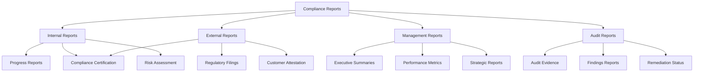
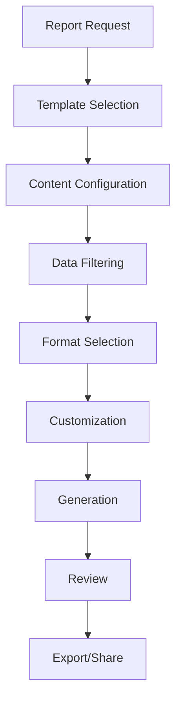

# Reports

Comprehensive reporting is essential for demonstrating compliance, communicating with stakeholders, and supporting audit activities. Studio Platform provides powerful reporting capabilities with customizable templates, automated generation, and multi-format export options.

## 📊 Reports Overview

### **What are Compliance Reports?**

Compliance reports are formal documents that demonstrate your organization's adherence to regulatory requirements and internal controls. They provide evidence of compliance activities, document compliance status, and support audit and certification processes.

#### **Report Types and Purposes**



### **Report Categories**

#### **Internal Reports**

| Report Type | Purpose | Frequency | Audience | Key Content |
|-------------|---------|-----------|----------|-------------|
| **Progress Report** | Track project advancement | Weekly/Bi-weekly | Project Team | Progress metrics, milestones, issues |
| **Gap Analysis** | Identify compliance gaps | Monthly | Compliance Team | Gap details, risk assessment, recommendations |
| **Risk Assessment** | Document risk landscape | Quarterly | Management | Risk inventory, analysis, mitigation status |
| **Evidence Inventory** | Catalog all evidence | Monthly | Team Members | Evidence list, quality scores, gaps |

#### **External Reports**

| Report Type | Purpose | Frequency | Audience | Key Content |
|-------------|---------|-----------|----------|-------------|
| **Compliance Certification** | Demonstrate compliance | Annual | Regulators | Compliance status, evidence, controls |
| **Regulatory Filings** | Meet regulatory requirements | As required | Regulators | Required disclosures, compliance attestations |
| **Customer Attestation** | Provide assurance to customers | On-demand | Customers | Compliance status, controls, evidence |
| **Third-Party Audit** | Support external audits | As needed | Auditors | Evidence, controls, compliance status |

#### **Management Reports**

| Report Type | Purpose | Frequency | Audience | Key Content |
|-------------|---------|-----------|----------|-------------|
| **Executive Summary** | High-level overview | Quarterly | Executive Leadership | Risk posture, compliance status, business impact |
| **Performance Metrics** | Track KPIs | Monthly | Management | Performance indicators, trends, benchmarks |
| **Strategic Report** | Support strategic planning | Annual | Leadership | Strategic alignment, future requirements, recommendations |

## 🛠️ Report Generation

### **Report Builder Interface**

#### **Report Creation Process**



**Report Builder Features:**
- **Template Library** - Pre-built report templates
- **Custom Builder** - Build reports from scratch
- **Content Selection** - Choose included sections and content
- **Data Filtering** - Filter data by date, framework, team
- **Format Options** - Multiple output formats
- **Branding** - Custom company branding

#### **Report Configuration**

**Configuration Options:**
```
📊 Report Builder
   Report Type: Compliance Summary
   Template: Executive Summary Template
   Date Range: Oct 1, 2024 - Nov 15, 2024
   
   📋 Content Sections:
   ✅ Executive Summary
   ✅ Compliance Overview
   ✅ Framework Breakdown
   ✅ Evidence Inventory
   ✅ Gap Analysis
   ✅ Risk Assessment
   ✅ Team Performance
   ✅ Recommendations
   
   🔧 Configuration Options:
   📅 Date Range: Custom range selected
   🎯 Frameworks: SOC 2, ISO 27001, GDPR
   👥 Teams: All teams included
   📊 Metrics: All key metrics included
   🎨 Branding: Company branding applied
   
   📄 Export Options:
   📄 PDF: High-quality PDF format
   📊 Excel: Interactive spreadsheet
   📝 Word: Editable document
   🌐 Web: Interactive web report
   📧 Email: Direct email delivery
```

### **Template Library**

#### **Available Templates**

**Executive Templates:**
- **Executive Summary** - High-level overview for leadership
- **Board Report** - Quarterly report for board of directors
- **Investor Report** - Compliance status for investors
- **Strategic Overview** - Long-term compliance strategy

**Operational Templates:**
- **Compliance Dashboard** - Operational compliance metrics
- **Project Status** - Project progress and milestones
- **Evidence Summary** - Evidence inventory and quality
- **Risk Report** - Risk assessment and mitigation

**Audit Templates:**
- **Audit Evidence** - Evidence compilation for auditors
- **Compliance Certification** - Certification package
- **Gap Analysis** - Detailed gap analysis report
- **Remediation Status** - Remediation progress tracking

**Custom Templates:**
- **Industry-Specific** - Templates for specific industries
- **Framework-Specific** - Templates for specific frameworks
- **Role-Specific** - Templates for different roles
- **Custom Company** - Company-specific templates

#### **Template Customization**

**Customization Options:**
- **Content Sections** - Add/remove content sections
- **Data Fields** - Include/exclude specific data fields
- **Formatting** - Customize fonts, colors, layout
- **Branding** - Add company logo and styling
- **Calculations** - Custom calculations and metrics

**Template Example:**
```
📋 Template: SOC 2 Type II Executive Summary
   Template ID: SOC2-EXEC-001
   Version: 2.1
   Last Updated: Nov 1, 2024
   
   📊 Template Structure:
   1. Executive Summary
      - Compliance Score Overview
      - Key Achievements
      - Critical Issues
      - Business Impact
   
   2. Compliance Details
      - SOC 2 Trust Services Criteria
      - Control Coverage
      - Evidence Quality
      - Gap Analysis
   
   3. Risk Assessment
      - Risk Inventory
      - Risk Mitigation
      - Risk Trends
      - Emerging Risks
   
   4. Team Performance
      - Team Metrics
      - Productivity Analysis
      - Training Status
      - Resource Utilization
   
   5. Recommendations
      - Strategic Recommendations
      - Operational Improvements
      - Resource Requirements
      - Timeline Planning
   
   🎨 Customization Options:
   - Add company branding
   - Include/exclude sections
   - Modify data fields
   - Adjust formatting
   - Add custom calculations
```

## 📈 Report Content

### **Executive Summary**

#### **Executive Summary Components**

**Key Elements:**
- **Compliance Score** - Overall compliance percentage
- **Key Achievements** - Major accomplishments and improvements
- **Critical Issues** - High-priority problems requiring attention
- **Business Impact** - Compliance impact on business operations
- **Strategic Recommendations** - High-level recommendations

**Executive Summary Example:**
```
📊 Executive Summary: Q4 2024 Compliance Report
   Report Date: November 15, 2024
   Period: October 1, 2024 - November 15, 2024
   
   🎯 Compliance Overview:
   Overall Compliance Score: 78% (Good)
   Improvement: +5% from previous quarter
   Target Achievement: On track for 85% year-end target
   
   🏆 Key Achievements:
   - SOC 2 Type II assessment 75% complete
   - GDPR compliance improved to 85%
   - Evidence quality increased to 87%
   - Team productivity up 15%
   
   ⚠️ Critical Issues:
   - 3 critical gaps in incident response (SOC 2 A6.1)
   - Database security vulnerability requiring immediate attention
   - Staff training completion below target (70% vs 85%)
   
   💼 Business Impact:
   - Customer confidence maintained
   - No regulatory penalties incurred
   - New customer onboarding accelerated
   - Insurance premiums reduced 10%
   
   🎯 Strategic Recommendations:
   1. Prioritize incident response improvements
   2. Address database security vulnerabilities
   3. Enhance staff training programs
   4. Prepare for ISO 27001 certification in Q1 2025
   
   📊 Resource Requirements:
   - Additional security staff: 2 FTE
   - Training budget: $50,000
   - Technology investment: $100,000
   - Consulting services: $75,000
```

### **Compliance Details**

#### **Framework Breakdown**

**SOC 2 Compliance Details:**
```
🔒 SOC 2 Type II Compliance Analysis
   Assessment Period: October 1, 2024 - November 15, 2024
   Overall Score: 78% (Good)
   
   📊 Trust Services Criteria Breakdown:
   
   Security (Common Criteria): 82%
   - Controls Complete: 45/55 (82%)
   - Evidence Quality: 85%
   - Gap Count: 3 critical, 5 moderate
   - Trend: +4% this quarter
   
   Availability: 75%
   - Controls Complete: 18/24 (75%)
   - Evidence Quality: 82%
   - Gap Count: 2 critical, 4 moderate
   - Trend: +6% this quarter
   
   Processing Integrity: 80%
   - Controls Complete: 20/25 (80%)
   - Evidence Quality: 88%
   - Gap Count: 1 critical, 3 moderate
   - Trend: +3% this quarter
   
   Confidentiality: 70%
   - Controls Complete: 14/20 (70%)
   - Evidence Quality: 80%
   - Gap Count: 3 critical, 6 moderate
   - Trend: +8% this quarter
   
   Privacy: 85%
   - Controls Complete: 17/20 (85%)
   - Evidence Quality: 90%
   - Gap Count: 1 critical, 2 moderate
   - Trend: +2% this quarter
   
   🎯 Key Insights:
   - Strong performance in Privacy controls
   - Availability controls improving rapidly
   - Confidentiality needs additional focus
   - Security controls consistently strong
```

#### **Evidence Inventory**

**Evidence Summary:**
```
📄 Evidence Inventory Report
   Total Evidence: 1,247 items
   Quality Score: 85% (Good)
   Upload Rate: 42 items per week
   
   📊 Evidence by Category:
   Policies & Procedures: 345 items (28%)
   Technical Evidence: 412 items (33%)
   Operational Records: 234 items (19%)
   Assessment Results: 156 items (12%)
   Training Records: 100 items (8%)
   
   📈 Quality Metrics:
   🟢 High Quality (90-100%): 523 items (42%)
   🟡 Good Quality (80-89%): 523 items (42%)
   🟠 Needs Improvement (70-79%): 156 items (12%)
   🔴 Poor Quality (<70%): 45 items (4%)
   
   🎯 Evidence Gaps:
   - Missing evidence: 23 controls
   - Poor quality evidence: 45 items
   - Outdated evidence: 67 items
   - Incomplete evidence: 34 items
   
   📅 Upload Trends:
   - This Week: 42 items
   - This Month: 167 items
   - This Quarter: 502 items
   - This Year: 1,247 items
   
   👥 Team Contributions:
   - Jane Smith: 234 items (19%)
   - John Doe: 198 items (16%)
   - Mike Johnson: 187 items (15%)
   - Sarah Wilson: 176 items (14%)
   - Others: 452 items (36%)
```

### **Risk Assessment**

#### **Risk Analysis**

**Risk Summary:**
```
⚠️ Risk Assessment Report
   Assessment Date: November 15, 2024
   Total Risks: 47
   Average Risk Score: 12.3 (Medium)
   
   📊 Risk Distribution:
   🔴 Critical Risks: 2 (4%)
   🔴 High Risks: 8 (17%)
   🟡 Medium Risks: 22 (47%)
   🟢 Low Risks: 12 (25%)
   🟢 Very Low Risks: 3 (6%)
   
   🎯 Top Risk Categories:
   1. Security Risks: 18 risks (38%)
      - Database vulnerabilities
      - Access control gaps
      - System configuration issues
   
   2. Compliance Risks: 15 risks (32%)
      - Documentation gaps
      - Control implementation issues
      - Training deficiencies
   
   3. Operational Risks: 8 risks (17%)
      - Process gaps
      - Resource constraints
      - System availability issues
   
   📈 Risk Trends:
   - Overall Risk Score: +2.3 points this quarter
   - Critical Risks: -1 (improvement)
   - High Risks: +3 (increase)
   - Medium Risks: +2 (increase)
   
   🛡️ Mitigation Status:
   - Risks Mitigated: 12 (25%)
   - Risks in Progress: 23 (49%)
   - Risks Not Addressed: 12 (26%)
   
   🎯 Risk Outlook:
   - Expected reduction in critical risks
   - Emerging cyber threats require attention
   - Compliance risks stabilizing
   - Operational risks improving
```

## 📤 Report Export and Sharing

### **Export Options**

#### **Format Options**

**PDF Export:**
- **High-Quality PDF** - Professional formatting with graphics
- **Interactive PDF** - Hyperlinks and bookmarks
- **Compressed PDF** - Optimized for email sharing
- **Archival PDF** - Long-term preservation format

**Excel Export:**
- **Data Workbook** - Raw data with calculations
- **Summary Workbook** - Summary data and charts
- **Interactive Dashboard** - Interactive Excel dashboard
- **Template Workbook** - Reusable Excel template

**Word Export:**
- **Editable Document** - Fully editable Word document
- **Final Document** - Read-only final version
- **Template Document** - Reusable Word template
- **Track Changes** - Document with tracked changes

**Web Export:**
- **Interactive Web** - Interactive web-based report
- **Static Web** - Static HTML report
- **Mobile Web** - Mobile-optimized web report
- **Printable Web** - Print-optimized web report

#### **Export Configuration**

**Export Settings:**
```
📤 Export Configuration
   Report: Q4 2024 Compliance Summary
   Format: PDF (High Quality)
   
   📋 Export Options:
   ✅ Include all sections
   ✅ Include charts and graphs
   ✅ Include company branding
   ✅ Include page numbers
   ✅ Include table of contents
   ❌ Include raw data
   ❌ Include sensitive information
   
   🎨 Formatting Options:
   Page Size: A4
   Orientation: Portrait
   Margins: Standard
   Font: Arial 11pt
   Colors: Company colors
   
   🔒 Security Options:
   Password Protection: No
   Copy Protection: No
   Print Protection: No
   Edit Protection: No
   
   📧 Delivery Options:
   Email: compliance@company.com
   Subject: Q4 2024 Compliance Report
   Message: Please find attached compliance report
   CC: management@company.com
   
   📅 Schedule:
   Generate: Immediately
   Repeat: Monthly
   Next Generation: December 15, 2024
```

### **Sharing and Distribution**

#### **Sharing Methods**

**Direct Sharing:**
- **Email Delivery** - Send reports via email
- **Secure Link** - Share via secure web link
- **Platform Sharing** - Share within platform
- **API Access** - Programmatic access to reports

**Distribution Lists:**
- **Management Distribution** - Executive leadership team
- **Team Distribution** - Project team members
- **Stakeholder Distribution** - Key stakeholders
- **External Distribution** - Customers, partners, regulators

**Sharing Configuration:**
```
📤 Report Sharing Configuration
   Report: Q4 2024 Compliance Summary
   
   👥 Distribution Lists:
   📧 Management Team:
   - CEO (ceo@company.com)
   - CISO (ciso@company.com)
   - CFO (cfo@company.com)
   - COO (coo@company.com)
   
   👥 Project Team:
   - Jane Smith (jane@company.com)
   - John Doe (john@company.com)
   - Mike Johnson (mike@company.com)
   
   🌐 External Stakeholders:
   - Board Members (board@company.com)
   - Key Customers (customers@company.com)
   - Regulators (regulators@company.com)
   
   🔒 Access Control:
   - Management: Full access
   - Team: View and comment
   - External: View only
   - Public: No access
   
   📅 Delivery Schedule:
   - Immediate: Management team
   - 24 hours: Project team
   - 48 hours: External stakeholders
   - Monthly: Recipients list
   
   📊 Tracking:
   - Email opens: Yes
   - Link clicks: Yes
   - Downloads: Yes
   - Feedback: Yes
```

## 🤖 AI-Powered Reporting

### **AI Report Generation

#### **AI-Assisted Report Creation**

**AI Capabilities:**
- **Content Generation** - Generate report content automatically
- **Data Analysis** - Analyze data for insights and trends
- **Recommendation Generation** - Generate actionable recommendations
- **Summarization** - Create executive summaries automatically
- **Quality Assessment** - Assess report quality and completeness

**AI Report Generation Example:**
```
🤖 AI Report Generation
   Report Type: Executive Summary
   Framework: SOC 2 Type II
   Period: Q4 2024
   
   📊 AI Analysis:
   Compliance Score: 78% (Good)
   Improvement Trend: +5% quarterly
   Key Achievements: 4 major accomplishments
   Critical Issues: 3 high-priority gaps
   
   📝 AI-Generated Content:
   
   Executive Summary:
   "Our Q4 2024 SOC 2 Type II compliance assessment shows strong progress
   with an overall compliance score of 78%, representing a 5% improvement
   from the previous quarter. Key achievements include successful implementation
   of enhanced access controls, completion of 75% of required controls,
   and improvement in evidence quality to 87%.
   
   Critical issues requiring immediate attention include three gaps in
   incident response procedures, a database security vulnerability, and
   below-target staff training completion rates. These issues pose
   moderate risk to our compliance objectives and require focused
   remediation efforts.
   
   Strategic recommendations include prioritizing incident response
   improvements, addressing database security vulnerabilities, and enhancing
   staff training programs. With appropriate resource allocation, we are
   on track to achieve our 85% year-end compliance target."
   
   🎯 AI Recommendations:
   1. Focus on incident response improvements (Priority: High)
   2. Address database security vulnerabilities (Priority: High)
   3. Enhance staff training programs (Priority: Medium)
   4. Prepare for ISO 27001 certification (Priority: Medium)
   
   📊 AI Insights:
   - Compliance improvement accelerating
   - Team productivity above target
   - Risk management effectiveness improving
   - Resource utilization optimal
```

### **Automated Report Scheduling

#### **Schedule Configuration**

**Scheduling Options:**
- **Recurring Reports** - Automatically generate on schedule
- **Trigger-Based Reports** - Generate based on events
- **Conditional Reports** - Generate based on conditions
- **Custom Schedules** - Flexible scheduling options

**Schedule Example:**
```
📅 Automated Report Schedule
   Report Name: Monthly Compliance Summary
   Schedule: Monthly (First business day)
   Time: 9:00 AM
   
   📋 Report Configuration:
   Template: Executive Summary Template
   Data Range: Previous month
   Recipients: Management team
   Format: PDF
   
   🎯 Trigger Conditions:
   - Compliance score change > 5%
   - New critical risks identified
   - Major milestones completed
   - Audit events occur
   
   📧 Delivery Configuration:
   Email: compliance@company.com
   CC: management@company.com
   Subject: Monthly Compliance Report - [Month] [Year]
   Message: Please find attached monthly compliance report
   
   📊 Backup Schedule:
   If primary delivery fails: Retry after 1 hour
   If retry fails: Notify administrator
   Maximum retries: 3
   Backup recipients: admin@company.com
   
   📈 Performance Metrics:
   Generation Time: < 5 minutes
   Delivery Success Rate: 99.5%
   Average File Size: 2.3 MB
   User Satisfaction: 4.6/5.0
```

## ✅ Reporting Best Practices

### **Report Quality Standards**

#### **Quality Criteria**

**Content Quality:**
- **Accuracy** - Information is factual and correct
- **Completeness** - All required information included
- **Relevance** - Content is relevant to audience
- **Clarity** - Information is clear and understandable
- **Timeliness** - Information is current and timely

**Presentation Quality:**
- **Professional Formatting** - Consistent and professional appearance
- **Visual Appeal** - Effective use of charts and graphics
- **Readability** - Easy to read and navigate
- **Accessibility** - Accessible to all users
- **Brand Consistency** - Consistent with company branding

### **Common Reporting Mistakes**

❌ **Avoid These Mistakes:**
- Including too much technical detail for executive audiences
- Not tailoring content to audience needs
- Using inconsistent formatting and branding
- Not including actionable recommendations
- Ignoring data quality and accuracy

✅ **Follow These Best Practices:**
- Tailor content to audience and purpose
- Maintain consistent formatting and branding
- Include clear, actionable recommendations
- Ensure data accuracy and quality
- Provide appropriate context and insights

---

!!! tip **AI-Powered Insights**
    Use the AI Assistant to generate insights and recommendations for your reports. The AI can identify patterns and trends that enhance report value.

!!! note **Report Automation**
    Set up automated report generation and scheduling to ensure consistent, timely reporting without manual effort.

!!! question **Need Help?**
    Check our [Troubleshooting Guide](../troubleshooting/) for common reporting issues, or contact our support team for personalized assistance.
