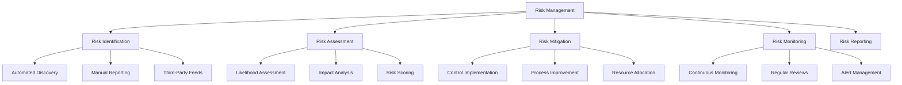
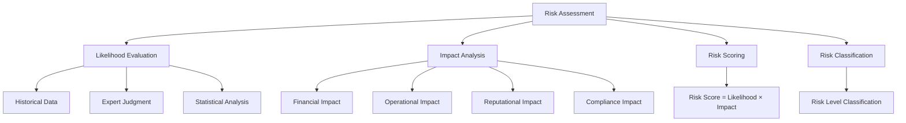
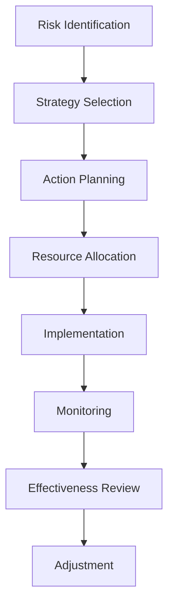
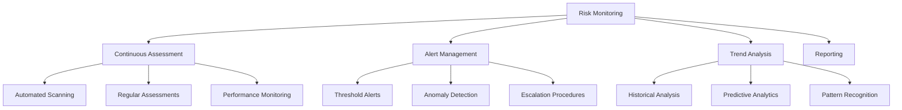

# Risk Management

Risk management is a critical component of compliance activities, helping organizations identify, assess, and mitigate security and compliance risks. Studio Platform provides comprehensive risk management tools with AI-powered analysis and automated risk scoring.

## 🎯 Risk Management Overview

### **What is Risk Management?**

Risk management is the systematic process of identifying, assessing, and mitigating risks that could impact your organization's ability to achieve compliance objectives. Studio Platform integrates risk management with compliance tracking to provide a unified view of your risk posture.

#### **Risk Management Framework**



### **Risk Categories**

#### **Primary Risk Categories**

| Category | Description | Examples | Impact Level |
|----------|-------------|----------|--------------|
| **Security Risks** | Threats to information security | Malware, data breaches, unauthorized access | High |
| **Operational Risks** | Failures in internal processes | System failures, human errors, process gaps | Medium |
| **Compliance Risks** | Regulatory and compliance violations | Non-compliance, audit failures, penalties | High |
| **Strategic Risks** | Business and strategic threats | Market changes, competitive pressures | Medium |
| **Financial Risks** | Financial losses and impacts | Fines, remediation costs, business losses | High |
| **Reputational Risks** | Damage to organization reputation | Public breaches, negative publicity | Medium |

#### **Risk Sources**

**Internal Risk Sources:**
- **System Vulnerabilities** - Technical weaknesses in systems
- **Process Gaps** - Incomplete or ineffective processes
- **Human Factors** - Employee errors, lack of training
- **Resource Limitations** - Insufficient resources or capabilities
- **Control Deficiencies** - Weak or missing controls

**External Risk Sources:**
- **Threat Actors** - Malicious external parties
- **Regulatory Changes** - Changes in laws and regulations
- **Third-Party Risks** - Vendor and supplier risks
- **Environmental Factors** - Natural disasters, infrastructure
- **Market Conditions** - Economic and market changes

## 🔍 Risk Identification

### **Automated Risk Discovery**

#### **AI-Powered Risk Detection**

```mermaid
graph TD
    A[Data Collection] --> B[Pattern Analysis]
    B --> C[Risk Identification]
    C --> D[Risk Classification]
    D --> E[Risk Scoring]
    E --> F[Alert Generation]
    
    A --> G[Compliance Data]
    A --> H[Security Logs]
    A --> I[System Metrics]
    A --> J[Third-Party Feeds]
    
    B --> K[Machine Learning]
    B --> L[Statistical Analysis]
    B --> M[Anomaly Detection]
```



**Automated Detection Methods:**
- **Compliance Gap Analysis** - Identify gaps as compliance risks
- **Security Event Monitoring** - Monitor security events for risks
- **Performance Anomalies** - Detect unusual system behavior
- **Third-Party Intelligence** - Incorporate external threat intelligence
- **Historical Pattern Analysis** - Identify patterns from historical data

**Risk Detection Example:**
```
🔍 Automated Risk Detection
   Detection Time: Nov 15, 2024 14:32
   Risk Source: Compliance Gap Analysis
   Risk Type: Compliance Risk
   Risk Level: High
   
   🤖 AI Analysis:
   Detected compliance gap in SOC 2 A6.1 (Incident Response)
   - Missing incident response plan
   - No documented response procedures
   - No incident response testing records
   
   📊 Risk Assessment:
   Likelihood: Medium (60% probability of incident)
   Impact: High (Significant compliance impact)
   Risk Score: 75/100 (High Risk)
   
   🎯 Recommended Actions:
   1. Develop incident response plan (Priority: Critical)
   2. Document response procedures (Priority: High)
   3. Implement incident response testing (Priority: Medium)
   
   📅 Deadline: Nov 30, 2024
   👥 Assigned To: IT Security Team
```

### **Manual Risk Reporting**

#### **Risk Reporting Process**

**Reporting Channels:**
- **Team Member Reports** - Risk reports from team members
- **Management Reports** - Risk identification by management
- **External Reports** - Reports from auditors, consultants
- **Incident Reports** - Risk identification from incidents
- **Assessment Findings** - Risks identified in assessments

**Risk Reporting Interface:**
```
📝 Risk Reporting Form
   Report Type: New Risk Identification
   Reporter: John Doe (IT Security Manager)
   Date: Nov 15, 2024
   Risk Category: Security Risk
   
   Risk Details:
   📋 Risk Description:
   "Critical vulnerability in customer database server identified during
   security assessment. Server runs outdated database software with known
   security vulnerabilities."
   
   🎯 Risk Impact:
   - Data breach potential
   - Compliance violations (SOC 2, GDPR)
   - Customer data exposure
   - Regulatory penalties
   
   📊 Current Status:
   Risk Level: Critical | Likelihood: High | Impact: Critical
   Immediate Action Required: Yes
   
   📋 Recommended Actions:
   1. Patch database server immediately
   2. Implement compensating controls
   3. Assess data exposure
   4. Notify stakeholders
   5. Document remediation
```

### **Third-Party Risk Intelligence**

#### **External Risk Feeds**

**Intelligence Sources:**
- **Security Feeds** - CVE databases, threat intelligence
- **Regulatory Updates** - Changes in laws and regulations
- **Industry Alerts** - Industry-specific risk information
- **Vendor Notifications** - Third-party security notifications
- **Market Intelligence** - Market and economic risks

**Intelligence Integration:**
```
🌐 External Risk Intelligence
   Last Update: Nov 15, 2024 14:45
   Sources: 12 active feeds
   New Risks Identified: 3
   
   🔴 Critical Alert:
   CVE-2024-12345: Critical vulnerability in database software
   Affected Systems: Customer database server
   Exploitation: Active in wild
   Recommended Action: Patch immediately
   
   🟡 Warning Alert:
   New GDPR guidance on data processing records
   Impact: Documentation requirements
   Deadline: January 31, 2025
   Recommended Action: Update documentation
   
   🟢 Information Alert:
   Industry best practices for incident response
   Impact: Process improvement opportunity
   Recommended Action: Review current procedures
```

## 📊 Risk Assessment

### **Risk Scoring Methodology**

#### **Risk Scoring Formula**



**Risk Scoring Calculation:**
```
Risk Score = Likelihood Score × Impact Score

Likelihood Scale:
- Very High (5): Almost certain to occur
- High (4): Likely to occur
- Medium (3): May occur
- Low (2): Unlikely to occur
- Very Low (1): Rarely occurs

Impact Scale:
- Critical (5): Catastrophic impact
- High (4): Major impact
- Medium (3): Moderate impact
- Low (2): Minor impact
- Very Low (1): Negligible impact

Risk Score Classification:
- 20-25: Critical Risk
- 15-19: High Risk
- 10-14: Medium Risk
- 5-9: Low Risk
- 1-4: Very Low Risk
```

#### **Risk Assessment Components**

**Likelihood Factors:**
- **Historical Occurrence** - Past frequency of similar events
- **Vulnerability Exposure** - Level of vulnerability exposure
- **Control Effectiveness** - Effectiveness of existing controls
- **Threat Landscape** - Current threat environment
- **External Factors** - External influences on likelihood

**Impact Factors:**
- **Financial Impact** - Direct and indirect financial costs
- **Operational Impact** - Impact on business operations
- **Compliance Impact** - Regulatory and compliance consequences
- **Reputational Impact** - Damage to reputation and brand
- **Customer Impact** - Impact on customers and stakeholders

### **Risk Assessment Dashboard**

#### **Risk Overview**

**Risk Summary Example:**
```
📊 Risk Management Dashboard
   Assessment Date: Nov 15, 2024
   Total Risks: 47 | New Risks: 3 | Closed Risks: 12
   
   Risk Distribution:
   🔴 Critical: 2 risks (4%)
   🔴 High: 8 risks (17%)
   🟡 Medium: 22 risks (47%)
   🟢 Low: 12 risks (25%)
   🟢 Very Low: 3 risks (6%)
   
   Risk Trends:
   📈 Total Risks: +3 this month
   📉 Critical Risks: -1 this month
   📈 High Risks: +2 this month
   📊 Average Risk Score: 12.3 (Medium)
   
   Top Risk Categories:
   1. Security Risks: 18 risks (38%)
   2. Compliance Risks: 15 risks (32%)
   3. Operational Risks: 8 risks (17%)
   4. Strategic Risks: 4 risks (9%)
   5. Financial Risks: 2 risks (4%)
```

#### **Detailed Risk Analysis**

**Risk Detail View:**
```
🔍 Risk Detail: Database Server Vulnerability
   Risk ID: RISK-2024-042
   Status: Active | Category: Security Risk
   Date Identified: Nov 10, 2024
   Last Updated: Nov 15, 2024
   
   📊 Risk Assessment:
   Likelihood: High (4/5)
   Impact: Critical (5/5)
   Risk Score: 20/25 (Critical Risk)
   
   🎯 Impact Analysis:
   💰 Financial Impact: $250K - $1M (remediation, fines, customer loss)
   ⚙️ Operational Impact: System downtime, data loss
   ⚖️ Compliance Impact: SOC 2, GDPR violations
   📢 Reputational Impact: Customer trust, brand damage
   👥 Customer Impact: Data exposure, service disruption
   
   🔍 Root Causes:
   - Outdated database software (version 3 years old)
   - Inadequate patch management process
   - Insufficient security monitoring
   - Lack of regular vulnerability assessments
   
   📋 Mitigation Status:
   ✅ Immediate patching completed
   ✅ Compensating controls implemented
   🔄 Data exposure assessment (in progress)
   ⏳ Stakeholder notification (planned)
   ⏳ Documentation update (planned)
   
   📅 Timeline:
   Identification: Nov 10, 2024
   Initial Response: Nov 11, 2024
   Mitigation Complete: Nov 20, 2024
   Review Date: Dec 1, 2024
```

## 🛡️ Risk Mitigation

### **Mitigation Strategies**

#### **Risk Treatment Options**

| Strategy | Description | When to Use | Example |
|----------|-------------|------------|---------|
| **Avoidance** | Eliminate risk by avoiding activity | High risk, low benefit | Discontinue risky service |
| **Mitigation** | Reduce risk likelihood or impact | Moderate to high risk | Implement security controls |
| **Transfer** | Transfer risk to third party | Cost-effective transfer possible | Purchase cybersecurity insurance |
| **Acceptance** | Accept risk without action | Low risk or mitigation cost too high | Accept low-impact operational risks |
| **Monitoring** | Monitor risk for changes | Uncertain or evolving risks | Monitor emerging threats |

#### **Mitigation Planning**

**Mitigation Planning Process:**


**Mitigation Plan Example:**
```
🛡️ Risk Mitigation Plan: Database Server Vulnerability
   
   🎯 Risk Treatment Strategy: Mitigation
   
   📋 Action Plan:
   
   1. 📦 Immediate Patching (Critical)
      - Action: Apply latest security patches
      - Owner: Database Administrator
      - Resources: 8 hours, $2,000
      - Timeline: Nov 11, 2024 (Completed)
      - Status: ✅ Completed
   
   2. 🔒 Compensating Controls (High)
      - Action: Implement additional security measures
      - Owner: Security Team
      - Resources: 16 hours, $5,000
      - Timeline: Nov 12, 2024 (Completed)
      - Status: ✅ Completed
   
   3. 🔍 Data Exposure Assessment (Medium)
      - Action: Assess potential data exposure
      - Owner: Compliance Team
      - Resources: 24 hours, $3,000
      - Timeline: Nov 15, 2024 (In Progress)
      - Status: 🔄 60% Complete
   
   4. 📢 Stakeholder Communication (Medium)
      - Action: Notify affected stakeholders
      - Owner: Communications Team
      - Resources: 8 hours, $1,000
      - Timeline: Nov 16, 2024 (Planned)
      - Status: ⏳ Not Started
   
   5. 📚 Process Improvement (Low)
      - Action: Improve patch management process
      - Owner: IT Operations
      - Resources: 40 hours, $8,000
      - Timeline: Nov 30, 2024 (Planned)
      - Status: ⏳ Not Started
   
   📊 Mitigation Progress:
   Overall Progress: 40% Complete
   Critical Actions: 100% Complete
   High Priority: 100% Complete
   Medium Priority: 30% Complete
   Low Priority: 0% Complete
   
   🎯 Expected Outcomes:
   - Risk Score Reduction: 20 → 8 (Critical → Low)
   - Likelihood Reduction: High → Low
   - Impact Reduction: Critical → Low
   - Compliance Restoration: Full compliance achieved
```

### **Control Implementation

#### **Control Types**

**Preventive Controls:**
- **Access Controls** - Limit access to systems and data
- **Security Policies** - Define security requirements and procedures
- **Training Programs** - Educate employees on security practices
- **Technical Controls** - Implement technical security measures

**Detective Controls:**
- **Monitoring Systems** - Monitor for security events
- **Audit Logs** - Record system and user activities
- **Intrusion Detection** - Detect unauthorized access attempts
- **Compliance Monitoring** - Monitor compliance status

**Corrective Controls:**
- **Incident Response** - Respond to security incidents
- **Backup Systems** - Recover from data loss
- **Remediation Procedures** - Correct identified issues
- **Business Continuity** - Maintain operations during disruptions

#### **Control Effectiveness**

**Effectiveness Measurement:**
- **Coverage Assessment** - Measure control coverage
- **Performance Metrics** - Monitor control performance
- **Testing Results** - Evaluate control testing outcomes
- **Incident Response** - Assess incident response effectiveness

**Control Effectiveness Example:**
```
🔒 Control Effectiveness Assessment
   Control: Database Access Management
   Type: Preventive Control
   Implementation Date: Oct 1, 2024
   
   📊 Effectiveness Metrics:
   Coverage: 95% (Excellent)
   Performance: 92% (Excellent)
   Testing Results: 88% (Good)
   Incident Response: 90% (Excellent)
   
   🎯 Overall Effectiveness: 91% (Excellent)
   
   📈 Performance Trends:
   - Access request processing: 2.3 hours (target: <4 hours)
   - Access review completion: 98% (target: >95%)
   - Unauthorized access attempts: 0 (target: 0)
   - User satisfaction: 4.6/5.0 (target: >4.0)
   
   💡 Improvement Opportunities:
   - Automate routine access requests
   - Enhance reporting capabilities
   - Implement just-in-time access provisioning
   - Add machine learning for anomaly detection
```

## 📈 Risk Monitoring

### **Continuous Monitoring**

#### **Monitoring Framework**



**Monitoring Components:**
- **Real-Time Monitoring** - Continuous risk assessment
- **Automated Alerts** - Automatic risk threshold alerts
- **Trend Analysis** - Historical risk trend analysis
- **Predictive Analytics** - AI-powered risk prediction
- **Performance Monitoring** - Control performance monitoring

#### **Risk Alerts**

**Alert Types:**
- **Threshold Alerts** - Risk exceeds predefined thresholds
- **Trend Alerts** - Unfavorable risk trends detected
- **Anomaly Alerts** - Unusual risk patterns identified
- **Compliance Alerts** - Compliance-related risk alerts
- **External Alerts** - External risk intelligence alerts

**Alert Management Example:**
```
🚨 Risk Alert Management
   Active Alerts: 5 | Critical Alerts: 2 | Total Today: 12
   
   🔴 Critical Alert:
   Risk Score Increase: Database Security Risk
   Previous Score: 8 (Low) | Current Score: 18 (High)
   Change: +10 points | Time: 2 hours ago
   Trigger: New vulnerability discovered
   
   📊 Alert Details:
   Risk ID: RISK-2024-042
   Risk Type: Security Risk
   Current Score: 18/25 (High Risk)
   Trend: Increasing rapidly
   
   🎯 Recommended Actions:
   1. Immediate vulnerability assessment
   2. Implement emergency controls
   3. Stakeholder notification
   4. Incident response preparation
   
   👥 Assigned To: Security Team
   ⏰ Response Time: 30 minutes
   📅 Follow-up: 2 hours
   
   🟡 Warning Alert:
   Compliance Risk Trend: GDPR Documentation
   Trend: Declining documentation quality
   Timeframe: 30 days
   Impact: Medium compliance risk
   
   📋 Alert Actions:
   ✅ Acknowledge Alert
   ✅ Assign to Team
   ✅ Set Follow-up Reminder
   ✅ Document Response
```

### **Risk Reporting

#### **Risk Reports**

| Report Type | Frequency | Audience | Purpose |
|-------------|-----------|----------|---------|
| **Risk Dashboard** | Real-time | All | Current risk status |
| **Risk Summary** | Weekly | Management | Weekly risk overview |
| **Risk Analysis** | Monthly | Leadership | Detailed risk analysis |
| **Risk Forecast** | Quarterly | Executives | Risk projections |
| **Incident Report** | As needed | All | Incident-specific risks |

#### **Risk Analytics**

**Risk Metrics:**
- **Risk Score Distribution** - Distribution of risk scores
- **Risk Trends** - Historical risk trend analysis
- **Risk Velocity** - Rate of risk change
- **Risk Heatmap** - Visual risk representation
- **Risk Correlation** - Risk interdependencies

**Risk Analytics Example:**
```
📊 Risk Analytics Dashboard
   Analysis Period: Q4 2024
   Total Risks: 47 | Average Score: 12.3
   
   📈 Risk Trends:
   - Overall Risk Score: +2.3 points this quarter
   - Critical Risks: -1 (improvement)
   - High Risks: +3 (increase)
   - Medium Risks: +2 (increase)
   
   🎯 Risk Velocity:
   - New Risk Identification: 3.2 per week
   - Risk Resolution Time: 14.5 days average
   - Risk Escalation Rate: 12% (below target 15%)
   
   🔥 Risk Heatmap:
   High Likelihood/High Impact: 2 risks
   High Likelihood/Medium Impact: 5 risks
   Medium Likelihood/High Impact: 8 risks
   Medium Likelihood/Medium Impact: 22 risks
   
   📊 Risk Correlations:
   - Security Risks ↔ Compliance Risks (0.78 correlation)
   - Operational Risks ↔ Financial Risks (0.65 correlation)
   - Strategic Risks ↔ Reputational Risks (0.72 correlation)
   
   🎯 Key Insights:
   1. Security risks driving compliance risks
   2. Operational improvements reducing financial risks
   3. Strategic initiatives increasing reputational exposure
   4. Risk management effectiveness improving overall
```

## 🎯 Best Practices

### **Risk Management Best Practices**

#### **Strategic Risk Management**
- **Risk Appetite** - Define and communicate risk appetite
- **Risk Culture** - Foster risk-aware culture
- **Governance** - Establish clear risk governance structure
- **Integration** - Integrate risk management with business processes
- **Continuous Improvement** - Continuously improve risk management

#### **Operational Excellence**
- **Systematic Approach** - Use systematic risk management processes
- **Data-Driven** - Use data and analytics for risk decisions
- **Regular Reviews** - Conduct regular risk assessments and reviews
- **Documentation** - Maintain comprehensive risk documentation
- **Training** - Provide regular risk management training

### **Common Risk Management Mistakes**

❌ **Avoid These Mistakes:**
- Ignoring risk management until problems occur
- Treating risk management as a one-time activity
- Focusing only on negative risks (missing opportunities)
- Not involving stakeholders in risk management
- Underestimating emerging risks

✅ **Follow These Best Practices:**
- Integrate risk management into daily operations
- Treat risk management as an ongoing process
- Consider both threats and opportunities
- Involve all relevant stakeholders
- Monitor emerging risks and trends

---

!!! tip **AI-Powered Risk Management**
    Use the AI Assistant for automated risk analysis and predictive insights. The AI can identify patterns and correlations that might be missed in manual analysis.

!!! note **Continuous Monitoring**
    Implement continuous risk monitoring to detect and respond to risks quickly. Early detection reduces risk impact and mitigation costs.

!!! question **Need Help?**
    Check our [Troubleshooting Guide](../troubleshooting/) for common risk management issues, or contact our support team for personalized assistance.
